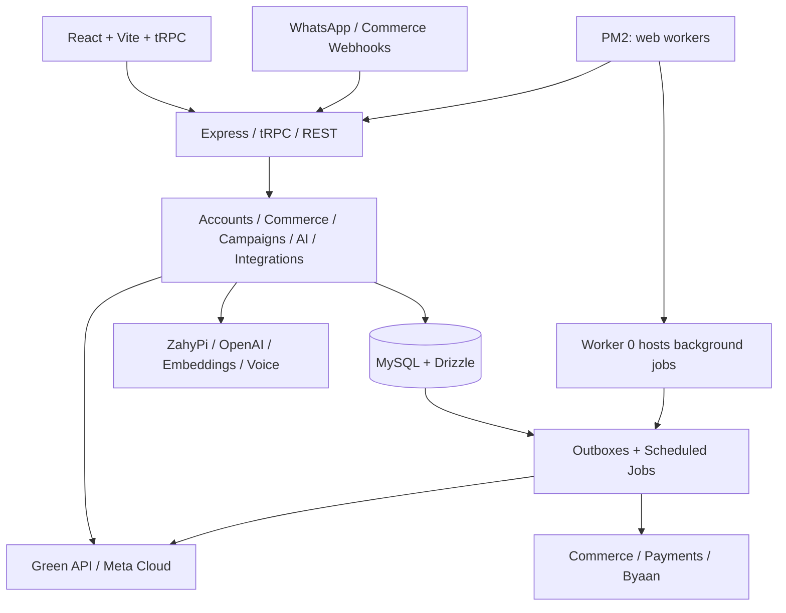

# ساري — تقييم معماري وتجاري وجاهزية التوسع

تاريخ الفحص: 19 سبتمبر 2026. المصدر المحلي: `a4538c62e0157102bc3113edffebc3e240354350`.

**الحكم التنفيذي**

ساري منتج عامل مبكر يملك فرصة تجارية تستحق الاستثمار. بحسب إفادة المالك في هذه المراجعة، لديه 12 عميلًا مدفوعًا ونشطًا، مع تجربة تمتد أربعة أشهر، في التدريب والاستقدام والمتاجر. هذه إشارة أولية إلى استعداد العملاء للدفع، لكنها لا تكفي وحدها لإثبات قابلية اكتسابهم بشكل متكرر أو ربحيتهم. لم أطلع على فواتيرهم أو بيانات الاستخدام والاحتفاظ.

أوصي بمعالجة عوائق الإصدار فورًا، ثم التوسع المحدود في قطاع واحد. لا أوصي بحملة اكتساب واسعة أو نشر النسخة الحالية باعتبارها اجتازت شروط الإصدار: آخر CI لنفس SHA فشل عند تدقيق الاعتماديات، والتدقيق الحالي أعاد 12 تحذيرًا عالي الخطورة. يمكن إصلاح ذلك دون إعادة بناء المنتج.

| المحور | التقييم التقديري | تفسيره |
|---|---:|---|
| الأساس المعماري | 6.5/10 | تقنيات مناسبة وضوابط موثوقية جيدة، مع تركز منطق كبير وتفاوت بين المسارات |
| نضج المنتج الوظيفي | 7/10 | نطاق واسع وتجربة عربية فعلية، وجودة الرحلات الحية الكاملة لم تُثبت في هذه الجولة |
| الفرصة التجارية مع التركيز القطاعي | 8/10 | عملاء يدفعون وتكاملات محلية؛ الدرجة تقدير للفرصة وليست احتمال نجاح |
| العرض التسويقي الحالي | 5.5/10 | تموضع واسع، أرقام قديمة، وتعارض في عرض التجربة والأسعار |
| جاهزية التوسع والإطلاق العام | 5/10 | بوابة أمن حمراء، وضبط تكلفة وتشغيل يحتاجان أدلة إضافية |

هذه تقديرات مهنية لتوجيه القرار، وليست نسب إنجاز أو درجات اعتماد أمني. الثقة أعلى في نتائج الكود والفحوص، وأقل في اقتصاديات العملاء التي لم تتوفر بياناتها.

**نطاق الفحص ونتائجه الفعلية**

شمل العمل جرد المصدر، وقراءة المسارات المركزية وعينات معمقة للمصادقة والاشتراك وواتساب والمعرفة والذكاء الاصطناعي والحملات والتشغيل، وتشغيل بوابات الاختبار المختارة، ومراجعة CI، وتصفح الرئيسية والتسعير والتسجيل في الموقع المنشور، والتحقق من المنافسة من مصادرها الرسمية. لم يكن تدقيقًا سطريًا لكل المشروع أو اختبار اختراق مستقلًا.

لم أعدل منطق التطبيق أو قاعدة البيانات، ولم أنشئ حسابًا أو أرسل رسائل أو أنفذ دفعًا أو نشرًا. ملفات العمل المؤقتة في `.tmp`، وهذا التقرير هو المخرج المتتبع المضاف.

| الفحص | النتيجة وحدودها |
|---|---|
| TypeScript، `tsc --noEmit` | ناجح، على Node 24.19.0 |
| بوابتا ZahyPi والإصدار مع pretest، بعد إزالة تكرار الملفات | 99 ملفًا، 1268 حالة: 1263 نجاحًا، 4 إخفاقات، وskip واحد؛ على Windows/Node 25.2.1 وVitest 4.1.7 |
| تشخيص الإخفاقات الأربعة | توقعات نصية تحتوي LF مقابل ملفات CRLF؛ تحقق محلي مستقل أثبت وجود النصوص الأربعة بعد تطبيع نهايات الأسطر. لم تُعدّل الاختبارات ولم تُحوّل النتيجة إلى PASS |
| بناء الواجهة Vite | ناجح؛ ملف الدخول 566,492 بايت، و169,579 بايت gzip وفق فاحص الميزانية |
| تجميع الخادم | ناجح إلى ملف مؤقت على Node 24.19.0؛ تحقق تجميع فقط، دون تشغيل الخادم أو إضافة banner تحميل البيئة |
| أمر البناء الكامل عبر pnpm المحلي | توقف عند عدم تطابق المحرك: Node 25.2.1 مقابل المطلوب 22.17.x؛ لذلك لا أسجل نجاحًا للبناء الكامل على بيئة الإصدار المثبتة |
| تاريخ مخطط Drizzle | `drizzle-kit check` ناجح بعنوان قاعدة وهمي؛ لم تُنفذ هجرة محلية |
| تدقيق اعتماديات الإنتاج الحالي | 0 critical، و12 high، و19 moderate، و7 low؛ بوابة `audit:production` تفشل كما ينبغي لهذه النتيجة |
| آخر CI لنفس SHA | Quality/security/build: فشل عند dependency audit؛ الخطوات التالية لم تعمل. Database integration: نجح، بما فيه migrations وقائمة اختبارات MySQL المحددة |
| اللغات | العربية المفعلة وحدها؛ الفاحص يصنف 99.6% من قيم ملفها كعربية. هذا ليس مقياسًا للدقة الدلالية. الإنجليزية غير المفعلة تحتوي 1573 قيمة عربية |
| الموقع المنشور | الرئيسية والتسعير والتسجيل قابلة للتصفح؛ لم يثبت تطابق SHA المنشور مع المصدر المحلي |
| `/health` و`/ready` | تعذر التحقق الحالي بسبب قيود أدوات الوصول/اتصال TLS؛ هذا لا يثبت تعطل الخدمة. نتائج 10 سبتمبر القديمة ليست نتيجة جديدة |

[سجل CI الذي قُرئ مباشرة](https://github.com/IngazTeam/sari-new/actions/runs/35457475570). تمت قراءة حالات الوظائف والخطوات، لكن تنزيل السجل التفصيلي أعاد 403 يتطلب صلاحية إدارة. لم أستنتج تفاصيل غير متاحة من السجل؛ أسماء الاعتماديات أدناه من التدقيق المحلي الجديد.

البيئة المحلية غير متجانسة: المشروع يثبت Node 22.17.1 وpnpm 10.4.1؛ shell المعزول يعرض Node 24.19.0 وpnpm 11.19.0، وخارج العزل ظهر Node 25.2.1، ونسخة pnpm الموجودة تحت node_modules هي 10.28.2. لم تُثبّت أدوات جديدة أو تُغيّر نسخة المشروع لتجاوز ذلك.

**ما تقوله البنية عن المشروع**

الجرد المحسوب لملفات `.ts/.tsx` في `server` و`client/src` و`shared` و`drizzle`: 999 ملفًا، منها 750 غير اختبارية بإجمالي 222,880 سطرًا، و249 ملف اختبار. تشمل الأعداد تعريفات المخطط والتعليقات، ولا تمثل كلها منطقًا مستخدمًا. يوجد 214 ملف صفحة و51 ملف SQL في جذر drizzle؛ الأخير عدد ملفات، وليس إثبات تطبيق 51 هجرة على الإنتاج.

البنية تطبيق موحد بدأ يفصل مجالاته إلى وحدات. اختيار React/TypeScript وtRPC وMySQL مناسب لهذه المرحلة. وجود 12 عميلًا لا يبرر تعقيد خدمات مصغرة، والأولوية هي جعل حدود المجالات واضحة داخل التطبيق الحالي.

نقاط القوة المثبتة في المصدر:

- قناة واتساب موحدة بمزودين Green API وMeta Cloud، وسجل تسليم وقيود هوية وملكية الرقم. لا يصح وصف المشروع بأنه لا يملك مسار Meta الرسمي؛ الموجود يحتاج إثبات تفعيل وتشغيل فعلي.
- حملات وعمليات تكامل تستخدم outbox دائمًا، وleases و`FOR UPDATE SKIP LOCKED` وإعادة المحاولة، وتحول النتائج الغامضة إلى مراجعة بشرية. مثال جيد: [campaign-delivery-outbox.ts](C:/Users/ingaz/Herd/sari/server/automation/campaign-delivery-outbox.ts:615).
- جلسات مصادقة قابلة للإلغاء، وحماية استعادة كلمة المرور، وتشفير أسرار وتقييد رفع الملفات، وعزل merchant في مسارات تمت مراجعتها، وضوابط طلبات حذف وتصدير وموافقات.
- بوابة readiness تربط بدء العمال باتصال القاعدة والمخطط، وrunbook نشر مع SHA وفحص ونسخ واستعادة وتراجع. وجودها أساس جيد، وتنفيذها على الإنتاج يحتاج سجلًا حديثًا.
- كتالوج مهام للذكاء الاصطناعي والتحقق من العقود والتتبع ومخرجات ZahyPi. هذا يقلل أخطاء النقل والهوية، ولا يقيس وحده جودة الجواب أو صحة القرار التجاري.
- تقسيم الواجهة إلى حزم وصفحات مؤجلة، وتقييد اللغات المعلنة بما تم اعتماده فعليًا.

**النتائج ذات الأولوية**

**1. P1 — الاعتماديات تمنع اعتماد الإصدار الحالي.**

تحذيرات high الاثنا عشر موزعة على ثلاث حزم، وليست 12 اختراقًا مثبتًا:

| الحزمة في القفل المدقق | التحذيرات العالية | الإجراء الأدنى المستند إلى التنبيهات الحالية |
|---|---:|---|
| `multer 2.2.0` | 3 | الانتقال إلى 2.3.0 أو إصدار أحدث متوافق، ثم فحوص الرفع |
| `nodemailer 9.0.5` | 1 | الانتقال إلى 9.1.0 أو إصدار أحدث متوافق، ثم فحوص البريد |
| `@xmldom/xmldom 0.8.13` عبر mammoth | 8 | تحديث مسار الاعتماد إلى 0.8.15 أو إصدار مصحح متوافق، ثم فحوص تحليل المستندات |

تصف تنبيهات المشاريع مخاطر استنزاف/تعطل وبعض حالات حقن XML. وجود الحزم المتأثرة في القفل مؤكد؛ قابلية استغلال كل حالة عبر ساري لم تُختبر. مصادقة مسار رفع المعرفة قبل multer تقلل التعرض فيه، لكنها لا تجعل النسخة المتأثرة مصححة. [تنبيه multer](https://github.com/advisories/GHSA-wc9g-mqfw-jrwm)، [تنبيه Nodemailer](https://github.com/advisories/GHSA-2x7j-588g-ccc2)، [تنبيه xmldom](https://github.com/advisories/GHSA-965w-775f-mr7g).

معيار الإغلاق: تحديث القفل بالنسخ المتوافقة، ومعالجة high/critical، واجتياز CI كاملًا على SHA الجديد ونسخ الأدوات المثبتة. لا يكفي تعديل نطاق النسخة في package.json دون القفل.

**2. P1 — بوابة تدقيق الاعتماديات قد تعلن نجاحًا عند فشل التدقيق.**

[check-production-audit.mjs](C:/Users/ingaz/Herd/sari/scripts/check-production-audit.mjs:18) يفحص فشل تشغيل العملية، ثم يحلل JSON ويفترض قائمة advisories فارغة عند غيابها. لا يتحقق بما يكفي من `report.error` أو اكتمال بنية النتيجة أو حالة انتهاء العملية.

أُجري تشخيص محلي مصطنع فقط: استُبدل أمر التدقيق ببرنامج مؤقت يعيد JSON من نوع error وينتهي برمز 1. الفاحص الأصلي خرج برمز 0 وطبع أن جميع درجات التحذيرات صفر. لم نغيّر الفاحص ولم نحتج شبكة أو بيانات حقيقية لهذه الإعادة.

الأثر: انقطاع السجل أو فشل بروتوكول التدقيق قد يتحول إلى نجاح كاذب. الإغلاق: رفض نتيجة خطأ أو بنية ناقصة أو خروج غير متوقع، مع تمييز خروج العثور على ثغرات عن خروج فشل الأداة.

**3. P1 قبل التوسع — سقف تكلفة الذكاء الاصطناعي غير مضمون عبر العمال.**

[cost-ceiling.ts](C:/Users/ingaz/Herd/sari/server/ai/cost-ceiling.ts:56) يخزن الاستخدام في Map داخل العملية. PM2 يشغل عاملين افتراضيًا، ويمكن أن يصل إلى أربعة. عدادات كل عامل مستقلة وتزول عند إعادة تشغيله.

الاستدعاء في [sari-personality.ts](C:/Users/ingaz/Herd/sari/server/ai/sari-personality.ts:1595) لا يمرر planSlug؛ لذلك يسقط إلى starter في هذا الحارس. وعند تجاوز السقف يجرب مسارًا أخف، لكنه يعود للمسار الكامل إذا فشل المسار الأخف. توجد حدود اشتراك أخرى مستمرة في القاعدة؛ الملاحظة تخص سقف تكلفة الذكاء الاصطناعي هذا ولا تعني غياب جميع الحدود.

الإغلاق: حجز ميزانية مشترك ودائم لكل تاجر ولكل فترة، وتسوية التكلفة بعد الطلب، وتمرير الخطة الفعلية، وقرار صريح عند نفاد الميزانية. يجب احتساب الصوت وembeddings والمهام المساعدة أيضًا، مع تنبيه قبل النفاد.

**4. P1 للتحقق باختبار أعطال — حماية منع تكرار الردود غير متساوية بين الحملات وpolling.**

المسار العام في [whatsapp.ts](C:/Users/ingaz/Herd/sari/server/whatsapp.ts:53) ينشئ `legacy:randomUUID()` جديدًا لكل محاولة إرسال. مسار polling يحتفظ برد AI ثم يرسله، ويعلّم الرسالة processed بعد نجاح الإرسال؛ عند فشل الإرسال أو حفظ الإتمام قد تعاد المحاولة. انظر [polling.ts](C:/Users/ingaz/Herd/sari/server/polling.ts:573).

الاستنتاج من تسلسل الكود: إذا قبل المزود الرد ثم فقدنا الاستجابة أو تعذر حفظ processed، فالمحاولة اللاحقة تملك مفتاحًا جديدًا ولا تستفيد من منع التكرار للمحاولة الأصلية. هذا سيناريو فشل قابل للاستدلال من المصدر، وليس حادثة مثبتة عند العملاء. مسار الحملات يعالج الغموض بشكل أقوى.

الإغلاق: مفتاح ثابت مشتق من هوية الرسالة الواردة ونوع الأثر، وسجل محاولة durable، وعدم إعادة إرسال النتيجة الغامضة بلا reconciliation أو مراجعة. اختبار قبول: قبول المزود ثم timeout أو فشل DB لا يولد إرسالًا ثانيًا بلا قرار واضح.

**5. P2 — الوحدات موجودة لكن نقطة الربط المركزية ما زالت ضخمة.**

`server/db.ts` نحو 12,521 سطرًا، و`server/routers.ts` نحو 8,524، و`server/ai/sari-personality.ts` نحو 3,331. ما زال `server/db/_shared.ts` يستورد من db.ts؛ الفصل الحالي جزئي. كثرة ميزات القطاعات والتكاملات ترفع احتمالات تأثير تعديل صغير على مجالات بعيدة.

الإجراء: استخراج Accounts وBilling وConversations وCatalog وCampaigns وIntegrations وAI إلى وحدات داخل التطبيق، لكل منها واجهة خدمات ومستودع بيانات. يبدأ الفصل عند الحاجة لإصلاح مسار أو تطويره، مع إزالة المسارات القديمة بعد إثبات البديل. لا أوصي بإعادة كتابة شاملة أو microservices الآن.

**6. P2 — دعم صلاحيات فرق التجار غير متجانس.**

توجد أدوار وصلاحيات و`permissionProcedure`، ويستخدمها WooCommerce. لكن CRUD المنتجات يستخدم `protectedProcedure` و`getMerchantByUserId`، والدالة الأخيرة تبحث عن مالك المتجر في `merchants.userId`؛ لا تحل عضوية الفريق. [routers-products.ts](C:/Users/ingaz/Herd/sari/server/routers-products.ts:373)، [db.ts](C:/Users/ingaz/Herd/sari/server/db.ts:798).

الأثر المستنتج: عضو فريق لديه products.manage قد لا يصل إلى المسار الذي يصل إليه المالك. هذا تفاوت وظيفي في تطبيق RBAC، وليس إثبات تسرب بين التجار. الإغلاق: مصفوفة owner/manager/supervisor/viewer على الرحلات الحية، وتوحيد حل merchant والدور قبل عرض الفرق كميزة مكتملة.

**7. P2 — كثرة الاختبارات لا تعادل تغطية رحلة العميل.**

الاختبارات تشمل سلوكًا فعليًا واختبارات أمن وعقود، لكنها تشمل أيضًا عددًا ملحوظًا يقرأ المصدر ويبحث عن عبارات وتعليقات. الإخفاقات الأربعة الحالية مثال مباشر: تغير نهايات الأسطر يكسر الحارس دون تغير السلوك. توجد 249 ملفات اختبار، لكن البوابات المختارة في هذه الجولة شغلت 99 فقط؛ لا أسجل نجاح المجموعة الكاملة أو نسبة coverage.

تُستبدل أهم حراس النص باختبارات سلوكية على صلاحيات وعزل tenant ومعاملات وقاعدة حقيقية ومزود مصطنع. وتضاف رحلة staging تغطي التسجيل → التحقق → إعداد المعرفة → الربط → رسالة → رد موثق → طلب/تسجيل → دفع → تحديث الحالة، مع replay وتوقف العامل أثناء التنفيذ.

**8. P2 — تشغيل المهام الخلفية مقيد بتوبولوجيا الخادم الواحد.**

المهام تبدأ من worker رقم 0 داخل تطبيق الويب نفسه. هذا يقلل تكرارها داخل PM2 واحد، لكنه ليس انتخاب قائد موزعًا بين خادمين. ضوابط outbox الدائمة تساعد في بعض المسارات، بينما لا يصح تعميم ضمانها على جميع cron jobs.

الخطوة التالية عند التوسع: عملية worker منفصلة، ومراقبة backlog وعمر أقدم مهمة وعمليات manual_review، وتوثيق التزامن والـleases لكل مهمة. لا حاجة لتبديل MySQL بطابور جديد لمجرد وجود عملاء إضافيين؛ يبدأ القرار بقياسات الحمل الفعلية.

**9. P1 تجاري — الموقع يضعف الثقة والتحويل رغم وجود استخدام حقيقي.**

المشاهدات على [الموقع](https://sary.live/) و[التسعير](https://sary.live/pricing):

- الرئيسية تعرض 3 تجارب ونحو 300 عميل نهائي، بينما الإفادة الحالية 12 عميلًا مدفوعًا ونشطًا. يُحدّث العدد بعد ربطه بتاريخ وتعريف واضح، ولا تُضرب أرقام العملاء النهائيين القديمة في أربعة افتراضًا.
- الرئيسية تقول خطة مجانية بـ100 محادثة شهريًا؛ التسعير يقول تجربة 7 أيام. [النص القديم](C:/Users/ingaz/Herd/sari/client/src/locales/ar.json:384)، [نص التجربة](C:/Users/ingaz/Herd/sari/client/src/locales/public-ux.ar.ts:22).
- زر البدء في Navbar يصل إلى signup، بينما زر الرئيسية الرئيسي يصل إلى login؛ مساران مختلفان للنية نفسها.
- التذييل يعرض الرقم البديل `+966 50 000 0000` وروابط الصفحات الرئيسية للشبكات الاجتماعية، وليس حسابات العلامة. [Footer.tsx](C:/Users/ingaz/Herd/sari/client/src/components/Footer.tsx:218).
- عبارة «حماية كاملة» وادعاء «الأول» أوسع من الأدلة الموجودة. تُستبدلان بوصف ضوابط محددة وفائدة مثبتة.
- بطاقات الأسعار التي ظهرت تتضمن السعر وعدد العملاء أساسًا، ولا توضح تعريف العميل المحتسب، أو حصص الصوت، أو رسوم القناة، أو الدعم، أو تكلفة التجاوز.
- قائمة القطاعات تعرض ستة مجالات بينما العملاء الحاليون في ثلاثة، ولا يظهر الاستقدام كمدخل قطاعي واضح في القائمة المشاهدة.

واجهة سطح المكتب منظمة، والتسجيل يعرض متطلبات كلمة المرور والموافقة التسويقية الاختيارية بوضوح. هذه إيجابيات، لكنها لا تعالج التعارضات التجارية المذكورة. لم يُختبر الهاتف أو الإكمال الفعلي للتسجيل في هذه الجولة.

**10. P2 — أدوات التشغيل لا تثبت بعد قدرة الرحلات الثقيلة أو الاستعادة التجارية.**

أداة الحمل في `scripts/ops/ops-policy.mjs` تسمح فقط بـ`/health` و`/ready`؛ قياسها لا يمثل الذكاء الاصطناعي أو webhooks أو استيراد الملفات أو الحملات. أداة restore-manifest تقارن أعداد الصفوف وبنية جداول محددة، ولا تنفذ الاستعادة نفسها أو تتحقق من مضمون جميع البيانات وملفات التخزين والأسرار.

المطلوب دليل staging لحمل يمثل الرسائل والوظائف الخلفية، وتمرين استعادة فعلي إلى قاعدة معزولة، ثم smoke journeys وصحة عينات البيانات ومفاتيح فك التشفير والملفات. يحدد الفريق RPO/RTO ويقيسهما. لا يوجد في هذه الجولة دليل يكفي لادعاء دعم عدد معين من التجار أو الرسائل المتزامنة.

**الفرصة السوقية والتموضع**

وجود 12 عميلًا يدفعون أهم من زيادة قائمة المزايا. السؤال التجاري الآن: أي قطاع يجدد، ويستخدم المنتج بانتظام، ويحقق نتيجة قابلة للقياس بأقل تكلفة إعداد ودعم؟ لا يمكن ترتيب القطاعات ترتيبًا نهائيًا دون توزيع العملاء والإيراد والتكلفة.

المنافسة الحالية تفرض قيمة تتجاوز الرد العربي:

| المنافس/البديل | ما يقدمه حسب المصدر الرسمي | أثره على ساري |
|---|---|---|
| Meta Business Agent | أعلنت Meta في يونيو 2026 وكلاء لخدمة العملاء والتفاعل التجاري وتكاملات عبر منصاتها | الرد الآلي العام يتجه إلى أن يكون وظيفة متاحة من منصة القناة نفسها؛ لا أفترض توفر كل القدرات في السعودية |
| WATI | إدارة محادثات وحملات وأتمتة ووكلاء Astra كإضافة، مع رسوم رسائل منفصلة | يصعب المنافسة بقائمة «واتساب + AI + حملات» وحدها |
| respond.io | قنوات وفريق وأتمتة وAI؛ صفحة التسعير تعرض Growth بـ159 دولارًا شهريًا عند الدفع السنوي، ورسوم واتساب خارج الاشتراك | هناك مساحة سعرية، لكن الباقات ليست متكافئة في السعة والخدمات |
| Lucidya | تتموضع كمنصة عربية لتجربة العملاء ووكلاء AI للمؤسسات | اللهجة العربية وحدها ليست حاجزًا تنافسيًا كافيًا |

المصادر: [إعلان Meta](https://about.fb.com/news/2026/06/meta-business-agent/)، [WATI](https://www.wati.io/pricing/)، [respond.io](https://respond.io/pricing)، [Lucidya](https://www.lucidya.com/). أوصاف الشركات عن نفسها لا تثبت تفوقها في اختبارات مستقلة.

التموضع الأقوى لساري: **تحويل استفسارات واتساب إلى تسجيل أو طلب موثّق داخل نظام النشاط، مع قياس النتيجة وتحويل الحالات الحساسة إلى الموظف.** العربية والصوت والتكامل المحلي عناصر مساعدة لهذا الوعد.

ترتيب تجريبي مقترح للقطاعات، قابل للتعديل بنتائج العملاء الـ12:

1. **التدريب:** مرشح أول إذا كان عملاء بيان/المراكز يحققون استخدامًا وتجديدًا جيدين؛ توجد بالمصدر معرفة بالدورات ومسار تكامل بيان وتسجيل ودفع. مقياس القيمة: استفسار مؤهل → تسجيل مدفوع، ووقت الموظف لكل تسجيل.
2. **الاستقدام:** يستحق عرضًا مستقلًا إذا كان يحتفظ بأفضل العملاء. يبدأ بجمع متطلبات العميل ومتابعة الاستفسار والمواعيد والتحويل للموظف، مع تأكيد الأسعار والتوافر والالتزامات من مصدر موثوق. لا يحوّل النظام إلى قرار آلي عن أهلية أشخاص أو اختيارهم.
3. **المتاجر:** سوق واضح ومنافسة قوية؛ ابدأ بمنصة واحدة ومسار واحد موثوق، مثل متابعة استفسار عن منتج إلى طلب مدفوع. فتح جميع المنصات والقطاعات بالتوازي يضاعف تكلفة الدعم.

لا يوصى بإلغاء عملاء القطاعات الأخرى؛ التركيز المقترح يخص الاكتساب والتطوير التاليين. يُختار القطاع الأفضل بناءً على التجديد وهامش المساهمة وسهولة الإعداد، لا عدد العملاء وحده.

**التسعير واقتصاديات الوحدة**

الأسعار المرئية وقت الفحص: 99 ريالًا/100 عميل، 189 ريالًا/500 عميل، و399 ريالًا/2000 عميل، قبل الضريبة عند انطباقها. ليست هذه إثباتًا لأسعار عقود العملاء الحاليين.

| الباقة المعروضة | الإيراد لكل عميل نهائي عند استنفاد الحد | ميزانية جميع التكاليف المباشرة للباقة إذا كان هدف الهامش 70% |
|---|---:|---:|
| 99 / 100 | 0.99 ريال | 29.70 ريال |
| 189 / 500 | 0.378 ريال | 56.70 ريال |
| 399 / 2000 | 0.1995 ريال | 119.70 ريال |

في الباقة الثالثة، الهامش المستهدف في المثال يترك نحو **0.06 ريال لكل عميل نهائي** للتكاليف المباشرة عند استنفاد الحد، قبل توزيعها على النموذج والصوت والقناة والاستضافة والدعم المباشر والدفع. هذا حساب افتراضي لشرح حساسية السعر، وليس إثبات خسارة أو تكلفة فعلية. العميل الواحد قد يرسل رسائل عديدة.

أوصي بتعريف العميل النشط/المحادثة المحتسبة صراحة، وقياس استهلاك كل تاجر، وفصل رسوم القناة والاستخدام الزائد بوضوح عند الحاجة. الربط والإعداد اليدويان يستحقان رسم تهيئة أو باقة خدمة إذا كانت تكلفتهما مؤثرة. لا أوصي بتخفيض الأسعار قبل قياس التكلفة والتجديد.

لم يتوفر MRR أو متوسط الإيراد أو CAC أو توزيع التجديد؛ لذلك لا أقدم تقييمًا ماليًا للشركة ولا تقديرًا لحجم السوق من أرقام عامة. يُحسب السوق القابل للوصول من قائمة المنشآت الممكن الوصول إليها في القطاع المختار وقدرة البيع وخدمة الحسابات.

**القياس التجاري المطلوب من العملاء الحاليين**

جدول واحد لكل حساب: القطاع، تاريخ البدء، الاشتراك المدفوع، مرات التجديد، أيام الاستخدام، عدد العملاء النهائيين الفريدين، عدد الرسائل/الصوت، تكلفة المزودين، وقت الدعم والإعداد، حالات التكرار/الأخطاء، والنتائج التجارية المؤكدة.

مسار القياس المقترح: زيارة مؤهلة → تجربة → اكتمال المعرفة والربط → أول رد صحيح → أول نتيجة موثقة → أول دفع → تجديد → إحالة. توجد أدوات تتبع عامة وPageView، لكن البحث لم يُظهر مسار أحداث اكتساب وتفعيل وتجديد موحدًا بهذه الصورة. غياب حدث عن البحث ليس إثبات غيابه عن كل نظام خارجي.

استخرج دراستي حالة من العملاء الحاليين بموافقتهم، مع الفترة والمقارنة الأساسية ومصدر الأرقام؛ لا تنسب كل مبيعات التاجر إلى ساري لمجرد حدوث محادثة. رسالة تدريب نموذجية: «يرد على استفسارات دوراتك، ويوصل المتدرب إلى تسجيل ودفع موثّق، ويحوّل الحالات التي تحتاج موظفًا».

قناة الاكتساب الأولى المقترحة: إحالات العملاء الحاليين وعروض قصيرة لجهات شبيهة وشراكات مع مزودي أنظمتهم، مع تهيئة موجهة. الإعلان الواسع يأتي بعد إثبات أن التسجيل يتحول إلى استخدام ثم تجديد مربح.

**شروط الانتقال إلى التوسع**

| البوابة | معيار القبول المقترح |
|---|---|
| الإصدار | high/critical مغلقة أو استثناء موثق قائم على reachability، وCI كامل أخضر على SHA المراد نشره؛ فشل خدمة التدقيق لا يمر |
| الرحلة الأساسية | نجاح سيناريو حقيقي مضبوط لكل قناة/تكامل سيباع، مع tenant A/B وreplay وفشل مزود، دون آثار مالية أو إرسال مكرر |
| دقة AI | مجموعة عربية قطاعية يراجعها إنسان؛ صفر تأكيد دفع/حجز/سعر غير موثق في الحالات الحرجة، ومراجعة الأخطاء قبل زيادة الحركة |
| التكلفة | دفتر استهلاك مشترك وحدود إنفاق، وقياس هامش كل حساب بما فيه الدعم؛ استهداف هامش 70% هنا هدف إداري مقترح وليس معيارًا عامًا |
| التشغيل | تمرين استعادة مثبت، وقياس حمل الرحلات، وتنبيهات 5xx وتأخر الردود وoutbox وmanual_review، ومالك واضح للحوادث |
| العرض التجاري | عرض تجربة واحد، وتعريف الحدود ورسوم المزودين، واتصال حقيقي، وأرقام عملاء حديثة موثقة |
| التوسع | دفعة 5–10 حسابات من القطاع المختار، ومراجعة التفعيل والتكلفة والأخطاء أسبوعيًا، ثم قياس التجديد قبل زيادة الإنفاق |

ترتيب التنفيذ المقترح: عدة أيام لإغلاق الاعتماديات وبوابة التدقيق وتناقضات العرض؛ ثم دورة هندسية مركزة لضبط التكلفة وإعادة الإرسال واختبارات الرحلة؛ ثم 30 يومًا على الأقل لجمع بيانات تشغيل وتجديد من الدفعة التالية. هذه تقديرات تخطيطية تفترض فريقًا متاحًا وتكاملات قابلة للاختبار، وليست موعد إطلاق مضمونًا.

تعلن صفحة شروط Meta حاليًا عن تحديث يسري في 23 سبتمبر 2026؛ لذلك يراجع مالك القناة إعدادات المزود والشروط السارية على تاريخ الإطلاق. هذه ملاحظة مرتبطة بموعد توسع قريب، وليست حكمًا بأن ساري مخالف أو أن كل مساعد أعمال محظور. [الإشعار الرسمي](https://www.whatsapp.com/legal/meta-terms-whatsapp-business).

**القرار المقترح للمالك**

وجّه الجهد القادم إلى حماية العملاء الـ12، وإثبات ربحيتهم ونتائجهم، ثم بيع الرحلة الأكثر نجاحًا لعملاء مشابهين. المشروع يملك من الميزات ما يكفي لهذه الخطوة. أكبر مكسب قريب هو إصدار موثوق، وعرض تجاري متسق، ودليل قطاعي قابل للتكرار.
