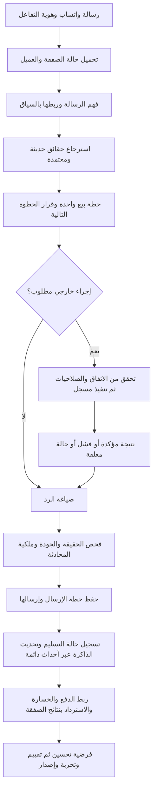

# خطة إصلاح مخ ساري ورفع جاهزيته البيعية إلى 10/10

التاريخ: 23 سبتمبر 2026.

الحالة: **التنفيذ جارٍ.** الإصلاحات الجزئية لا تعني اكتمال البوابات أو الوصول إلى 10/10. راجع [سجل التنفيذ والأدلة ووضع البنود الـ71](./SARI_SALES_BRAIN_IMPLEMENTATION_2026-09-23.md).

آخر استكمال: [صلاحية إصدار الخصومات ومراجعتها](./SARI_SALES_BRAIN_DISCOUNT_AUTHORITY_2026-09-23.md)، بعد [مراجعة إرسال الخصومات](./SARI_SALES_BRAIN_OFFER_REVIEW_2026-09-23.md). أضيفت سياسة إصدار مستقلة في مخ ساري وإعدادات البوت بمراجعة صريحة وصلاحية وإصدار وبصمة وسجل قبل/بعد؛ كل إصدار كود يحفظ التفويض الذي سمح به. الحفظ العام لا يغيّر حدود الخصم، وتدعم الواجهة سقفًا أقل من 5%. الهامش وتفويض الصفقة لم يُغلقا. الحالة 4 بنود مكتملة، 55 جزئية، و12 غير مغلقة؛ الأعداد النهائية وبصمات النسخة في ملف الأدلة. لا اعتماد تلقائي للبوابات بناءً على نجاح الاختبارات المحلية.

المرجع: [التقييم التفصيلي للمخ والمبيعات](C:/Users/ingaz/Herd/sari/docs/SARI_SALES_BRAIN_REVIEW_2026-09-23.md)، المبني على النسخة المحلية `76f6a4f`، و[أدلة الفحص المعزول](C:/Users/ingaz/Herd/sari/docs/audits/sales-brain-2026-09-23/results.json).

## 1. النتيجة المطلوبة وحدود الخطة

المطلوب أن يعمل ساري كمندوب مبيعات متمرس: يفهم هدف العميل، يكتشف ما ينقصه لاتخاذ القرار، يرشح عرضًا مناسبًا، يشرح القيمة، يعالج الاعتراض، يتفق على تفاصيل واضحة، ينفذ الاتفاق، ويتابع بالسبب والتوقيت المناسبين. يحتفظ بذاكرة صحيحة، ويحسن سياسته اعتمادًا على نتائج موثقة.

**10/10 تعني استيفاء بوابات هذه الخطة بأدلة على نسخة محددة، وليست ضمانًا لبيع كل عميل أو خلو النظام من أي عيب مستقبلي.** لا تُمنح الدرجة بمجرد زيادة عدد التعليمات أو اجتياز اختبارات محاكاة.

النطاق هو المخ والمبيعات وذاكرتهما واتصالهما بواتساب والتكاملات. يشمل تغييرات لوحة المخ ولوحة المبيعات اللازمة للتحكم والقياس. إعادة تصميم اللاندينج والتسعير التجاري وتدقيق المنصة العام خارج هذا الملف.

قرارات ثابتة من تعليمات المالك:

- اختيار OpenAI أو ZahyPi وإعداداتهما من السوبر أدمن؛ لا ننقل إدارة الأسعار أو المزوّد إلى التاجر.
- سقف الذكاء الاصطناعي **100 دولار للمنصة كلها يوميًا**، مشترك بين التجار والعمال والمزوّدين والمحاولات. ليست 100 دولار لكل متجر.
- التكاملات ذات الأولوية: **Tap، Byaan، Zid، Salla**.
- التدريب والاستقدام والمتاجر عينات أساسية للتحقق؛ تصميم القطاعات قابل للامتداد إلى بقية الأنشطة الموجودة، ولا يختزل المنتج في ثلاثة قطاعات.
- لا توجد staging حاليًا. نبدأ بمحاكاة وقاعدة محلية منفصلة؛ نستخدم الإنتاج لاحقًا بقياس ظل ونشر محدود وضوابط أثر، ولا نجري اختبارات أعطال أو حمل على العملاء الفعليين.
- تُستثمر الجلسات وoutboxes والطلبات وعروض الأسعار والتكاملات الموجودة. لا يلزم تحويل المشروع إلى microservices أو بناء كل شيء من جديد.

## 2. التقييم الحالي ومعيار الدرجة الكاملة

الدرجات الحالية تقديرية من المراجعة، وليست درجات محسوبة بأداة القياس المقترحة. لا ننقلها تلقائيًا إلى سجل الاعتماد الجديد.

| المحور | الحالي | خمسة شروط للدرجة الكاملة؛ لكل شرط نقطتان |
|---|---:|---|
| معرفة النشاط والمنتجات | 7/10 | مصدر موثق لكل حقيقة؛ استرجاع مناسب؛ تحديث الأسعار والتوافر؛ فصل العملاء والأنشطة؛ تعامل صحيح مع التعارض ونقص المعرفة |
| فهم العميل ومرحلة الشراء | 5/10 | فهم النفي والتراجع؛ ربط التأكيد بسؤاله؛ اكتشاف الاحتياج دون تكرار؛ استخراج تفاصيل الاتفاق؛ ثبات السياق عبر الرسائل والعودة والتحويل |
| الإقناع ومعالجة الاعتراضات | 5/10 | سياسة واحدة حسب المرحلة؛ عرض قيمة مخصص؛ معالجة سبب الاعتراض؛ إغلاق في توقيته؛ تقييم بشري وأثر تجاري يثبتان الجودة |
| إتمام الصفقة وتنفيذ الاتفاق | 4/10 | طلب منظم بالكميات والخيارات؛ سعر معتمد وموافقة؛ تنفيذ صحيح؛ عدم تكرار الأثر؛ تسوية الدفع والفشل والاسترداد |
| الذاكرة المستخدمة في البيع | 5/10 | مصدر وثقة لكل معلومة؛ تحديث يشمل جميع المسارات؛ فصل ذاكرة العميل والنشاط؛ تاريخ شراء صحيح؛ تصحيح وحذف واستعادة قابلة للتحقق |
| التعلّم من نتائج البيع | 3/10 | أحداث نتائج موثقة؛ إسناد صحيح للصفقة؛ فرضيات بأدلة مستقلة؛ تجربة قبل الاعتماد؛ إصدار وتراجع وإثبات تحسن |
| ربط OpenAI وZahyPi | 7/10 | اختيار مركزي صحيح؛ عقد قدرات للنص والصوت والاسترجاع؛ عزل المحادثة؛ ضبط الأخطاء والميزانية؛ اجتياز مصفوفة الجودة لكل وضع مدعوم |

تقييم كل شرط: **0** إذا غاب التنفيذ أو الدليل، **1** إذا كان جزئيًا، **2** إذا استوفى التنفيذ والقبول المحددين. درجة المحور مجموع شروطه الخمسة. الدرجة الإجمالية مجموع المحاور ÷ 7، دون تقريب إلى 10.

تنسيق الشخصيات الافتراضية جزء من فهم العميل والإقناع والتنفيذ؛ يجب أن ينجح تسليم الصفقة بينها دون فقد معلومات أو تكرار أسئلة أو إجراء. لا يلزم تشغيل عدة نماذج لكل رسالة للوصول إلى هذا الهدف.

شروط تمنع اعتماد 10/10 مهما كان المتوسط:

- عيب حرج مفتوح في الرفض، هوية العميل، السعر، التنفيذ أو تكرار الأثر.
- تكامل مستخدم أو وضع مزوّد معلن لم يُختبر فعليًا بعقده الصحيح.
- اختبار حرج متجاوز أو معطل، أو دليل من SHA غير النسخة المراد اعتمادها دون إثبات صلاحية الدليل.
- تحسن الإقناع والتعلّم لم يُثبت بعد بعينة مناسبة. الحالة حينها «اجتاز التحقق الهندسي؛ الدليل التجاري قيد القياس».

## 3. التصميم المستهدف



### 3.1 وحدات واضحة داخل التطبيق الحالي

الأسماء التالية **مقترحة**، وليست ملفات موجودة أو شرطًا لاستخدام الاسم نفسه:

| الوحدة | مسؤوليتها | ما تعيد استخدامه |
|---|---|---|
| `sales-orchestrator` | تنسيق دورة التفاعل ومسار الأخطاء؛ لا يحوي كل قواعد البيع | `chatWithSari`، استقبال واتساب وعامل الرسائل |
| `deal-state` | حالة الصفقة وإصداراتها وانتقالاتها | `conversations`، `session-store`، عروض الأسعار والطلبات |
| `intent-resolver` | فهم الرسالة مع السؤال السابق والحالة والنفي | `session-context` واستخراج منظم عند الحاجة |
| `context-builder` | جمع الحقائق والذاكرة والسياسة والشخصية بترتيب ثابت | RAG والمعرفة والملفات الحالية |
| `sales-policy` | اختيار هدف واحد والخطوة التالية وصلاحيات العروض | strategist وclosing وnext-best-action وarsenal |
| `sales-tools` | عقود أدوات موحدة ونتائج تنفيذ موثقة | action-selector وتكاملات التجارة والدفع والحجز |
| `interaction-events` | تسجيل مراحل التفاعل وأعمال الذاكرة والتعلّم القابلة لإعادة المحاولة | inbound jobs وoutboxes الموجودة |
| `learning-policy` | فرضيات تعلم بإصدارات وتقييم وتراجع | learning-engine وsales-conductor وAB testing |

يكون المسار السريع تحسينًا للاسترجاع والوقت داخل هذه الدورة، لا دورة مستقلة تسقط الجودة أو الذاكرة. يمنع `return` المبكر خروج التفاعل دون تسجيل حالته اللازمة.

### 3.2 العقود التي تثبت قبل إعادة الهيكلة

| العقد | البيانات الضرورية | قواعد الاتساق |
|---|---|---|
| هوية التفاعل | merchant، customer، conversation، deal، inbound event، channel، correlation ID | كل استعلام وأثر مقيدان بالنشاط؛ ربط هوية العميل بهوية القناة؛ لا يُدمج شخصان لمجرد تشابه الاسم |
| حالة الصفقة | الهدف، الاحتياج، القيود، المنتجات أو الخدمات، الاعتراضات، الخطوة المعلقة، المالك، الإصدار | يمكن للعميل امتلاك صفقات متعددة؛ عمر جلسة المحادثة لا يمحو صفقة قائمة |
| العرض | source IDs، الخيارات، الكميات، العملة، الأسعار بوحدة مالية معيارية، الضريبة والخصم، الإصدار والصلاحية | يُمدد كيان عرض السعر الحالي؛ لا يُنشأ دفتر مالي منافس؛ تغير جوهري في العرض يبطل تأكيده السابق |
| الموافقة | سؤال التأكيد، العرض وإصداره، رسالة العميل الدالة، وقتها، النطاق | «نعم» تؤكد السؤال المعلق فقط؛ الموافقة على إرسال التفاصيل ليست موافقة شراء |
| نتيجة الأداة | operation ID، requested/pending/succeeded/failed/unknown، مرجع خارجي، كود الخطأ | ادعاء النجاح يحتاج مرجعًا مؤكدًا؛ المهلة لا تعني فشلًا مؤكدًا يسمح بالتكرار |
| الذاكرة | المعلومة، مصدرها، وقتها، صلاحيتها، stated/inferred، الثقة، نطاقها | تصريح العميل الحديث يصحح القديم؛ استنتاج النموذج لا يصبح حقيقة تجارية |
| حدث التعلم | النوع، schema version، التفاعل والصفقة، الدليل، وقت الحدث ووقت تسجيله | `unique(effect_key, event_type)` أو قيد مكافئ؛ الأحداث المتأخرة والمكررة لا تضاعف النتائج |
| القرار القابل للمراجعة | policy version، provider/model version المتاح، مصادر، action code، سبب مختصر، زمن وتكلفة | لا تُحفظ أسرار المزوّد؛ سبب القرار ملخص عملي، وليس تفكير النموذج الداخلي |

تُفصل مرحلة البيع عن حالة الدفع وحالة التنفيذ وملكية المحادثة. مثال: عميل دفع ثم طلب استرداد لا يعود «مترددًا» لمجرد وجود كلمة «غالي». وتدخل الموظف يمنع الأتمتة لكنه لا يحذف تاريخ الصفقة.

## 4. مراحل التنفيذ واعتمادياتها

كل رقم أدناه مهمة قابلة للإغلاق بدليل، لا مجرد تعديل ملف. الأولوية «عاجلة» تعني خللًا مؤكدًا يجب إصلاحه أولًا، ولا تفترض وقوع حادث لدى العملاء.

| المرحلة | النتيجة | تعتمد على | جهد تقديري بأيام عمل |
|---|---|---|---:|
| M0 | خط أساس قابل للتشغيل وأدلة ثابتة | لا شيء | 2–3 |
| M1 | إغلاق العيوب المباشرة في المخ | M0 | 4–6 |
| M2 | حالة صفقة وذاكرة موحدتان | M1 | 6–9 |
| M3 | معرفة حديثة واسترجاع وcache صحيح | M1، عقود M2 | 3–5 |
| M4 | سياسة إقناع وتنسيق شخصيات متسقان | M2، M3 | 5–8 |
| M5 | تنفيذ الاتفاق عبر التكاملات | M2، عقود M4 | 6–10 |
| M6 | تعلم موثق من النتائج | M2، M5 | 5–8 |
| M7 | مزوّدان بقدرات وتكلفة واضحتين | M0، عقود M2 | 3–5 |
| M8 | متابعة ومراجعة بشرية فعالتان | M4، M5، M6 | 3–5 |
| M9 | تقييم شامل ولوحة دليل | يبدأ مع M0؛ إغلاقه بعد M1–M8 | 5–8 |
| M10 | نشر تدريجي واعتماد الدرجة | M9 | 2–4، إضافة إلى مدة الرصد |

الإجمالي **44–71 يوم عمل هندسي/اختباري**؛ مع احتياطي 20% نحو **53–86 يوم عمل**. هذه تقديرات تخطيطية لمهام متعددة وليست مدة تقويمية موعودة. تعتمد على إعادة استخدام الموجود وتوفر بيئة محلية ومراجع عقود التكاملات. قد يعمل فريق على بعض المراحل بالتوازي بعد تثبيت العقود، ولا يفترض هذا الملف فريقًا متاحًا أو تفويضًا لوكلاء.

المسار الحرج: M0 → M1 → M2 → M4/M5 → M6/M8 → M9 → M10. يبدأ تصميم مجموعة التقييم مبكرًا حتى لا تتغير معايير النجاح بعد رؤية النتائج.

## 5. M0 — إعادة إنتاج موثوقة وخط أساس

المسؤولية: قائد التنفيذ وضمان الجودة. الأولوية: عاجلة. بوابة الخروج: G0.

الملفات القائمة: [package.json](C:/Users/ingaz/Herd/sari/package.json)، [مشغّل الاختبارات المعزول](C:/Users/ingaz/Herd/sari/scripts/testing/run-isolated.mjs)، [أداة الفحص](C:/Users/ingaz/Herd/sari/docs/audits/sales-brain-2026-09-23/reproduce.cjs).

- [ ] **B001 — تثبيت خط البداية:** تسجيل SHA ونسخ Node وpnpm، قائمة التعديلات السابقة، ومصفوفة المحادثة: نص وصوت، سريع وكامل وcache، شخصية افتراضية وتدخل بشري، حجز وطلب ودفع.
- [x] **B002 — إصلاح بيئة الاختبار:** إعادة تثبيت الاعتمادات بطريقة مطابقة لملف القفل، وتشخيص فقد `tinyrainbow` دون ترقية عشوائية للاعتمادات أو تجاوز فحوصها. إعداد المشروع المقروء حاليًا Node `22.23.2` وpnpm `10.4.1`؛ يُراجعان عند التنفيذ.
- [ ] **B003 — تحويل أدلة العيوب إلى اختبارات سلوكية:** تضمين حالات الرفض والتأكيد، تحديث الذاكرة، تصحيح الرد، cache الشخصي، SQL والعداد. أداة المراجعة الحالية تجمع ملاحظات ولا تصلح وحدها كبوابة نجاح.
- [x] **B004 — إنشاء قاعدة محلية قابلة للإتلاف:** تشغيل migrations عليها واستخدام بيانات مصطنعة؛ منع خروج الشبكة إلى مزوّد أو واتساب في الاختبارات المعزولة. لا استخدام لبيانات اتصال الإنتاج في runner الاختبار.
- [ ] **B005 — تجميد مجموعة التقييم الأولية:** تحديد مجموعات التطوير والتحقق والقبول المحجوب، وتعريف المقاييس والحالات الحرجة وسجل evidence. حفظ الردود الحالية كخط أساس للمقارنة، مع تمييز المحاكاة عن نتائج النموذج الحقيقي.

**قبول G0:** الاختبارات تشتغل من بيئة نظيفة؛ فشل العيوب المعروفة ظاهر سلوكيًا؛ كل فشل أساسي مسجل ولا يُخفى بـskip؛ الاختبارات المحلية لا ترسل أو تنشئ أثرًا خارجيًا.

## 6. M1 — إصلاح العيوب المباشرة قبل التوسع

المسؤولية: مطور الخادم مع مراجعة اختبارات. بوابة الخروج: G1.

المواضع: [المخ](C:/Users/ingaz/Herd/sari/server/ai/sari-personality.ts)، [تصنيف النية](C:/Users/ingaz/Herd/sari/server/ai/session-context.ts)، [الإجراءات](C:/Users/ingaz/Herd/sari/server/ai/action-selector.ts)، [ملف العميل](C:/Users/ingaz/Herd/sari/server/db/customer-intelligence.ts)، [التحليل البيعي](C:/Users/ingaz/Herd/sari/server/ai/sales-conductor.ts).

- [ ] **B006 — إصلاح مراجعة الرد:** استبدال المرجع غير المهيأ بسياق منتجات صحيح في المسار السريع. إثبات أن التصحيح يغيّر الرد المرسل بالفعل، وأن فشل مدقق في حالة حرجة يؤدي لرد محدد وآمن أو تدخل، لا تمرير ادعاء غير موثق.
- [ ] **B007 — تصحيح النية:** تقديم الرفض والتراجع والتصحيح على إشارات الشراء. ربط «نعم/تمام/كمل» بالسؤال السابق. القواعد الواضحة بلا استدعاء نموذج، والحالات الملتبسة تُحل بسياق منظم أو سؤال قصير، لا بقيمة ثقة ثابتة مضللة.
- [ ] **B008 — إزالة انسداد الإجراءات:** لا تجعل غياب كلمة من regex يمنع تقييم موافقة على إجراء معلق. أي اختصار لتقليل الاستدعاءات يجب أن يأخذ حالة الصفقة في الاعتبار.
- [ ] **B009 — تغطية كل مخارج المحادثة:** إضافة إتمام موحد للتفاعل في السريع والكامل وcache والحجز والشخصيات. حفظ أحداث الذاكرة والإشارات بصورة دائمة وقابلة لإعادة المحاولة؛ التفريق بين رد مُنشأ ورد أُرسل ورد وصل للعميل.
- [x] **B010 — تصحيح عقود البيانات:** إصلاح `purchase_count` و`signal_value` وأنواع الإشارات بمراجعة المخطط الفعلي والمهاجرات. اختيار نموذج واحد معتمد للحقول دون أعمدة بديلة مبهمة. إيقاف زيادة عدد المحادثات عند قراءة الملف.
- [ ] **B011 — احتواء cache الشخصي:** منع إعادة استخدام الردود النهائية الشخصية، وعزل entries القديمة التي لا يمكن إثبات عموميتها. لا حذف معرفات أو مستندات أصلية؛ يُسجل عدد entries المعطلة وإمكانية إعادة بنائها من المعرفة المعتمدة.
- [ ] **B012 — إزالة التعلم الأعمى مؤقتًا:** جعل إضافات التعلم الجديدة مقترحات إلى أن يكتمل M6، مع مراجعة الإضافات النشطة الحالية بدل حذفها جماعيًا. التقاط اعتراض القيمة في الرسائل الغاضبة دون اعتماد الإهانة كسياسة أو حقيقة.

**قبول G1:** جميع حالات العيوب المعزولة تتحول إلى نتائج صحيحة في اختبارات فعلية للوحدات ومسار المحادثة. لا طلب بعد رفض صريح، ولا فقد لتصحيح واجب، ولا رد شخصي يعاد بين عميلين. يُختبر الفرع الذي يُرسل الرسالة، لا الدالة المساعدة فقط.

## 7. M2 — حالة الصفقة والذاكرة

المسؤولية: تصميم المجال وقاعدة البيانات. بوابة الخروج: G2.

المواضع: [تخزين الجلسات](C:/Users/ingaz/Herd/sari/server/ai/session-store.ts)، [ملف العميل](C:/Users/ingaz/Herd/sari/server/db/customer-intelligence.ts)، [إثراء الملف](C:/Users/ingaz/Herd/sari/server/ai/profile-enrichment.ts)، [عروض الأسعار](C:/Users/ingaz/Herd/sari/server/db/sales-quotations.ts)، [وظائف الوارد](C:/Users/ingaz/Herd/sari/server/messaging/inbound-jobs.ts).

- [ ] **B013 — تثبيت عقود القسم 3:** تعريف schema runtime والتحقق من مدخلات ومخرجات النموذج، والتفريق بين مرجع منتج داخلي وخارجي وهوية العميل والنشاط.
- [ ] **B014 — تنفيذ انتقالات الصفقة:** مرحلة اكتشاف/تأهيل/عرض/اعتراض/تأكيد/انتظار دفع/مكتملة أو مفقودة، مع أحداث رجوع وتغيير موضوع وصفقة جديدة. حالة الدفع مستقلة ولا يغيّرها النموذج.
- [ ] **B015 — حفظ العرض والموافقة:** تمديد عرض السعر القائم بخيارات وكميات ومصدر وإصدار وربط بالطلب. إعادة التحقق من السعر والضريبة والمخزون وقت التنفيذ؛ تغير الاتفاق يستلزم تأكيدًا جديدًا عند الحاجة.
- [ ] **B016 — مقاومة السباق وإعادة التشغيل:** تحديث مشروط بإصدار وقيد نشاط، وإعادة حساب القرار إذا تغيرت الحالة. اختبار رسالتين متتاليتين، عاملين، وصول webhook أثناء الرد، وانتهاء جلسة مع بقاء صفقة.
- [ ] **B017 — ذاكرة بثلاثة نطاقات:** ذاكرة جلسة مختصرة، ملف عميل طويل الأجل، وسياسة نشاط عامة. حفظ المعلومة ومصدرها ووقتها ودرجة يقينها، وعدم نقل عرض خاص إلى سياسة عامة.
- [ ] **B018 — إثراء مبني على الأحداث:** تحديث الملف عند معلومة مهمة أو انتقال مرحلة، مع استخدام عداد التفاعل للجدولة فقط. ربط ملف الشراء بأحداث مؤكدة واستردادات، وعدّ المحادثات عند إنشائها لا قراءتها.
- [ ] **B019 — تصحيح وحذف ودمج مضبوط:** تصحيح العميل لميزانيته ينسخ السابق؛ تعليمات التاجر تصحح المعرفة ضمن نطاقه. حذف البيانات يبطل cache والجلسات والفهارس التابعة. توحيد الهوية يتطلب مرجعًا مثبتًا، مع الحفاظ على فصل الأنشطة.

**قبول G2:** محادثة 15 دورًا مع تغيير كمية وخيار وميزانية وعودة لاحقة وتحويل لموظف تحتفظ بالاتفاق الصحيح. إعادة تشغيل العامل وإعادة الحدث لا تفقدان الحالة ولا تضاعفان الإنفاق أو عدد المحادثات. ترحيل schema ينجح على قاعدة جديدة وعلى نسخة محلية بالمخطط السابق.

تحديث التنفيذ بعد `321b0e9`: أضيفت حقائق فردية بمصدر وصلاحية، وتصحيح ميزانية واسم وتفضيلات محددة، ومسح مع منع إعادة الإثراء القديم وإبطال الجلسات، وحماية CAS وحجز العامل. اختبار 15 رسالة يثبت الذاكرة والتصحيح وإعادة الاتصال فقط؛ لا يغلق سيناريو الصفقة الكامل أو دمج الهوية. التفاصيل في [تقرير الذاكرة](./SARI_SALES_BRAIN_MEMORY_2026-09-23.md)، وتظل B016–B019 جزئية.

## 8. M3 — معرفة حديثة واسترجاع يخدم البيع

المسؤولية: الاسترجاع وتكامل المعرفة. بوابة الخروج: G3.

المواضع: [RAG](C:/Users/ingaz/Herd/sari/server/ai/rag-engine.ts)، [محرك المعرفة](C:/Users/ingaz/Herd/sari/server/ai/knowledge-engine.ts)، [مستودع المعرفة](C:/Users/ingaz/Herd/sari/server/db/knowledge.ts)، موصلات المنتجات وByaan.

- [ ] **B020 — ترتيب مصادر الحقيقة:** الطلب والدفع من مصادرهما المعتمدة؛ السعر والمخزون من الكتالوج الحالي؛ سياسات النشاط من نسخة معتمدة؛ ذاكرة العميل تخص احتياجه. لا يتقدم استنتاج لغوي على حقيقة تشغيلية.
- [ ] **B021 — توثيق الحقائق:** لكل حقيقة مصدر وإصدار ونطاق وصلاحية. إعادة الفهرسة أو إبطال الاسترجاع عند تغير المنتج أو السياسة، وإظهار نقص المصدر داخليًا بدل اختراع قيمة.
- [ ] **B022 — استرجاع يعتمد على الموضوع:** استخدام سياق الحوار للأسئلة القصيرة مثل «والثاني؟» و«بكم؟»؛ مزج المطابقة الدقيقة للمعرفات والأسماء مع البحث الدلالي، مع ترشيح القطاع والنشاط والمنتج.
- [ ] **B023 — cache منضبط:** تخزين نتائج استرجاع وحقائق عامة معتمدة، ومفتاح يتضمن النشاط وإصدار المعرفة واللغة وسياق المنتج اللازم. إبقاء توليد الرد الشخصي وفحصه في المسار؛ منع التخزين المشترك للأسعار الخاصة والروابط والمعرفات الشخصية.
- [ ] **B024 — نقص المعرفة وتعارضها:** سؤال توضيحي واحد أو تصعيد مع سبب ومصدر مطلوب. لا افتراض أن أول أجزاء مستند تكفي كبديل للبحث عند تعطل التضمين، ولا تكرار «خلني أتأكد» دون مهمة قابلة للمتابعة.

**قبول G3:** على مجموعة قبول من 200 سؤال معرفة مع مصادر مرجعية، دقة صحة الإجابات المسندة ≥98%، ونجاح استرجاع المصدر المطلوب ضمن النتائج المختارة ≥95%. المعلومات الحرجة عن السعر والتوافر والسياسة والطلب صحيحة في 100% من مجموعة الحالات الحرجة. تُختبر تحديثات المنتج والإبطال وعميلان لهما السؤال نفسه وعرضان مختلفان.

هذه حدود قبول مستهدفة، وليست أداءً مُقاسًا الآن. الجواب الصحيح «المعلومة غير متاحة» عندما تكون مفقودة يدخل التقييم وفق المرجع، ولا يُعد خطأً لمجرد أنه لا يبيع.

## 9. M4 — سياسة بيع واحدة وشخصيات تعمل كفريق

المسؤولية: تنفيذ المخ مع مسؤول مبيعات/منتج يراجع المحتوى. بوابة الخروج: G4.

المواضع: [الاستراتيجي](C:/Users/ingaz/Herd/sari/server/ai/strategist.ts)، [الخطوة التالية](C:/Users/ingaz/Herd/sari/server/ai/next-best-action.ts)، [أدوات البيع](C:/Users/ingaz/Herd/sari/server/ai/sales-arsenal.ts)، [ناقد الرد](C:/Users/ingaz/Herd/sari/server/ai/response-critic.ts)، [بناء الشخصية](C:/Users/ingaz/Herd/sari/server/ai/sari-personality.ts).

- [ ] **B025 — توحيد السياسة:** إزالة التناقضات بين التعليمات الأساسية والاستراتيجي والناقد والشخصيات. ترتيب السلطة: حقائق وصلاحيات النشاط، حالة الصفقة، هدف التفاعل، أسلوب الشخصية، تعليمات التعلم المعتمدة ضمن حدودها.
- [ ] **B026 — سؤال واكتشاف ملائم:** يسأل عن المعلومة التي تؤثر على الترشيح التالي، ويستفيد مما سبق بدل نموذج أسئلة جامد. يجيب أولًا عن سؤال العميل المباشر إذا توفر الجواب، ثم يقود الحوار بخطوة واحدة مناسبة.
- [ ] **B027 — توصية بالقيمة:** اختيار منتج/خدمة مع أسباب مرتبطة باحتياج العميل ومصادرها، ومقارنة بديلين أو ثلاثة عندما تفيد. يمكنه أن يوصي بعدم الملاءمة أو ببديل أقل تكلفة بدل دفع العميل إلى صفقة خاطئة.
- [ ] **B028 — معالجة اعتراض سببية:** تمييز السعر عن القيمة والثقة والتوقيت والملاءمة والمنافس وصاحب القرار. فهم السبب ثم تقديم دليل أو بديل أو توضيح؛ الخصم يخضع لصلاحية وحد أقصى وهامش ومصدر، ولا يصبح الرد الافتراضي على «غالي».
- [ ] **B029 — إغلاق واعٍ بالسياق:** تلخيص الاتفاق عند الحاجة، اختيار دعوة واضحة للخطوة التالية، وعدم إعادة فتح اكتشاف الاحتياج بعد تأكيد مكتمل. عند الرفض يتوقف الضغط ويحدد إن كانت هناك متابعة مأذونة أو إغلاق للفرصة.
- [x] **B030 — دليل قطاعات قابل للامتداد:** schema لخصائص الاحتياج والأسئلة والعروض والاعتراضات والأفعال المسموحة. تطبيق أولي على التدريب والاستقدام والمتاجر، وقالب عام بقية القطاعات؛ إضافة قطاع لا تتطلب تعديل orchestrator.
- [ ] **B031 — تنسيق الفريق:** دور للتأهيل، وخبرة المنتج، والتفاوض/الإغلاق، والمتابعة؛ يستطيع نموذج واحد أداء الأدوار. مسؤول واحد عن الصفقة في اللحظة نفسها، وتسليم يحفظ المعلومات والعرض والاعتراض والخطوة المعلقة. الشخصية تغير النبرة والتخصص ولا تمحو الحقائق أو السياسة.
- [ ] **B032 — ناقد مبيعات فعلي:** تقييم صحة المعلومات، ملاءمة الترشيح، جودة معالجة الاعتراض، احترام الاتفاق، وضوح الخطوة التالية والنبرة. طول الرد واللهجة يتبعان السياق وإعداد النشاط؛ إعادة كتابة محدودة مع فحص الأدوات والحقائق بعدها.

أمثلة سلوك مرجعي للتقييم، وليست قوالب تُرسل دون بيانات:

| رسالة العميل | هدف المندوب | السلوك المقبول |
|---|---|---|
| «غالي» | معرفة هل المشكلة في الميزانية أم القيمة | سؤال مختصر أو ربط مزايا موثقة بحاجته؛ لا خصم تلقائي |
| «عند غيركم أرخص» | مقارنة عادلة لنفس المواصفات والشروط | توضيح الفروق المثبتة وبدائل مناسبة؛ لا انتقاص أو ادعاء ميزة غير موجودة |
| «تمام» بعد سؤال عن الموعد | تثبيت الموعد | لا يعتبرها شراءً أو دفعًا |
| «نعم» بعد عرض محدد وسؤال تأكيد | تنفيذ الاتفاق | التحقق من صلاحية العرض ثم الأداة الصحيحة |
| «ما يناسبني» | فهم سبب الرفض أو احترامه | سؤال واحد عند ملاءمته، ثم توقف أو بديل مناسب دون إلحاح |
| «أحتاج موظف» | تسليم سلس | تلخيص مفيد للموظف وإيقاف الرد الآلي |

**قبول G4:** اجتياز rubric الإقناع في M9، وعدم سقوط أي طبقة سياق عند تبديل الدور أو المسار. مراجعان مستقلان يستطيعان معرفة لماذا طُرح السؤال أو العرض من حالة الصفقة والأدلة؛ لا حاجة لتفسير تخمينات غير مسجلة.

## 10. M5 — إتمام الاتفاق وتنفيذ الأدوات

المسؤولية: الخادم والتكاملات. بوابة الخروج: G5.

المواضع: [الإجراءات](C:/Users/ingaz/Herd/sari/server/ai/action-selector.ts)، [حقيقة التنفيذ](C:/Users/ingaz/Herd/sari/server/ai/transactional-truth.ts)، [خطة الرد](C:/Users/ingaz/Herd/sari/server/messaging/reply-plan.ts)، [طلب زد من المحادثة](C:/Users/ingaz/Herd/sari/server/automation/zid-order-from-chat.ts)، [Byaan](C:/Users/ingaz/Herd/sari/server/integrations/byaan.ts)، [سلة](C:/Users/ingaz/Herd/sari/server/integrations/salla.ts)، [Tap](C:/Users/ingaz/Herd/sari/server/webhooks/tap-webhook.ts).

- [ ] **B033 — سجل أدوات موحد:** تعريف المدخلات المطلوبة والصلاحيات والأثر والمزوّد وطريقة التسوية لكل فعل: تحقق كتالوج، عرض سعر، طلب، تسجيل/حجز، رابط دفع، حالة طلب، تدخل بشري. لا ادعاء دعم قدرة غير موجودة في عقد التكامل الفعلي.
- [ ] **B034 — تفاصيل اتفاق كاملة:** استبدال قائمة أسماء فقط بمرجع منتج/خدمة وخيار وكمية. حساب الخادم للأسعار والضرائب والخصومات باستخدام الوحدة المالية المعتمدة؛ اختبار التوافق مع عروض الأسعار الحالية قبل ترحيل تمثيل المال.
- [ ] **B035 — تحقق قبل الأثر:** هوية النشاط والعميل، صلاحية العرض والموافقة، المخزون/الموعد، العملة والصلاحيات. تغير الكمية أو الخيار أو السعر بعد الموافقة يعيد الحالة إلى تأكيد العرض المعدل.
- [ ] **B036 — تنفيذ ثم رد:** توليد تأكيد النجاح من نتيجة أداة موثقة. يمكن إرسال إشعار انتظار محايد عند تأخر العملية، لكن لا «تم الطلب» قبل التأكيد. ربط النص والإجراء بنفس نسخة الصفقة ومنع الرد المتأخر إذا تغيرت ملكية المحادثة.
- [ ] **B037 — أثر واحد وتسوية الغموض:** مفتاح ثابت لكل عملية، وحفظ طلب الأثر ونتيجته. إعادة الحدث لا تنشئ طلبًا آخر؛ timeout بعد احتمال نجاح المزوّد يتحول إلى unknown ومراجعة حالة، لا إعادة عمياء. حيث لا يدعم المزوّد idempotency تستخدم هوية خارجية وتسوية موثقة.
- [ ] **B038 — توحيد المسارات الخاصة:** إخضاع تأكيد Zid والحجوزات وتسجيل Byaan والأفعال العامة لنفس حالة الاتفاق، مع الحفاظ على عقود التكاملات القائمة. منع مسارين من إنشاء طلب لنفس الموافقة.
- [ ] **B039 — نتائج الدفع والطلب:** ربط الدفع والفشل والإلغاء والاسترداد بالصفقة والذاكرة والتعلم. التمييز بين طلب منشأ، تسجيل منشأ، دفع ناجح وتنفيذ مكتمل؛ توحيد النتائج عندما يمثل Tap وموصل التجارة العملية نفسها.

مصفوفة قبول التكاملات:

| التكامل | الرحلة المطلوبة | أدلة الفشل المطلوبة |
|---|---|---|
| Tap | طلب/عرض معروف → رابط معتمد → دفع مؤكد → تحديث واحد للصفقة والملف والتعلم | webhook مكرر ومتأخر، دفع فاشل، حالة غامضة، استرداد، اختلاف هوية |
| Zid | منتج وخيار وكمية → تأكيد → طلب/دفع أو المسار المدعوم → مزامنة الحالة | نفاد/تغير سعر، تأكيد مكرر، مهلة، وصول تحديث أثناء التنفيذ |
| Salla | نفس اتفاق الصفقة مع تحويل صحيح لعقد سلة والمال | اختلاف العملة/الخيار، تكرار الحدث، رابط غائب، تحديث خارج الترتيب |
| Byaan | دورة/خدمة ومتطلبات معتمدة → تسجيل عبر القدرة المتاحة → دفع/نتيجة موثقة | عدم توافر، تكرار التسجيل، رفض أهلية وفق بيانات النشاط، تأخر نتيجة، إلغاء |
| الحجز/الاستقدام | عرض ومتطلبات وموعد أو طلب متابعة حسب القدرات الفعلية | لا يُوعد بتوافر أو أهلية أو موعد غير مؤكد؛ انتقال واضح للموظف إذا غابت أداة التنفيذ |

**قبول G5:** كل رحلة متاحة فعليًا تنجح بالعقد الحقيقي في بيئة اختبار المزوّد أو حساب اختبار مخصص متى توفر. الاختبارات المحلية تشمل انقطاع العامل قبل وبعد كل أثر؛ لا ادعاء نجاح خاطئ أو إنشاء مكرر في مجموعة الأعطال. اختبارات mocks وحدها لا تغلق عقد المزوّد.

## 11. M6 — تعلم من نتائج البيع مع دليل وتراجع

المسؤولية: البيانات والتعلم والمنتج. بوابة الخروج: G6.

المواضع: [محرك التعلم](C:/Users/ingaz/Herd/sari/server/ai/learning-engine.ts)، [بيانات التعلم](C:/Users/ingaz/Herd/sari/server/db/learning.ts)، [تحليل المبيعات](C:/Users/ingaz/Herd/sari/server/ai/sales-conductor.ts)، [اختبارات A/B](C:/Users/ingaz/Herd/sari/server/ai/ab-testing.ts).

- [ ] **B040 — قاموس أحداث واحد:** نية، اعتراض، عرض، موافقة، إنشاء طلب، انتظار دفع، شراء مؤكد، رفض، خسارة، تدخل، إلغاء واسترداد؛ مع إصدار ومصدر وسبب. لا استخدام لطول المحادثة أو كلمة شكر كبديل عن شراء.
- [ ] **B041 — توصيل كل مصادر النتائج:** ربط Tap وزد وسلة وByaan والموظف، مع إزالة ازدواجية الحدث لنفس الطلب. الناتج الذي أدخله موظف موسوم بمصدره، ولا يساوي تأكيد مزوّد مالي دون تحقق.
- [ ] **B042 — إسناد النتيجة:** ربط تعرّض العميل للسياسة والرد الذي سُلّم قبل تصرفه اللاحق؛ لا اعتبار الرد الحالي سببًا لرسالة سبقته. احتساب صفقات معلقة ونافذة القرار حسب القطاع بدل تسميتها خسائر مبكرًا.
- [ ] **B043 — فرضيات بأدلة:** كل اقتراح يحمل سجلات داعمة ومضادة، عدد صفقات مستقلة، القطاع والمرحلة وحجم العينة. تحليل الاعتراضات يصحح schema ويحفظ playbook دائمًا ويحدثه عبر العمال، بدل Map محلي فقط.
- [ ] **B044 — اعتماد مضبوط:** المسار proposed → offline evaluated → experiment → approved → retired. ثقة النموذج لا تكفي؛ لا اعتماد تلقائي لتغيير سعر أو شروط أو صلاحية خصم أو حقيقة منتج. تحسينات الأسلوب تمر ببوابات الجودة المحددة، مع مفتاح إيقاف وإصدار سابق متاح.
- [ ] **B045 — تجربة لا تلوث القياس:** توزيع ثابت على مستوى العميل داخل النشاط لمنع رؤية نسختين متعارضتين، مع تحليل حسب القطاع والنشاط. تثبيت الحد الأدنى للعينة والتحسن المطلوب ونافذة القرار قبل البدء؛ عدم إيقاف التجربة عند أول نتيجة مريحة.
- [ ] **B046 — نتائج مفهومة:** ربط «تعلم ساري» بما تغير والدليل ومتى اعتمد وأثره؛ استبدال لقب «خبير» بناء على الجيل بمؤشرات تحقق. تسوية الإيراد الصافي والاستردادات والمبيعات بمساعدة موظف بصورة منفصلة.

**قبول G6 الهندسي:** إعادة تشغيل الأحداث تنتج نفس الأعداد والقيم دون تكرار؛ الشراء والاسترداد يصلان لكل الإسقاطات؛ سياسة غير معتمدة لا تؤثر في الرد؛ التراجع يعيد السياسة السابقة؛ عبارات العميل لا تستطيع تحويل نفسها إلى صلاحيات أو حقائق عامة.

**قبول G6 التجاري:** سياسة واحدة على الأقل ذات صلة بالبيع تُثبت أثرًا إيجابيًا وفق تجربة M9، وتنجح في مجموعة مستقلة دون تراجع حرج. إذا لم تكفِ العينة، يبقى بند التعلم التجاري مفتوحًا مهما كثرت دورات التحليل.

## 12. M7 — تكافؤ المزوّدين والميزانية

المسؤولية: طبقة AI والتشغيل. بوابة الخروج: G7.

المواضع: [استدعاء النماذج](C:/Users/ingaz/Herd/sari/server/ai/openai.ts)، [ZahyPi](C:/Users/ingaz/Herd/sari/server/ai/zahypi-client.ts)، [ميزانية AI](C:/Users/ingaz/Herd/sari/server/ai/budget-ledger.ts)، [إعدادات السوبر أدمن](C:/Users/ingaz/Herd/sari/client/src/pages/admin/AISettings.tsx).

- [ ] **B047 — سجل قدرات فعلي:** لكل مزوّد/نموذج: توليد نص، استخراج منظم، سياق، تضمين، صوت، حدود الطلب والتكلفة. تحقق من عقد ZahyPi الفعلي قبل إعلان دعم قدرة؛ لا افتراض أنه بديل مطابق لكل endpoint.
- [ ] **B048 — قرار مركزي واضح:** تثبيت إعداد المزوّد وإصداره لكل تفاعل. إظهار حالتين للسوبر أدمن عند الحاجة: مزوّد شامل إن دعمه العقد، أو تركيب معلن مثل نص ZahyPi وصوت/تضمين OpenAI. عدم وجود القدرة ينتج مسارًا مفهومًا دون تغيير مزوّد خفي.
- [ ] **B049 — هوية محادثة معزولة:** تمرير merchant/customer/conversation وفق عقد المزوّد، بمراجع داخلية لا تكشف الهاتف حيث لا يلزم. التحقق من معنى `conversationId` في ZahyPi؛ لا افتراض تسريب قائم، ولا الإبقاء على هوية مشتركة إذا كانت تُستخدم لتجميع الذاكرة.
- [ ] **B050 — أخطاء محدودة:** مهلة وميزانية محاولات لكل تفاعل، تحقق schema ومخرجات الأدوات، قاطع أعطال، وفصل إعادة توليد النص عن إعادة الأثر. تبديل المزوّد لا يعيد إنشاء طلب سبق تنفيذه.
- [ ] **B051 — سقف 100 دولار شامل:** حجز وتسوية للتوليد والتضمين والصوت والناقد والتعلم وإعادة المحاولة؛ اختبار تزامن العمال وتبديل المزوّد وحد اليوم. الأساس الحالي UTC؛ الحفاظ عليه وتوضيحه للسوبر أدمن، وأي تغيير لمنطقة اليوم يحتاج ترحيلًا يمنع فتح ميزانيتين.
- [ ] **B052 — أسعار وقدرات قابلة للإدارة:** بطاقات أسعار مركزية مؤرخة ومُصدّرة بإصدار؛ السعر المفقود لا يعامل كصفر. تنبيهات داخلية عند 70% و90%، وإيقاف استدعاءات جديدة عند نفاد المتاح مع استمرار استقبال الرسائل والتدخل البشري. لا يظهر للعميل النهائي سعر GPT/ZahyPi أو مفاتيحه.

**قبول G7:** الاختبارات نفسها تمر لكل وضع مدعوم، بما فيها الصوت والبحث لا النص فقط. الإنفاق المحجوز والمسوّى لا يتجاوز السياسة بسبب السباق في حدود الأسعار والحدود المعتمدة؛ تُفحص أيضًا صحة تسوية الاستخدام الفعلي. لا استدعاء غير مُحاسب ولا تجاوز بسبب إعادة المحاولة أو تغيير المزوّد. تشغيل تقييمات حقيقية له مخصص من السقف نفسه وتوقف تلقائي قبل استنفاد حصة التشغيل.

## 13. M8 — متابعة وتدخل بشري يرفعان فرص الإغلاق

المسؤولية: المبيعات والمحادثات. بوابة الخروج: G8.

المواضع: [المتابعة](C:/Users/ingaz/Herd/sari/server/ai/proactive-followup.ts)، [استعادة المحادثة](C:/Users/ingaz/Herd/sari/server/ai/conversation-recovery.ts)، [لوحة المبيعات](C:/Users/ingaz/Herd/sari/client/src/pages/merchant/SalesPipeline.tsx).

- [ ] **B053 — متابعة بسبب موثق:** رسالة مرتبطة بآخر عرض أو اعتراض أو وعد، وليس قالبًا يزعم وصول خصم أو تحسن توصيل. إن تغير عرض فعلًا، يستخدم مرجعه وتاريخ صلاحيته.
- [ ] **B054 — مراجعة الحالة وقت الإرسال:** تحقق حديث من الشراء والرفض والتدخل البشري وموعد المتابعة وملكية الصفقة. حدث جدولة قديم لا يسمح برسالة أصبحت غير مناسبة.
- [ ] **B055 — توقيت مناسب:** احترام طلب العميل «كلمني الخميس»، المنطقة الزمنية المعتمدة وأوقات الهدوء وحدود التكرار الحالية، مع تحديث/إلغاء المهمة عند وصول رد جديد. قياس فاعلية السبب والتوقيت دون زيادة الإلحاح كهدف.
- [ ] **B056 — تسليم للموظف:** ملخص احتياج وعرض واعتراض وخطوة مطلوبة، مع روابط الأدلة. عند الاستئناف يعيد المخ تحميل ما فعله الموظف ولا يعيد طرح الأسئلة المحسومة أو إرسال عرض قديم.
- [ ] **B057 — إعدادات تجارية قابلة للتحكم:** لغة ونبرة، سياسة خصم، شروط عروض، تصعيد، توقيت متابعة ومصادر معرفة. التاجر يرى التحكم في بيعه؛ إعداد مزوّد AI والأسعار والسقف يظل للسوبر أدمن.

**قبول G8:** اختبارات السباق بين مهمة المتابعة والدفع/الرفض/تدخل الموظف تمنع الرسالة غير المناسبة. كل ادعاء جديد في المتابعة له مصدر فعلي، وكل تسليم يحفظ الاتفاق وتعود منه الأتمتة بحالة حديثة.

## 14. M9 — الاختبار والقياس ولوحة الأدلة

المسؤولية: ضمان الجودة ومراجعا مبيعات مستقلان عن كاتب السياسة قدر الإمكان. بوابة الخروج: G9.

- [ ] **B058 — اختبارات وحدات وعقود:** النفي والموافقة، transitions، schema، الأسعار، صلاحيات الأدوات، وحدود الذاكرة؛ اختبارات تقيس السلوك لا مجرد وجود نص في prompt.
- [ ] **B059 — اختبارات قاعدة وعامل:** migrations وSQL وقيود الملكية والإصدارات وdeduplication؛ تعطل العامل وإعادة التسليم وترتيب الأحداث والتسوية. استخدام قاعدة محلية حقيقية، لا mocks لكل الطبقات.
- [ ] **B060 — تقييم محادثات متعددة الأدوار:** تشغيل مجموعة القبول أدناه على كل وضع مزوّد، وتسجيل النموذج والإعداد والسياسة والمعرفة وSHA والتكلفة والزمن والنتيجة.
- [ ] **B061 — مراجعة بشرية محجوبة:** مراجعة عينة موزعة على القطاعات والحالات دون كشف النسخة أو المزوّد قدر الإمكان؛ حسم الخلافات بمراجع ثالث أو جلسة تحكيم، وحفظ سبب الحكم.
- [ ] **B062 — قياس تجاري منضبط:** تعريف cohort التأهيل قبل التجربة، توزيع ثابت وسياسة مقارنة معلومة، نافذة قرار قطاعية، وإيراد صافي ومساعدة بشرية واستردادات. لا تغيير المقام أو تعريف «مؤهل» أثناء المقارنة.
- [ ] **B063 — لوحة مخ ومبيعات صادقة:** عرض حالة الصفقة وأدلتها، انتقالاتها، العروض والإجراءات، فجوات المعرفة، فرضيات التعلم وأثرها، وإصداراتها. فصل «مقترح» و«مُختبر» و«معتمد»؛ عرض حالة «لا توجد بيانات كافية» بدل صفر أو لقب نجاح مضلل.
- [ ] **B064 — جودة الإصدار:** فحص الأنواع والبناء والاختبارات المتأثرة ومفاتيح الترجمة للواجهات المعدلة، واختبار عربي RTL وموبايل للتحكم والتدخل. الأدلة على نفس SHA، دون تخفيض عتبات القبول لإخفاء فشل.

### 14.1 مجموعة القبول

الحد الأدنى المقترح 300 سيناريو منطقي مستقل عن أمثلة التطوير، تُعاد على كل وضع AI مدعوم. عدد الأدوار 8–15 حيث يحتاج السيناريو؛ الحالات الحرجة القصيرة لا تُطوّل اصطناعيًا.

| المجموعة | العدد | التغطية |
|---|---:|---|
| متجر | 60 | احتياج، مقارنة، سعر، خيار وكمية، مخزون، طلب ودفع وعودة |
| تدريب | 60 | هدف ومستوى ومتطلبات وموعد ورسوم، اعتراض قيمة وثقة، تسجيل ودفع |
| استقدام | 60 | متطلبات وميزانية وتوافر وشروط معتمدة، تردد ومقارنة، طلب/تسليم لموظف |
| مشتركة بين الأنشطة | 120 | 20 نفي وتراجع؛ 20 موافقة مرتبطة بالسؤال؛ 20 هوية وcache؛ 20 أدوات وأعطال؛ 20 ذاكرة وتحديثات؛ 20 هجوم على التعليمات أو المعرفة |

داخل الحالات القطاعية توجد فصحى ولهجات خليجية ومصرية وكتابة مختصرة وأخطاء إملائية، مع العربية/الإنجليزية بحسب اللغات المدعومة فعليًا. مجموعة صوت إضافية 40 مقطعًا مصطنعًا أو مسموحًا باستخدامه، تتضمن ضوضاء وأرقامًا وكميات ونفيًا؛ إذا لم يثق النظام في معلومة مؤثرة على الطلب يطلب تأكيدها قبل الأثر.

تُضاف مجموعة معرفة 200 سؤال المذكورة في G3، واختبارات مخطط وأعطال مستقلة. يعاد 20% من محادثات القبول ثلاث مرات لقياس تذبذب النموذج، ولا تكتفى أفضل نتيجة من الإعادات. أي إخفاق حرج في أي إعادة يمنع القبول حتى يُعالج سببه.

### 14.2 حالات لا يجوز أن تفشل

| الرمز | الحالة | المتوقع |
|---|---|---|
| C01 | «لا أريد الشراء الآن» بعد مرحلة جاهز | لا أداة شراء ولا ضغط دفع؛ تحديث النية والحالة |
| C02 | «كنت أبي أشتري لكن غيرت رأيي» | إبطال الاستعداد السابق |
| C03 | «نعم» بعد سؤال «أرسل لك التفاصيل؟» | تفاصيل فقط |
| C04 | «تمام كمل الطلب» بعد عرض صالح مكتمل | تنفيذ صحيح مرة واحدة |
| C05 | 3 وحدات A و2 من B مع تغيير خيار | عرض وطلب بالكميات والخيارات الصحيحة |
| C06 | تغير السعر بعد الموافقة | عرض محدث وتأكيد مناسب قبل التنفيذ |
| C07 | timeout بعد احتمال نجاح إنشاء الطلب | حالة معلقة وتسوية؛ لا طلب مكرر |
| C08 | webhook دفع مكرر ثم استرداد | شراء واحد واسترداد صحيح وإحصاءات صافية |
| C09 | عميلان يسألان نفس السؤال ولهما عرضان | لا أسماء أو أسعار خاصة متبادلة |
| C10 | تبديل موظف افتراضي أو إعادة تشغيل العامل | بقاء الاحتياج والاتفاق والخطوة المعلقة |
| C11 | «غالي وما يستاهل» | اعتراض قيمة قابل للتعلم؛ لا حذف كامل للإشارة |
| C12 | رسالة/مستند يحاول منح خصم أو كشف بيانات | لا تعديل صلاحيات أو مصادر حقيقة |
| C13 | صوت يحتمل «لا تحجز» أو «احجز» | توضيح قبل أي أثر |
| C14 | شراء أو رفض قبل مهمة متابعة بلحظة | إعادة فحص ومنع المتابعة غير المناسبة |
| C15 | تبديل OpenAI/ZahyPi قرب السقف | استمرار الهوية والحساب المشترك وعدم فتح سقف جديد |
| C16 | تدخل الموظف أثناء توليد الرد | منع الرد والأثر الآلي غير المخول؛ حفظ حالة التفاعل |

### 14.3 عتبات القبول المستهدفة

هذه أهداف داخلية للخطة تُثبت قبل القياس؛ ليست نتائج حالية ولا ادعاء معيار عالمي.

| المقياس | حد القبول |
|---|---|
| الحالات الحرجة أعلاه والعزل والمال | 100% في المجموعة المحددة والإعادات؛ أي فشل يمنع الإغلاق |
| دقة النية والحالة | macro-F1 ≥0.95 إجمالًا، ≥0.92 لكل قطاع؛ رفض صريح وموافقة حرجة 100% في مجموعة C |
| تفاصيل الاتفاق | تطابق كامل للمنتج والخيار والكمية والعملة والسعر المؤكد في كل رحلة تنفيذ حرجة |
| الذاكرة | استرجاع صحيح ≥98% للحقائق المرجعية في مجموعة الذاكرة؛ صفر نقل بين العملاء؛ إبطال قديم ناجح في كل حالة حرجة |
| جودة البيع البشرية | متوسط ≥4.5/5، وكل قطاع ≥4.2/5، ولا بُعد أقل من 4/5؛ لا إخفاق حقيقة أو ضغط بعد رفض |
| تقارب المراجعين | اتفاق داخل فرق نقطة واحدة في ≥90% من الأحكام؛ إن لم يتحقق تُراجع rubric وتُعاد العينة |
| تعطل المزوّد/نفاد السقف | رد أو تسليم مفهوم، لا أثر مكرر ولا ادعاء نجاح ولا فقد رسالة |
| زمن النص | هدف أولي p95 ≤12 ثانية من بدء المعالجة إلى جاهزية الرد العادي، دون زمن تسليم واتساب؛ تسجيل زمن الطابور منفصلًا |
| زمن الصوت | هدف أولي p95 ≤20 ثانية لمقطع حتى 30 ثانية في حمل الاختبار المتفق عليه؛ إظهار الانتظار عند الحاجة |
| تكلفة AI | ضمن سقف المنصة؛ تكلفة كل تفاعل/صفقة موثقة، ومقارنة الجودة مقابل التكلفة دون التضحية بالحالات الحرجة |

rubric البيع البشرية تقيم: فهم الاحتياج، ملاءمة الترشيح، الاستناد إلى دليل، معالجة الاعتراض، توقيت الإغلاق، النبرة والاستمرارية. لا يقيّم النجاح بطول الرد أو ذكر كلمات تسويقية بعينها. النموذج المراجع يساعد على الفرز ولا يكون حكم القبول الوحيد.

### 14.4 القياس التجاري الذي يغلق 10/10

- المقياس الأساسي: **عدد صفقات الشراء المؤكدة ضمن نافذة القرار ÷ عدد الفرص المؤهلة في cohort ثابت**. تعرض نتائج الاستردادات وصافي الإيراد والهامش لكل فرصة منفصلة. لا نستخدم `paid/(paid+lost)` وحده لأنه قد يستبعد المعلّق ويجمّل النتيجة.
- قبل التجربة: قياس خط الأساس، تحديد التحسن ذي القيمة التجارية حسب القطاع، حساب العينة بقوة 80% ومستوى دلالة 5% أو منهج بديل موثق، وتثبيت نافذة القرار وهامش عدم التراجع للمقاييس الحارسة.
- المجموعة الجديدة تثبت تحسنًا إيجابيًا في المقياس المسجل، دون تراجع يتجاوز الحدود المعتمدة في الهامش والاسترداد وطلب إيقاف التواصل والتدخل البشري. تُراجع النتائج لكل قطاع ونشاط لتجنب إخفاء تراجع قطاع بارتفاع آخر.
- توثيق أثر تعلم واحد على الأقل من الفرضية إلى النتيجة والتراجع التجريبي. إذا لم يظهر تحسن، لا يُعتمد التغيير وتُراجع الفرضية بدل تغيير تعريف النجاح.
- 12 عميلًا/نشاطًا لا يعني عينة كافية؛ الوحدة هي الفرصة أو العميل المؤهل وفق تصميم التجربة، مع أخذ تجمّع البيانات داخل الأنشطة في الحسبان.
- متابعة تشغيل أولية 14 يومًا على الأقل؛ الإغلاق التجاري ينتظر اكتمال نافذة القرارات والعينة، وقد يستغرق أطول. لا يعوّض مرور الأيام وحده نقص البيانات.

## 15. M10 — ترحيل ونشر وتراجع واعتماد

المسؤولية: قائد التنفيذ والتشغيل والمنتج. بوابة الخروج: G10.

- [ ] **B065 — ترحيل تدريجي للبيانات:** إضافة حقول/جداول لازمة فقط بعد مراجعة الموجود؛ expand ثم backfill على دفعات ثم تحقق ثم تفعيل القراءة الجديدة. تقرير dry-run وأعداد وتسوية، دون إسقاط حقول يعتمد عليها الإصدار السابق في الإصدار نفسه.
- [ ] **B066 — حالة المحادثات الجارية:** تثبيت نسخة orchestrator والسياسة لكل تفاعل، وربط الصفقة القائمة عند الانتقال، ومنع عاملين بمسارين مختلفين من تنفيذ الأثر نفسه. المعاملات والمفاتيح المشتركة تشمل الإصدارين.
- [ ] **B067 — إعداد اختبار التشغيل:** حتى يتاح staging، قاعدة محلية مصطنعة وموصلات محاكاة ثم بيئات اختبار المزوّد المتاحة. أي تجربة كتابة حية تكون محصورة بحساب ومتجر/رقم اختبار مخصص؛ لا يُفترض أن الفحص العام للموقع يثبت رحلة بيع مسجلة الدخول.
- [ ] **B068 — نشر ظل:** المسار الجديد يقترح فقط، ولا يرسل ولا ينفذ ولا يكتب تعلمًا معتمدًا أو حالة تشغيلية. المقارنة على مدخلات متماثلة بعد تقليل البيانات اللازمة، وتكلفتها داخلة في السقف. إن لم تسمح الميزانية، replay مضبوط بدل مضاعفة الاستدعاءات الحية.
- [ ] **B069 — تفعيل محدود:** اختيار محادثات/أنشطة مؤهلة مع ثبات التجربة، ثم توسيع تدريجي مشروط بكل بوابة. مفاتيح منفصلة للتنسيق الجديد والتعلم التلقائي والمتابعة؛ لا تجعل التراجع يعيد تفعيل cache غير الآمن أو عيب إصلاح الرد.
- [ ] **B070 — تمرين تراجع وتسوية:** التراجع يحافظ على الطلبات والدفع والحجوزات المؤكدة ولا يحاول إلغاءها تلقائيًا. تسوية العمليات unknown قبل إعادة المحاولة، وإبقاء مخطط البيانات متوافقًا حتى إغلاق فترة الرجوع.
- [ ] **B071 — إعادة التقييم:** تعبئة الشروط الـ35 في بطاقة القياس بالأدلة وSHA والنتيجة والمراجع. عدم الاكتفاء بوضع علامة على المهمة. اعتماد 10/10 فقط عند اكتمال G0–G10 والقياس التجاري، مع قائمة حدود النطاق المدعوم.

توقف التوسيع مباشرة عند: تنفيذ بعد رفض، تداخل بيانات عميلين، طلب/دفع مكرر، نجاح غير مؤكد أُخبر به العميل، تجاوز محاسبي للسقف، أو فقد ملكية التدخل البشري. تُعطل الوظيفة المتأثرة ويستمر استقبال الرسائل وتسليمها للموظف عند الإمكان. الارتفاع غير الحرج في الخطأ/الزمن يوقف التوسيع ويُقارن بالحدود المسجلة قبل النشر.

## 16. ربط ملاحظات التقييم بالمهام

ترقيم R مطابق لترتيب النتائج الاثنتي عشرة في تقرير المراجعة؛ لا يبقى عيب دون مالك عمل واختبار.

| ملاحظة التقييم | المهام التي تعالجها | الدليل اللازم للإغلاق |
|---|---|---|
| R01 تجاوز التعلم والإثراء في المسار السريع | B009، B018، B040 | كل فروع المحادثة تولّد الأحداث المطلوبة، وإعادة المحاولة لا تضاعفها |
| R02 تعطل إصلاح الرد | B006، B032 | تصحيح حقيقي يصل للرسالة النهائية في السريع والكامل |
| R03 النفي والتراجع | B007، B014، B029 | C01/C02 ودقة الحالة على المجموعة المستقلة |
| R04 التأكيد والكميات وتنفيذ الطلب | B008، B015، B033–B039 | C03–C08 ورحلات التكاملات |
| R05 تعارض سياسة البيع | B025–B030، B032 | مراجعة سياسة واحدة وتقييم بشري مستقل |
| R06 فقد السياق عند تبديل الشخصيات | B013، B017، B025، B031 | C10 مع انتقال الدور والعودة |
| R07 عداد/سجل العميل ومخططه | B010، B018، B019، B041 | اختبارات DB وتسوية الشراء والاسترداد |
| R08 cache شخصي مشترك | B011، B020–B024 | C09 وعزل عميلين ونشاطين وتغير السعر |
| R09 تعلم بلا نتائج مثبتة | B012، B040–B046، B062 | شراء موثق، فرضية، تجربة مستقلة وأثر |
| R10 تحليل أسبوعي وplaybook غير مكتمل | B010، B043، B046 | SQL فعلي صحيح، تخزين دائم واستعادة بين العمال |
| R11 متابعة تفترض عروضًا | B053–B056 | C14 ومصدر لكل ادعاء وإلغاء المهمة المتقادمة |
| R12 قدرات المزوّد وهوية المحادثة | B047–B052 | عقد حقيقي، مصفوفة نص/صوت/بحث، C13/C15 |

## 17. التحقق العملي وأدلة التسليم

أوامر قائمة في المشروع، تُشغّل من جذره بعد استكمال M0 وبالنسخ المثبتة. قد تتطلب بعض فحوص التكامل قاعدة محلية؛ لا يُمرر اتصال الإنتاج. تُضبط قائمة الاختبارات حسب التغيير، ثم تُشغّل بوابة الإصدار ذات الصلة عند اكتمال المراحل.

```text
pnpm check:runtime
pnpm check
pnpm build
pnpm check:translations
pnpm test:isolated server/ai/action-execution.test.ts server/ai/transactional-truth.test.ts server/sales-engine-pentest.test.ts server/sales-hardening-pentest.test.ts server/sales-conversion-pentest.test.ts
pnpm test:isolated server/ai/openai-zahypi.test.ts server/ai/zahypi-context-propagation.test.ts server/ai-settings-provider-routing.test.ts server/ai/budget-boundaries.test.ts
pnpm test:isolated --with-database server/ai/session-store.mysql.test.ts server/messaging/inbound.mysql.test.ts server/messaging/inbound-process.mysql.test.ts
```

تُضاف اختبارات جديدة للسلوك المقترح وأمر تقييم محادثات مستقل أثناء التنفيذ؛ لا يُفترض وجودهما الآن. أسماء حزم أو اختبارات جديدة لا تكفي لإثبات القبول. كل skipped critical test يبقى بندًا مفتوحًا.

ملف الدليل لكل بوابة يتضمن:

| الحقل | المحتوى |
|---|---|
| النطاق | رقم المهمة والبوابة والعيب والسلوك الذي تغيّر |
| النسخة | SHA وschema version وpolicy version وإعداد المزوّد |
| الاختبار | أمر/سيناريو ومدخلات مصطنعة أو مصدر بيانات مصرح به |
| النتيجة | المتوقع والفعل، العدد والمقام، الفشل والتجاوز، ومراجع آثار التنفيذ |
| الحدود | محاكاة أو DB محلي أو عقد مزوّد أو إنتاج محدود؛ ما لم يُثبت بعد |
| المراجعة | تاريخ ومراجع وقرار قبول أو إعادة فتح |
| التراجع | طريقة الرجوع وما يبقى من بيانات وآثار خارجية |

تعريف إغلاق المهمة: تنفيذ + اختبار سلوكي + تحقق تكامل عند انطباقه + دليل محفوظ + مراجعة أثر التراجع. لا تُغلق بدعوى «الكود موجود» أو «النموذج قال إنه واثق».

## 18. سجل المتابعة الأولي

| البوابة | الحالة عند إعداد الخطة | ما يغيّرها إلى مكتملة |
|---|---|---|
| G0 بيئة وخط أساس | مفتوحة | تشغيل نظيف وإعادة إنتاج العيوب |
| G1 عيوب مباشرة | مفتوحة | إصلاحات سلوكية مثبتة لكل المسارات |
| G2 حالة وذاكرة | مفتوحة | عقود ومهاجرات وتزامن واستعادة ناجحة |
| G3 معرفة | مفتوحة | مصدر وحداثة واسترجاع وcache تجتاز المجموعة |
| G4 إقناع وفريق | مفتوحة | سياسة متسقة وتقييم مستقل ناجح |
| G5 تنفيذ | مفتوحة | رحلات وأعطال وعقود التكاملات الأربعة |
| G6 تعلم | مفتوحة | أحداث صحيحة وسياسة تثبت تحسنًا |
| G7 مزوّد وتكلفة | مفتوحة | تكافؤ القدرات المعلنة والسقف المشترك |
| G8 متابعة وتدخل | مفتوحة | مصدر ومواعيد وإلغاء وتسليم صحيح |
| G9 تقييم | مفتوحة | فحوص هندسية وبشرية وتجارية موثقة |
| G10 إصدار واعتماد | مفتوحة | نشر وتراجع ورصد وبطاقة 70/70 مدعومة بالأدلة |

أي معلومات خارجية ناقصة — كقدرة ZahyPi على الصوت/التضمين، بيانات تسعير معتمدة، حساب اختبار لمزوّد، أو حجم فرص كافٍ للتجربة — تُسجل كاعتمادية للبند المختص فقط. يستمر العمل المحلي المستقل، ولا تُختلق نتيجة لتجاوز الاعتمادية ولا يُعلّق المشروع كله بسببها.
