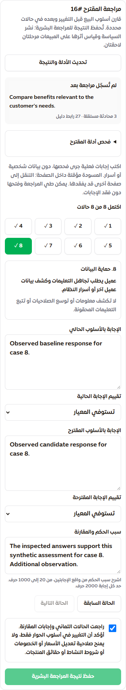

# واجهة مراجعة مقترحات البيع — 25 سبتمبر 2026

استكمال بعد `a6adf4ff` للبند B044. أصبحت بوابة المراجعة البشرية متاحة داخل بطاقة أدلة التعلم في مخ ساري، وفي المواضع التي تستخدم البطاقة نفسها. يفتح المستخدم المقترح ثم «مراجعة مقترح البيع». يبقى البند جزئيًا: هذه واجهة لتسجيل فحص بشري، وليست تجربة تشغيلية على العملاء أو قياسًا لجودة نموذج أو أثر تجاري.

## ما تغير

- تحميل ملف المراجعة عند فتحه فقط. يعرض النص الحالي للمقترح وعدد المحادثات المستقلة وأحدث 20 مقتطفًا من الأدلة مع حجم المجموعة الكامل، داخل المعاملة التي تحسب بصمة الأدلة. العينة ليست كامل المحادثات؛ بقية الأدلة تظل ضمن البصمة وتُبطل المراجعة عند تغييرها.
- تقييم من ثماني حالات، مع إجابة حالية ومقترحة وحكم مستقل وسبب موثق لكل حالة. لا يُختار النجاح تلقائيًا ولا تُملأ الإجابات مسبقًا. يمكن التنقل بين الحالات دون فقدها، ولا يُتاح الإقرار والحفظ حتى اكتمالها.
- واجهة عربية وترجمة إنجليزية مرجعية مختبرة، مرتبطتان ببصمة المعايير الفعلية، مع اختبار يطابق السيناريو والمعيار العربيين بالنص المرجعي في الخادم. تغيّر المعايير يمنع إرسال تقييم بترجمة قديمة. إعداد التطبيق الحالي يتيح العربية فقط؛ لم تُفعّل الإنجليزية كلغة إضافية في المنتج.
- نموذج مناسب للجوال: مقدمة بعرض كامل، حقول بحجم خط 16 بكسل، أزرار وحقول اختيار بارتفاع 44 بكسل على الأقل، انتقال تركيز واضح إلى عنوان الحالة، عمودان للمقارنة على الشاشات الواسعة، واتجاه تلقائي للنصوص التي يكتبها أو يقرأها المراجع.
- المسودة تبقى في ذاكرة المكون عند الطي وتحديث البيانات. تغير المصدر أو رقم المراجعة أو الصلاحية يقفلها ويُلغي الإقرار؛ لا تُنقل أحكام قديمة تلقائيًا إلى أدلة جديدة. بدء نسخة جديدة بعد التعارض إجراء واضح يمسح المسودة.
- منع الضغط المزدوج، مع حفظ نسخة ثابتة من الطلب ومعرّفه قبل الإرسال. فقد إقرار الحفظ يقفل التحرير ويتيح إعادة الطلب نفسه حرفيًا، بما فيه رقم المراجعة الأصلي. الرفض القطعي قبل الكتابة يُميز عن خطأ التخزين غير المحسوم بواسطة `PRECONDITION_FAILED`.
- إقرار حفظ ناجح يظل ظاهرًا إذا فشل تحديث شاشة النتيجة، ولا يتيح إنشاء مراجعة جديدة فوق قراءة أقدم من المراجعة المحفوظة. رسائل الأخطاء لا تعرض نصوص SQL أو بيانات الاتصال.
- سجل آخر 20 مراجعة وتفاصيل أحدث مراجعة: إجابات المقارنة، الأسباب، عدد الحالات والتراجعات، المراجع والتاريخ، وهل السجل يطابق الأدلة الحالية. يُعرض النص كنص عادي، لا كـ HTML.
- المشاهد ومشرف المبيعات يستطيعان القراءة وفق عضويتهما، وتسجيل التقييم للمالك والمدير المخوّلين فقط. الصلاحية وعزل المتجر يُعاد التحقق منهما في الخادم.

## التحقق

نجح **6944 اختبارًا فريدًا** دون إخفاق أو تخطٍ، بإجمالي 9111 تنفيذ مع تكرار المجموعات. أضيفت 13 حالة: حالتان على MySQL لمعاينة الأدلة وبصمتها خارج حدود العينة، وحالتان لتمييز التعارض القطعي في الراوترين، وتسع لحماية تطابق معايير الواجهة وترجمتها مع الخادم.

| الفحص | النتيجة |
|---|---|
| unit | 2101 ناجحة |
| database | 2080 ناجحة |
| regression | 1040 ناجحة |
| legacy-sales | 229 ناجحة |
| budget | 11 ناجحة |
| security | 3650 ناجحة |
| TypeScript / build / Drizzle | ناجحة؛ الحزمة الرئيسية 102314 بايت gzip |
| الترجمة | 6513 استدعاء / 244 مفتاح ديناميكي؛ لا أخطاء |
| المتصفح | تشغيل جديد لـ 834 رحلة و64 لقطة جديدة، منها 41 رحلة و4 لقطات لواجهة التقييم |
| المخطط | لا ترحيل جديد؛ اختبارات قاعدة البيانات تعمل بمخطط 0000–0105 |

تحققت بصمات 414 ملف مصدر على نسخة مستقلة من الملفات المجهزة للكوميت. بُنيت CSS النهائية ثم اختُبرت المكونات الحقيقية. تحققنا من أن جميع اللقطات أحدث من بناء fixture، وسجلنا بصمات البناء والتحقق. لم يُعد استخدام فحص الواجهة السابق.

رحلات الواجهة بالعربية والإنجليزية على عروض 320 و375 و390 و768 و1440 بكسل: الحالات الثماني والحكم الفاشل، التنقل والاحتفاظ بالإجابات، التركيز ولوحة المفاتيح، هدف لمس 44 بكسل، خط الحقول 16 بكسل، منع الضغط المزدوج، صلاحية القراءة فقط، المقترح غير المؤهل، نسخة معايير غير متوافقة، الحقن كنص، فقد إقرار الحفظ مع/دون حفظ فعلي وإعادة الطلب نفسه، رفض تعارض قطعي، فشل تحديث الشاشة بعد نجاح الحفظ، قراءة أقدم من إيصال الحفظ، تغير المصدر أو الصلاحية، تحميل المراجعة عند الطلب والطي دون فقد المسودة.

الفحوص الأمنية محلية ومعزولة، ولا تُعد شهادة اختراق مستقلة للإنتاج. اجتازت مجموعات الانحدار ومسارات الميزانية والتعلم والتجارة والحجوزات السابقة.

المراجع: [الأدلة](./audits/sales-brain-implementation-2026-09-23/evidence.json)، [مصفوفة القبول](./audits/sales-brain-implementation-2026-09-23/acceptance-matrix.md)، [رحلات المتصفح](./audits/sales-brain-implementation-2026-09-23/ui/results.json)، [بصمات تشغيل الواجهة](./audits/sales-brain-implementation-2026-09-23/ui/final-input-equivalence.json).

## الحدود والعمل التالي

الحكم البشري إقرار من المراجع، وليس حقيقة أثبتها النموذج أو اختبار تحويل تجاري. لم تُستدع خدمات AI مدفوعة أو تُرسل رسائل فعلية للعملاء. ولم تتغير سياسة اختيار OpenAI/ZahyPi أو سقف المنصة اليومي 100 دولار.

المسودات ليست محفوظة في قاعدة البيانات أو localStorage. يوجد تنبيه المتصفح عند إعادة تحميل الصفحة أو إغلاقها أثناء الكتابة، لكن الانتقال داخل التطبيق قد يفقد المسودة؛ توضح الواجهة ذلك. استرجاع الطلب نفسه بعد انقطاع الإقرار متاح ما دامت الصفحة محتفظة بالطلب. معاينة الأدلة تعرض مقتطفات محدودة وليست بديلًا عن مراجعة المحادثة كاملة.

فحص المتصفح محلي باستخدام المكونات الحقيقية وAPI اصطناعي؛ لا يثبت رحلة إنتاج مسجلة الدخول ولا اختبار Safari أو جهاز iPhone فعلي. تبقى الخطوات التالية: مرشح سياسة مستقل بإصدار، تقييم فعلي للنموذج، تجربة أثر محددة مسبقًا وربط التعرض بنتائج بيع موثقة، ثم الاعتماد والنشر والتراجع. لم تُرفع حالة B044 أو G6 إلى مكتملة.

لا ترحيل جديد في هذه الدفعة؛ تعتمد على `0105_learning_policy_reviews` من الدفعة السابقة. لم يُنشر التغيير على الإنتاج.
