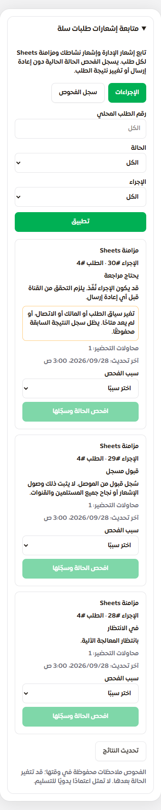
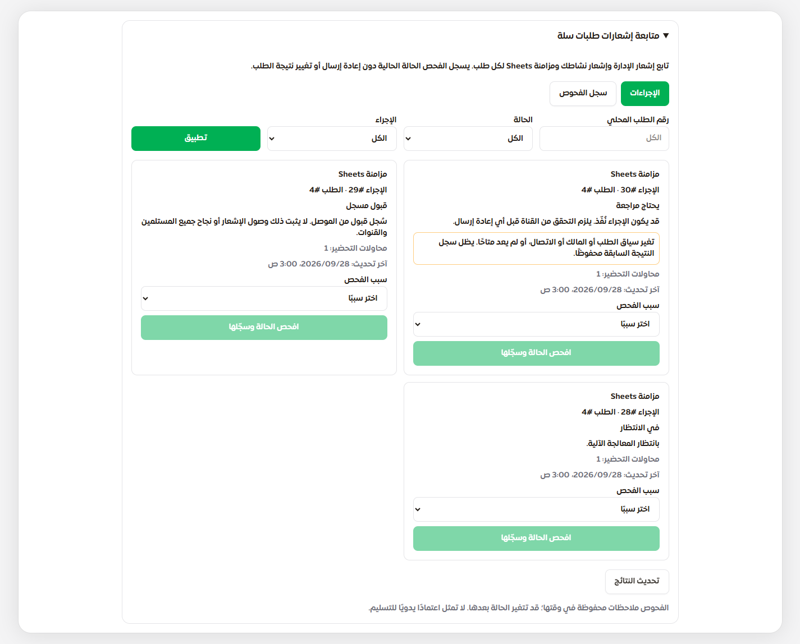

# مراجعة إجراءات طلبات سلة وسجل فحوصها

استكمال خطة المخ والمبيعات، 28 سبتمبر 2026، فوق `78590097` على `main`. تتناول الدفعة واجهة التشغيل في B037 وسجل الترحيل في B065. تبقى بنود الخطة **4 مكتملة / 62 جزئية / 5 مفتوحة**؛ لا اعتماد 10/10 أو نشر إنتاجي.

## ما أصبح متاحًا

في صفحة `/merchant/salla` يظهر للمالك والمدير قسم **متابعة إشعارات طلبات سلة**، ويمكن فتحه حتى إذا فُصل اتصال المتجر. تعرض البطاقات إشعار إدارة المنصة، وإشعار النشاط، ومزامنة Sheets. يمكن التصفية برقم الطلب المحلي والحالة ونوع الإجراء، والانتقال في صفحات من 20 سجلًا. لا تُعرض بيانات العملاء أو رموز الاتصال أو بصمات الطلبات.

تميز الواجهة بين الانتظار، والتحضير الجاري أو المنتهية مهلته، والإرسال الجاري أو مجهول النتيجة، والقبول المسجل، والتوقف قبل الإرسال. يُفحص تطابق السياق الحالي مع الطلب والمتجر والمالك والاتصال، ويظهر تنبيه إذا تغير أو اختفى. القبول السابق يبقى حقيقة تاريخية حتى لو تغير السياق بعده.

يختار المشغّل سببًا ثم يستخدم **افحص الحالة وسجّلها**. يقرأ الخادم الحالة الحالية ويسجل ملاحظة مرتبطة بالإجراء والطلب والمراجع ووقت الفحص. لا يستدعي الفحص مزوّدًا، ولا يعيد تشغيل المهمة، ولا يغير `review` إلى `accepted`. سجل الفحوص يعرض الملاحظة كما كانت وقتها، حتى لو قبل العامل الإرسال لاحقًا أو حُذف المصدر.

## الحماية والاتساق

- يتحدد النشاط والمستخدم من الجلسة؛ لا يقبل الطلب `merchantId` أو هوية مراجع أو أمر إعادة إرسال أو نجاحًا يدويًا. يلزم `integrations.manage`، وتُعاد قراءة حالة النشاط والحساب والعضوية داخل المعاملة؛ رفض العضوية الحالية يتقدم على ملكية قديمة.
- صفحات البيانات وعقود المتصفح محدودة وصارمة؛ ترفض الحقول الخاصة الإضافية والحالات المتناقضة والسجلات المكررة والمؤشر غير الصحيح. أخطاء الخدمة لا تعرض SQL أو أسرارًا.
- المراجعة تحمل UUID ثابتًا وتفردًا بحسب النشاط. تكرار الطلب يعيد الملاحظة الأصلية؛ تغيير السبب أو الإجراء أو المراجع بنفس المفتاح مرفوض. فقد إقرار commit لا يكرر السجل عند الإعادة.
- تستخدم المراجعة أقفال قراءة للسلطة والمصدر، مع تفرد SQL لتسلسل حفظ الطلب المتزامن. لا تستدعي النقل ولا تُمسك اتصالًا أثناء HTTP. فشل حفظ المراجعة لا يعدل مهمة الإرسال.
- البصمة مبنية على JSON مرتب ترتيبًا ثابتًا؛ ترتيب مفاتيح JSON الذي يختاره MySQL لا يبطل سجلًا صحيحًا. تربط القراءة البصمة بالأعمدة والمعرفات والوقت، وترفض الدليل المتناقض. هذا تحقق اتساق تطبيقي، وليس توقيعًا يحمي من مسؤول قاعدة بيانات قادر على تعديل المحتوى والبصمة معًا.
- عند إعادة التحميل أو انقطاع الشبكة أو فشل التفويض، تُخفى النتائج القديمة. بعد خطأ حفظ مجهول تطلب الواجهة تحديث النتائج قبل إعادة الفحص، وتحتفظ برقم الطلب نفسه ما دامت اللوحة مفتوحة. إغلاق اللوحة أو الصفحة يبدأ عمر واجهة جديدًا؛ حتى لو سُجل فحص إضافي، لا ينتج عنه إرسال خارجي.

## الترحيل والنشر

تضيف `0141_salla_effect_reviews.sql` جدول التدقيق فقط، مع فهرس فريد للطلب وفهرس لتاريخ النشاط والطلب. يصبح السجل 142 ترحيلًا. لا backfill، ولا تغيير في حالات `salla_creation_effects`، ولا إرسال آلي بسبب الترحيل. يحتفظ التدقيق بمراجع المصدر والمراجع دون FK يحذفه عند حذف المهمة أو المستخدم؛ حذف النشاط يتبع سياسة cascade القائمة.

تتحقق الخدمة من الجدول والفهرس قبل القراءة أو الفحص، وتفشل عند غيابهما. الترحيل إضافي ومتوافق مع `78590097`؛ لا تحتاج هذه الدفعة قدرة نشر جديدة، وتبقى قدرة آثار سلة 0140 مطلوبة. عند التراجع إلى نسخة متوافقة احتفظ بجدول المراجعات؛ النسخة القديمة لن تعرضه. أمر التحديث الكامل في [دليل الإنتاج](./PRODUCTION_RELEASE_RUNBOOK.md) باقٍ.

## التحقق

اختبار الإنجليزية يستخدم كتالوجها داخل نموذج الاختبار؛ لا يضيف لغة معلنة إلى إعدادات التطبيق الحالية.

[أدلة البوابة وبصمات المصدر وأسماء الاختبارات](./audits/sales-brain-implementation-2026-09-23/salla-effect-review-verification.json). النسخة المختبرة هي قاعدة `78590097` مع ملفات هذه الدفعة، وتحقق تطابق بصماتها مع ملفات الكوميت قبل حفظه.

| الفحص | النتيجة |
|---|---|
| وحدات وأمن وانحدار | 224 ناجحة، منها 30 جديدة لواجهة API والعقود |
| MySQL فعلي | 192 ناجحة، منها 38 جديدة للمراجعة والتدقيق |
| أدوات النشر والتراجع | 117 ناجحة |
| المجموع | **533**، دون فشل أو تخطٍّ |
| متصفح | **38 سيناريو ناجحًا**؛ العربية والإنجليزية، وعروض 320 و375 و390 و430 و768 و1440 |
| ترحيل | قاعدة جديدة من 142 ترحيلًا وترقية 0140، حفظ ثمانية جداول، وإعادة DDL والمهاجرات وحفظ تاريخ المراجعات بعد حذف المصدر |
| الأنواع والمخطط والبناء والترجمة | ناجحة؛ 7,661 استدعاء ترجمة و248 مفتاحًا ديناميكيًا بلا أخطاء |

يغطي المتصفح المكوّن الفعلي وAPI محاكاة: عرض الهاتف، أهداف لمس 44px، التصفية بلوحة المفاتيح، التنقل بين الصفحات، تسجيل الفحص وسجله، إعادة رقم الطلب نفسه عند فقد إقرار الحفظ، إخفاء البيانات القديمة عند الرفض أو انقطاع الشبكة، والمدخلات المتناقضة وحقن HTML. لا تجاوز أفقي أو خطأ JavaScript في الحالات المختبرة. ليس اختبار Safari أو iPhone فعليًا ولا قبولًا حيًا للمزوّد.

الاختبارات ببيانات مصطنعة وقنوات محاكاة، مع حظر الشبكة الخارجية؛ لا وصول إلى الإنتاج أو مراسلة عميل. كشف التشغيل الأول اعتماد البصمة على ترتيب JSON وأُصلح، وصُححت بيانات ترقية الاختبار لتشمل الحقول الإلزامية للطلب، وعقد الأنواع لقيم المرشح الاختيارية. الأعداد تخص التشغيل النهائي الناجح فقط.

لإعادة البوابة: `node scripts/testing/verify-salla-effect-review.cjs` مع قاعدة الاختبار المملوكة `SARI_TEST_DATABASE_URL` على 127.0.0.1:33089 وNode 22.23.2 وpnpm 10.4.1 وChromium المحلي؛ لا تعتمد أسرار الإنتاج.

## المتبقي لهذا الجزء

اكتملت واجهة **الفحص وتسجيل المراجعة** ضمن النطاق أعلاه. ما زالت **تسوية الإرسال المجهول** تحتاج إيصالات مرتبطة بالمحاولة والقناة والمستلم، وفحصًا موثوقًا من المزوّد، وعقود نتائج تميز التعطيل والرفض والغموض والقبول الجزئي. الحالة المسجلة حاليًا تعود إلى الموصل وقد تعني قبول إحدى القناتين عند اختيار `both`؛ لا يجوز ترقيتها إلى دليل تسليم كامل.

تغيير إعداد القناة أو إجراء الفحص لا يعيد تشغيل المهام التاريخية. القبول الحي للقنوات وتمرين التشغيل على السيرفر ما زالا مفتوحين. اتفاق البيع النهائي وموافقة العميل وتسوية إنشاء سلة المجهول والربط المالي تبقى ضمن بقية الخطة.

بقي اختيار OpenAI/ZahyPi والسقف المشترك 100 دولار يوميًا كما هو. لم تُرفع التغييرات أو تُنشر للإنتاج.
