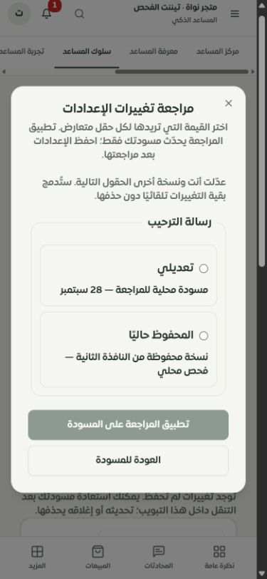
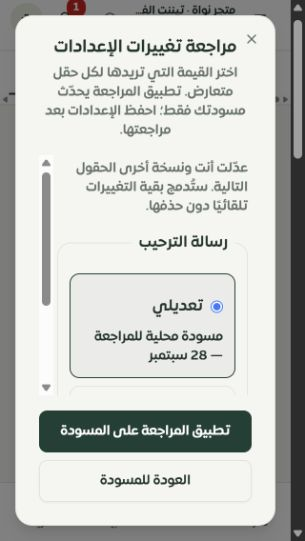
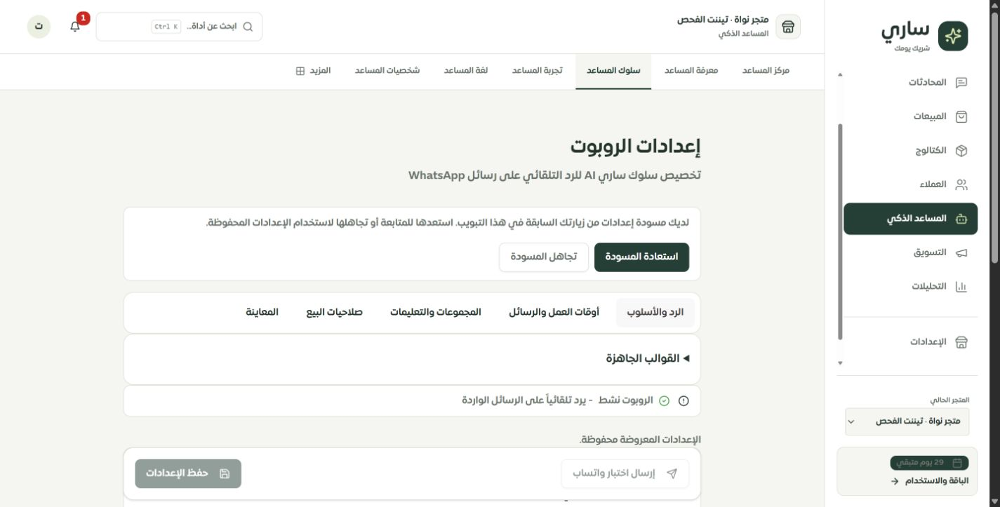

# استعادة مسودة إعدادات المساعد ومراجعة تعارض الحفظ

تاريخ الفحص: 2026-09-28. هذه جولة استكمال للتطبيق الفعلي والموك أب. لا تعني اكتمال فحص النظام بنسبة 100% ولا نشر التغييرات.

## ما تغير

- يمكن استعادة تعديلات إعدادات الرد بعد التنقل داخل التبويب نفسه. تظهر استعادة أو تجاهل المسودة قبل تحرير النموذج؛ ولا تُحفظ تلقائيًا في الخادم.
- المسودة في ذاكرة التبويب، ومفتاحها المستخدم والتيننت معًا. لا تُكتب تعليمات العمل في localStorage أو sessionStorage. تُمسح عند تسجيل الخروج أو انتهاء الجلسة، ويظهر تنبيه في تأكيد الخروج عند وجود مسودة. يُطلب تحذير المتصفح الأصلي قبل مغادرة عمر الصفحة.
- يحمل النموذج بصمة للحقول التي فتحها التاجر. يفحصها الخادم داخل قفل معاملة MySQL قبل التحديث؛ إذا تغيرت الإعدادات، يرجع تعارضًا دون استبدال بيانات أحدث.
- تعرض مراجعة التعارض القيمتين للحقول التي عدلها الطرفان. يتطلب كل تعارض اختيارًا صريحًا، وتُدمج التغييرات المستقلة تلقائيًا. تطبيق المراجعة يغير المسودة فقط، ثم يحفظ التاجر بإجراء منفصل.
- فشل تحميل أحدث نسخة يبقي المسودة ويتيح إعادة المحاولة. نجاح الحفظ لا يمحو تعديلات أُجريت أثناء انتظار الطلب.
- أضيف التدفق إلى الموك أب المحلي، مع ترجمة عربية وإنجليزية للشاشات الجديدة.

البصمة لقيم النموذج وليست رقم إصدار متزايدًا، ولا تشمل صلاحيات الخصم والهامش أو إعدادات صفحات أخرى. `expectedRevision` اختياري للتوافق مع عملاء التحديث الجزئي السابقين؛ صفحة إعدادات المساعد الجديدة ترسله دائمًا. لا يدعي هذا التغيير حماية جميع نماذج النظام من الكتابة المتعارضة.

## الاختبارات

نجح **96 اختبارًا في 8 ملفات** دون احتساب إعادة التشغيل مرتين:

| الملف | العدد | الدليل |
| --- | ---: | --- |
| assistant-settings-review.test.ts | 14 | الاستعادة، فصل التيننت، الاختيار والدمج، فشل المراجعة، تنظيف المسودة المحفوظة، التحرير أثناء الحفظ، تحقق الدوام والمعاينة |
| assistant-draft-cache.test.ts | 3 | فصل المستخدم والتيننت، نسخ البيانات، التحذير والتنظيف، دمج الحقول |
| bot-settings-version.test.ts | 1 | تطبيع القيم، تغير البصمة حسب حقول النموذج والتيننت |
| bot-settings-validation.test.ts | 7 | تحقق API وتمرير الإصدار والتعارض |
| merchant-domains-access.test.ts | 15 | انحدار صلاحيات المجالات |
| merchant-assistant-prototype.test.ts | 14 | تفاعلات الموك أب بما فيها الاستعادة والتعارض |
| assistant-save-safety.mysql.test.ts | 11 | معاملات MySQL وحدود الشخصيات، حفظان متزامنان من نفس النسخة، تحديث جزئي وإصدار لتيننت آخر |
| ai/discount-policy.mysql.test.ts | 31 | انحدار سياسة الخصم وإصداراتها وسلطاتها |

استخدمت اختبارات قاعدة البيانات قاعدة محلية مخصصة للاختبار وبيانات قابلة للتنظيف. نجح فحص TypeScript والترجمة: **8181** استدعاءً و**348** مفتاحًا ديناميكيًا، بلا مفاتيح مفقودة أو استدعاءات ديناميكية غير محلولة أو أخطاء interpolation. نجح بناء Vite وبناء الخادم والعامل وفحص ميزانية حزمة المتصفح. يبقى تحذير Vite عن بعض الحزم الكبيرة. هذه اختبارات انحدار وصلاحيات وعزل وتزامن محددة؛ ليست اختبار اختراق شاملًا.

## التحقق في المتصفح

التطبيق الفعلي: `http://127.0.0.1:3018/merchant/bot-settings`، تيننت «متجر نواة · تيننت الفحص». الخادم المحلي يحظر الشبكة الخارجية وcron معطل؛ لم نرسل رسالة WhatsApp أو طلب مزود ذكاء اصطناعي.

1. تعديل الترحيب والتنقل إلى شخصيات المساعد ثم العودة: ظهر خيار الاستعادة واستعاد النص نفسه.
2. حفظ ترحيب مختلف وتأخير الرد 5 ثوانٍ من تبويب آخر.
3. الحفظ من المسودة الأولى: رفض الخادم النسخة القديمة وظهرت المراجعة. بقي الحفظ محظورًا حتى المراجعة.
4. اختيار ترحيب المسودة: احتفظ الدمج بتأخير 5 ثوانٍ من النافذة الأخرى. لم يُحفظ إلا بزر الحفظ المنفصل، ثم ظهرت الحالة المحفوظة.
5. إعادة الترحيب الأصلي وتأخير الرد إلى 4 ثوانٍ، ثم الحفظ وإعادة التحميل: تأكدت القيم الأصلية والحالة المحفوظة. أُغلق تبويب المقارنة وأعيد حجم المتصفح الطبيعي.

| قياس Chrome | عرض المستند / المحتوى القابل للتمرير | مستطيل الحوار | النتيجة |
| --- | --- | --- | --- |
| 390×844 | 375 / 375 | x=16، y=125.5، العرض 343، الارتفاع 593 | لا تجاوز أفقي؛ القيم والأزرار ظاهرة |
| 320×568 | 305 / 305 | x=16، y=16، العرض 273، الارتفاع 536 | محتوى قابل للتمرير داخل الحوار وأزرار ثابتة ظاهرة؛ تم الاختيار والتطبيق |

الفرق بين عرض نافذة Chrome وعرض المستند هو شريط التمرير الرأسي. [تفاصيل التحقق](browser-checks.json).

## إعادة حصر المصدر وما لم يُغلق

أعيد الحصر في [سجل الصفحات والخصائص](source/FEATURE_REGISTER.md) و[البيانات التفصيلية](source/inventory.json): **126 مسارًا، 184 ملفًا، 1628 عنصر تحكم**. لا روابط تاجر حرفية غير صالحة ولا مسارات مفقودة من مداخل الموك أب وفق فاحص المصدر. هذا إثبات للحصر الآلي، وليس إثبات تشغيل كل زر أو مطابقة كل تصميم.

أشار التحليل إلى 560 عنصرًا دون تسمية يستنتجها الفاحص؛ تحتاج مراجعة السياق والمكونات قبل اعتبارها أخطاء وصول فعلية. بقيت 7 ملفات صفحات قديمة مرشحة لعدم الوصول من المسارات: AdvancedAnalytics، AdvancedAnalyticsDashboard، Reports، SariPersonality، Subscriptions، WhatsApp، WhatsAppSetupWizard. لم تُحذف آليًا؛ وجود استيرادات قديمة وخصائص خادم يستلزم مطابقة كل وظيفة أولًا.

وجدت فجوة محددة: صفحة الشخصية القديمة تحتوي أسلوب الكتابة، كثافة الرموز التعبيرية، صوت العلامة وتعليمات شخصية منفصلة ونبرة إضافية. المسار القديم يحوّل إلى BotSettings، لكن جميع هذه الخيارات لم تنتقل إلى النموذج الجديد، والخادم ما زال يستخدم بعض قيم الشخصية. يلزم توحيد مصدر الإعدادات وتصميم حقولها قبل وصف إزالة الواجهة القديمة بأنها مكتملة. `getMerchantByUserId` يراعي سياق التيننت المختار وملكيته؛ لم تُصنف هذه الفجوة تلقائيًا كثغرة تجاوز صلاحيات.

لوحظ أيضًا أن فتح رابط داخلي في تبويب بلا متجر محدد ينقل إلى لوحة البداية عند الاختيار التلقائي للمتجر الوحيد. السبب مسار `selectMerchant` الثابت؛ سجلت كمشكلة وصول للرابط المباشر ولم أغير سلوك تبديل التيننت في هذه الجولة.

تبقى أعداد **تصميم الموك أب** السابقة: 107 عامة، 10 تفصيلية، واحدة تفصيلية جزئية، و8 تحويلات. لم تتحول تلقائيًا إلى تغطية مكتملة بعد حصر المصدر. بقية الأولويات في [سجل الاستكمال](../tenant-testing-workspace-2026-09-28/REMAINING.md).

- استعادة المسودة محدودة بعمر التبويب؛ تحديث الصفحة أو إغلاقها بعد قبول المغادرة يفقدها. تحذير beforeunload مختبر آليًا، وليس ضمانًا عند إنهاء المتصفح بواسطة نظام الهاتف.
- Safari وiPhone الحقيقيان ولوحة مفاتيح iOS والمناطق الآمنة الفعلية لم تُختبر.
- النوافذ الجديدة تحققت بصريًا بالعربية؛ الإنجليزية تحققت مفاتيحها وبناؤها، ولم يجر فحص بصري مستقل لها في هذه الجولة.
- لم يُختبر مزود فعلي أو قياس مبيعات حقيقي أو إرسال خارجي؛ لا توجد نسبة احتراف مبيعات جديدة مستنتجة من هذه الاختبارات.
- لا push أو نشر في هذه الجولة، ولا نتيجة DEPLOY_OK جديدة.
