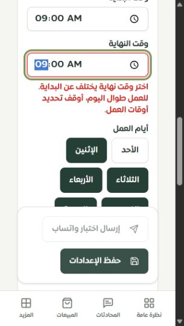
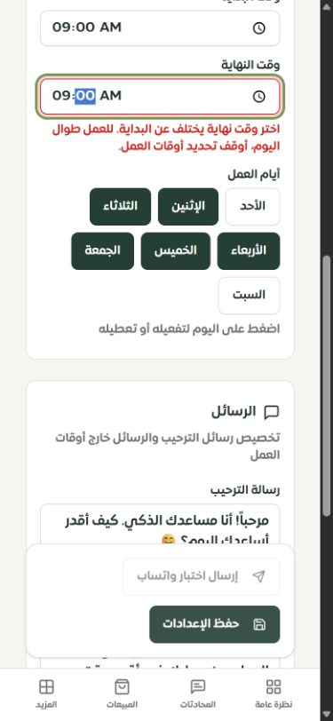

# استكمال حماية حفظ الشخصيات وإعدادات المساعد

التاريخ: 2026-09-28. العمل على `main` في مشروع ساري المحلي. هذه الجولة تغلق مشكلات محددة في `/merchant/virtual-team` و`/merchant/bot-settings` وتطابق قواعد الدوام مع الموك أب. ليست إثباتًا لإكمال جميع صفحات التيننت أو نشرها.

## الإصلاحات ونتيجتها

| المشكلة | التغيير | دليل التحقق |
| --- | --- | --- |
| طلبا إنشاء متزامنان قد يتجاوزان حد 10 شخصيات أو يكرران الأولوية | قفل صف التاجر داخل معاملة تشمل القراءة والتحقق والكتابة | اختبار MySQL يبدأ بتسع شخصيات، يقبل طلبًا واحدًا ويرفض الآخر؛ يبقى العدد 10 والأولويات غير مكررة |
| تغيير الافتراضية ليس ذريًا وقد يترك الفريق بلا افتراضية عند فشل الإدراج | مسح الافتراضية والكتابة داخل المعاملة نفسها، مع ترتيب قفل موحد لكل عمليات الفريق | طلبا تعيين متزامنان يتركان افتراضية واحدة؛ فشل إدراج محقون بعد المسح يعيد الافتراضية السابقة عبر rollback حقيقي |
| إنشاء القوالب مرتين أو حفظ جزء منها | فحص الفريق وإدراج القوالب الثلاثة داخل المعاملة | طلبا قوالب متزامنان ينتجان ثلاث شخصيات فقط |
| الترتيب يُراجع خارج المعاملة والحذف يعلن نجاحًا دون صف محذوف | التحقق من قائمة الترتيب داخل القفل؛ الحذف يتحقق من affectedRows | رفض قائمة قديمة ومعرفات تيننت آخر؛ إرجاع NOT_FOUND للحذف غير الموجود أو غير المملوك |
| قبول `99:99` أو `NaN` أو أيام مكررة، وإمكان دمج تعديلين إلى وقتي بداية ونهاية متساويين | تحقق مشترك في الواجهة وAPI وقاعدة البيانات؛ دمج التعديل الجزئي مع الصف المقفول قبل الحفظ | اختبارات الصيغة والحدود والتعديلات الجزئية والتزامن والتراجع عن جميع حقول الطلب المرفوض |
| غموض الأسبوع الفارغ | الإبقاء على معناه: لا وقت رد مجدول، مع توضيح بجانب الأيام | اختبار الواجهة والموك أب؛ قبول الدوام الليلي والأسبوع الفارغ في MySQL |
| عرض أخطاء تقنية خام عند فشل حفظ إعدادات المساعد | رسالة محلية ثابتة مع بقاء المسودة، وأخطاء بجانب الأوقات مع aria-invalid وaria-describedby والتركيز | اختبارات React وAPI تمنع ظهور تفاصيل SQL؛ فحص المتصفح يثبت انتقال التركيز لحقل النهاية |
| زر الحفظ على الهاتف مغطى بشريط التنقل السفلي | رفع شريط الحفظ فوق التنقل بمسافة 12px، مع مراعاة safe-area وحالة لوحة المفاتيح في CSS | قبل الإصلاح فتح النقر على الحفظ صفحة المحادثات؛ بعده نجح التحقق والحفظ الفعلي على عرضي 390 و320 |

يحافظ تحديث إعدادات المساعد على مسار الخصومات المنفصل، ويقفل التاجر ثم الإعدادات بنفس ترتيب سياسات البيع. يرفض تحديث صفوف إعدادات قديمة مكررة بدل اختيار صف اعتباطي. لا تتطلب الإصلاحات ترحيل قاعدة بيانات.

القفل يحمي ثوابت الفريق والجدول، لكنه ليس آلية اكتشاف تعارض نسختين كاملتين من نموذج مفتوح. ما زال الحفظ العام يعمل وفق آخر تحديث ناجح؛ إضافة revision ومراجعة التعارض عمل مستقل. يبقى مسح الافتراضية بإرادة المستخدم مسموحًا؛ النظام لا يفرض وجود افتراضية في كل وقت.

## الاختبارات

**154 اختبارًا فريدًا ناجحًا في 11 ملفًا**؛ إعادة تشغيل الملف لا تُضاعف العدد:

| الملف | العدد |
| --- | ---: |
| `server/merchant-persona-access.test.ts` | 13 |
| `server/bot-working-schedule.test.ts` | 16 |
| `server/assistant-settings-review.test.ts` | 9 |
| `server/bot-settings-validation.test.ts` | 6 |
| `server/merchant-assistant-prototype.test.ts` | 13 |
| `server/merchant-domains-access.test.ts` | 15 |
| `server/persona-preview.test.ts` | 20 |
| `server/merchant-persona-routing.test.ts` | 17 |
| `server/virtual-team-page.test.ts` | 5 |
| `server/assistant-save-safety.mysql.test.ts` | 9 |
| `server/ai/discount-policy.mysql.test.ts` | 31 |

شُغلت عبر `scripts/testing/run-isolated.mjs`، واختبارات MySQL عبر `--with-database` على قاعدة `sari_pages_test` المحلية فقط، ببيانات مؤقتة تُنظف بعد الاختبار. اختبار التراجع يحقن فشل الإدراج داخل معاملة MySQL حقيقية؛ ليس تعطل خادم قاعدة البيانات بالكامل. هذه اختبارات صلاحيات وعزل وتزامن وانحدار، وليست اختبار اختراق شاملًا للنظام.

نجح `tsc --noEmit`، وفحص الترجمة (8134 استدعاءً و340 مفتاحًا ديناميكيًا؛ صفر مفتاح مفقود أو خطأ interpolation)، وبناء Vite، وبناء الخادم والعامل عبر esbuild، وفحص ميزانية حزمة المتصفح. بقي تحذير Vite عن بعض الحزم الكبيرة؛ لا يُعد إصلاح الأداء الكامل ضمن هذه الجولة.

## الفحص الفعلي في المتصفح

الخادم المحلي على `127.0.0.1:3018`، تيننت «متجر نواة · تيننت الفحص»، مع حظر الاتصال الخارجي وتعطيل مهام cron المحلية. استُخدم Chrome بعرضي 390×844 و320×568. الفرق بين innerWidth وعرض المحتوى أدناه هو شريط التمرير الرأسي.

| العرض | scrollWidth / clientWidth | خط الوقت | نهاية شريط الحفظ / بداية التنقل |
| --- | --- | --- | --- |
| 390 | 375 / 375 | 16px | 770 / 782 |
| 320 | 305 / 305 | 16px | 494 / 506 |

تمت تجربة الوقتين المتساويين وظهور الخطأ، ثم التصحيح والحفظ. أُعيد إعداد الجدول في تيننت الفحص إلى حالته السابقة (تحديد الساعات متوقف، 09:00–18:00، الأيام 1–5). لم يُرسل اختبار WhatsApp. أُعيد حجم المتصفح الطبيعي بعد الفحص. التفاصيل في [سجل المتصفح](browser-checks.json).

## ما يبقى مفتوحًا

- Safari وiPhone الفعليان ولوحة مفاتيح iOS والمناطق الآمنة على جهاز حقيقي لم تُختبر؛ محاكاة عرض Chrome لا تثبتها.
- حماية مغادرة صفحة إعدادات المساعد دون حفظ، واكتشاف تعارض النسخ عبر revision.
- التحقق الكامل من نتائج نموذج حقيقي وجودة المبيعات والمصادر والفجوات ما زال منفصلًا؛ هذه الجولة لا تُنتج نسبة جودة جديدة.
- لم يُعد حصر كل صفحات المصدر. تبقى أرقام الموك أب المسجلة: 107 عامة، 10 تفصيلية، واحدة تفصيلية جزئية، و8 تحويلات. راجع [سجل الاستكمال](../tenant-testing-workspace-2026-09-28/REMAINING.md).
- لا يوجد push أو نشر ضمن هذه الجولة، ولا نتيجة `DEPLOY_OK` جديدة.
