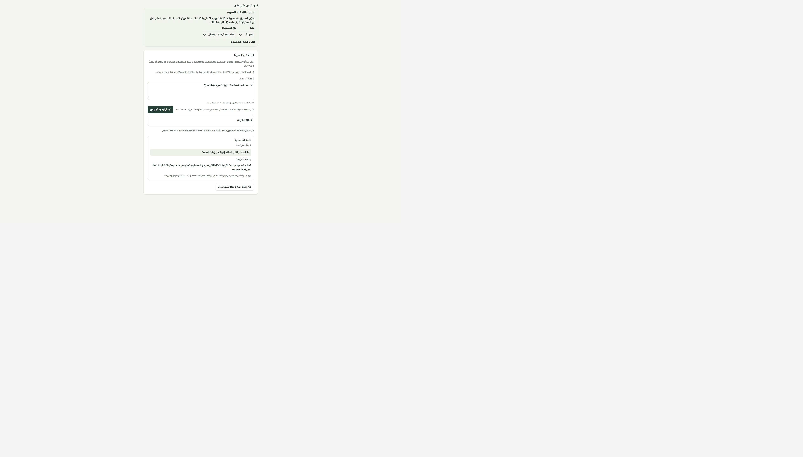
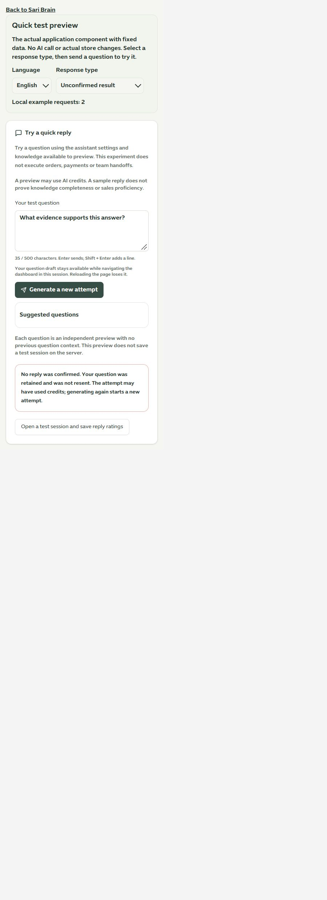

# الاختبار السريع داخل عقل ساري

1 أكتوبر 2026 · المرحلة 153 · main · تطبيق محلي وموك أب مطابق

استُبدلت واجهة السؤال القديمة بمكوّن مترجم يوضح السؤال والنتيجة وحدود المعاينة، مع المحافظة على إمكانية تجربة سؤال سريع والانتقال إلى جلسة الاختبار الكاملة.

## الإصلاح والتحقق

- كان `sariBrain.testSari` يستدعي `chatWithSari` التشغيلي. صار يستدعي `previewSari` المخصص للمعاينة دون سياق محادثة أو تشغيل طلبات أو تحويلات. بقي اسم API وحقلا السؤال والإجابة، وأضيف نوع النتيجة (توليد/حماية). استخدام الذكاء الاصطناعي يظل خاضعًا للرصد والميزانية.
- عقد السؤال صار صارمًا مع trim وحد 500 حرف ورفض التيننت أو السياق المزور في المدخلات. صلاحية إدارة المساعد وهوية التيننت المؤكدة وحد التكرار السابق محفوظة، مع الاشتراك أيضًا في حد معاينات المساعد.
- حقل مسمى وخطأ طول ظاهر دون قص النص الملصق. قفل فوري يمنع الإرسال المتكرر قبل تحديث React، وEnter لا يرسل أثناء تركيب الحروف أو تكرار المفتاح أو مع Shift.
- السؤال والأمثلة مقفلة أثناء الطلب. لا تستبدل الأمثلة نصًا مكتوبًا. النتيجة تعرض السؤال المرسل مستقلة عن أي تعديل لاحق، وتعزل الرد المتأخر بعد تبديل النطاق.
- مسودة في الذاكرة مرتبطة بالمستخدم والتيننت تستعاد أثناء التنقل وتمسح عند الخروج. إعادة تحميل الصفحة تفقدها، مع تحذير المغادرة القائم؛ لا تُخزن نصوصها في تخزين المتصفح الدائم.
- فشل الطلب لا يعرض تفاصيل المزود ولا يعاد تلقائيًا. توضيح أن المحاولة قد استهلكت رصيدًا وأن التوليد مرة أخرى محاولة جديدة، دون ادعاء وجود إيصال استعادة. خطأ الصلاحية وحد المحاولات منفصلان.
- حدود واضحة: لا توثيق للمصادر المستخدمة ولا قياس لاكتمال المعرفة أو احتراف المبيعات من إجابة واحدة. لكل سؤال سياق مستقل، وهذه المعاينة لا تحفظ جلسة اختبار على الخادم.
- الموك أب يستخدم المكوّن الفعلي بست حالات: رد، حماية، نتيجة غير مؤكدة، حد محاولات، دون صلاحية، طلب معلق بإكمال صريح. العداد والاستجابات محلية ثابتة ولا تستدعي AI.

نجحت **190 حالة** (العقد والواجهة والمعاينة المعزولة والصلاحيات) و**147 حالة** للحصر وحفظ الخصائص وموك أب العقل. نجح فحص أنواع التطبيق والموك أب وبناؤهما. فُحص 10670 استدعاء ترجمة و508 مفاتيح ديناميكية دون فقد أو أخطاء معاملات. بقي تحذير حجم ExcelJS السابق، وميزانية الحزمة ناجحة.

في المتصفح جُرب الطلب المعلق ثم إكماله، وخطأ النتيجة الإنجليزية، والعرض 480×844 (clientWidth وscrollWidth يساويان 450) وأعيد الحجم الافتراضي. في التطبيق الحقيقي جرى الانتقال من مسودة السؤال إلى جلسة الاختبار والعودة، فاستعيد النص دون إرسال سؤال أو إنشاء جلسة. لا اتصالات AI/واتساب ولا تعديل لبيانات العملاء. لم يُختبر Safari أو iPhone فعليًا على جهاز Apple.

الحصر: 126 مسارًا و322 ملفًا و2163 موضع تحكم، بلا مسار محذوف أو رابط غير صالح. هذا حصر قابل للتتبع وليس إثبات تغطية وظيفية 100%.

## التالي

فحص المعاينة المستقلة SariPlayground ثم بطاقات استخلاص المعرفة والمبيعات القديمة وبقية سجل الصفحات. لا دفع أو نشر.

[الموك أب المحلي](http://127.0.0.1:4329/brain-preview.html)

