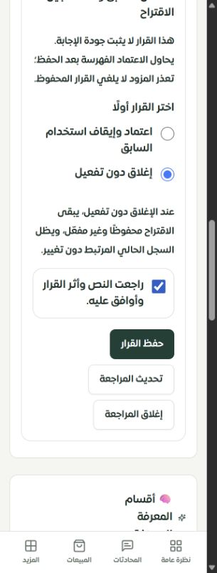
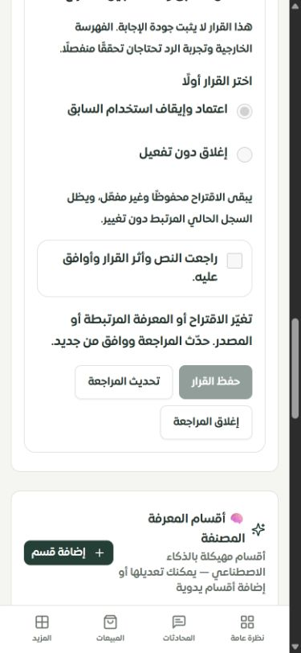
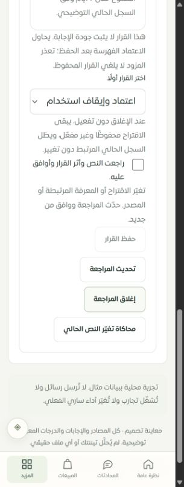

# مراجعة تعارضات المعرفة في لوحة التيننت — 29 سبتمبر 2026

استُبدلت واجهة التعارضات القديمة بمساحة مراجعة تعرض جميع الاقتراحات عبر صفحات، وتربط القرار بالنص المقترح والنص الحالي ومصدر الربط. نُفذت في لوحة التاجر والموك أب. هذه دفعة محددة من العمل؛ لم يكتمل فحص جميع صفحات النظام.

## ما تغير

| السابق | الحالي |
|---|---|
| أول خمسة تعارضات فقط وبقية العدد دون فتح | قائمة مرقمة، 8 اقتراحات في الصفحة، مع إعادة قراءة صريحة |
| معاينة 120 حرفًا وأزرار قبول ورفض مباشرة | النص المقترح كاملًا، النص الحالي المرتبط، النص السابق وقت التسجيل، والسبب المسجل |
| قبول الاقتراح مع بقاء السجل السابق قابلًا للاستخدام | عند وجود ربط موثوق، يُفعّل الاقتراح ويُوقف استخدام السجل الحالي المرتبط فقط داخل معاملة واحدة |
| تخمين أن جميع السجلات المعلقة تمثل تعارضًا معروفًا | تمييز الربط الموثوق، السجل القديم بلا ربط، والمصدر غير المتاح؛ لا تُستنتج العلاقة من تشابه النص أو العنوان |
| الرفض يحذف الاقتراح | «إغلاق دون تفعيل» يحتفظ بالنص والقرار ويُبقي السابق دون تغيير |
| يمكن اعتماد نسخة تغيرت منذ فتحها | بصمة تشمل الاقتراح والسجل المرتبط والأب ودليل المصدر وسجل التعارض؛ تُقارن تحت القفل قبل القرار |
| موافقة قديمة قد تنطبق على بيانات محدثة | تتطلب الواجهة قرارًا وموافقة، ولا تستخدم الموافقة إذا تغيرت بصمة المراجعة أو القرار |
| خطأ القراءة يظهر كغياب تعارضات | رسالة خطأ مستقلة عن الفراغ، وإعادة تحميل دون نجاح وهمي |

يحترم الخادم عضوية المتجر وصلاحية `bot_settings.manage`، ويخفي تفاصيل أعطال قاعدة البيانات. معاملة القرار تضم تعديل السجلين، إغلاق أحداث التعارض المرتبطة، سجل التدقيق، حذف ذاكرة الردود وإبطال الجلسات الدائمة. تقبل المعاملة قرارًا واحدًا من الطلبات المتزامنة. لا تحذف مصادر أخرى أو رسائل أو أقسامًا تابعة تلقائيًا.

الفهرسة الاختيارية القائمة حُفظت بعد نجاح المعاملة، وتعرض الواجهة جاهزيتها أو عدم تأكدها دون ادعاء تراجع قرار محفوظ عند فشل المزود. لا تُجرى الفهرسة داخل المعاملة. تحسين الإجابة الفعلية ونسبة احتراف المبيعات يحتاجان اختبارًا مستقلًا.

لا توجد ترحيلات قاعدة بيانات جديدة. يعتمد الربط على `sectionLinks` والخطة المحفوظة في إيصال المصدر. السجل القديم بلا ربط يمكن اعتماده كمعلومة مستقلة فقط بعد تحذير واضح بأنه لا يوقف معرفة أخرى؛ أما الربط الموجود لكنه ناقص أو غير متاح فيمنع الاعتماد. تُرفض أيضًا أهلية التفعيل المنتهية أو إعداد الاستخدام غير المناسب أو الأب غير المفعّل، مع دعم الإضافة التابعة بعد تفعيل أبيها دون إيقاف الأب.

## التحقق الحي المحلي

استخدم الفحص تيننت «متجر نواة · تيننت الفحص» وقاعدة `sari_pages_test` مع بيانات وهمية، والرد التلقائي معطل والاتصالات الخارجية محظورة. لم تُرسل رسائل عملاء.

1. عرضت القائمة عشرة اقتراحات على صفحتين، بما فيها العناصر التي كانت تختفي بعد الخامس.
2. فُتح اقتراح مرتبط بالسجل السابق وعُرض النصان كاملين. بعد اختيار الاعتماد والموافقة، غُيّر النص الحالي الوهمي من 7 إلى 8 أيام في قاعدة الاختبار.
3. رفض الخادم القرار القديم، واحتفظت الواجهة بنص المراجعة مع منع الإرسال مرة أخرى قبل التحديث.
4. تحديث المراجعة أظهر نص الثمانية أيام ومسح الاختيار والموافقة. بعد المراجعة الجديدة نجح الاعتماد وأصبح السابق غير مفعّل والاقتراح مفعّلًا.
5. اقتراح ثانٍ أُغلق دون تفعيل من عرض 320 بكسل، وبقي هو والسجل السابق محفوظين، مع استمرار تفعيل السابق.
6. الموك أب عرض حالة تغيّر النص ومنع استخدام الموافقة القديمة، ثم حفظ قرارًا توضيحيًا بعد التحديث.

الأدلة: [browser-checks.json](browser-checks.json) و[live-database-result.json](live-database-result.json). أربعة سجلات الاختبار الأخيرة تؤكد: السابق في تجربة الاعتماد `use_in_bot=0` والاقتراح `1`، والسابق في تجربة الإغلاق `1` والاقتراح `0`، دون حذف النصوص.

## الاختبارات

| المجال | النتيجة |
|---|---|
| واجهة مراجعة التعارضات | 14 حالة ناجحة |
| عقود الصلاحيات والمراجعة | 9 حالات ناجحة |
| الفهرسة بعد الحفظ بمزود محاكى | 4 حالات ناجحة |
| صلاحيات المعرفة القائمة | 95 حالة ناجحة |
| موك أب عقل ساري | 24 حالة ناجحة، منها 8 حالات جديدة للتعارضات |
| موك أب إدخال المعرفة | 32 حالة ناجحة |
| MySQL للتزامن والنسخ وعزل المتاجر وروابط المصادر وإبطال الذاكرة | 24 حالة ناجحة، تشمل منع إيقاف الأب الذي يعتمد عليه الاقتراح |
| الإجمالي دون تكرار الإعادات | **202 حالة في 7 ملفات** |
| TypeScript | نجح |
| مفاتيح الترجمة | 8475 استدعاء و346 مفتاحًا ديناميكيًا؛ صفر مفقود وصفر أخطاء متغيرات |
| بناء الواجهة والخادم والعامل والموك أب | نجح، وميزانية الحزمة نجحت؛ تحذير Vite المعروف للحزمة الأكبر من 600 كيلوبايت باقٍ |
| التطبيق في Chrome بعروض 320 و390 و1440 | لا تجاوز عرض في الحالات المقاسة؛ عرض المحتوى 305 و375 و1425 |
| الموك أب في Chrome بعرض 320 | لا تجاوز عرض في حالة المراجعة وتغيّر النص |
| Safari وiPhone فعلي، ونجاح فهرسة مزود حي | لم تُختبر |

اختبارات الأمن محددة بالصلاحيات والعزل والتزامن وصحة النسخة وعدم إظهار تفاصيل الخادم، وليست اختبار اختراق شاملًا. لم تُعد مجموعة `sales-engine-pentest.test.ts` القديمة في هذه الدفعة؛ الإخفاقات السابقة موثقة في [تقرير FAQ](../tenant-faq-workspace-2026-09-29/REPORT.md)، ولا يُفهم نجاح الاختبارات المستهدفة كنجاح كامل مجموعة النظام.

## حدود ومتطلبات المتابعة

- أصبح `approveSection` يتطلب `expectedRevision` و`acknowledged=true`. الواجهة الداخلية الوحيدة التي كانت ترسل العقد القديم استُبدلت؛ أي عميل خارجي قديم يحتاج طلب المراجعة أولًا، وإلا يُرفض طلبه بدل اعتماد محتوى لم يراجعه.
- الإغلاق دون تفعيل يسجل `reviewDecision.action=reject` مع `useInBot=0` و`merchantEdited=1`. بسبب حالات الجدول الحالية يُنهى وضع `pending_review` باستخدام `status=approved`؛ لا يعني هذا أن النص المرفوض أصبح مؤهلًا للردود. دلالة القرار محفوظة في السجل وفي بيانات المصدر. لا توجد في هذه الدفعة شاشة مستقلة لاستعادة القرارات المغلقة.
- الاستبدال يوقف السجل المرتبط فقط؛ لا يوقف تلقائيًا أبناءه أو نسخ النص في مصادر أخرى، ولا يثبت حسم جميع التناقضات في معرفة المتجر.
- الاقتراحات القديمة بلا ربط موثوق تحتاج مراجعة بشرية للمصادر الأخرى. لا تُبنى روابط رجعية اعتمادًا على العنوان أو النص المتشابه.
- عند فقد نتيجة الطلب قد يكون القرار حُفظ بالفعل. تُمنع إعادة الإرسال المباشر وتُطلب إعادة القراءة؛ لا يوجد إيصال قرار مستقل لاستئناف التفعيل بعد إغلاق التبويب. الفهرسة ليست مهمة دائمة ذات إعادة محاولة في هذه الدفعة.
- الموك أب يستخدم بيانات وحالات محلية. لا يختبر مزودًا أو تزامن MySQL؛ الأدلة الحقيقية تأتي من الاختبارات والواجهة المحلية أعلاه.
- مؤشر «صحة المعرفة» الحالي يعتمد على وجود الأقسام، وقد يشمل أقسامًا غير مفعّلة. يحتاج مراجعة منفصلة قبل اعتباره قياسًا للأهلية أو الدقة. لم تُرفع أي نسبة احتراف أو جودة بسبب هذه الدفعة.
- بقية محرر الأقسام والصفحات وSafari/iPhone الحقيقي تبقى في [سجل الاستكمال](../tenant-testing-workspace-2026-09-28/REMAINING.md). لم يُعد حصر الصفحات ولم تتغير أرقامه: 126 مسارًا، منها 101 بموك أب عام و8 تحويلات و10 تفصيلية و7 تفصيلية جزئيًا.

العمل محلي على `main`؛ لم يُدفع أو يُنشر على الإنتاج. ملفات إعداد الحساب وواتساب المتزامنة ليست ضمن هذه الدفعة.

