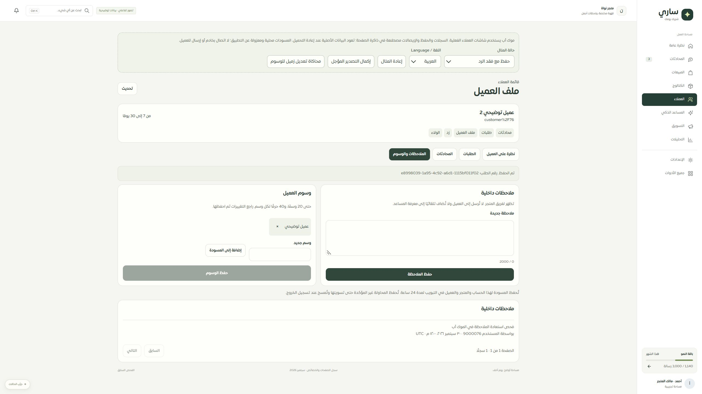

# المرحلة 76 — موك أب العملاء وملف العميل

استخدم الموك أب CustomerListWorkspace وCustomerDetailWorkspace وCustomerAnnotations نفسها، بعقد البيانات والترجمة والتنسيق والمسودات الفعلية. تشمل المطابقة القائمة والبحث الحرفي والنشاط والترقيم والمصادر، تفاصيل العملات والولاء، جداول الطلبات والمحادثات، الملاحظات والوسوم والنسخة والإيصال واستعادة النتيجة.

## التفاعل

- 32 معرفًا مصطنعًا،25 في الصفحة، و27 طلبًا و28 محادثة لكل مثال؛ يختبر معرفcustomer%2F76 فك الترميز مرة واحدة. مسار الفهرس:phone يفتح مثالًا جاهزًا، ولا يسقط في صفحة مفقودة.
- 18 وضعًا: بيانات، فراغ، تحميل، خطأ، اتصال موقوف، ممنوع، جلسة منتهية، قراءة فقط، تاجر مختلف، اختيار سابق، مفقود، نصوص طويلة، ولاء ملتبس/قيمة مستبعدة، رفض حفظ، فقد الرد بعد الحفظ، فشل قراءة الإيصال، فشل تصدير، وتصدير مؤجل.
- زر مستقل يحاكي تغيير زميل للوسوم؛ تبقى مسودة المستخدم ويُمنع حفظ النسخة القديمة. إعادة المثال تتطلب تأكيدًا وتمسح مسوداته الخاصة فقط. إيصالات المحاكاة في ذاكرة الصفحة؛ بعد إعادة تحميل المتصفح تعود البيانات الأصلية، وهذا مصرح به في الشاشة.
- CSV محلي لنتائج المثال المرشحة مع الأعمدة والعملات والولاء وتحييد الصيغ والمعرفات الرقمية. ليس اتصالًا بقاعدة التيننت ولا إثباتًا لتحميل بيانات إنتاج.
- الروابط الداخلية تبقى في الموك أب، وتسجيل الدخول والدعم يعرضان إيضاحًا محليًا دون إرسال. جميع اختبارات المتصفح تمنعfetch وتتأكد من عدم استدعائه.

## إصلاحات اكتشفها الفحص

أُزيل تكرار التنبيه عند نتيجة حفظ غير مؤكدة من المكون الفعلي. صُحح تعارض معنىmuted بين تصميم الموك أب وتصميم التطبيق: نصوص الإرشاد بلون داكن وخلفيات الوسوم والتنبيه بلون فاتح. بقيت الألوان والتعديلات محصورة بمساحة العملاء.

## الأدلة

- 207 اختبارات نهائية ناجحة:38 للموك أب والعقود والحفظ والترقيم والتصدير،29 للواجهة الفعلية،8 للتنقل بكل133 شاشة في فهرس الموك أب، و132 للحصر والحفاظ على الخصائص.
- نجح TypeScript للتطبيق وللموك أب مستقلًا، وبناء الموك أب وبناء التطبيق والخادم والعامل. لا تغيير لمفاتيح الترجمة بعد فحص المرحلة75.
- فُحص الرابط المشفر في IAB، والحفظ مع فقد الرد ثم استعادة الإيصال وظهور ملاحظة واحدة وتنبيه واحد، والألوان الفعلية بعد الإصلاح. نص الإرشادrgb(93,107,96)، ونص الوسمrgb(38,62,53) علىrgb(237,242,231).
- فُحص العرض المكتبي2560 والضيق480 فعليًا: الوثيقة450 وتمريرها450، والجدول640 داخل منطقة391؛ عناصر اللمس44px أو أكثر. صُححت الصور بعد مراجعتها وأُعيد المقاس الافتراضي.
- الحصر ثابت289 ملفًا و1958 عنصرًا، ولا روابط مكسورة أو صفحات يتيمة. أصبحت تغطية126 مسارًا:79 عامًا و30 جزئيًا و9 تفصيلية و8 تحويلات، بترقية مساري العملاء فقط إلى تفصيلي جزئي.

## المتابعة

التالي فحص مستهلكي واجهاتcustomers القديمة وإزالة القارئ والتصميم غير المستخدمين، ثم بقية الحصر. الموك أب لا يثبت دوام إيصال خادم أو عزل MySQL؛ أدلة ذلك في تقارير المرحلتين73/74. Safari/iPhone و320/390 الفعلي وحفظ تنزيل المتصفح غير مثبتة. لا نشر ولا اتصال بمزوّد.
