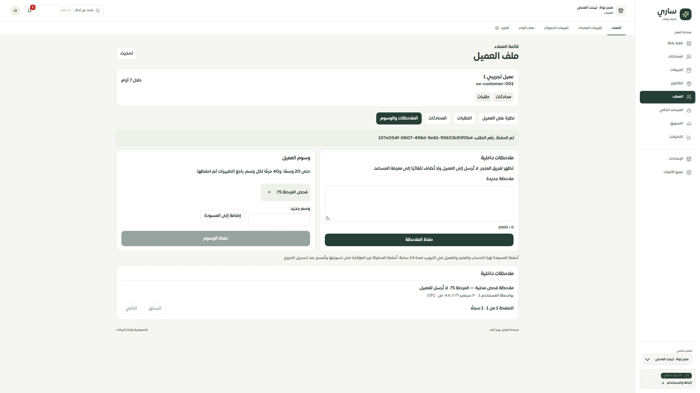

# المرحلة 75 — قائمة العملاء وملف العميل والحفظ الفعلي

استُبدلت صفحتا Customers وCustomerDetails القديمتان بمساحة عمل مرتبطة بالمستخدم والمتجر المؤكدين. انتقلت نافذة تفاصيل القائمة إلى صفحة العميل ذات الرابط الدائم، واستُبدلت أزرار الملاحظات والوسوم التي كانت تستدعي واجهات غير موجودة بالحفظ والإيصالات المنفذين في المرحلة74.

## مطابقة الخصائص

| الخاصية السابقة | التنفيذ الحالي |
| --- | --- |
| القائمة والبحث والحالة والعدادات | قائمة25 سجلًا، بحث حرفي بالاسم والمعرف، نشاط7/30 يومًا أو مجهول، تعداد المصادر الخمسة، أول تسجيل متاح هذا الشهر، ترقيم وتحديث |
| فتح التفاصيل في نافذة أو صفحة | رابط واحد لكل معرف، مع فك ترميز مسار المتصفح مرة واحدة؛ الاسم والمصادر والتواريخ والطلبات والمحادثات والولاء |
| مجموع المشتريات | قيم الطلبات المؤهلة منفصلة حسبSAR/USD بوحدتها الصغرى، مع المستبعد وحالة الدفع المسجلة منفصلة؛ لا جمع للعملات ولا إثبات تحصيل |
| تبويبات الطلبات والمحادثات | سجلات فعلية مرقمة من المصدر، الحالة والدفع والتاريخ والقيمة، رابط مساحة الطلبات، ورابط المحادثات بالهجاء الأصلي للرقم |
| إضافة الملاحظات والوسوم وإزالتها | ملاحظات داخلية فعلية، وسوم بمسودة ومراجعة النسخة، إيصالات وإعادة قراءة النتيجة وتكرار الرقم نفسه دون تكرار الكتابة |
| التصدير | CSV لكل النتائج المطابقة بحد5000، لقطة جديدة متسقة مع وقتها في الملف، العملات مستقلة والولاء المفرد فقط، تعقيم الصيغ وحفظ المعرفات النصية |

الحالات الفارغة مستقلة عن التحميل والتحديث وتوقف الاتصال والخطأ ومنع الصلاحية وانتهاء الجلسة والبيانات غير المطابقة. لا تُعرض بيانات تاجر آخر أو بحث سابق. المسودة مرتبطة بالحساب والمتجر والعميل، محفوظة24ساعة في عمر التبويب، والمحاولة غير المؤكدة لا تُحذف تلقائيًا. فشل تخزين المتصفح يوقف الحفظ ويحافظ على النص الموجود في الذاكرة. تسجيل الخروج يمسح التخزين ويمنع استجابة قديمة من إحيائه.

الملاحظات والوسوم للفريق فقط، وليست إرسالًا للعميل أو إضافة تلقائية إلى معرفة المساعد. إزالة الوسم تعدّل المسودة أولًا؛ مسح المسودة له تأكيد صريح. تعارض النسخة يحتفظ بمسودة المستخدم ويعرض الوسوم الحالية دون كتابة فوقها.

## التحقق

- نجحت213 حالة نهائية:52 للمصدر والتصدير والمسودات وخدمة الملاحظات، و29 لتفاعل الواجهة، و132 للحصر والحفاظ على الخصائص. تشمل تغيّر البحث والخروج ومغادرة الصفحة أثناء التصدير، رفض الإيصال لحساب مختلف، استعادة نتيجة منقطعة، نفس رقم الإعادة، رفض الكتابة مع إبقاء المسودة، تعارض الوسوم، التخزين غير المتاح وقراءة فقط.
- نجح16 اختبارMySQL: عزل المصادر واللقطة والتجميع والهجاءات والترقيم، التصدير المرشح والوحدات وصيغCSV، والحفظ المتزامن والإيصالات والتراجع وفقد إقرارCOMMIT وصلاحيات العضوية.
- TypeScript وبناء التطبيق والخادم والعامل نجحت. فحص الترجمة9636 استدعاء و451 مفتاحًا ديناميكيًا دون مفتاح مفقود أو خطأ استبدال.
- الخادم المحلي فقط على127.0.0.1:3018 خلف حاجز الاتصالات الخارجية. فُحص البحث في66 معرفًا وفتح العميل التجريبي والطلبات والمحادثات، ثم حفظ ملاحظة ووسم وإعادة التحميل وظهورهما مرة أخرى. لا إرسال ولا خدمات خارجية.
- IAB مكتبي2560 وعرض ضيق480 فعليًا: عرض الوثيقة450 وتمريرها450، دون تجاوز أفقي في النموذج والقائمة؛ جدول الطلبات640 داخل منطقة تمرير391. عناصر اللمس44px أو أكثر وخط الحقول16px. صور IAB الضيقة تتضمن مساحة فارغة حول الجزء المصغّر. أُعيد المقاس الافتراضي بعد الفحص. زرCSV الحي أكد بدء تنزيل66 سجلًا؛ حفظ الملف على القرص غير مثبت.

## الحدود والمرحلة التالية

التصدير يقرأ لقطة جديدة للنتائج المرشحة، وليس نسخة مطابقة زمنيًا لقائمة فُتحت سابقًا. بدء التنزيل لا يثبت حفظ الملف على القرص. رابط الطلب يفتح مساحة الطلبات العامة، ورابط المحادثة يطبق البحث بالرقم ولا يختار محادثة بعينها. الإيميل الذي لم يكن موصولًا بمصدر في النافذة القديمة ليس حقلًا مستنتجًا؛ إضافة مصادر بريد موثقة تحتاج عقدًا منفصلًا.

الموك أب لهاتين الصفحتين يبقى عامًا حتى المرحلة التالية: استخدام المكونات الفعلية نفسها مع حالات الحفظ والاستعادة والتعارض. واجهاتcustomers القديمة باقية لحين فحص المستهلكين وإغلاقها في مرحلة تنظيف مستقلة. تبقى320/390 وSafari/iPhone الفعلي وحفظ تنزيل المتصفح مفتوحة. لا نشر ولا تعديل إنتاج، والترحيل172 مطبق على قاعدة الفحص المحلية فقط.
