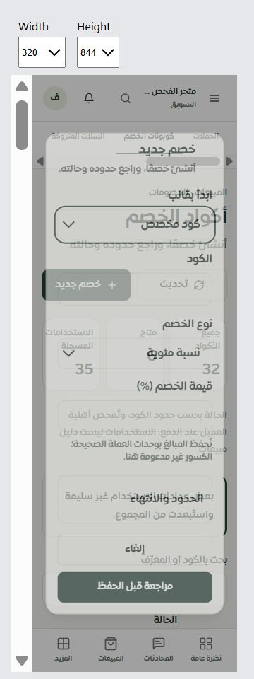

# المرحلة 353 — واجهة الخصومات ومراجعة الأفعال

التاريخ: 2026-10-03. التنفيذ محلي على main، بلا push أو نشر.

## النتيجة

استُبدلت شاشة الخصومات القديمة بمكونات اللوحة الجديدة. تعرض جميع الأكواد وحالاتها وأعدادها، وبحثًا وفلاتر وصفحات 25 وشرحًا للعدادات غير الصالحة. استخدام الكود ليس دليل مبيعات أو نسبة احتراف، وحالة «متاح» ليست إثبات أهلية العميل عند الدفع.

- بقيت القوالب الستة، وتُحسب تواريخها عند اختيارها. الإنشاء بخطوتي إدخال ومراجعة، مع أخطاء الحقول وقبول الأرقام العربية ورفض الكسور التي لا يدعمها التخزين.
- تعرض التفاصيل القيود والمصدر والاستخدام والتواريخ بتوقيت UTC. تعديل الحد والانتهاء يسمح بمسحهما صراحة. التفعيل والتعطيل والحذف تتطلب مراجعة نسخة السجل، وأي استعمال أو تغيير لاحق يرفض الكتابة القديمة داخل القفل.
- بقيت صلاحية التيننت المختار وإعادة تحقق الصلاحية داخل المعاملة. العضو المشاهد لا يرى أدوات الكتابة. إخفاق القراءة يخفي النسخة القديمة، والحفظ غير المؤكد يمنع إعادة الإرسال قبل قراءة جديدة.
- أصلح فحص المتصفح تكرار شرح التعديل، أسماء الحقول التي كانت تدمج الوصف، وتركيز لوحة المفاتيح بعد الحفظ. اختُصرت بطاقات الملخص على الهاتف.

## التحقق

- المجموعة النهائية: **277 حالة ناجحة، 0 فشل، 0 مجموعات فاشلة، success=true، exit=0**. تشمل الواجهة الفعلية باللغتين، الحقول والصلاحيات والبصمة وعزل الاستجابة والنتيجة المتأخرة وحفظ الخصائص والحصر. الدليل المحلي: `.tmp/tenant-ux/phase353-acceptance.json`.
- MySQL: **12/12** في `.tmp/tenant-ux/phase353-mysql.json`، تشمل نسخة تغيّر استخدامها، المسح الصريح للحدود، ورفض المداخل القديمة غير المراجعة. لا تغييرات على منطق الخادم بعد هذه المجموعة.
- TypeScript نجح. عالج التحقق الأخير استخدام نشر NodeList في اختبار جديد إلى Array.from. الترجمة: **12831 استدعاء، 854 مفتاحًا ديناميكيًا، بلا مفقود أو غير محلول أو خطأ interpolation**.
- بناء التطبيق نجح في **17.64 ثانية**؛ تحذير حجم بعض الحزم موجود، وحارس ميزانية الحزمة نجح. لا يعد البناء نشرًا.
- Chromium المحلي: **15 قياس قبول** في [responsive.json](responsive.json)، على iframe بأبعاد CSS 320/390/768/1440 وارتفاع 844 أو 550. لا تجاوز أفقي أو عنصر تحكم مقاسه أقل من 44px ضمن عناصر الخصومات المختبرة، ولا مفاتيح ترجمة خام. قياسات أولية أثناء تغيير الحجم أو قبل التنقيح محفوظة منفصلة وليست قبولًا.
- جرى إنشاء كود محلي ثم مسح حدوده وتعطيله، والتحقق من رفض الكود المكرر والبحث وتغيير الصفحة. حذف المتصفح وصل للمراجعة فقط؛ الحذف الفعلي اختُبر آليًا. عودة التركيز إلى h1 مؤكدة في المتصفح واختبار الواجهة.
- استُخدم 32 سجلًا مصطنعًا فقط داخل التيننت المحلي 17070، ثم أزيلت جميعها بنطاق ومعرفات صريحة. نُقلت أدوات قياس iframe خارج client/public قبل البناء.

## حدود العمل والمتابعة

لا اختبار على Safari/iPhone فعلي أو مزود حي، ولا ادعاء اختبار اختراق شامل. هذه مراجعة أمنية محلية واختبارات تراجع ضمن النطاق المذكور. القراءة الداخلية ما زالت تجلب أكواد المتجر كاملة؛ لا ادعاء اختبار أداء لقوائم ضخمة. إنشاء الكود ليس له إيصال دائم لاستعادة الحفظ الملتبس، ولا إعادة تلقائية له. الموك أب المركزي للخصومات يتصل بالمكونات الفعلية في المرحلة التالية.

الحصر المحدث: **126 مسارًا، 433 ملفًا، 2509 عناصر تحكم مكتشفة**؛ حالة التصميم **49 تفصيليًا، 30 تفصيليًا جزئيًا، 39 موك أب عامًا، 8 تحويلات**. الأعداد حصر مصدر وليست ضمان اكتمال 100%. وُثّق انتقال list/getStats إلى workspace مع إبقاء الإنشاء والتعديل والحذف دون إضعاف اختبار حفظ الخصائص.

