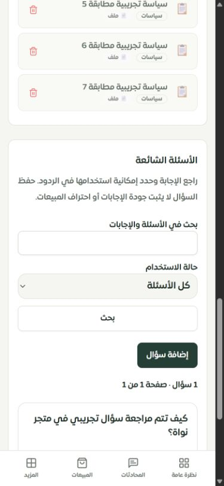
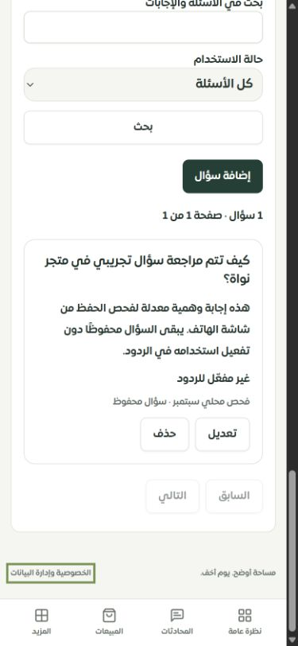
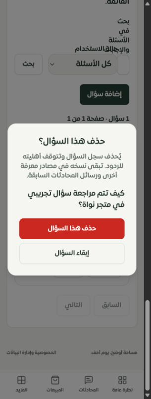
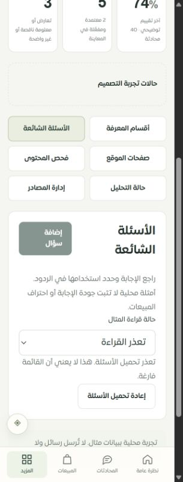

# مراجعة مساحة الأسئلة الشائعة في عقل ساري — 29 سبتمبر 2026

استُبدلت قائمة FAQ القديمة بمساحة تتيح المراجعة والتعديل والإيقاف والبحث، مع حماية الحفظ والحذف من الكتابة فوق نسخة أحدث. نُفذت في لوحة التاجر الفعلية والموك أب التفاعلي. هذه دفعة من مراجعة لوحة التيننت؛ لا تعني اكتمال فحص النظام أو تصميم جميع الصفحات.

## المشكلات التي عولجت

| المشكلة السابقة | السلوك الحالي |
|---|---|
| خطأ تحميل الأسئلة يظهر كقائمة فارغة | حالات مستقلة للتحميل والخطأ والفراغ وغياب نتائج البحث، وإعادة قراءة صريحة |
| العرض والإضافة والحذف فقط | محرر للسؤال والإجابة والتصنيف وحالتي الإتاحة والاستخدام في الردود |
| السؤال الجديد يُفعّل مباشرة | الواجهة تبدأ دون تفعيل؛ استخدامه في الردود يتطلب مراجعة صريحة تُلغى عند تغيير الحقول أو استعادة المسودة |
| الحذف المباشر دون مراجعة | نافذة تسمّي السؤال وتشرح بقاء نسخه في المصادر الأخرى والمحادثات؛ الإلغاء يبقيه |
| تعديل قديم قد يستبدل الأحدث | بصمة نسخة يرسلها المحرر وتُقارن داخل معاملة مقفلة؛ يُرفض التعديل أو الحذف عند الاختلاف |
| طلبات متزامنة قد تتجاوز حد 50 | فحص العدد والإنشاء داخل قفل التاجر ومعاملة واحدة في مسار CRUD هذا |
| إعادة الإضافة بعد فقد الرد قد تكرر السؤال | UUID للمحاولة، وإعادة الطلب المطابق تعيد السجل نفسه؛ تغيير محتوى الطلب بنفس الرقم يُرفض |
| مسودة تضيع عند التنقل الداخلي | ذاكرة مؤقتة مرتبطة بالحساب والتاجر، دون حفظ الموافقة؛ تحذير قبل تجاهل التعديلات |
| بحث ضيق على الهاتف | حقول البحث والفلتر وزر البحث تتكدس بعرض كامل على الشاشة الصغيرة |

القراءة تحترم عضوية المتجر، والكتابة تتطلب `bot_settings.manage`. لا يظهر نص خطأ قاعدة البيانات للمستخدم. الإنشاء والتعديل والحذف تبطل ذاكرة الردود والجلسات الدائمة داخل المعاملة وتحفظ حدث التدقيق. لا توجد ترحيلات قاعدة بيانات جديدة لهذه الدفعة.

## تجربة محلية فعلية

البيئة: قاعدة `sari_pages_test` وتيننت «متجر نواة · تيننت الفحص»، مع حظر الاتصالات الخارجية وتعطيل الرد التلقائي. استُخدمت بيانات وهمية فقط.

1. أُنشئ سؤال من الواجهة وحُفظ دون تفعيل.
2. فُتح للتعديل، وطُلبت موافقة قبل التفعيل. بعد التنقل للملخص والعودة بقيت المسودة دون استعادة الموافقة.
3. حُفظ التفعيل وظهرت الحالة في القائمة، ثم عُدلت الإجابة وأُوقف الاستخدام وحُفظت الحالة الجديدة.
4. فُتحت نافذة الحذف على الهاتف وأُلغي الحذف. بقي السجل. الحذف الفعلي اختُبر على سجلات آلية مؤقتة منفصلة.
5. فلتر المفعّل أعاد صفر نتائج بعد الإيقاف، وفلتر الكل أعاد السؤال المحفوظ.
6. في الموك أب فُتح السؤال وعدّلت حالته وتصنيفه، ثم اختُبرت حالة خطأ القراءة وإعادة التحميل ومنع الإضافة أثناء تعذر القراءة.

كان التطبيق متاحًا على `http://127.0.0.1:3018/merchant/sari-brain?view=knowledge` والموك أب على `http://127.0.0.1:4329/#/page/merchant/sari-brain` وقت الفحص. القياسات ونصوص النتائج في [browser-checks.json](browser-checks.json).

## نتائج التحقق

| الفحص | النتيجة |
|---|---|
| واجهة FAQ | 14 حالة ناجحة: التفعيل، الصلاحيات، الخطأ، الحذف، المسودة، إعادة المحاولة والتعارض |
| صلاحيات FAQ ونصوص أخطاء الخادم | 9 حالات ناجحة |
| صلاحيات المعرفة القائمة | 95 حالة ناجحة |
| مخزن المسودة ونطاقها | 7 حالات ناجحة في ملفين |
| موك أب عقل ساري والمعرفة | 48 حالة ناجحة في ملفين |
| MySQL: التزامن والعزل والمراجعة وإبطال الذاكرة والتوافق | 13 حالة ناجحة |
| إجمالي الحالات المختلفة المذكورة أعلاه | **186 حالة في 8 ملفات**؛ الإعادات غير محسوبة مرة ثانية |
| الترجمة | 8429 استدعاء و346 مفتاحًا ديناميكيًا؛ لا مفقود ولا أخطاء متغيرات |
| TypeScript العام | نجح آخر فحص؛ ظهر قبله خطآن في ملف العمل المتزامن `server/automation/onboarding-store.ts`، ثم زالا بعد تحديث ذلك العمل دون تعديل الملف أو ضمه لهذه الدفعة |
| بناء الواجهة والخادم والعامل والموك أب | نجح؛ ميزانية الحزمة نجحت، وبقي تحذير Vite المعروف لحزمة أكبر من 600 كيلوبايت |
| Chrome — التطبيق 320 و390 | عرض المحتوى 305 و375؛ لا تجاوز أفقي في الحالات المقاسة |
| Chrome — الموك أب 320 | عرض المحتوى 305؛ لا تجاوز أفقي في المحرر وخطأ القراءة |
| Safari وiPhone فعلي | لم يُختبرا؛ تغيير عرض Chrome ليس اختبار Safari |

شُغّل أيضًا ملف `sales-engine-pentest.test.ts`: **176 حالة ناجحة و8 فاشلة**. الإخفاقات في PEN-12 وPEN-17 وPEN-30 وPEN-46 تعتمد على مطابقة نصوص SQL وتواقيع واستدعاءات حرفية. تحققنا أن الشروط الثمانية نفسها تفشل على الكوميت السابق `e39ae831`؛ راجع [legacy-baseline.json](legacy-baseline.json). هذا يحدد أنها سابقة لتغييرات FAQ، ولا يثبت سلامة السلوك الأمني الذي تحاول قياسه. تظل بحاجة إلى مراجعة سلوكية منفصلة؛ لذلك لا نصف مجموعة الاختبارات الأمنية كلها بأنها ناجحة.

استُبدلت فحوص PEN-34 الثلاثة التي كانت تبحث عن لفظ `invalidateCache` في الراوتر باختبارات MySQL فعلية للإنشاء والتعديل والحذف تتحقق من حذف ذاكرة الردود وإبطال الجلسات. لم تُحذف الإخفاقات الثمانية الأخرى أو تُتجاهل. هذه اختبارات أمن محددة للتغيير وليست اختبار اختراق شاملًا للنظام.

## القيود والبنود المفتوحة

- المسودة في ذاكرة التبويب أثناء التنقل الداخلي فقط. التحديث الكامل أو إغلاق التبويب أو تسجيل الخروج يفقد النص غير المحفوظ ومرجع إعادة محاولة FAQ. لا يوجد إيصال دائم مستقل لهذا المسار بعد حذف السؤال.
- منع التكرار مربوط بالسجل المحفوظ: إعادة الطلب بعد حذف السجل لا تستفيد من الرقم القديم. عند نتيجة غير مؤكدة توضّح نافذة الإغلاق احتمال أن الخادم حفظ الطلب، وتطلب التحقق من القائمة قبل إضافة نسخة أخرى.
- بصمة النسخة اختيارية في API للتوافق مع العملاء السابقين؛ الواجهة الجديدة ترسلها دائمًا. العملاء السابقون ومسارات الاستيراد الأخرى لم تتحول جميعها إلى مراجعة نسخة إلزامية.
- حد 50 يحمي طلبات الإنشاء المتزامنة عبر هذا المسار؛ لا يمثل حدًا عامًا لجميع التكاملات ومسارات تحليل المواقع. وقد تغير المزامنة سؤالًا مستوردًا لاحقًا.
- حدود التحرير بقيت 500 حرف للسؤال و2000 للإجابة. النص المستورد الأطول يُعرض دون قص، لكن حفظه عبر هذا المحرر يتطلب الالتزام بالحدود.
- الموك أب يستخدم أمثلة محلية وحالات فشل توضيحية؛ ليس اختبار معاملة خادم أو تزامن حقيقي. ثبات UUID والمعاملات والبصمات اختُبر في التطبيق والاختبارات الآلية.
- لم يُشغّل نموذج ذكاء اصطناعي أو إرسال عميل في هذه الدفعة. تفعيل FAQ يحدد أهليته للاستخدام، ولا يثبت أن إجابة بعينها استخدمته أو أن نسبة احتراف المبيعات تحسنت.
- بقيت بقية أقسام المعرفة وإجراءات التعارض القديمة والصفحات في [سجل الاستكمال](../tenant-testing-workspace-2026-09-28/REMAINING.md). لم يُعد حصر الصفحات؛ أرقام آخر سجل ثابتة: 126 مسارًا، منها 101 بموك أب عام و8 تحويلات و10 تفصيلية و7 تفصيلية جزئيًا.

التغييرات محلية في `main`، ولم تُدفع أو تُنشر على الإنتاج في هذه الجولة. أعمال إعداد الحساب وواتساب المتزامنة وملفات التصميم غير المتعلقة بهذه الدفعة مستبعدة من الكوميت.

