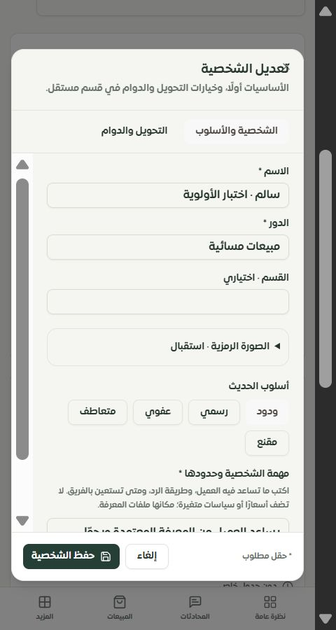

# الفحص العميق للوحة التيننت — 28 سبتمبر 2026

## النتيجة الحالية

متابعة أحدث: [إصلاح التقارير المجدولة وقوالب واتساب وحالة التكاملات](../tenant-mobile-followup-2026-09-28/REPORT.md). تمت معالجة الجداول الناقصة وحفظ الإعدادات والتحقق من عزل التيننت؛ الإرسال التلقائي لهذه الإعدادات ما يزال غير مربوط، والموك أب المستقل ما يزال عامًا.

تحديث لاحق: [فحص الموبايل والآيفون وسفاري، مع الإصلاحات والمقاسات وحدود التحقق](../tenant-mobile-2026-09-28/REPORT.md). أُعيد توليد بصمات سجل المصدر بعد تعديل الريسبونسف.

حُصرت **126/126 مسارًا مسجلًا** للتاجر من المصدر، مع الحقول والنوافذ والخيارات وشروط الظهور والإجراءات المرتبطة. أُعيدت زيارة المسارات كلها على نسخة محلية وتيننت اختبار مستقل. جرى ضبط الشخصيات وخيارات المساعد وإصلاح أخطاء فعلية في التقارير والعملات والنصوص.

**حصر المسارات كامل، لكن اكتمال تصميم كل خاصية وتشغيلها ليس 100%.** يوجد 112 مسارًا بموك أب عام، وفجوات تشغيل مؤكدة أدناه. لم تُعتبر الصفحة ناجحة لمجرد تحميل عنوانها، ولم تُعتبر البيانات التوضيحية قياسًا حقيقيًا.

- [سجل كل صفحة وخصائصها ومواقعها في المصدر](FEATURE_REGISTER.md)
- [سجل تفاعلي قابل للبحث](http://127.0.0.1:4329/feature-audit.html)
- [موك أب الشخصيات](http://127.0.0.1:4329/#/page/merchant/virtual-team) و[عقل ساري](http://127.0.0.1:4329/#/page/merchant/sari-brain)
- [التطبيق المحلي](http://127.0.0.1:3018/merchant/virtual-team)
- [نتائج التحقق المسجلة](deep-verification.json)

## حدود الحصر

| الدليل | العدد | ما يثبته |
| --- | ---: | --- |
| المسارات المسجلة | 126 | تشمل التحويلات والصفحات ذات المعلمات |
| ملفات الواجهة المرتبطة | 179 | الصفحات ومكونات الخصائص والغلاف المشترك؛ لا تُكرر مكونات UI الأساسية |
| عقد عناصر التحكم | 1585 | عقد المصدر، وليست عدد خصائص مستقلة أو كل تكرارات القوائم |
| قوائم خيارات ساكنة | 54 | إضافة إلى الخيارات المشروطة والديناميكية |
| عقد لها شروط ظهور | 652 | تُحفظ الشروط للمراجعة، ولم تُشغّل كل تراكيبها |
| إجراءات تعديل API مختلفة | 236 | مفهرسة، ولم تُنفّذ جميعها |
| روابط داخلية نصية إلى مسارات مفقودة | 0 | لا يثبت ذلك صحة غرض كل رابط ديناميكي |
| ملفات قديمة غير متصلة بالمسارات | 7 | محفوظة في السجل لتجنب فقد إجراءات فريدة |

يوجد 187 من 288 استدعاء قراءة دون إشارة خطأ مباشرة يكتشفها التحليل الساكن. هذه **إشارات مراجعة وليست عدد أعطال مؤكدة**. وقد تعالج المكونات المشتركة الخطأ أو تتولد التسميات ديناميكيًا.

اختبار بصمات الملفات يرفض سجلًا قديمًا لا يطابق المصدر. واختبار المحافظة على الخصائص يقارن إجراءات كل مسار بخط الأساس 52a4f0c8؛ البدائل المعتمدة موثقة في feature-baseline.json: تصدير التقارير من بياناتها الصحيحة، واستبدال واجهة العملة غير المسجلة بالواجهة الفعلية.

## الشخصيات وخيارات المساعد

| التغيير | النتيجة والدليل |
| --- | --- |
| محرر الشخصية | قسمان: الشخصية والأسلوب، ثم التحويل والدوام. بقيت حقول الاسم والدور والقسم والمهمة، و12 رمزًا و5 أساليب والكلمات والدوام والتفعيل والافتراضية. الصورة قابلة للطي لتقصير النموذج. |
| أولوية الشخصيات | رفع وخفض مع حفظ الترتيب. تستخدم الواجهة ومحرك الاختيار نفس قاعدة الأولوية. جُرّب تداخل كلمة «سعر» ثم إعادة التحميل. |
| الدوام الليلي | دعم 22:00–06:00 بتوقيت الرياض. نهاية الدوام غير مشمولة. الشخصية خارج دوامها لا تعود عبر fallback؛ إن لم توجد شخصية متاحة يعود المساعد الأساسي. |
| معاينة الاختيار | رسالة عميل ووقت افتراضيان مع سبب الاختيار. تحققت نتيجة سالم ليلًا وليان نهارًا. لا تُرسل المعاينة رسالة ولا تستدعي النموذج. |
| سلامة الحفظ | تحقق من الفراغ والطول والدوام الناقص والمتساوي. إلغاء الدوام يرسل null. فشل الحفظ يحفظ المسودة. |
| الصلاحيات والعزل | القراءة من التيننت المحدد، والتعديلات تتطلب bot_settings.manage. ترتيب كامل وفريد من شخصيات التيننت فقط، ويُحفظ في transaction. فحص الحد الأعلى يسبق إزالة الافتراضية الحالية. |
| إعدادات المساعد | خمسة أقسام تبقى مركبة عند التنقل. مسودة الرد والمجموعات لا تُستبدل عند إعادة جلب البيانات. الحفظ يشمل الكلمة المكتوبة التي لم يضغط المستخدم «إضافة» لها. |
| حفظ مستقل | الخصم والهامش بمراجعة وحفظ مستقلين. اختيار لغة المساعد لا يغيّر لغة اللوحة. بقيت الأيام والدوام والقوالب وأوضاع المجموعات والتدخل البشري. |

تحقق حي: إنشاء وتعديل، تفعيل، تغيير أولوية، دوام ليلي وإزالته، حفظ تأخير الرد 4 ثوانٍ وكلمة مجموعة معلّقة ثم إعادة التحميل. المحاكاة والاختبارات لا تثبت جودة رد النموذج لدى المزود.

## عقل ساري وملفات المعرفة واحتراف المبيعات

أصبحت الواجهة الفعلية ستة أقسام: **النظرة العامة، المصادر، المعرفة، المبيعات، الاختبار، السجل**. بقيت المكونات المتقدمة موجودة: أدلة ومراجعات التعلم، إعدادات القطاع، بروتوكول التجارب، مراجعة الرد، سياسة المتابعة، وسياسات الخصم والهامش. يمكن التنقل دون ضياع المسودة؛ تحقّق ذلك بحقل مصدر المعرفة بعد استقرار تحديثات التطوير.

أزيل شريط التقدم العشوائي. يعرض التحليل النسبة التي يبلغها الخادم فقط، أو حالة انتظار عند عدم توفر نسبة. يمكن متابعة العمل وإعادة فتح نافذة التقدم، مع إظهار فشل الاستعلام وإعادة المحاولة.

صحة المعرفة الحالية تقيس **تغطية أقسام ومصادر**، وليست صحة الإجابات أو احتراف البيع. يعرض التطبيق صراحةً **«لا تتوفر نسبة مقاسة بعد»** لاحتراف المبيعات. للوصول إلى نسبة معتبرة يلزم تعريف الأبعاد والعينة والفترة والأوزان، وربط المحادثات بنتائج الطلبات، والموافقة والمراجعة ومصدر كل حكم.

الموك أب يوضح نتائج مرتبطة بمصادرها، وملفات بحالات استخراج واعتماد وتفعيل، وفجوات وتعارضات وخطوة معالجة. أضيفت مراجعة تفاعلية من **8 حالات**: فهم الاحتياج، المقارنة، السعر، الموافقة، الرفض، صدق المعلومة، التحويل للموظف، والتعليمات الخادعة. لكل حالة الرد الحالي والمقترح والحكمان والسبب؛ لا تُحفظ مراجعة ناقصة، وأي تعديل يلغي إقرار المراجعة. الحفظ محلي ولا يفعّل سياسة أو تجربة، ولا يغيّر نسبة 74% التوضيحية.

معاينة TXT/CSV تمنع اقتطاع الملف بعد 30 ألف حرف بصمت وتحافظ على المسودة عند الفشل. لا يُعد ذلك إثباتًا لدورة استخراج PDF/Word/Excel أو سجل الملفات المتعدد الإنتاجي. في مسار عقل ساري وحده 275 عقدة تحكم مرتبطة؛ تشغيل التجارب وتأهيل الجمهور وتجميد العينة والسحب والإرسال ومراجعاتها لا تزال تحتاج مطابقة موك أب تفصيلية واختبارات تشغيل.

## أخطاء إضافية أُصلحت

| المشكلة | الإصلاح والتحقق |
| --- | --- |
| تصدير المبيعات أو العملاء كان يصدر تحليلات رسائل | مصدر واحد للجدول وExcel والطباعة، بحسب نوع التقرير والفترة. فُك ملف Excel الناتج حيًا وطابق 1560 SAR و8 طلبات ومتوسط 195 وترتيب المنتجات. |
| خلط العملات ووحدات المبالغ | فلتر العملة يطبق على استعلامات مبيعات الفترة والمقارنة والمنتجات. تعرض الطلبات والمكونات عملة كل طلب ووحداته الصغرى صحيحة؛ 31500 أصبحت 315 SAR. مجموع الطلبات غير الملغاة منفصل لكل عملة. |
| بيانات جودة غير مقاسة تظهر صفرًا | رضا العملاء وزمن الرد «غير مقاس»، والنمو دون أساس مقارنة غير متاح. توضيح أن نسبة الطلبات إلى المحادثات ليست تحويلًا منسوبًا لكل محادثة. |
| عناوين التقارير تربط مفاتيح تخص حملات | نصوص دلالية جديدة عربية وإنجليزية، وحالات فشل واضحة وتعطيل التصدير أثناء التحميل والفشل. |
| العملة تستدعي merchant.get/update غير الموجودتين | استخدام merchants.getCurrent/update وترطيب الاختيار بعد وصول البيانات. حُفظ USD وأعيد تحميله ثم استعيد SAR. |
| نجاح تكاملات افتراضي 100% دون مزامنة | «—» عند غياب القياس، وروابط إعدادات صحيحة لكل مزود. اختبر عرض 0 عمليات و4 عمليات/3 ناجحة في اختبارات المكونات. |
| نصوص في خانات خاطئة داخل أربعة إعدادات | صححت العملة، حالة التكاملات، التقارير المجدولة وإشعارات واتساب، مع إشعارات فشل حقيقية. اختبار وجود المفاتيح وحده لم يكن يكشف ذلك. |
| نماذج الجدولة والإشعارات | ربط التسميات بالحقول، تحقق الإدخال، نافذة تمرير للهاتف وتأكيد الحذف. دورة الحفظ الحية متوقفة على نقص الجداول الموضح أدناه. |

بقيت إصلاحات الجولة السابقة ضمن الاختبارات: روابط الأدوات وصفحات الأخطاء داخل غلاف التاجر، عناوين حالات زد والدفع، Google Sheets، منع تزامن استيراد وتصدير المخزون، ومركز المساعد ذي المداخل الـ13.

## النواقص المؤكدة — لا تُحسب مكتملة

| الأولوية | النقص | معيار الإغلاق |
| --- | --- | --- |
| P1 | **ثلاث صفحات لا تكتمل قراءتها في قاعدة الاختبار:** التقارير المجدولة، إشعارات واتساب، وحالة التكاملات. الجداول scheduled_reports وwhatsapp_auto_notifications وintegration_stats وintegration_errors غير موجودة؛ عاد فحص SHOW COLUMNS بـ ER_NO_SUCH_TABLE، ولا توجد لها ترحيلات SQL مسجلة في المستودع. | إضافة مخطط وترحيل معتمد واختبار قاعدة جديدة وقاعدة قائمة، ثم CRUD كامل ومراقبة الإرسال. لم يُفحص مخطط الإنتاج ولا يُدّعى أنه مطابق للمحلي. |
| P1 | تحديث التقرير المجدول في server/db-notifications.ts لا يكتب خيارات محتوى التقرير الستة. | حفظ كل مفتاح include* ثم قراءته، مع اختبار كل قيمة false. |
| P1 | **112 مسارًا بموك أب عام**، مقابل 5 تفصيلية وعقل ساري جزئي و8 تحويلات. | مطابقة سجل كل صفحة بحقولها ونوافذها وشروطها وصلاحياتها وحالات الخطأ والتحميل والحفظ؛ لا يكفي تغيير الغلاف العام. |
| P1 | مخططات عقل ساري المتقدمة لم تُمثّل كلها تفاعليًا، ومؤشر احتراف البيع غير مقاس إنتاجيًا. | استكمال التصميم والدليل المقاس، دون اختلاق نسبة من اكتمال الملفات. |
| P2 | triggerIntents في الشخصيات وdelayMinutes في إشعارات واتساب محفوظان دون استخدام فعلي في مسار القرار/الإرسال الذي فُحص. | ربطهما بسلوك مختبر أو توثيق عدم دعمهما؛ لم يُعرضا كخيارات تعمل. |
| P2 | تبديل الشخصية الافتراضية والإنشاء المتزامن لم يكتسبا ضمانًا ذريًا كاملًا؛ إعادة الترتيب فقط داخل transaction. | اختبار تنافس تحديثين/حد 10 وعدم فقد الافتراضية عند فشل قاعدة البيانات. |
| P2 | حالات الأدوار وجميع الشروط وفشل المزود وانتهاء الجلسة لم تُختبر عبر كل صفحة. | مصفوفة صلاحيات وحالات، وحساب موظف محدود وتيننتان ومزود اختبار. |
| P2 | حفظ PDF من نافذة الطباعة لم يختبر حيًا؛ وبعض نصوص الصفحات القديمة لا تزال عربية ثابتة. | التحقق من ملف PDF فعلي ومن اللغات المعلن دعمها. |
| P2 | لا تزال بطاقات وألوان قديمة داخل بعض الصفحات، و7 ملفات قديمة غير مربوطة لها إجراءات فريدة. | نقل الوظائف المطلوبة قبل الحذف، وعدم اعتبار توحيد الغلاف إزالة كاملة للتصميم القديم. |

إظهار حالات الفشل في الصفحات الثلاث إصلاح للواجهة؛ **لا يصلح الجداول المفقودة**. لا يوجد اختبار ناجح لإرسال التقارير أو إشعاراتها في هذه الجولة. لم تُنشأ جداول مؤقتة لإخفاء النقص، ولم تُشغّل رسائل خارجية.

## سهولة الاستخدام

الشخصيات أصبحت أقصر وأسهل للفهم: الأساسيات أولًا، والتفاصيل عند الحاجة، مع تفسير قرار التحويل. خيارات المساعد موزعة حسب هدف التاجر وتحافظ على المسودة. عقل ساري يفصل المعرفة عن جودة البيع ويكشف الأدلة بدل نسبة مطمئنة بلا أساس.

ما زالت سهولة النظام كله **متفاوتة** بسبب كثافة الأدوات المتقدمة والنماذج العامة والأعطال المذكورة. لم يُقَس زمن إتمام المهام مع تجار حقيقيين، لذلك لا توجد درجة سهولة رقمية مدّعاة. معيار القبول المقترح لكل صفحة: أن يعرف التاجر الخطوة التالية، ويفهم الحقول والأثر، ويجد خطأه بجانب الحقل، ويحفظ دون فقد المسودة، ويستعيد عمله بعد الفشل.

## التحقق المنفذ

- **740 اختبارًا ناجحًا في 23 ملفًا**: المحافظة على خصائص 126 مسارًا، البصمات، اختبارات الموك أب، الشخصيات والدوام والأولوية والصلاحيات، حدود الطلبات، التقارير وExcel، حالات الأخطاء والنصوص، ومعرفة ساري ومجموعات أمن وعزل موجودة. بعض الاختبارات ساكنة أو تستخدم mocks؛ ليست مسح اختراق شاملًا للإنتاج.
- TypeScript ناجح. الترجمة: **7884 استدعاء و311 مفتاحًا ديناميكيًا**، دون مفاتيح ناقصة أو أخطاء interpolation في نطاق المدقق.
- بناء Vite ناجح. ميزانية ملف الدخول ناجحة: **102317 بايت gzip**. يوجد تحذير حجم لحزمة ExcelJS المحملة عند التصدير؛ ليس تحميلًا أوليًا.
- أُعيدت زيارة **126 مسارًا بعرض فعلي CSS 480** دون تجاوز أفقي لجذر الصفحة. القوائم والجداول القابلة للتمرير مقصودة. الصفحات ذات معرفات غير موجودة أعطت حالات عدم وجود؛ هذا لا يثبت نجاح شاشة تفاصيل بسجل صالح.
- اختبارات مركزة للشخصيات وإعدادات المساعد والمعرفة والتقارير على عروض أوسع، مع حفظ وإعادة تحميل ومطابقة Excel. لم تُجرّب كل عملية دفع أو حذف أو إرسال أو مزود خارجي.
- [المرور الحي الكامل](deep-route-recheck.json) يسجل المرحلة قبل تصحيح آخر النماذج؛ [إعادة فحص الإعدادات](settings-recheck.json) تسجل النتيجة اللاحقة، بما فيها أخطاء الجداول. ملفات verification.json وlive-route-checks.json القديمة أدلة للجولة السابقة.

## حالة التسليم

التعديلات والبيانات التجريبية **محلية**. لا يوجد push أو نشر أو ترحيل لقاعدة الإنتاج في هذه الجولة. حظر الاتصالات الخارجية مفعل، ومهام cron متوقفة على خادم الفحص. فُصلت حالة الحصر عن حالة التصميم والتشغيل في السجل كي لا تُنسى الصفحات أو تُعلّم ناجحة دون دليل.
