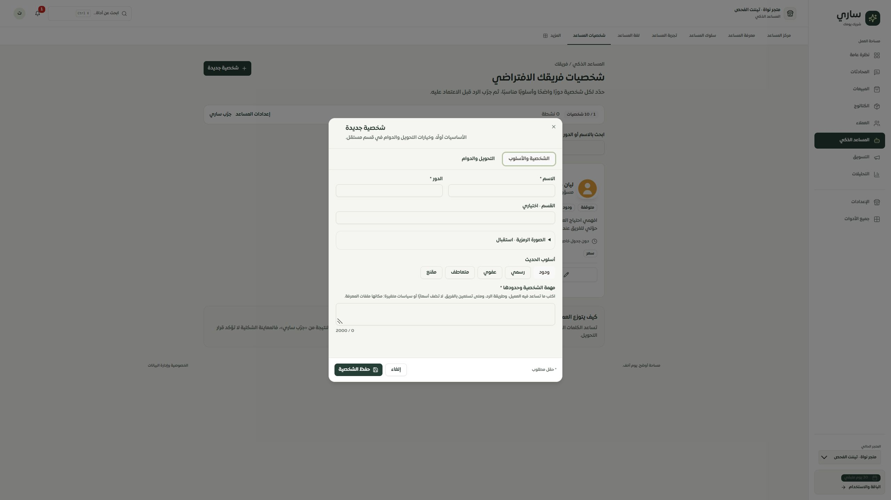

# إعادة فحص لوحة التيننت — 28 سبتمبر 2026

## النتيجة

حُصرت **126 من 126 مسارًا مسجلًا للتاجر** من `client/src/App.tsx`، ومكوناتها الداخلية، ثم زِيرت جميعها على تشغيل محلي بتيننت مخصص. هذا إثبات لحصر المسارات، **وليس شهادة بأن كل خاصية تعمل أو أن إعادة تصميم النظام اكتملت 100%**.

ما زالت هناك فجوات مؤكدة في مطابقة الموك أب للخصائص، وفي التقارير، وفي إثبات جودة المساعد. لذلك لا أوصي باعتبار الموك أب الحالي مواصفة نهائية لكل النظام أو إعلان اكتمال الإصلاح الشامل.

هذه المراجعة توسّع تقريري الصفحات والمعرفة السابقين. التقرير التفصيلي لكل صفحة موجود في [FEATURE_REGISTER.md](FEATURE_REGISTER.md)، والنسخة القابلة للبحث في [سجل الفحص التفاعلي](http://127.0.0.1:4329/feature-audit.html). الموك أب في [المعاينة المحلية](http://127.0.0.1:4329/#/page/merchant/virtual-team).

## نطاق الأدلة

| البند | النتيجة | معنى النتيجة |
| --- | ---: | --- |
| المسارات المسجلة | 126/126 | تشمل التحويلات والصفحات ذات المعلمات |
| ملفات الواجهة المرتبطة | 178 | الصفحات والمكونات المستوردة والغلاف المشترك |
| عقد عناصر التحكم في المصدر | 1563 | ليست عدد خصائص مستقلة؛ العنصر المكرر ديناميكيًا قد يُعد عقدة واحدة |
| قوائم الخيارات الساكنة | 51 | إضافة إلى خيارات الحقول المشروطة والديناميكية |
| عناصر لها شروط ظهور | 645 | شروط صلاحية/حالة/اختيار/تحميل وغيرها |
| إجراءات تعديل API مختلفة | 235 | فُهرست من الواجهة؛ لم تُنفذ جميعها |
| روابط داخلية نصية إلى مسار غير موجود | 0 | بعد التصحيح؛ صحة المسار لا تثبت صحة غرضه |
| ملفات صفحات قديمة غير متصلة بالمسارات | 7 | محفوظة في السجل؛ لم تُحذف وظائفها الفريدة بلا تحقق |

تعقّب الفحص الحقول والأزرار والنوافذ والتبويبات، القيود والخيارات، استدعاءات القراءة والتعديل، شروط الظهور، وموقع كل عنصر في المصدر. أضيف اختبار يرفض السجل عند اختلاف بصمة ملف عن الكود الحالي، حتى لا تتحول نسخة قديمة من التقرير إلى ادعاء اكتمال.

وجد التحليل الساكن 191 من 285 استدعاء قراءة بلا إشارة خطأ مباشرة، و551 عنصرًا لا يستطيع استخراج تسميته ثابتًا. **هذه قوائم تحتاج مراجعة، وليست 191 عطلًا أو 551 مشكلة إتاحة مؤكدة**؛ قد تعالجها مكونات أخرى أو تتولد تسمياتها وقت التشغيل.

## ما أُصلح في هذه الجولة

| المجال | التغيير | التحقق |
| --- | --- | --- |
| شخصيات الفريق | محرر مختصر بقسمين، حقول مطلوبة بأخطائها، 12 رمزًا و5 أساليب، كلمات بلا تكرار، دوام، افتراضية وإيقاف مؤقت | إنشاء وتعديل وحفظ محلي؛ تحقق الحقول؛ اختبارات الموك أب |
| إزالة الدوام | إرسال `null` عند إلغاء الجدول بدل ترك القيمة القديمة محفوظة | حُفظ دوام ثم أُلغي وأُعيد فتح الشخصية |
| بيانات الشخصية | الاحتفاظ بالمسودة عند فشل الحفظ، تنظيف الكلمات المخزنة، دعم رموز القوالب القديمة | اختبارات تطبيع وحدود وطول المحتوى |
| إعدادات المساعد | خمسة أقسام واضحة، إبقاء المسودة عند التنقل، القوالب قابلة للطي، حفظ سياسات البيع مستقلًا | اختبارات التنقل والحفظ المستقل والمراجعة |
| لغة المساعد | قراءة اللغة المحفوظة وحفظها، 6 لغات وخيار ثنائي؛ لا تتغير لغة اللوحة أو عملتها | حفظ الإنجليزية وإعادة التحميل ثم استعادة العربية |
| التدخل البشري | فصل خطأ جلب المحادثات عن حالة عدم وجود محادثات؛ إبقاء مدد الاستئناف وخياراته | مراجعة المصدر واختبارات الخيارات |
| مركز المساعد | وصول مباشر إلى المعرفة والشخصيات واللغة والتدخل؛ 13 مدخلًا؛ إزالة الأرقام التسويقية الثابتة | اختبار الروابط والمطابقة مع الكتالوج |
| روابط الأدوات | تصحيح وجهات بيان وسلة وWooCommerce والخطط؛ إظهار Shopify غير المتاح بوضوح | فحص المسارات؛ لا توجد وجهات نصية مفقودة |
| الكلمات المفتاحية | توجيهها إلى الردود السريعة بدل التحليل الذكي، في التطبيق وسياسة المسارات والموك أب | اختبار التحويل والتحقق من تحميل جديد محليًا |
| Google Sheets | تصحيح مفاتيح النصوص المنزاحة في الإعدادات والتقارير والمخزون؛ عدم عرض النجاح أو الفشل كعنوان أولي؛ تصحيح إشعارات Sonner وأخطاء الطلبات | اختبارات عرض فعلية للمكونات وإشعارات الفشل؛ إعادة زيارة الصفحات |
| استيراد/تصدير المخزون | تعطيل العمليتين أثناء تنفيذ إحداهما | اختبار حالة الانتظار في الاتجاهين |
| صفحات زد والدفع | عناوين دلالية في الحالات الفارغة/الفشل، وتصحيح نصوص منتجات زد؛ عرض أخطاء جلب بيانات زد والدفع | إعادة زيارة الصفحات وفحص عناوينها |
| معاينة المعرفة | منع اقتطاع ملف بعد 30 ألف حرف بصمت، الحفاظ على المسودة عند رفضه، الإبلاغ عن الملف الفارغ وغير المدعوم وتعذر القراءة، الاحتفاظ باسم الملف عند التحليل والاعتماد | 4 اختبارات للحدود وسلامة النص؛ لم تُرسل الملفات إلى مزود خارجي |
| نسبة صحة المعرفة | شرح ظاهر بأنها تغطية أقسام المعرفة ولا تثبت دقة الإجابات أو احتراف البيع | تحقق من النص في التطبيق المحلي |

لم تُحذف صفحة أو خاصية تشغيلية من لوحة التاجر في هذه الجولة. لم تُغيّر مخططات قاعدة بيانات الإنتاج أو تُنفذ عملية نشر.

## ما لم يكتمل — نتائج مؤكدة وأولويات

### P1 — مطابقة الموك أب مع الوظائف الفعلية

حالة التصميم التفصيلي الحالية: **5 صفحات تفصيلية، صفحة عقل ساري تفصيلية جزئيًا، 112 مسارًا بموك أب عام، و8 تحويلات**. المخطط العام في تلك الصفحات يوفر عرضًا وتنقلًا، لكنه لا يمثل تلقائيًا كل حقول الإضافة والتحرير والصلاحيات وحالات الفشل والإجراءات الداخلية. لكل صفحة قائمة عناصر وخطة قبول في سجل التغطية؛ لا يجوز وضع علامة «مكتملة» قبل مطابقتها.

### P1 — التقارير: التصدير لا يطابق القسم المختار

في `client/src/pages/Reports.tsx`، تستخدم أزرار PDF وExcel للمبيعات والعملاء والمحادثات `messageAnalytics.exportPDF/exportExcel`. نوع التقرير المختار يدخل في رسالة الإشعار فقط، والفترة المختارة لا تُرسل إذ تُرسل تواريخ غير محددة. هذه مشكلة وظيفية مؤكدة من مسار الاستدعاء، **لم تُصلح في هذه الجولة**.

القبول المطلوب: ملف يحمل نوع القسم والفترة والعملة، ويطابق أرقام جدول التاجر نفسه؛ اختبارات تحميل وفك الملف لكل نوع وفترة، وعزل بيانات تيننتين، ومنع نجاح زائف عند فشل التصدير.

### P1 — التقارير: نصوص ومقاييس تحتاج تصحيحًا

`Reports.tsx` يستخدم مفاتيح `reportsPage.text1..text16` التي تصف في الكتالوج حملات وإيصالات مزود، بينما الصفحة تعرض تقارير مبيعات وعملاء. ظهر العنوان «30 يوم» مكان عنوان تقرير المبيعات في الفحص الحي. إصلاح صفحات Sheets وزد لا يصلح هذه الصفحة تلقائيًا.

في `server/routers-reports.ts`، يعود متوسط زمن الرد ورضا العملاء حاليًا بصفر ثابت، والموضوعات بقائمة فارغة مع TODO. تعرض الواجهة الأصفار كمقاييس؛ يجب تمييز «لم يُقَس» عن صفر فعلي قبل استخدام الأرقام في تقييم أداء التاجر أو المساعد.

### P1 — عقل ساري: تفاصيل غير ممثلة بالكامل في الموك أب

حُصرت 265 عقدة تحكم مرتبطة بهذه الصفحة ومكوناتها، ومنها مراجعات التعلم، مرشح السياسة، تشغيل التقييم وإيقافه، مراجعة المخرجات والأرشيف، تصميم تجربة البيع وتجميد العينة والتأهيل والمراجعة، مراجعة الرد وإرساله، سياسة المتابعة والقطاع، والخصم والهامش. الموك أب الحالي لنتائج/ملفات/فجوات/مبيعات لا يغطي جميع هذه الشاشات.

الترتيب المقترح للتاجر: ملخص القرار التالي، ثم **النتائج والأدلة → الملفات والمصادر → الفجوات والتعارضات → جودة البيع → الإعدادات والمراجعات المتقدمة**. تظهر الإجراءات المتقدمة عند الحاجة دون حذفها. كل نتيجة قابلة لفتح المصدر وتاريخ تحديثه وحالة اعتماده؛ وكل فجوة لها تأثير وخطوة علاج واختبار لاحق.

### P1 — معنى نسبة احتراف المبيعات

`calculateHealthScore` في `server/db/knowledge.ts` يجمع أوزان وجود أقسام ومصادر: الهوية 15، الخدمات/المنتجات 25، التواصل 10، السياسات 10، FAQ 10، ذكاء المبيعات 15، تحليل الموقع 10، والملف التعريفي 5. هذا **مؤشر تغطية معرفة**؛ وجود المحتوى لا يثبت صحته أو جودة الإقناع أو التحويل.

النسبة في موك أب احتراف المبيعات توضيحية. قبل إنتاج نسبة حقيقية يلزم تعريف الأبعاد والأوزان، عينة محادثات صالحة وفترة واضحة، إسناد نتائج الطلبات والتحويل، توثيق الموافقات والمراجعات، واستبعاد التقييم عند نقص البيانات. تعرض الواجهة «بيانات غير كافية» بدل نسبة مخمّنة. تبقى تجارب البيع ومراجعاتها مصدر الدليل ولا تُختزل في رقم جمالِي.

### P2 — ملفات المعرفة والمزامنة والتقدم

الفحص المسبق الحالي داخل عقل ساري يدعم TXT/CSV؛ دعم صيغ أخرى في إعدادات الملفات مسار مستقل يحتاج مطابقة. لا يمثل سجل الملفات المتعدد في الموك أب بالضرورة عقد التخزين الإنتاجي الحالي. يجب اختبار الاستخراج والفشل وإعادة المحاولة والأسماء والإصدارات والاعتماد والتعطيل والمصدر المستخدم في الرد. أصلحنا الاقتطاع الصامت، لكن هذا لا يثبت اكتمال دورة معالجة كل نوع ملف.

يعرض عقل ساري تقدّمًا تدريجيًا محاكى (`fakeProgress`) أثناء التحليل. يلزم ربط المراحل بحالة حقيقية أو عرض انتظار غير رقمي؛ تقدم المؤشر وحده ليس دليل إنجاز المزود.

### P2 — حالات الخطأ والصلاحيات والتصميم القديم

تعالج صفحات المساعد المعدلة فشل التحميل بوضوح، لكن إشارات الأخطاء الساكنة في بقية الصفحات تحتاج اختبار فشل API/انتهاء الجلسة/نقص الصلاحية، لا مجرد زيارة بحساب المالك. بعض الصفحات لا تزال تستخدم ألوانًا وبطاقات قديمة داخل الغلاف الجديد. لم تُعلن إزالة التصميم القديم نهائيًا، ولم تُحذف الملفات السبعة غير المرتبطة لأن بعضها يشير إلى واجهات لا تظهر في الصفحات الحالية.

## الفحص الحي والاختبارات

- التطبيق الحقيقي: `127.0.0.1:3018`؛ الموك أب: `127.0.0.1:4329`. قاعدة محلية منفصلة وتيننت اصطناعي، واتصالات المزودين الخارجيين محجوبة، والمهام المجدولة متوقفة.
- [سجل زيارة المسارات](live-route-checks.json): 126 زيارة بعرض CSS مقداره 480px، بلا تجاوز أفقي لجذر الصفحة. معرّفات التفاصيل استخدمت بيانات اختبار؛ الحالات غير الموجودة والاتصالات غير المربوطة ليست نجاحًا لتكامل حي.
- [إعادة فحص الإصلاحات](follow-up-checks.json): العناوين والنصوص والتحويلات بعد التصحيح. يحتفظ الملف بالملاحظة الأولى ثم نتيجة التصحيح النهائية لمنتجات زد والكلمات. تحويل الكلمات القديم كان مخزنًا في المتصفح؛ تحميل عنوان جديد بمعلمة فحص أظهر الردود السريعة الصحيحة.
- [الاستجابة](responsive-checks.json): نافذة الشخصية على عروض CSS فعلية 480 و768 و1440px. بقي عرض الحوار ضمن الشاشة ودون تجاوز داخلي؛ أعيد حجم المتصفح الطبيعي. لم يُختبر عرض أصغر من 480 في هذه الجولة الحية.
- **554 اختبارًا ناجحًا في 15 ملفًا**: الموك أب والصفحات، خيارات المساعد، سلامة المعاينة، حالات التكامل، حصر المصدر، الإتاحة، التحويلات، عقود الواجهة، صلاحيات الفريق والتيننت، وانحدارات أمنية لمحرك البيع. الاختبارات الأمنية محلية ومعزولة؛ ليست اختبار اختراق كاملًا للإنتاج أو لتكاملات المزودين.
- **فحص الترجمة ناجح**: 7763 استدعاء، 308 مفتاحًا ديناميكيًا محدد الخيارات؛ لا مفاتيح مفقودة، لا استدعاءات ديناميكية غير محسومة، ولا أخطاء متغيرات نصية. هذا لا يثبت صحة المعنى في كل ترجمة قديمة؛ مشكلة صفحة التقارير مثال موثق.
- **بناء Vite الإنتاجي ناجح**. `git diff --check` ناجح.
- فحص TypeScript نجح قبل ظهور تغييرات سلة مستقلة متزامنة في مساحة العمل. آخر تشغيل شامل فشل في `server/ai/salla-checkout-agreements.ts:33` بسبب راية Unicode لتعبير منتظم مع هدف TypeScript قديم (`TS1501`). هذا الملف خارج تغييرات الواجهة هنا؛ **لا تُعتبر بوابة الأنواع الشاملة ناجحة للنسخة الحالية**.

أوامر إعادة توليد السجل: `node scripts/testing/audit-tenant-features.mjs` ثم `node scripts/testing/report-tenant-features.mjs`. للتحقق: `node scripts/testing/run-isolated.mjs` مع ملفات `merchant-*-prototype` و`merchant-feature-inventory` و`merchant-integration-feedback` و`merchant-knowledge-preview` وفحوص الإتاحة والصلاحيات المشار إليها في [verification.json](verification.json).

## تقييم سهولة الاستخدام

المسار اليومي للشخصيات وإعدادات المساعد أبسط الآن: قرار أساسي أولًا، تفاصيل اختيارية لاحقًا، أخطاء بجوار الحقول، وحفظ معلوم النطاق. تقييم بقية النظام **متفاوت ويحتاج إكمالًا** بسبب كثافة عقل ساري، تفاوت الحالات الفارغة والخطأ، ومشكلات التقارير. هذا تقييم خبير مبني على الفحص؛ لم تُجر دراسة مستخدمين أو قياس SUS، ولا توجد نسبة موضوعية لسهولة النظام كاملًا.

الإغلاق المقبول لكل صفحة: مطابقة عناصر السجل مع التصميم، اختبار دورة العمل الفعلية بالتيننت التجريبي، نجاح وفشل وصلاحيات، لوحة مفاتيح وRTL والجوال، حفظ واسترجاع البيانات، ثم توثيق الدليل. لا يغلق أي بند بمشاهدة واجهة عامة أو نجاح البناء فقط.

