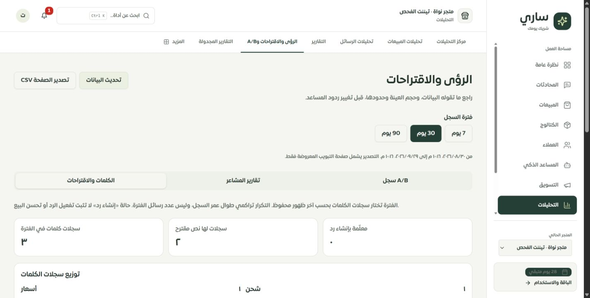
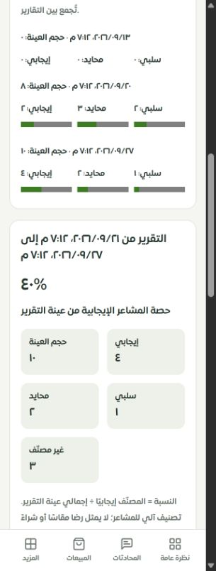

# الرؤى والاقتراحات وتقارير المشاعر وA/B — 29 سبتمبر 2026

هذه مرحلة التطبيق الفعلي وعقد البيانات لثلاثة مسارات تشترك في صفحة واحدة: `/merchant/insights` و`/merchant/ai-suggestions` و`/merchant/ab-tests`. يبدأ مسار A/B بتبويبه، ويبدأ مسار الاقتراحات بالكلمات والنصوص المقترحة. استُبدلت الصفحة القديمة المعطلة من فحص الأنواع بمكوّن مكتوب الأنواع دون `ts-nocheck`.

## ما تغير

- قراءات الرؤى تستخدم عضوية المتجر المحدد وصلاحية `analytics.read`، فتتاح للأدوار الأربعة بحسب السياسة الحالية. المسار القديم كان للمالك فقط، ومساعد المتجر فيه كان يحترم الاختيار الصريح؛ لم يكن ذلك إثباتًا لتسريب بين المتاجر. لا يُقبل معرّف متجر من مدخل عقد المساحة الجديد، وتعزل الواجهة بيانات الحساب والمتجر وتمنع عرض ذاكرة متجر سابق.
- أصبحت البيانات لقطة قراءة داخل معاملة `REPEATABLE READ` مع `READ ONLY`، ويثبتها أول استعلام. اكتشف MySQL أن الجمع بين خياري اللقطة والقراءة فقط في المشغل يولد صياغة غير صالحة؛ استُخدمت لقطة القراءة المتكررة الضمنية وصارت الاختبارات ناجحة. العدادات لا تتحول إلى أصفار أو قوائم فارغة عند فشل الاتصال.
- رُبط فلتر 7/30/90 يومًا بمعنى صريح لكل تبويب: آخر ظهور للكلمة، نهاية نطاق التقرير، وإنشاء سجل A/B. جميع السجلات مرقمة من الخادم، 20 في الصفحة، مع ترتيب ثابت وحدود للمدخلات. لا تقتصر الكلمات على أول عشرة أو التقارير على أربعة، وتظهر حالات A/B الثلاث.
- تكرار الكلمات تراكمي، وعدّاد «إنشاء رد» مجرد حالة في السجل. يظهر النص المقترح كاملًا بعد فتحه، دون ادعاء تفعيله. أضيفت قائمة موزعة بالفئات وأشرطة مع أرقامها ورابط إدارة الردود.
- النسبة المسماة سابقًا «رضا» كانت النسبة الإيجابية المخزنة. أصبح العرض يحسب حصة المشاعر الإيجابية من عدادات العينة، ويعرض الإيجابي والسلبي والمحايد وغير المصنّف. العينة الفارغة أو غير المتسقة لا تعطي نسبة صفرية زائفة. تظهر اتجاهات التقارير المعروضة من الأقدم للأحدث مع حجم كل عينة، دون جمعها كعملاء فريدين. لا تمثل المشاعر تقييم رضا أو شراءً مؤكدًا أو نسبة احتراف المبيعات.
- تعرض نسختا A/B النص وعدد الملاحظات والعلامات الإيجابية ونسبتها؛ لا تُعرض كنسبة تحويل أو فائز إحصائي. الدليل موسوم `legacy_unverified_observations`، الثقة الإحصائية `null` والتفعيل غير مسموح. يظهر الاختيار التاريخي بوصفه سجلًا غير مثبت. لم تُضف إجراءات اختيار فائز أو تفعيل رد من هذه الشاشة.
- ينتظر زر التحديث نتيجة القراءة، ويمنع الضغط المتكرر ويتجاهل النتيجة المتأخرة بعد تبديل المتجر. فشل القراءة يخفي الأرقام القديمة ويمنع التصدير. أصلح تعريف اللغة وتواريخ UTC التي كانت تُستخدم في الصفحة القديمة مع متغير غير معرّف.
- نُفذ CSV لصفحة التبويب المعروضة مع الفترة وحدودها وأسماء الحقول التي توضّح معنى العدادات. تُقتبس الفواصل والأسطر والاقتباسات، وتُعطل بادئات صيغ الجداول داخل النصوص. لا يُدّعى تصدير كل الصفحات.

## أدلة التحقق

- **114 اختبارًا ناجحًا**: عقود العضوية والمدخلات، 12 اختبار واجهة معروضة، التواريخ والنسب وCSV، واختبارات اختراق عقود A/B القائمة. `tests.json`.
- **4 اختبارات MySQL ناجحة** بعزل متاجر مؤقتة: كلمات قديمة الإنشاء حديثة الظهور، استبعاد القديم والمستقبلي، أكثر من 20 سجلًا، حدود الصفحات، نهاية نطاق التقرير، العدادات المتناقضة، الحالات الثلاث، والعينة الفارغة. `mysql-tests.json`.
- فحص الأنواع الكامل ناجح؛ بناء الإنتاج ناجح. المدخل 337291 بايت، 103363 مضغوطًا، مع تحذير الحزم الكبيرة المعروف. فحص 8897 استدعاء ترجمة و401 مفتاح ديناميكي بلا نقص أو أخطاء.
- الفحص الحي على Chrome: سطح المكتب، A/B والمشاعر عند 320 بكسل، والكلمات عند 390. عرض المستند 305/320 و375/390 دون قص أفقي، والتبويبات الثلاثة داخل حدودها. فلتر سبعة أيام خفّض تقارير البيانات المحلية من ثلاثة إلى واحد. `local-fixtures.json` يسجل المعرّفات التجريبية في تيننت الفحص المحلي؛ ليست قياسًا من نشاط حقيقي.
- تحقق الاختبار من محتوى Blob التصدير واسم الملف وبياناته الآمنة. نُقر التصدير في المتصفح، لكن أداة المتصفح لم تُرجع حدث التنزيل ولم يثبت الملف في المسار الافتراضي؛ لذلك **تنزيل الملف على الجهاز لم يُثبت حيًا**. لا يُعد نجاح إنشاء CSV إثباتًا لحفظه على جهاز المستخدم.

## المرحلة التالية والحدود

المرحلة التالية مواءمة الموك أب التفصيلي للثلاثة مسارات مع هذه التبويبات والحالات والتصدير. لم تُرقَّ صفحاتها في سجل التغطية بعد؛ يبقى الحصر 99 عامًا و9 جزئيًا و10 تفصيليًا و8 تحويلات من أصل 126 مسارًا. التوليد الآلي للتقارير والاقتراحات ومسارات إدارة الكلمات القديمة لم يُعَد تصميمها أو تدقيقها بالكامل هنا. لا دليل مبيعات سببي أو تجربة مزود خارجي أو Safari/iPhone حقيقي. لا migration ولا دفع أو نشر.

صُحح أيضًا وصف تقرير أمان الردود السريعة السابق: كان المسار القديم للمالك فقط مع احترام اختيار المتجر، وليس التفافًا مثبتًا على الاختيار الصريح. لم يتغير كوده بهذا التصحيح التوثيقي.
