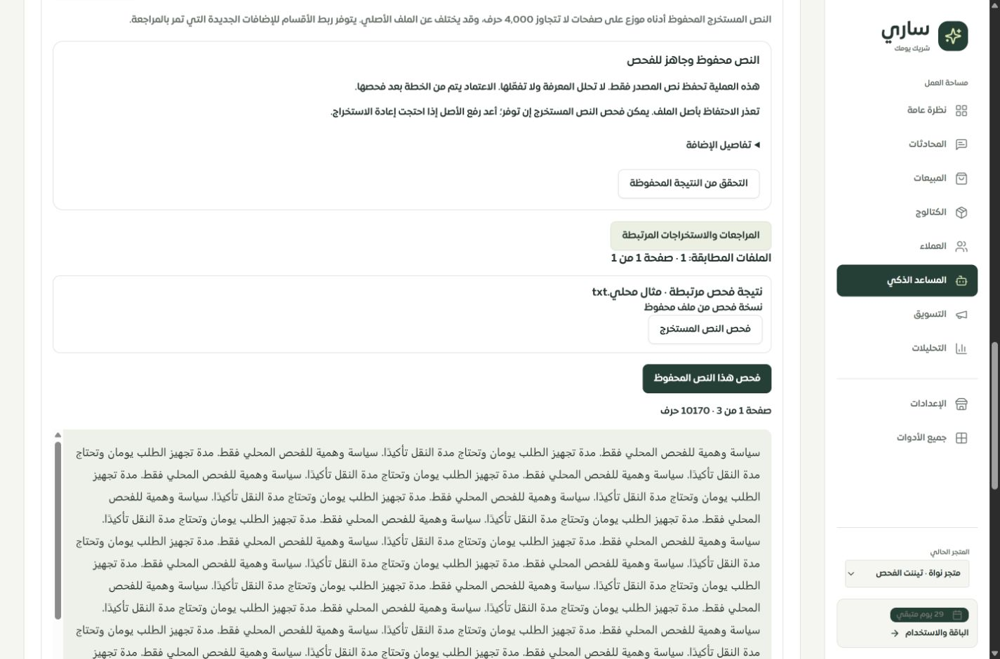

# ملفات المعرفة: استخراج كامل ثم مراجعة واعتماد — 29 سبتمبر 2026

أُصلح مسار PDF وDOCX وXLSX في التطبيق المحلي ووُحّد بين الإعدادات وعقل ساري، مع موك أب تفاعلي للحالات. هذا استكمال محدد لفحص لوحة التيننت، وليس إعلانًا باكتمال جميع صفحاتها أو نجاح Safari وiPhone الفعليين.

## المشكلات التي ثبتت والإصلاح

- كان الرفع يستبدل أحدث سجل مستند قديم، ويختصر النص عند 8000 حرف، ويخلط ملخص النموذج بالنص الأصلي، وقد يعرض نجاحًا رغم فشل إضافة المعرفة. أصبح كل رفع سجلًا مستقلًا: استخراج النص وحفظه أولًا، ثم فحصه عبر الخطة المحفوظة والموافقة عليها. لا يستدعي الرفع نموذجًا ولا يفعّل أقسام معرفة تلقائيًا.
- أُزيل نموذج الإعدادات القديم الذي كان يوحي باستبدال ملف واحد وحذفه، بينما الحذف في الخادم يحذف مجموعة الملفات. يستخدم الإعدادات الآن مكوّن الرفع نفسه، مع رابط للمكتبة؛ حذف المجموعة يبقى في إدارة المصادر مع بيان أثره.
- يقبل المسار حتى 5 ميجابايت، ويشترط أن يلائم النص الكامل حد 30000 حرف وسعة عمود TEXT بالبايت. يُرفض الزائد بدل اختصاره. يبقى الأصل السابق محفوظًا عند رفع ملف آخر أو إعادة استخراج نسخة جديدة.
- يحتفظ Excel باسم الورقة وعنوان كل خلية، بما فيها الأعمدة المتباعدة والقيم صفر/false والنص المنسق ونتائج المعادلات المحفوظة. لا ينفذ المعادلات ولا يستورد منتجات الكتالوج، ويرفض المعادلة التي لا تملك نتيجة محفوظة. لا يوجد OCR.
- أثبت اختبار PDF أن القارئ كان يعيد رقم الصفحة حتى للصفحات الفارغة؛ أُوقفت هذه الإضافة حتى يُعرض الفراغ الحقيقي. واكتشفت تجربة المتصفح تشوه اسم الملف العربي في ترويسة multipart؛ أصبح الاسم يُرسل كحقل UTF-8 مستقل ويُعقّم في الخادم.
- تعرض النتيجة بشكل منفصل نجاح استخراج النص، فشله، تجاوز الحد، غياب النص، تعذر الاحتفاظ بالأصل، والطلب غير المؤكد. لا تُساوى هذه الحالات بجاهزية الردود أو احتراف المبيعات.

## ربط المصدر والحفظ

للطلب UUID وبصمة للمدخل. إعادة الطلب نفسه تعيد سجله دون استخراج أو رفع ثانٍ، وتُرفض إعادة استخدامه لملف مختلف. يحتفظ المتصفح بالرقم بعد انقطاع الاتصال، وحتى إذا رُفضت محاولة لاحقة بسبب الحصة؛ يمكن قراءة النتيجة المحفوظة دون إعادة العمل. يبقى حد الرفع قبل تخصيص ذاكرة multipart، وتُحد إعادة الاستخراج بخمس عمليات في الساعة لكل تيننت دون منع قراءة طلب سابق.

تستخدم العمليات حجز التنفيذ والمهلة والتجديد والحماية من الكتابة المتأخرة الموجودة في مسار المعرفة. يُمنع حذف المصادر أثناء المعالجة؛ وبعد إغلاق طلب منقطع لا يستطيع قارئ قديم كتابة نتيجته. يسجل إنهاء الاستخراج نشاطًا واحدًا داخل معاملة إغلاق الطلب، مع وصف صريح أنه حفظ نص دون تفعيل المعرفة.

زر «فحص هذا النص المحفوظ» يفتح النص كاملًا كنسخة قابلة للتعديل. تُفحص ملكية المصدر وبصمته قبل النموذج وعند حفظ الفحص، ويُقفل سجل المصدر أثناء التحقق عند الحفظ والموافقة. تُحفظ الإضافة المعتمدة كسجل مرتبط بالأصل، مع خطتها وروابط أقسامها. تتيح المكتبة التنقل من الملف إلى المراجعات والاستخراجات المرتبطة، ومن نتيجة المراجعة إلى الأصل؛ القائمة مرقمة ولا تخفي ما بعد الصفحة الأولى. حذف مجموعة الملفات يمحو نسخ تقاريرها وبيانات الاستخراج وروابطها.

الملفات الجديدة مؤرشفة بمعرّف طلب، فتظل خارج مسارات حقن النص الخام القديم في الردود. لم نعدّل الملفات القديمة أو ندّعِ استعادة ما سبق اختصاره فيها. تُعرض ملاحظة عند مراجعة نص قديم، مع إعادة استخراج الأصل إن كان متاحًا. ربط ملف قديم بعملية جديدة يثبت هذه العملية فقط، ولا ينسب إليه أقسامًا قديمة بالتخمين.

المهاجرة `0157_knowledge_document_extraction.sql` تضيف نتيجة الاستخراج ومعرّف المصدر الاختياري وفهرسه وعلاقته. طُبقت في قاعدة الاختبار المحلية فقط. يلزم تنفيذ المهاجرة ضمن إجراء التحديث المعتاد قبل تشغيل النسخة الجديدة. تبويبات التطبيق القديمة تحتاج تحديث الصفحة لعقد الرفع الجديد.

## التحقق

| الفحص | النتيجة |
| --- | --- |
| مجموعة الرجوع للمعرفة والصلاحيات والمعاملات والواجهة والموك أب | 357 نجاحًا في 28 ملفًا |
| بوابة أمن الرفع بعد نقل التحقق إلى الخدمة | 6 نجاحات في ملف إضافي؛ المجموع 363 اختبارًا مختلفًا في 29 ملفًا |
| إعادة الاختبارات المتأثرة بعد استكمال قفل المصدر وسجل النشاط | 53 نجاحًا في 5 ملفات؛ ليست إضافية إلى المجموع |
| TypeScript | ناجح |
| تدقيق الترجمة | 8349 استدعاء و346 مفتاحًا ديناميكيًا، دون مفاتيح مفقودة أو أخطاء متغيرات |
| بناء العميل والخادم والعامل وميزانية الحزمة | ناجح؛ حزمة الدخول 334982 بايت، gzip ‏102486 بايت |

تغطي الاختبارات ملفات PDF وWord وExcel فعلية مولّدة محليًا، النص الطويل وحد البايت، الملفات التالفة، بصمات الملفات، عزل التيننت والصلاحيات، المصدر المتغير والمحذوف، الترقيم، إعادة المحاولة، فشل التخزين، المهلة والإغلاق والحذف، وعدم تحويل الاستخراج إلى تفعيل معرفة. اختبارات تنزيل إعادة الاستخراج تغطي الحجم والمهلة وتثبيت DNS ورفض عناوين الشبكة الخاصة والتحويل إليها. هذه فحوص أمنية محلية محددة، وليست اختبار اختراق شاملًا أو مراجعة مستقلة.

ظهر إخفاق أولي بسبب أرقام صفحات PDF الوهمية وأُصلح في التطبيق. وصُححت في الاختبارات طريقة محاكاة الاستعادة خارج سياق العامل، وفصل حالات حد التحليل الزمني، والتوقع الذي خلط حفظ مسودة الموك أب بتفعيل معرفة. أُعيدت الاختبارات ونجحت. بقي تحذير Vite المعروف عن بعض الحزم الكبيرة؛ ليس نجاح البناء قياس أداء كاملًا.

## تجربة المتصفح والموك أب

في «متجر نواة · تيننت الفحص» على `127.0.0.1:3018`:

- رُفع Word وهمي وحُفظت **10170 حرفًا** كاملة، بما فيها `END_MARKER` في النهاية. ظهر الاسم العربي صحيحًا بعد إصلاح الترميز.
- رُفض Word بطول 31000 حرف وPDF فارغ برسالتيهما المناسبتين، دون زر مراجعة لنص غير مستخرج.
- فُتح النص مجددًا من المكتبة، ثم نتيجة مراجعة مرتبطة، ثم الأصل. نتيجة المراجعة أُعدت برمجيًا ببيانات وهمية عبر دوال الحفظ الفعلية، لا بواسطة نموذج. أضيفت ملاحظة خاصة بالتاجر غير مفعلة في ردود العملاء.
- التخزين الخارجي محظور في خادم الاختبار؛ ظهرت رسالة غياب الأصل كما هو متوقع. نجاح التخزين وإعادة التنزيل اختُبرا بعقود مضبوطة، وليس بمخزن إنتاجي حي.
- فُحصت شاشة الإعدادات الموحدة. لا توجد معرفات حقول مكررة عند فتح مراجعة ملف بجانب نموذج إضافة النص العام.

في الموك أب على `127.0.0.1:4329`: إدارة المعرفة ← إدارة المصادر. أضيفت محاكاة استخراج PDF/Word/Excel، النجاح والفراغ وتجاوز الحد والفشل وغياب الأصل وانقطاع الاتصال والمعالجة، مع إعادة المحاولة بنفس الرقم ثم فتح مراجعة النسخة. الموك أب يوضح أنه لا يقرأ الملفات الثنائية فعليًا ولا يرسل طلبًا خارجيًا.

لم يظهر تجاوز أفقي في Chrome عند 1440 و768 و390 و320؛ قياسات المحتوى/المتاح: 1425/1425 و753/753 و375/375 و305/305. فُحص نموذج المراجعة في الموك أب عند 390 و320، وكانت مساحة النافذة ومحتواها متساوية. أعيد حجم المتصفح الطبيعي بعد الفحص.

الأدلة: [قياسات المتصفح](browser-checks.json)، [النص الكامل على الهاتف](live-review-390.jpg)، [المصدر 390](live-source-390.jpg)، [المصدر 320](live-source-320.jpg)، [رفض النص الزائد](live-too-large-390.jpg)، [الإعدادات](settings-390.jpg)، [موك أب 390](mock-review-390.jpg)، [موك أب 320](mock-review-320.jpg). لقطات الهاتف أجزاء من صفحات قابلة للتمرير.

## المتبقي والحدود

لا تزال قراءة OCR، الملفات الأكبر وتقسيمها، المعالجة في عامل دائم مع استكمال بعد إعادة التشغيل، استعادة مسودة النص عند مغادرة الصفحة، تتبع كل حقيقة إلى صفحة/خلية أصلية، والتحقق الحي من التخزين والمزوّد والفهرسة خارج هذا التسليم. استخراج PDF لا يضمن ترتيب قراءة صحيحًا لكل تخطيط معقد؛ مراجعة النص تظل مطلوبة. إعادة الاستخراج تتطلب أن يكون الأصل القديم ما زال متاحًا.

مسارات استيراد الكتالوج وتحليل الموقع والتكاملات والتعليم من المحادثات لم تُحوّل كلها إلى هذه الرحلة. تبقى مطابقة بقية المصادر وتحرير بنود الخطة والتراجع عنها وقياس المبيعات الفعلي ضمن [سجل المتبقي](../tenant-testing-workspace-2026-09-28/REMAINING.md). لم تتغير أرقام تغطية الصفحات الـ126، ولم تُعلن صفحة عقل ساري مكتملة.

Safari وiPhone الفعليان ولوحة مفاتيح iOS واللمس ما زالت غير مختبرة. التغييرات محلية على `main`؛ لم يُنفذ push أو نشر إنتاجي في هذه الجولة.
