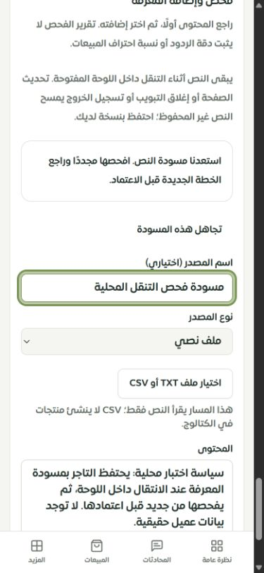
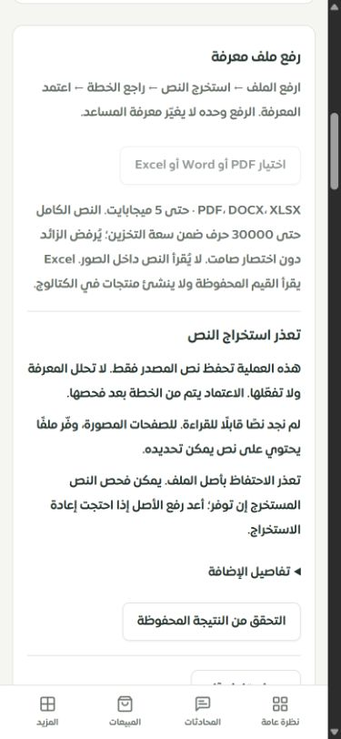
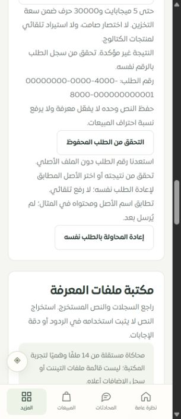

# متابعة لوحة التيننت: مسودات المعرفة واستعادة الطلبات

التاريخ: 2026-09-29. النطاق: فحص وإضافة النص، مراجعة نص ملف محفوظ، رفع PDF/DOCX/XLSX وإعادة استخراج الأصل، والتنقل وتسجيل الخروج والموك أب المرتبط. هذه دفعة محددة من السجل الشامل، وليست إغلاقًا لكل صفحات اللوحة.

## المشكلات والإصلاح

| الحالة السابقة | السلوك الجديد |
| --- | --- |
| مغادرة صفحة المعرفة تمسح النص والتعديلات على نسخة المصدر. | تستعاد المسودة عند الرجوع داخل عمر الصفحة المفتوحة، بمفتاح منفصل للحساب والمتجر ونوع النموذج والمصدر. |
| إعادة فتح النموذج قد تشجع الاعتماد على فحص سابق. | يستعاد النص فقط؛ لا يستعاد تقرير الفحص أو الموافقة. يلزم فحص جديد ومراجعة الخطة. تبقى بصمة المصدر القديمة في المسودة حتى يرفض الخادم مراجعة مصدر تغيّر بدل نسب التعديل إلى نسخة جديدة. |
| تحديث الصفحة يفقد رقم الطلب عند انقطاع الرد. | يحفظ الرقم قبل الإرسال، ويظهر بعد العودة مع إجراء قراءة النتيجة نفسها. لا يرسل الرجوع أو التحديث طلب إضافة تلقائيًا. |
| لا يبقى الملف محددًا بعد التحديث، وقد لا يكون الرفع وصل إلى الخادم. | يمكن إعادة اختيار الأصل إذا كان مرجعه يحتوي على بصمة الملف. يجب تطابق الاسم والبايتات الكاملة قبل إتاحة إعادة إرسال صريحة بالرقم نفسه. الملف المختلف يُرفض محليًا. المراجع الأقدم دون بصمة تتيح قراءة النتيجة فقط. |
| زر التحقق قد يستخدم نتيجة مخزنة لمدة الاستعلام الافتراضية. | قراءة النتيجة تستخدم `staleTime: 0` للحصول على الحالة من الخادم. |
| تعذر تخزين الهوية أو تبدّل الحساب قد يترك محاولة غير قابلة للتتبع. | عند تعذر حفظ المرجع يُمنع الإرسال؛ الهوية تأتي من API، وتزال المسودات والمراجع عند تسجيل الخروج وانتهاء الجلسة. يمنع رقم جيل الذاكرة الاستجابات المتأخرة من إعادة كتابة ذاكرة أُفرغت. |
| الرفض المعروف ثم التنقل قد يترك نموذجًا عالقًا على رقم بلا طلب. | يزال مرجع المحاولة المرفوضة قبل الإرسال الفعلي؛ تبقى مسودة النص متاحة للفحص مجددًا. أما الطلب غير المحسوم فيحتفظ برقمه. |

## التخزين وتجربة الاستخدام

- نصوص النشاط وأسماء الملفات والموافقة والتقارير لا تدخل التخزين الدائم للمتصفح. المسودة النصية في الذاكرة فقط. `sessionStorage` يحتفظ برقم UUID وبصمة SHA-256 غير نصية للملف عند الرفع.
- البصمة تشمل طول اسم الملف واسمه الكامل والبايتات كلها؛ لا تعتمد على الاسم والحجم وحدهما. لا يغيّر اختيار الأصل رقم الطلب، ولا يرسل الملف تلقائيًا.
- يظهر تنبيه مفهوم بحدود المسودة: التنقل داخل اللوحة يحتفظ بالنص؛ تحديث الصفحة وإغلاق التبويب والخروج يفقد النص غير المحفوظ. يوجد إجراء لتجاهل المسودة وتحذير خروج عند وجود نص فعلي. لا يظهر تحذير فقد نص لمسودة فارغة تحمل رقم طلب فقط.
- الموك أب يحتوي على استئناف المسودة دون موافقة قديمة، وتجاهلها، ومحاكاة العودة بعد تحديث الصفحة، واختيار الأصل المطابق ثم إعادة نفس المرجع. يوضح الفرق بين حفظ أمثلة الموك أب محليًا وحفظ النصوص في التطبيق الفعلي.
- لا تغييرات على صلاحيات الخادم أو تفعيل المعرفة أو احتساب صحة المعرفة/احتراف المبيعات. هذه الدفعة لا تحتاج ترحيل قاعدة بيانات جديدًا.

## التحقق

**219 اختبارًا مختلفًا في 13 ملفًا نجحت.** شغلت المجموعة بـ218 حالة، ثم أضيف اختبار المسودة الفارغة وأعيد ملف واجهة الإدخال كاملًا بـ24 حالة. العدد لا يجمع إعادة تشغيل الحالة نفسها مرتين.

المجموعة تغطي واجهات النص والملفات، عزل المستخدم والمتجر والمصدر، فقد الرد، القراءة دون إرسال، رفض ملف مختلف، تعذر التخزين، تنظيف الخروج، الصلاحيات، حدود الرفع، مكتبة الملفات، روابط الأقسام، الاستعادة، الموك أب، وعدم تأثر ذاكرة إعدادات المساعد. فحوص الأمان محلية ومحددة بهذه المسارات؛ ليست اختبار اختراق شاملًا للإنتاج.

- `tsc --noEmit`: نجح في الفحص النهائي. أظهر فحص سابق خطأين في `server/ai/coaching-store.ts` من تعديل متزامن خارج هذه الدفعة؛ زالا في آخر فحص دون تعديل الملف ضمن هذا العمل.
- الترجمة: 8366 استدعاء، و346 مفتاحًا ديناميكيًا؛ لا مفاتيح ناقصة أو أخطاء متغيرات.
- بناء العميل والخادم والعامل وفحص حجم الحزمة: نجح. تحذير Vite عن بعض الحزم الأكبر من 600 كيلوبايت ما زال موجودًا.
- بيئة المتصفح: Chrome، التطبيق المحلي على 3018، والموك أب على 4329، وتيننت «متجر نواة · تيننت الفحص». لا بيانات عملاء حقيقية أو طلبات لنموذج خارجي.
- فُحص التنقل بين تبويبات عقل ساري ثم إلى سلوك المساعد والرجوع؛ عاد النص نفسه مع رسالة استعادة وحاجة لفحص جديد.
- فُحص رفع PDF تجريبي فارغ ثم تحديث الصفحة وقراءة النتيجة بالمرجع `3479f619-c88f-40da-a598-3279ab9ba743`. عادت نتيجة عدم وجود نص، ولم تُعرض معرفة مفعلة أو نجاح استخراج وهمي.
- لم يظهر تجاوز عرض في فحص المسودة عند 390 و320، ولا في الموك أب عند 320. القياسات والنصوص الملاحظة في [browser-checks.json](browser-checks.json).

السجلات المحلية: `.tmp/tenant-ux/draft-complete-tests.log`، `draft-empty-final.log`، `draft-complete-types.log`، `draft-complete-translations.log`، وسجل البناء النهائي المرفق في `validation.json`.

## الأدلة المرئية

## ما بقي مفتوحًا

- حفظ المسودة النصية على الخادم واستعادتها بعد إغلاق الصفحة غير منفذ؛ الحفظ الحالي أثناء التنقل فقط. تحذير المغادرة لا يضمن الحماية عند إغلاق نظام الهاتف للعملية.
- اختبار مطابقة الأصل الحقيقي بعد التحديث مغطى آليًا وفي الموك أب. محاولة رفع إضافية في المتصفح رفضها الخادم قبل إكمال رحلة البصمة؛ لم تُوثق علة الرفض، ولم تُتجاوز الحماية. لذلك لا يُنسب لهذه الجولة تحقق حي كامل من إعادة اختيار الأصل وإعادة إرساله.
- Safari وiPhone الحقيقيان غير مختبرين، ولا يُعد تغيير عرض Chrome بديلًا عنهما.
- لا نشر للإنتاج ولا `DEPLOY_OK`. بقي سجل تغطية 126 مسارًا دون تغيير؛ OCR والمهام الدائمة وبقية تدفقات النظام والمزود والتخزين الحي والتقييم الحقيقي للمبيعات ما زالت ضمن المتبقي.
