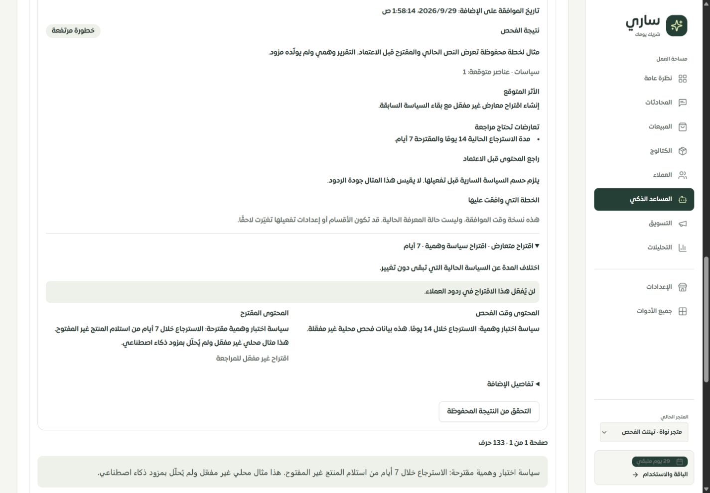

# تقرير خطة تغييرات المعرفة قبل الموافقة

التاريخ: 2026-09-29. النطاق: نموذج فحص وإضافة المعرفة في عقل ساري، نتيجة الإضافة ومكتبة الملفات، والموك أب المقابل. متابعة [جولة التقرير المحفوظ](../tenant-knowledge-reviews-2026-09-29/REPORT.md).

## النتيجة

كان التاجر يوافق على تقرير وصفي، ثم يعيد محرك الإضافة تصنيف النص وتوليد تغييرات الأقسام بعد الموافقة. أصبحت رحلة الفحص هذه تُعد **خطة محفوظة بالمحتوى الفعلي**، تعرضها قبل الموافقة، ثم تنفّذ الخطة نفسها دون توليد نصوص أخرى عند الإضافة.

تُقرأ أقسام التيننت واسم النشاط قبل إعداد الخطة، وتُحسب بصمة لهذه النسخة. يُرفض حفظ الخطة إذا تغيرت النسخة أثناء استدعاء النموذج، وتُفحص البصمة مجددًا تحت أقفال قاعدة البيانات عند الإضافة. تغيّر قسم أو حالته أو حذفه أو إضافته، أو تغيّر اسم النشاط، يستلزم فحصًا جديدًا مع بقاء نص التاجر. كتابة الفهرسة وحدها لا تُبطل الخطة.

## السلوك المنفذ

- تعرض الخطة كل إضافة أو تحديث أو اقتراح متعارض أو بند دون تغيير، مع المحتوى الحالي والمقترح وسبب التغيير وحالة التفعيل. يمكن فتح تفاصيل البنود؛ الأول مفتوح افتراضيًا.
- التحديث يستبدل المحتوى والملخص بالقيم الموافق عليها، ويحافظ على عنوان القسم ونوعه وحالة تفعيله. يُسند المحتوى إلى مصدر الإضافة الجديدة مع مرجع الطلب والملف والتقرير؛ لا تُستبقى فهرسة النص السابق.
- القسم الذي عدله التاجر لا تقبل الخطة الكتابة فوقه. الاقتراح المتعارض يُنشأ غير مفعّل ويترك السابق كما هو. الأبناء تحت اقتراح متعارض يبقون غير مفعّلين كذلك. الفرص مخصصة للتاجر ولا تُستخدم في ردود العملاء.
- لا تُنشأ إرشادات مبيعات أو فرص خارج الخطة. أي إضافة من هذا النوع يجب أن تكون ضمن البنود المعروضة والموافق عليها.
- إنشاء الأرشيف والسجل، استهلاك التقرير، تطبيق جميع البنود، سجل تغييراتها وإبطال الكاش تحدث في معاملة واحدة. فشل إحدى الكتابات يعيدها كلها، ولا يستهلك التقرير.
- إعادة رقم الطلب نفسه تعيد النتيجة السابقة دون تطبيق الخطة مرة أخرى. الفهرسة لاحقة ومنفصلة عن حفظ النصوص؛ فشلها لا يُعرض كنجاح في جاهزية البحث. تبقى أعداد تغييرات الخطة المحفوظة عند إغلاق عملية منقطعة.
- تعرض المكتبة «الخطة التي وافقت عليها» بوصفها نسخة وقت الموافقة؛ لا تدّعي أنها حالة المعرفة اليوم. السجلات الأقدم تبقى قابلة للقراءة مع توضيح غياب الخطة.
- خُففت الهوامش والإطارات المتداخلة في سجل الملف والنتيجة على الهاتف، مع الإبقاء على مقارنة بعمودين على سطح المكتب وعمود واحد على الهاتف.

## التحقق

| الفحص | النتيجة |
| --- | --- |
| انحدار المعرفة والعقود والصلاحيات والمكتبة والاستعادة والخطة والموك أب | **297 اختبارًا ناجحًا في 22 ملفًا** |
| إعادة مجموعة الواجهة والمكتبة والموك أب بعد آخر تحسينات العرض | **48 اختبارًا ناجحًا في 4 ملفات**؛ جزء من العدد السابق |
| TypeScript النهائي | ناجح |
| تدقيق الترجمة | 8266 استدعاء، 346 مفتاحًا ديناميكيًا، دون مفاتيح مفقودة أو أخطاء متغيرات |
| بناء العميل والخادم والعامل وميزانية الحزمة | ناجح؛ حزمة الدخول 334982 بايت، gzip ‏102496 بايت |
| المهاجرة 0155 | طُبقت على قاعدة الاختبار المحلية فقط |

ملف الاختبار الجديد `server/knowledge-intake-plans.mysql.test.ts` يختبر النص الموافق عليه، ترتيب الأبناء، التحديث والتعارض وعدم التغيير، عزل التيننت، التغيّر أثناء إعداد الخطة أو قبل الإضافة، منع استهداف قسم محمي أو أجنبي أو تكرار تحديثه، الفشل بعد تطبيق البنود داخل المعاملة، وعدم إبطال الخطة بسبب فهرسة فقط. شملت الجولة بقية ملفات الانحدار الـ21 الواردة في التقرير السابق، مع توسيع عقود API والواجهة والموك أب.

بقي تحذير Vite عن حزمة كبيرة. نجاح البناء ليس قياس أداء كاملًا، واختبارات الحماية المحددة هنا ليست اختبار اختراق شاملًا للنظام.

## الفحص البصري والمحلي

شُغّل التطبيق على `127.0.0.1:3018` والموك أب على `127.0.0.1:4329`. أُنشئ مثال وهمي داخل «متجر نواة · تيننت الفحص» عبر دوال الخطة والحجز والحفظ الحقيقية؛ القسم السابق والاقتراح المعارض غير مفعّلين. لم يُستدعَ نموذج أو تُرسل رسائل للعملاء. مصدر التقرير الوهمي واضح في الشاشة.

في Chrome على Windows، لم تتجاوز الصفحة عرضها عند 320 و390 و1440 بكسل: القياسات 305/305 و375/375 و1425/1425 للمحتوى والمساحة المتاحة، بعد استثناء شريط التمرير. في الموك أب فُحص تغيّر المعرفة: بقي النص، تعطلت الإضافة، ثم أعيد الفحص والموافقة والحفظ وقراءة الخطة بعد إعادة تحميل الصفحة. لم تتجاوز نافذته محتواها بعرضي 390 و320. أُعيد حجم المتصفح الطبيعي بعد الفحص.

الأدلة: [قياسات المتصفح](browser-checks.json)، [التطبيق 390](live-390.png)، [التطبيق 320](live-320.png)، [تغيّر المعرفة في الموك أب](mock-stale-390.png)، [الخطة المحفوظة في الموك أب](mock-saved-320.png). صور الهاتف أجزاء من محتوى قابل للتمرير.

## الحدود المهمة

1. الخطة والبصمة تخصان **أقسام المعرفة واسم النشاط** لهذا المسار. لا تشملان حالة الكتالوج أو FAQ المستقل أو الملفات الخام أو كل إعدادات المساعد. لا يثبت هذا الفحص اكتشاف كل تعارض بين جميع مصادر النظام.
2. لم تُقَس جودة الخطة المولدة بمزود حقيقي. أمثلة الردود والتوصية ليست درجة دقة أو نسبة احتراف مبيعات. التحقق يثبت حفظ الخطة المعروضة وتطبيقها، وليس صحة حقائقها.
3. سياق الأقسام محدود بـ120000 حرف ويُرفض تجاوزه بدل إسقاط أجزاء بصمت. الخطة حتى 60 بندًا و300000 حرف عند تسلسلها، والنص لكل قسم حتى 30000 حرف مع تحقق سعة التخزين. الحجم الزائد يعرض رسالة واضحة؛ دعم المعرفة الأكبر يحتاج تقسيم مراجعات مدروسًا.
4. الموافقة على الخطة كاملة. اختيار بعض البنود أو تحرير المقترح داخل الخطة، والتراجع المنظم عن تطبيقها، وعلاقات المصدر المتعددة ما زالت تحتاج تصميمًا مستقلًا. مرجع المصدر الحالي لا يمثل تاريخ نسب كاملًا لكل معلومة.
5. محرك الإدخال القديم يبقى مستخدمًا في المسارات الأخرى؛ لم يُنقل رفع كل أنواع الملفات أو تحليل المواقع أو التكاملات إلى هذه الخطة. في الموك أب تبقى رحلة النص الحر محاكاة يدوية منفصلة، ونموذج المكتبة يعرض مثالًا لسجل قديم. لا تعني محاكاة نتيجة فيه تنفيذ خادم أو تفعيل معرفة حقيقية.
6. أحجام Chrome ليست اختبار Safari أو iPhone فعليًا. لوحة مفاتيح iOS واللمس وWebKit الفعلي ما زالت غير مختبرة.
7. لم تتغير أرقام تغطية الصفحات الـ126، ولا تزال حالة عقل ساري «تفصيلي جزئي» في [سجل الاستكمال](../tenant-testing-workspace-2026-09-28/REMAINING.md).

## التشغيل

تحتاج النسخة الجديدة `0155_knowledge_intake_plans.sql` بعد المهاجرات السابقة. التقارير غير المستهلكة الأقدم دون خطة لا تصلح لإضافة جديدة؛ يعيد التاجر الفحص. سجلات الإضافات القديمة تبقى قابلة للقراءة. يلزم تحديث العملاء المفتوحين عند ترقية الخادم.

العمل محلي، دون push أو نشر إنتاجي. لم تُضمّن التغييرات المستقلة الموجودة في المشروع ضمن هذه الدفعة.
