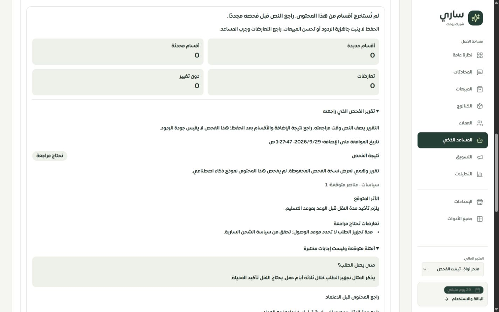

# تقرير ربط إضافة المعرفة بالفحص والموافقة

التاريخ: 2026-09-29. النطاق: نموذج فحص وإضافة المعرفة في عقل ساري، وسجل النتيجة داخل مكتبة الملفات، والموك أب المقابل. هذه جولة استكمال محددة؛ لا تعني اكتمال مراجعة كل صفحات لوحة التيننت.

## المشكلة والإصلاح

كانت الموافقة على تقرير الفحص محصورة في الواجهة؛ يقبل مسار الإضافة في الخادم نصًا دون مرجع لتقرير محفوظ. وبعد مغادرة الصفحة لا يمكن معرفة التقرير الذي شاهده التاجر قبل الإضافة.

أصبح الخادم يحفظ تقرير الفحص أولًا، ويربطه بالتيننت وبصمة النص واسم المصدر ونوعه. لا يقبل مسار الإضافة طلبًا جديدًا دون هذا المرجع وموافقة صريحة. صلاحية التقرير 30 دقيقة، ويُستهلك مرة واحدة داخل معاملة الحجز نفسها. تعديل النص أو الاسم أو النوع يتطلب فحصًا جديدًا. يحفظ سجل الإضافة نسخة التقرير ووقت الموافقة؛ تُعرض النسخة مجددًا من سجل الملف دون تشغيل تحليل آخر.

إذا انتهت الصلاحية تبقى المسودة، وتظهر دعوة واضحة لإعادة الفحص وتجديد الموافقة. عند إعادة إرسال رقم الطلب نفسه يعاد السجل المحفوظ؛ لا تُنشأ إضافة أخرى، حتى بعد استهلاك التقرير. استخدام رقم الطلب نفسه مع مرجع مختلف يُرفض. عند فشل معاملة الحجز لا يُستهلك التقرير.

## الواجهة والموك أب

- عارض واحد للتقرير قبل الموافقة وبعد الحفظ: الملخص، النوع، عدد العناصر المتوقع، مستوى المخاطر، الأثر، التعارضات، أمثلة الأسئلة والإجابات، والتوصية وسببها.
- التقرير المحفوظ مطوي افتراضيًا، ويمكن فتحه داخل نتيجة الإضافة. خُففت الإطارات والمسافات المتداخلة على الهاتف.
- توضّح الواجهة أن التقرير يصف النص وقت المراجعة، وأن أمثلة الإجابات ليست اختبار جودة فعليًا. السجل القديم يعرض عدم توفر تقرير بدل اختلاق نتيجة.
- أضيف للموك أب اشتراط فحص المثال قبل الحفظ، ومحاكاة انتهاء صلاحيته مع حفظ النص، وتقرير محفوظ قابل للفتح. يُلتقط محتوى التقرير قبل الكتابة المؤجلة كي لا تغيّره حركة المستخدم أثناء المصالحة.
- رحلة النص الحر اليدوية في الموك أب ما زالت محاكاة محلية منفصلة ومعلّمة بذلك؛ ليست بديلًا عن تقرير الخادم المطلوب في التطبيق.

## حماية البيانات

اختبارات MySQL تتحقق من منع استخدام تقرير تيننت آخر، أو تقرير منتهي، أو بصمة مختلفة، أو تقرير مستهلك بطلب جديد. حجزان متزامنان بمرجع واحد ينتجان حجزًا واحدًا فقط. كل ذلك يسبق الأرشفة أو استدعاء مزود الإضافة.

حذف مجموعة ملفات المعرفة أو إعادة ضبط المعرفة يمسح نص التقرير المحفوظ والتقارير غير المستهلكة للتيننت ضمن المعاملة نفسها. تبقى هوية الطلب والبصمة ومرجع التقرير كأثر لمنع إعادة إنشاء طلب محذوف. لا يتأثر تيننت آخر. تُعرض النصوص المولدة كنص React؛ اختبار الواجهة يتحقق من عدم تنفيذ HTML ضمنها.

التقارير المنتهية غير المستهلكة تُحذف عند حفظ فحص جديد للتيننت نفسه، أو حذف مجموعة ملفاته. انتهاء الصلاحية يمنع استخدامها فورًا؛ لا توجد مهمة جديدة تحذفها ماديًا عند الدقيقة الثلاثين.

## التحقق المنفذ

| الفحص | النتيجة |
| --- | --- |
| اختبارات المعرفة والعزل والمكتبة والاستعادة والعقود والواجهة والموك أب | **279 اختبارًا ناجحًا في 21 ملفًا** |
| إعادة اختبارات الواجهة والاستعادة والموك أب بعد آخر تحسينات العرض | **38 اختبارًا ناجحًا في 3 ملفات**؛ مجموعة فرعية وليست 38 حالة إضافية |
| فحص TypeScript دون إخراج | ناجح |
| تدقيق الترجمة النهائي | 8248 استدعاء، 346 مفتاحًا ديناميكيًا؛ لا مفاتيح مفقودة أو أخطاء متغيرات أو استدعاءات ديناميكية غير محسومة |
| بناء واجهة العميل والخادم والعامل وميزانية الحزمة | ناجح؛ حزمة الدخول 334982 بايت، gzip ‏102497 بايت |
| تحذير البناء | بقي تحذير Vite لحزمة كبيرة؛ لا يُعد نجاح البناء اختبار أداء لكل صفحة |
| المهاجرة 0154 | طُبقت بنجاح على قاعدة الاختبار المحلية |

تشمل الحالات الجديدة: غياب الموافقة أو المرجع، فشل حفظ التقرير، تغيّر النص والاسم والنوع، انتهاء الصلاحية، العزل بين التيننتات، تزامن الاستهلاك، تراجع المعاملة، إعادة قراءة النسخة، مسح التقرير مع الملفات، ورسالة السجل القديم.

اختبارات الانحدار شملت الملفات التالية تحت `server/`:

```text
knowledge-intake-contract.test.ts
knowledge-recovery-ui.test.ts
knowledge/intake-execution.test.ts
knowledge-intake-ui.test.ts
knowledge-library-ui.test.ts
knowledge-access.test.ts
knowledge-library-access.test.ts
merchant-brain-knowledge-prototype.test.ts
knowledge/transaction.test.ts
knowledge/upload-access.test.ts
knowledge/reprocess.test.ts
knowledge/embedding-readiness.test.ts
knowledge/website-analysis-status.test.ts
merchant-knowledge-preview.test.ts
knowledge-intake-recovery.mysql.test.ts
knowledge-intake-receipts.mysql.test.ts
knowledge-intake-reviews.mysql.test.ts
knowledge-library.mysql.test.ts
knowledge-intake.mysql.test.ts
knowledge/lifecycle.mysql.test.ts
knowledge/sales-knowledge.mysql.test.ts
```

## التحقق البصري

فُحص التطبيق المحلي على `127.0.0.1:3018` والموك أب على `127.0.0.1:4329` باستخدام Chrome على Windows. بيانات التقرير المعروض وهمية ومعلّمة بذلك، أُنشئت عبر دوال الحفظ والحجز والنتيجة الفعلية محليًا دون استدعاء نموذج ذكاء اصطناعي. لم تُنشأ منها أقسام معرفة أو تُرسل رسائل للعملاء.

| الشاشة | عرض المحاكاة | عرض الصفحة / المحتوى | النتيجة |
| --- | ---: | ---: | --- |
| تقرير الملف في التطبيق | 320 | 305 / 305 | لا تجاوز أفقي للصفحة |
| تقرير الملف في التطبيق | 390 | 375 / 375 | لا تجاوز أفقي للصفحة |
| تقرير الملف في التطبيق | 1440 | 1425 / 1425 | لا تجاوز أفقي للصفحة |
| انتهاء صلاحية المثال في الموك أب | 390 | 375 / 375 | النص محفوظ والحفظ معطّل؛ عرض النافذة ومحتواها 341 / 341 |
| التقرير المحفوظ في الموك أب | 320 | 305 / 305 | أُعيد الفحص والموافقة والحفظ؛ عرض النافذة ومحتواها 271 / 271 |

القياسات في [browser-checks.json](browser-checks.json). فرق 15 بكسل سببه شريط التمرير. أُعيد عرض المتصفح الطبيعي بعد الفحص.



صور الهاتف: [التطبيق بعرض 390](live-390.png)، [التطبيق بعرض 320](live-320.png)، [انتهاء الفحص في الموك أب](mock-expired-390.png)، [نافذة الموك أب بعرض 320](mock-saved-320.png). الصور الأخيرة تعرض جزءًا من نافذة قابلة للتمرير؛ ليست لقطات لكل محتواها.

## الحدود والمتبقي

1. المحفوظ هو **تقرير الفحص الأولي**، وليس خطة ثابتة لتغييرات الأقسام. محرك الإضافة لا يزال يصنّف ويطوّر المعرفة لاحقًا؛ لم تُثبّت نسخة قاعدة المعرفة المستخدمة وقت الفحص، ولم يُضف تحقق اختلافها قبل التنفيذ. يلزم ربط خطة التنفيذ ومصادرها وإصداراتها في عمل مستقل.
2. الفحص الحالي لا يقرأ كل معرفة التيننت؛ يستخدم السياق المحدود الموجود في المسار. لم تُقَس دقة تحليله أو جودة الردود بمزود حقيقي، ولم تُحسب نسبة احتراف المبيعات من هذه الجولة.
3. الربط الجديد يخص نموذج فحص وإضافة المعرفة هذا. بقية مسارات الاستيراد والرفع والتحليل، وعلاقات الأقسام بالملفات المشتركة، والمهام الدائمة ما زالت تحتاج مراجعة مستقلة.
4. فحص الأحجام على Chrome لا يثبت عمل Safari أو iPhone الحقيقي، أو لوحة المفاتيح واللمس فيهما. هذا البند مفتوح.
5. اختبارات الحماية هنا محددة لهذا المسار، ولا تمثل اختبار اختراق شامل للنظام. سجل الصفحات الـ126 وأعمال المطابقة المتبقية موجود في [سجل الاستكمال](../tenant-testing-workspace-2026-09-28/REMAINING.md)، ولم تُرفع أرقام اكتماله بسبب هذه الجولة.

## التشغيل

المهاجرة الجديدة `0154_knowledge_intake_reviews.sql` مطلوبة قبل تشغيل الشيفرة الجديدة على قاعدة أخرى. تبقى السجلات القديمة قابلة للقراءة، دون تقرير سابق. ينبغي تحديث العملاء المفتوحين وإعادة فحص النص قبل الإضافة لأن مرجع الفحص والموافقة أصبحا مطلوبين.

التحقق محلي، ولم يُنفذ push أو نشر إنتاجي في هذه الجولة. لا تعني اختبارات البناء أن النسخة تعمل على الموقع العام.
