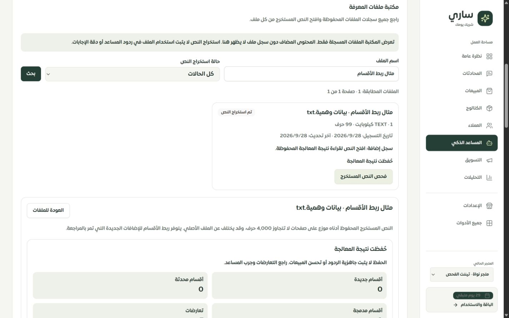

# تقرير ربط ملفات المعرفة بالأقسام وقراءة أثرها

التاريخ: 2026-09-29. النطاق: مكتبة ملفات عقل ساري، مسار فحص وإضافة المعرفة، الموك أب، وتواريخ المعرفة. متابعة [الخطة المحفوظة](../tenant-knowledge-plans-2026-09-29/REPORT.md).

## ما أُصلح

كان سجل الإضافة يحتفظ بالخطة التي وافق عليها التاجر، لكن معرّفات الأقسام الجديدة لم تُحفظ في الخطة. كما أن تحديث قسم من ملف لاحق يستبدل مرجع مصدره الحالي، ولا تُسجل البنود التي بقيت دون تغيير في سجل التغييرات. لذلك لم يكن بالإمكان الاعتماد على هذه الحقول لإظهار أثر كل ملف بعد تعديلات لاحقة.

أصبحت الإضافات الجديدة في هذا المسار تحفظ روابط ثابتة بين كل بند في الخطة والقسم الذي نتج عنه أو بقي دون تغيير. تُحفظ الروابط في سجل الإضافة نفسه مع بصمتين للمحتوى والإعدادات، داخل معاملة إنشاء الأرشيف وتطبيق الخطة. لا تُختلق روابط بأثر رجعي من تشابه العناوين أو النصوص.

تتيح شاشة «الأقسام المرتبطة بهذه الإضافة» ما يلي:

- معرفة ما إذا كان القسم أُضيف أو حُدّث أو حُفظ كاقتراح متعارض مستقل أو بقي دون تغيير. رابط التعارض يشير إلى الاقتراح الجديد، وليس القسم الأصلي.
- عرض النص والعنوان والملخص وقت الإضافة مقابل النسخة الحالية، مع تمييز تغيّر المحتوى عن تغيّر إعدادات الاستخدام.
- قراءة حالة المراجعة، السماح بالرد، طريقة استخدام المعرفة، القسم الأم وانتهاء الصلاحية. هذه إعدادات مسجلة؛ لا تثبت استخدام المعلومة في رد فعلي أو جاهزية فهرستها.
- الاحتفاظ بإمكانية قراءة النص المحفوظ إذا لم يعد القسم الحالي متاحًا، وبقاء روابط الملف الأول بعد تحديث القسم من ملف ثانٍ.
- عرض خمسة بنود في الصفحة، وتفاصيل مطوية لتخفيف طول القراءة على الهاتف، مع نقل التركيز إلى العنوان بعد التنقل بين الصفحات.
- تمييز السجل القديم الذي لا يملك ربطًا موثوقًا عن الخطة الجديدة الخالية من البنود، وفصل فشل القراءة والتحميل عن النتيجة الفارغة.

أُضيفت الحالات نفسها إلى مكتبة الموك أب ببيانات وهمية: نص مطابق، نص متغير، إعدادات متغيرة، قسم غير متاح، تاريخ ربط غير متوفر، خطة بلا أقسام، تحميل وفشل قراءة. لا يجري الموك أب طلبات لمزود خارجي ولا ينشئ سجلات تيننت حقيقية.

كشف الفحص البصري كذلك أن بعض تواريخ المعرفة قرب منتصف الليل تظهر بيوم سابق: كانت سلاسل قاعدة البيانات UTC تُقرأ كتوقيت المتصفح المحلي. أُعيد استخدام محلل تواريخ التاجر المشترك في المكتبة ونتيجة الموافقة ومجموعات المصادر وسجل المعرفة وإعدادات انتهاء الصلاحية. تأكد ظهور 29 سبتمبر في المثال الذي سُجل مساء 28 سبتمبر UTC، مع اختبار انتقال اليوم في الرياض.

## الحفظ والصلاحيات

- المهاجرة `0156_knowledge_section_links.sql` تضيف عمود JSON اختياريًا لسجل الإضافة؛ لا تغيّر السجلات القديمة أو تعيد بناء نسبها.
- بصمة المحتوى تشمل النوع والعنوان والنص والملخص. بصمة الإعدادات تشمل القسم الأم وحالة المراجعة والسماح بالرد وطريقة الاستخدام والصلاحية. تُقرأ القيم الفعلية بعد الكتابة، بما فيها معرّفات الآباء والقيم القديمة الفارغة. تغيير الفهرسة أو المصدر أو الثقة أو التوقيت وحده لا يُعدّ تغيّرًا في النص والإعدادات.
- قراءة الروابط محمية بصلاحية `bot_settings.manage`. تُحل هوية التيننت من العضوية، ويُقيد بها الملف والسجل وكل قسم حالي، حتى لو احتوى سجل تالف على معرّف قسم لتيننت آخر.
- يستبعد مسار قائمة الملفات النصوص والخطط والروابط التفصيلية. قراءة المقارنة محدودة بخمسة أقسام لكل صفحة، ضمن حد الخطة البالغ 60 بندًا.
- تُقرأ وثيقة الربط والخطة والأقسام من لقطة قاعدة بيانات واحدة. أصبحت قراءة نص الملف ونتيجة إضافته أيضًا داخل معاملة قراءة واحدة.
- إعادة رقم الطلب نفسه لا تستبدل روابطه القديمة. حذف مجموعة الملفات يمحو نسخة التقرير وروابطها ويمنع قراءة الملف المحذوف؛ إزالة قسم فقط تترك نصه المؤرشف قابلًا للقراءة من الملف الباقي.

## نتائج التحقق

| الفحص | النتيجة |
| --- | --- |
| اختبارات الرجوع النهائية للمعرفة والتواريخ والصلاحيات والواجهة والموك أب | **322 اختبارًا ناجحًا في 25 ملفًا** |
| TypeScript بعد آخر التعديلات | ناجح |
| تدقيق الترجمة | 8313 استدعاء، 346 مفتاحًا ديناميكيًا؛ لا مفاتيح مفقودة أو أخطاء متغيرات |
| بناء العميل والخادم والعامل وميزانية الحزمة | ناجح؛ حزمة الدخول 334982 بايت، gzip ‏102494 بايت |
| تطبيق المهاجرة 0156 | قاعدة `sari_pages_test` المحلية فقط |

الاختبارات الجديدة في `server/knowledge-section-links.mysql.test.ts` تغطي تعدد الملفات، التعارض وعدم التغيير والأبناء، التعديل والحذف، استبعاد تغيّر الفهرسة، الترقيم، السجلات القديمة والناقصة، عزل التيننت وحذف المصدر. اختبارات الواجهة تتحقق من فصل الحالات، إخفاء النص المخزن مؤقتًا عند فشل القراءة، عرض المحتوى كنص آمن، وتركيز الترقيم. وُسعت اختبارات صلاحيات المكتبة والموك أب والتوقيت، مع تشغيل ملفات الرجوع الـ22 السابقة.

ظهر فشل أولي في اختبار حقن فشل الكتابة لأن حقن الخطأ لمرة واحدة يمكن استهلاكه بمحاولة تراجعت بسبب deadlock أثناء اختبارات MySQL المتوازية. ثُبت حقن الخطأ طوال عملية الاختبار ثم أُعيد التنفيذ الطبيعي؛ اجتاز اختبار التراجع الذري وبقية المجموعة. لم يُضعف سلوك إعادة المحاولة في التطبيق.

بقي تحذير Vite المعروف عن حزمة كبيرة. فحوص العزل والصلاحيات وعرض النصوص هنا ليست اختبار اختراق شاملًا للنظام، ونجاح البناء ليس قياس أداء كاملًا.

## المعاينة والأدلة

التطبيق المحلي: `http://127.0.0.1:3018/merchant/sari-brain?view=sources`، والموك أب: `http://127.0.0.1:4329/#/page/merchant/sari-brain` ← إدارة المعرفة ← إدارة المصادر.

أُنشئ ملف «مثال ربط الأقسام · بيانات وهمية.txt» داخل «متجر نواة · تيننت الفحص» عبر دوال الحفظ الحقيقية، بسبعة اقتراحات غير مفعلة. عدّل ملف وهمي ثانٍ أحدها، وغُيّرت طريقة استخدام آخر وحُذف ثالث لغرض الفحص. لا اتصالات بنموذج أو رسائل عملاء. أظهر المتصفح اختلاف النص، اختلاف الإعدادات، القسم غير المتاح، الأقسام المطابقة والصفحة الثانية. تأكد أيضًا ظهور رسالة غياب الربط لسجل سابق دون الادعاء بأن نتيجته فارغة.

في Chrome على Windows لم يظهر تجاوز أفقي عند عروض 1440 و768 و390 و320؛ عرض المحتوى/المتاح: 1425/1425 و753/753 و375/375 و305/305 بكسل. فُحص الموك أب عند 390 و320 دون تجاوز. أعيد حجم المتصفح الطبيعي بعد الفحص.

الأدلة: [القياسات](browser-checks.json)، [الهاتف 390](live-390.png)، [الهاتف 320](live-320.png)، [الموك أب 390](mock-390.png)، [قسم غير متاح في الموك أب 320](mock-removed-320.png). صور الهاتف أجزاء من محتوى قابل للتمرير.

## ما يزال مفتوحًا

هذا ربط نتائج **الإضافات الجديدة عبر الخطة المحفوظة**؛ لا يغطي الملفات القديمة أو كل مسارات رفع الملفات وتحليل الموقع والتكاملات. لا يمثل نسبًا كاملًا لكل حقيقة أو صفحة وصف داخل الملف، ولا يسجل كل تعديل يدوي وسيط، ولا يثبت أي مصادر استُرجعت عند إنتاج إجابة بعينها. قد تبقى المعلومة نفسها في مصادر أخرى بعد حذف قسم.

تبقى مقارنة الكتالوج وFAQ والمصادر الأخرى، تحرير بنود الخطة واختيارها والتراجع عنها، المهام الدائمة، جودة المزود والفهرسة الحية وقياس جودة المبيعات ضمن سجل المتبقي. الموك أب محاكاة حالات، وليس دليلًا على تلك الخدمات. لم تُرفع صفحة عقل ساري إلى مكتملة ولم تتغير أرقام تغطية الصفحات الـ126.

Safari وiPhone الفعليان ولوحة مفاتيح iOS واللمس ما زالت غير مختبرة. اختبارات المقاسات في Chrome لا تعوّضها.

التغييرات محلية على `main`. لم يُنفّذ push أو نشر إنتاجي. يلزم تطبيق المهاجرة 0156 ضمن إجراء التحديث المعتاد قبل تشغيل النسخة الجديدة.
