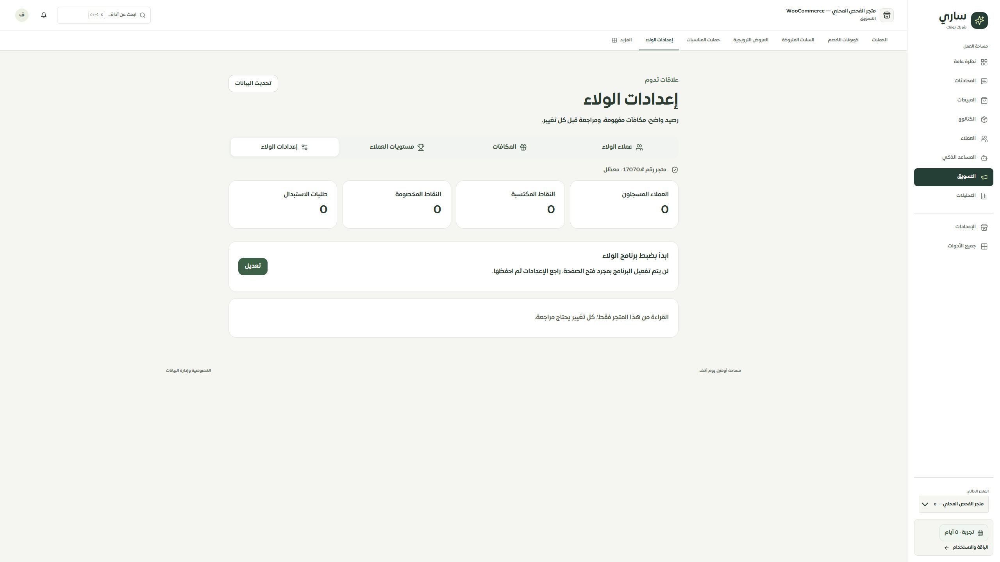
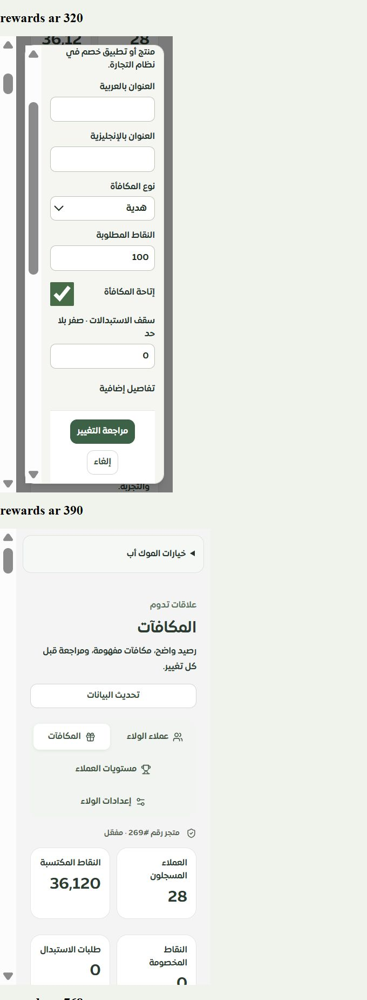

# المرحلة 524 — الولاء في التطبيق والموك أب

2026-10-04. استبدال الصفحات الأربع القديمة وإعادة تصميم تفاصيل العميل المرتبطة بمسار customer/loyalty أيضًا. لا نشر أو رسائل أو استبدالات حقيقية.

## النتيجة

المكوّن نفسه يخدم التطبيق والموك أب: العملاء والإعدادات والمستويات والمكافآت. لم تعد صفحات الولاء الأربع تعتمد القالب العام. بقيت الوظائف والحقول السابقة مع بدائل API موثقة في سجل الحفاظ على الخصائص، دون تغيير خط الأساس.

- العملاء: بحث كامل وصفحات، الاسم والهاتف والرصيد والمستوى المشتق من الحد الحالي، إضافة/خصم بمراجعة الرصيد قبل وبعد. فتح عميل غير مسجل لا ينشئ سجلًا حتى اعتماد إضافة نقاط.
- تفاصيل العميل: تاريخ النقاط والاستبدالات والمكافآت المتاحة، صفحات مستقلة، سبب التغيير، حالة الاستبدال وملاحظاته وطلبه وتواريخه. لا إعادة حالة نهائية للحياة.
- الإعدادات: تفعيل صريح وقواعد الكسب والقيمة والصلاحية والمكافآت الإضافية. حفظ الأصفار الصحيحة وتوضيح أن ضبط القواعد لا يثبت تشغيل الأتمتة.
- المستويات: الاسمان والحد والخصم والشحن والأولوية واللون والأيقونة والمزايا، مع تحرير ومراجعة كل الحقول.
- المكافآت: الأنواع الأربعة، الكلفة والتوافر وحد الاستبدالات، الوصف والشروط باللغتين والتواريخ ورابط الصورة. اختيار منتج مملوك بالبحث حتى خارج أول25نتيجة؛ المراجعة تعرض الاسم وتخفي الحقول غير المرتبطة والاختيارية الفارغة.
- جميع الكتابات من هذه الشاشات تمر عبر reviewedAction. المرجع العشوائي للعملية المعلقة محفوظ محليًا بدون بيانات العميل، وتُمنع محاولة جديدة حتى استعادة إيصال مؤكد أو إغلاق المحاولة بقرار ذري دائم يمنع وصول كتابة متأخرة.
- إغلاق محاولة اكتملت يعيد إيصالها؛ إغلاق محاولة لم تنفذ يحفظ إيصال إغلاق في معاملة قفل التيننت نفسها. كل قراءة/تغيير/استعادة تفحص الحساب والجلسة والصلاحية والتيننت.
- حالات القراءة المتعذرة والجلسة والصلاحية والبيانات القديمة/الأجنبية تخفي بيانات المتجر وأزرار التغيير. أخطاء المدخلات بجانب الحقول مع تركيز مناسب، وأزرار حفظ محمية من النقر المزدوج.

## التحقق

نجح212اختبار وحدة/واجهة وحصر وحفاظ على الخصائص ومخطط ونشر؛ منها35اختبار واجهة الولاء. نجحت49تجربة MySQL، و77اختبار عقد إصدار، والأنواع والبناء والترجمة. العقد الجديد: loyalty-shared-reviewed-workspace-v1.

فحص المتصفح32حالة: الصفحات الأربع × العربية/الإنجليزية × حاويات320/390/768/1440. عرض المحتوى المقاس290/360/738/1410 بسبب حواف التمرير؛ لا تجاوز أفقي أو مفاتيح ترجمة ظاهرة أو أزرار أقل من44تقريبًا. وفُحصت8نوافذ تحرير على أصغر حاوية، منها تفاصيل المكافأة وتواريخها؛ حقول16px وأزرار44px فأكثر. هذا Chromium في بيئة سطح المكتب، وليس اختبار Safari أو آيفون فعلي.

فُحصت الصفحات الأربع قراءةً في التطبيق المحلي3025 بتيننت الاختبار17070؛ ظهرت حالة البرنامج غير المهيأ/المعطل الصحيحة دون تفعيل أو إنشاء بيانات. انتهت الجلسة السابقة واستُعيد الدخول ببيانات حساب الاختبار القائمة. الحفظ جُرّب في المحاكي والاختبارات المعزولة فقط.

[الفحوص](checks.json) · [قياسات المتصفح](browser-checks.json) · [قراءات التطبيق](local-read-checks.json)

## الحدود والمتابعة

الحصر يغطي126مسارًا و606ملفات و2800عنصر تحكم، مع صفر روابط حرفية غير مطابقة. صارت الصفحات الأربع ذات تصميم مشترك بدل الموك أب العام؛ تصنيف «تفصيلي جزئي» يظل مقصودًا لأن التصميم لا يثبت تشغيل كل تكامل.

المرحلة التالية إغلاق تسع واجهات كتابة ولاء قديمة بعد اكتمال بديلها. قراءة المعرفة ونتائج عقل ساري لا يجوز تحويلها إلى نسبة احتراف مبيعات بلا معيار وبيانات نتائج. لا تشغيل أتمتة النقاط/الصلاحية أو إشعارات الولاء، ولا إثبات تنفيذ مزايا التجارة أو فحص مزود حي أو اختراق شامل أو ضمان100%.
