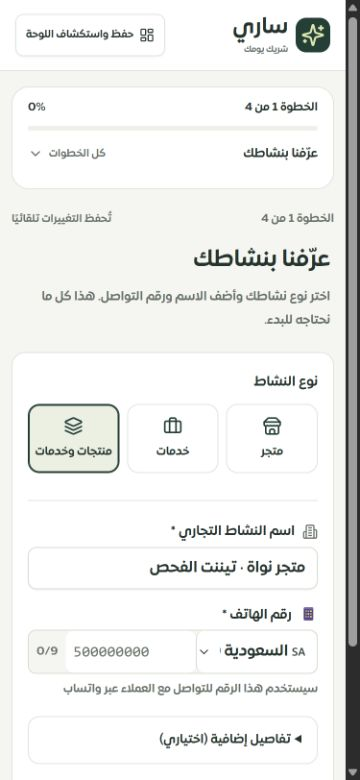
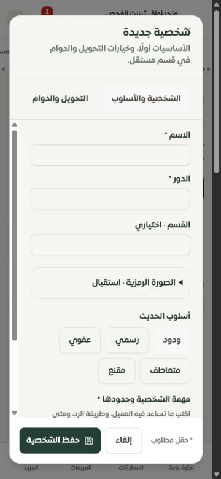
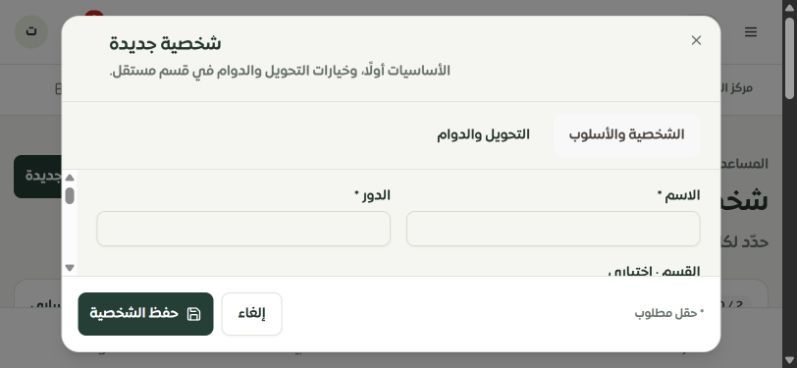

# فحص الموبايل والريسبونسف وسفاري — 28 سبتمبر 2026

تحديث لاحق: [إصلاح الصفحات الثلاث ذات الجداول الناقصة واختبار نماذجها على الهاتف](../tenant-mobile-followup-2026-09-28/REPORT.md). أُصلحت دورة حفظ الإعدادات، مع توثيق عدم ربط الإرسال التلقائي وحدود اختبار Safari.

أُصلحت مشكلات فعلية في عرض لوحة التاجر والويزرد، وأُضيفت قواعد للمساحة الآمنة وارتفاع الشاشة المرئي والنوافذ عند ظهور لوحة المفاتيح. الفحص الحي هنا **Chromium على Windows بمقاسات CSS مختلفة**. لا يمثل تشغيل Safari أو جهاز iPhone فعليًا، ولا يثبت نجاح كل حالة تشغيل لكل خاصية.

## نطاق التحقق

| الفحص | التغطية |
| --- | --- |
| التطبيق المحلي على 375 × 812 | زيارة 126 مسارًا من سجل المصدر، ثم إعادة فحص التحميل البطيء والمواضع المتأثرة |
| الموك أب على 375 × 812 | زيارة 126 مسارًا؛ لم يرصد القياس قصّ عناصر التحكم الظاهرة أو تجاوز عرض الجذر |
| 320 × 568 | 13 صفحة أساسية، ثم إعادة فحص الخدمات وعقل ساري |
| 812 × 375 أفقي | 13 صفحة أساسية ونافذة الشخصية |
| 390 × 844 و430 × 932 | الويزرد والرئيسية والشخصيات وإعدادات المساعد وعقل ساري |
| 768 × 1024 | الصفحات الخمس السابقة والمحادثات والخدمات |
| 1024 × 768 و1440 × 900 | الصفحات الأساسية الخمس للتحقق من التابلت والديسكتوب |
| النوافذ | محرر الشخصية وقسما الشخصية/الدوام في التطبيق، ومحرر الشخصية في الموك أب |
| التنقل والبحث | قائمة الموبايل، وإغلاق النوافذ بلوحة المفاتيح، ونافذة البحث بارتفاع 360 مع تمرير داخلي؛ [القياسات](navigation.json) |

الأدلة: [المسارات الفعلية](routes-375.json)، [إعادة الفحص](rechecks.json)، [55 قياسًا إضافيًا للمقاسات](viewport-matrix.json)، [الموك أب](prototype-375.json)، [قياسات النوافذ](dialogs.json)، [نافذة الموك أب](prototype-dialog.json).

تقيس الأداة عرض الجذر، وحدود الحقول والأزرار الظاهرة، وحجم خط المدخلات. تستثني التمرير الأفقي المقصود والمحتوى المطوي. لا تغطي كل نافذة مشروطة أو كل عينة بيانات أو قصّ النص داخل عنصر. السجلات تحتفظ بالنتيجة السابقة؛ **آخر إعادة فحص للمسار والمقاس هي المرجع**. بعض اللقطات الأولى تسبق اكتمال التحميل أو حدث تغيير الاتجاه، وقد أُعيد فحصها. حقل `error` في القياس يبحث عن نص حالة واحدة فقط، وليس إثباتًا لسلامة API.

## الإصلاحات

| المشكلة المرصودة | المعالجة |
| --- | --- |
| تمدد الويزرد بسبب المقاس الداخلي لحقل الهاتف | السماح بانكماش الحقل واختيار الدولة، وضبط أعمدة الخطوة إلى minmax(0,1fr)، مع الحفاظ على التحقق والتسميات |
| قصّ إجراءات الخدمات والمدفوعات والاشتراك والاستخدام | التفاف صفوف الإجراءات عند ضيق المساحة |
| قصّ زر 90 يومًا في تحليلات الرسائل، وإعادة التعيين في تجربة ساري | التفاف العناوين ومجموعات الأزرار؛ يشمل مسارات التحليلات البديلة |
| قصّ حقل التاريخ الثاني في مؤشرات الأداء | حقلان متراصان على الهاتف، وصف واحد عند توفر المساحة، وتسميتان بالعربية والإنجليزية |
| قصّ زر إعادة ضبط عقل ساري عند 320 | التفاف إجراءات الرأس |
| حقول صغيرة وأهداف لمس ضيقة | خط 16px للمدخلات على الهاتف وأجهزة اللمس، وارتفاع 44px للأزرار الرئيسية، وتوسيع أزرار الأيقونات وقوائم التبويب |
| الاعتماد على ارتفاع الصفحة الكامل للنوافذ | متابعة VisualViewport للارتفاع والإزاحة، مع تجاهل التكبير بالقرص والحفاظ على إعدادات الصفحة عند الخروج |
| حواف الآيفون وتغير الارتفاع | viewport-fit=cover داخل مساحة التاجر، safe-area-inset للحواف والأشرطة والنوافذ، وإخفاء التنقل السفلي عند رصد لوحة المفاتيح أثناء التحرير |
| اختلاف أساسيات الموك أب عن التطبيق | توحيد الخطوط اللمسية والحواف الآمنة والهوامش وارتفاع النوافذ على الموبايل |

اختفت حالات القصّ المرصودة بعد إعادة الفحص. ظهرت قراءة عابرة لقصّ إجراء الرئيسية أثناء استقرار الصفحة؛ القياس اللاحق والصورة أظهرا تموضعه الصحيح، دون تغيير غير لازم في منطقها.

## سفاري والآيفون

المشروع يستخدم Tailwind CSS 4؛ الحد الأدنى المستهدف للمكتبة هو **Safari 16.4**، وليس كل الإصدارات القديمة. [التوثيق الرسمي للتوافق](https://tailwindcss.com/docs/compatibility).

استُخدمت الحواف الآمنة وفق [إرشادات WebKit للآيفون](https://webkit.org/blog/7929/designing-websites-for-iphone-x/)، ووحدات الارتفاع الديناميكية التي أضيفت في [Safari 15.4](https://webkit.org/blog/12445/new-webkit-features-in-safari-15-4/)، و[VisualViewport](https://webkit.org/blog/9674/new-webkit-features-in-safari-13/) لقياس الجزء المرئي. لا يوجد منع للتكبير أو user-scalable=no. عتبة اكتشاف لوحة المفاتيح 120 بكسل أثناء تركيز حقل قابل للتحرير؛ هي معالجة دفاعية واختُبر منطقها بوحدات محاكاة، وليست نتيجة اختبار لوحة مفاتيح iOS حقيقية.

**ما يزال غير متحقق على جهاز حقيقي:** Safari على iPhone/iPad، لوحة المفاتيح العربية والإنجليزية والاقتراحات، شريط العنوان أثناء التمرير، safe-area غير الصفرية، التكبير باللمس، منتقي التاريخ والملفات الأصلي، وVoiceOver. يلزم المرور بهذه الحالات على نسخة بناء الإنتاج قبل اعتبار التوافق مع سفاري معتمدًا بالكامل. تغيير أبعاد Chromium وحده لا يثبت ذلك.

## الاختبارات وحدود التشغيل

- نجح **217 اختبارًا في 12 ملفًا**: ارتفاع الشاشة والتنظيف وتعدد ملاك الغلاف، الويزرد، سهولة الوصول، مفاتيح الترجمة، المحافظة على إجراءات المسارات، والموك أب.
- نجح TypeScript دون أخطاء، وفحص الترجمة: 7886 استدعاء و311 مفتاحًا ديناميكيًا، بلا مفاتيح مفقودة أو أخطاء interpolation في نطاق المدقق.
- نجح Vite production build وفحص حجم الحزمة. سجل أوامر التحقق في [verification.json](verification.json).
- بقيت حالات البيانات المحلية المعروفة من [التقرير العميق](../tenant-features-2026-09-28/REPORT.md): التقارير المجدولة وحالة التكاملات وإشعارات واتساب مرتبطة بجداول مفقودة. فحص شاشة الخطأ لا يثبت تشغيل هذه الخصائص.
- صفحة بيان أظهرت حالة «لم يتم ربط بيان»، وصفحة تحرير خدمة بمعرف غير موجود أظهرت 404. لا يُحسب ذلك اختبارًا لشاشة مربوطة أو لسجل صالح.
- هذه الجولة لا تلغي فجوات التصميم والوظائف الموثقة سابقًا، ولا تجعل الموك أب العام تفصيليًا لكل خاصية.

التعديلات محلية؛ **لم تُنشر على الخادم**.
