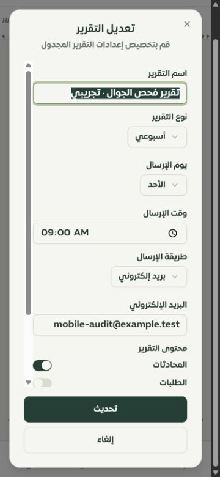
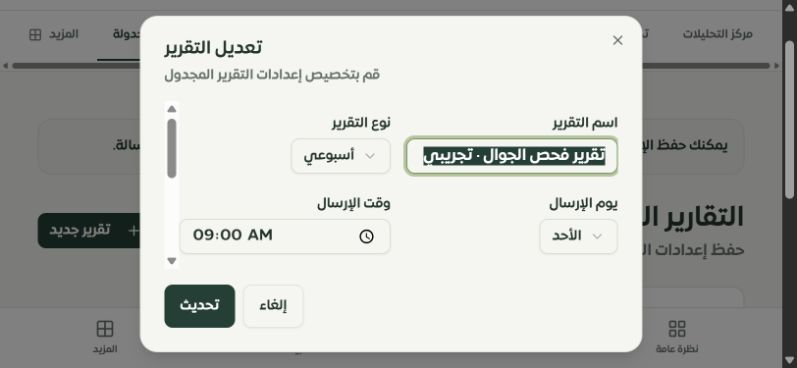
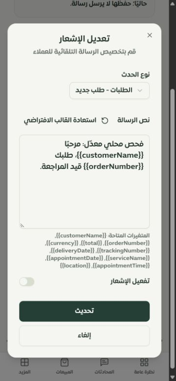
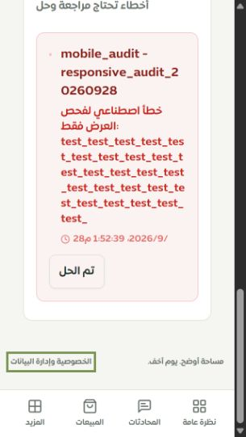

# استكمال إصلاح صفحات التيننت وفحص الجوال — 28 سبتمبر 2026

هذه متابعة للفحص السابق، تركّز على الصفحات الثلاث التي منعت الجداول الناقصة التحقق من تشغيلها: التقارير المجدولة، قوالب إشعارات واتساب، وحالة التكاملات. أُصلحت دورة حفظ إعداداتها واختُبرت في التيننت المحلي الاصطناعي. **لا تعني هذه الجولة اكتمال كل تصميم أو خاصية في النظام بنسبة 100%.**

## ما أُصلح

| المشكلة | النتيجة |
| --- | --- |
| غياب جداول الصفحات الثلاث عن الترحيلات | أضيفت الهجرة المسجلة `0146_tenant_notification_workspaces` لأربعة جداول، مع تعريفها في مخطط Drizzle وفهارسها وعلاقتها بالتاجر. |
| تعديل التقرير لا يحفظ مفاتيح المحتوى الستة | التحديث يكتب كل المفاتيح ويحافظ على `false`، ولا يعيد ضبط بقية الإعدادات عند تغيير الحالة فقط. |
| تحويل قيم MySQL العددية مباشرة إلى مفاتيح التبديل | تحويل القيم إلى Boolean قبل التحرير؛ نجح إنشاء وتعديل التقرير والقالب وإعادة فتحهما. |
| تغييرات بلا صلاحيات مناسبة أو عزل كافٍ | استخدام التاجر المحدد من سياق الوصول، وصلاحيات إعدادات المتجر/واتساب/التكاملات، والتحقق من ملكية السجل، وتقييد أوامر SQL بالتاجر. قُيّدت قراءة محاولات Webhook الفاشلة بالتاجر أيضًا. |
| مدخلات غير محكومة | تحقق من الوقت، وأيام الأسبوع/الشهر، ووسيلة الإرسال والمستلمين، ونوع الحدث، وطول القالب، وحدود الاستعلامات. |
| نوافذ طويلة على الهاتف | تمرير داخلي لمحتوى النموذج مع بقاء الرأس وإجراءات الحفظ داخل النافذة، وصفوف حقول مناسبة للمقاس الصغير. |
| مؤشر التبديل يخرج من مساره عند التفعيل بالعربية | تثبيت اتجاه مسار المفتاح ليتوافق مع حركة المؤشر؛ تحقق القياس من احتوائه في الحالتين. |
| قصّ رسالة خطأ طويلة داخل بطاقة التكاملات | إزالة غلاف التمرير ذي العرض الجدولي، وتقييد انكماش المحتوى ولف الكلمات الطويلة. أصبح النص وإجراء المعالجة ظاهرين بعرض 320. |
| أسماء حقول حالة التكاملات لا تطابق API | استخدام `platformType` و`isActive` و`lastSyncAt` لاسم المنصة والحالة والتاريخ ورابط الإعدادات. أضيف اختبار ببيانات API الفعلية. |
| نصوص عربية داخل الملف الإنجليزي | تصحيح النصوص الخاصة بهذه الصفحات وإضافة المفاتيح الدلالية المقابلة؛ لم تُفعّل لغة جديدة في التطبيق. |
| زر التصعيد لا يُقرأ إلا كعلامة تعجب | اسم واضح لقارئ الشاشة «سلسلة تنبيهات ساري» وهدف لمس 44 × 44. |

## التحقق الحي

الفحص على Chrome/Chromium في Windows، بإطارات CSS: 320 × 568، 375 × 812، 812 × 375، وفحص تكميلي لنافذة التقرير على الديسكتوب. بيانات البريد والقوالب والإحصائيات اصطناعية في قاعدة `sari_pages_test` المحلية، مع حظر الاتصالات الخارجية وتعطيل مهام الإرسال المجدولة في خادم الفحص.

- إنشاء تقرير، تعطيل الطلبات والإيرادات، الحفظ وإعادة الفتح، ثم تعطيل المنتجات وحفظ التعديل وإعادة الفتح: بقيت الاختيارات كما حُفظت.
- إنشاء قالب واتساب مع إيقافه، تعديل النص، ثم إعادة فتحه: بقي النص الجديد وحالة الإيقاف.
- بيانات تكامل اصطناعية: 4 مزامنات، 3 ناجحة، وخطأ واحد؛ ظهرت النسبة 75% من هذه العينة، ثم نجح إجراء «تم الحل» وأصبحت قائمة الأخطاء غير المحلولة فارغة.
- النوافذ المقاسة بقيت داخل المساحة المرئية، مع تمرير داخلي وظهور إجراءات الحفظ. لا توجد مدخلات أصغر من 16px في عينات الهاتف المقاسة.
- رسالة الخطأ الطويلة كانت بعرض يقارب 840px داخل مساحة 245px قبل الإصلاح؛ بعده صار محتوى النص نحو 162px وظهر كاملًا داخل البطاقة.

[القياسات وحالات التحقق](browser-evidence.json) · [الهجرة وقاعدة البيانات](migration-results.json) · [الاختبارات والبناء](verification.json)

## الاختبارات

نجح **217 اختبارًا في 9 ملفات**، إضافة إلى **5 اختبارات على MySQL حقيقي**: إجمالي 222. تشمل صلاحيات الأدوار، السجلات التابعة لتاجر آخر، التحديث الجزئي، القيم المعطّلة، التحويلات والترجمة، سهولة الوصول، وسجل المحافظة على واجهات القراءة والتعديل للمسارات الـ126.

نجح اختبار الهجرة على قاعدة جديدة، وعلى قاعدة ترقية تحتوي الجداول والبيانات مسبقًا، ثم إعادة تشغيلها مرتين دون تغيير السجلات الموجودة. هذه تجربة للهيكل المتوقع، وليست إثباتًا لتوافق كل بنية قديمة معدّلة يدويًا.

نجح TypeScript، وتجميع الخادم والعامل، وبناء إنتاج الواجهة. فحص الترجمة غطى 7968 استدعاء و311 مفتاحًا ديناميكيًا، بلا مفاتيح مفقودة أو أخطاء interpolation في نطاق المدقق. بقي تحذير حجم بعض الحزم في Vite؛ لا يمنع نجاح البناء.

أُعيد توليد سجل المصدر: **126 مسارًا، 180 ملف واجهة، 1590 موضع عنصر تحكم**. هذا حصر ساكن ومراجعة للمحافظة على الخصائص، وليس اختبارًا وظيفيًا لكل حالة بكل صفحة.

## حدود مهمة باقية

- **الإرسال التلقائي لهذه التقارير والقوالب غير مربوط بمسار تشغيل فعلي في الكود الحالي.** أصبحت الواجهة تصرّح بذلك، وأزرارها تحفظ الإعدادات فقط. لا تُعد هذه الجولة تفعيلًا للإرسال أو اختبارًا لمزود خارجي، و`delayMinutes` لا يشغّل تأخيرًا فعليًا هنا.
- **Safari وiPhone/iPad حقيقي لم تُختبر**؛ تبقى لوحة مفاتيح iOS، شريط العنوان، الحواف الآمنة غير الصفرية وVoiceOver ضمن فحص الجهاز الحقيقي. راجع [تفاصيل الفحص السابق](../tenant-mobile-2026-09-28/REPORT.md).
- التطبيق يعلن العربية فقط حاليًا؛ تصحيح الملف الإنجليزي لا يعني إتاحة تجربة إنجليزية كاملة أو اعتمادها.
- الموك أب المستقل لهذه الصفحات ما يزال عامًا. تحديث سجل الفجوات لا يحوّله إلى تصميم تفصيلي لكل خاصية، ولا يلغي الفجوات الأخرى في [التقرير العميق](../tenant-features-2026-09-28/REPORT.md).
- اختبارات الأمان هنا موجهة لعزل التيننت والصلاحيات والمدخلات في النطاق المعدّل؛ ليست اختبار اختراق شاملًا للنظام أو اختبار حمل.

التغييرات محلية على `main`، ولم تُدفع أو تُنشر على الخادم في هذه الجولة.
