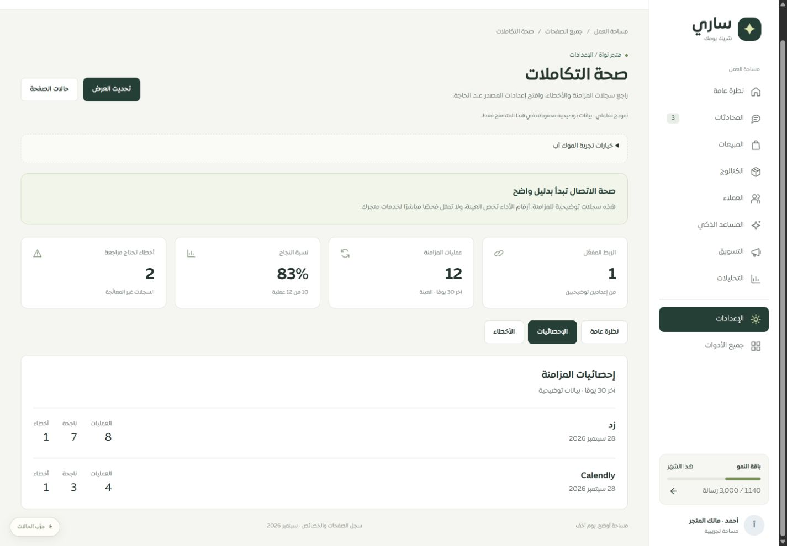
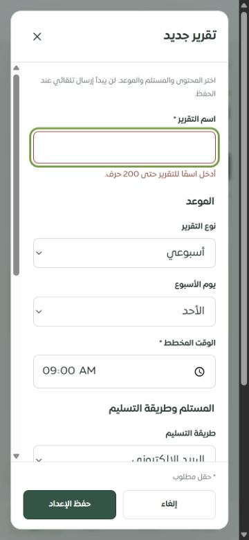
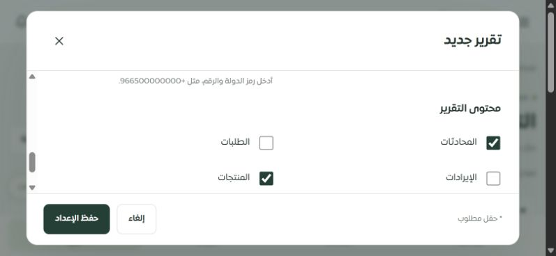
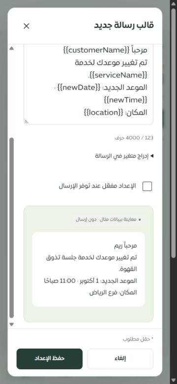

# استكمال موك أب التقارير والإشعارات والتكاملات — 28 سبتمبر 2026

استُبدل العرض العام لثلاث صفحات بنماذج تفاعلية تفصيلية، مع الحفاظ على التصميم المشترك واتجاه العربية والجوال. هذه الجولة تخص **الموك أب المحلي**؛ لا تغيّر واجهات الخادم أو قاعدة البيانات أو مفاتيح ترجمة التطبيق. إصلاحات التطبيق الفعلية السابقة موثقة في [تقرير المتابعة](../tenant-mobile-followup-2026-09-28/REPORT.md).

## المطابقة مع الواجهات الحالية

| الصفحة ومصدرها | ما يغطيه التصميم | تحسين تجربة الاستخدام |
| --- | --- | --- |
| [التقارير المجدولة](http://127.0.0.1:4329/#/page/merchant/scheduled-reports) · `client/src/pages/ScheduledReports.tsx` | الاسم؛ يومي/أسبوعي/شهري؛ اليوم والوقت؛ البريد/واتساب/كلاهما؛ المستلمان؛ أقسام المحتوى الستة؛ عرض الحالة وآخر إرسال؛ الإنشاء والتعديل والحذف المؤكد. | نموذج واحد بحقول شرطية، أخطاء بجانب كل خانة وتركيز على أول خطأ، بطاقات تُظهر المستلم والمحتوى، حفظ الخيارات المعطلة وإعادة فتحها. |
| [قوالب رسائل العملاء](http://127.0.0.1:4329/#/page/merchant/whatsapp-auto-notifications) · `client/src/pages/WhatsAppAutoNotifications.tsx` | الأحداث التسعة للطلبات والمواعيد؛ نص حتى 4000 حرف؛ استعادة النص الافتراضي؛ حالة الإعداد؛ مجموعتا الطلبات والمواعيد؛ التعديل والحذف. | معاينة النص ببيانات مثال؛ إدراج المتغير في موضع الكتابة؛ تنبيه للمتغير غير المعروف؛ الحفاظ على النص المخصص عند تغيير الحدث؛ عدّ الأحرف. |
| [صحة التكاملات](http://127.0.0.1:4329/#/page/merchant/integrations-dashboard) · `client/src/pages/IntegrationsDashboard.tsx` | مؤشرات الربط والمزامنة والنجاح والأخطاء؛ أقسام النظرة العامة والإحصائيات والأخطاء؛ حالة الإعداد وآخر مزامنة؛ إعدادات المصدر؛ تفاصيل الخطأ وتوقيته والتعليم كمعالَج. | فصل حالة الربط المحفوظة عن فحص توفر المزود؛ النسبة محسوبة من العينة؛ لا تُفترض نسبة 100% عند غياب العمليات؛ رسالة طويلة تُلف داخل البطاقة. العينة تمثل زد وCalendly. |

خيارات تجربة التصميم تعرض دور مالك/مشاهد وفشل الحفظ دون فقد المسودة، وعينة إحصائيات فارغة. هذه محاكاة واجهة، وليست صلاحيات خادم. أُتيح زر إعادة ضبط البيانات من حالات الصفحات الداخلية؛ يعيد بيانات النماذج المتخصصة والعامة بعد تأكيد مستقل.

توجد فروق مقصودة عن التطبيق: حفظ نص الرسالة عند تغيير الحدث ومعاينة المتغيرات والإدراج وأخطاء الحقول المخصصة مقترحات UX في الموك أب. القيم الافتراضية نصوص توضيحية. نوع التقرير `custom` المقبول في API لا يظهر كمسار إنشاء مستقل، اتساقًا مع الخيارات الثلاثة الحالية في الواجهة. `delayMinutes` ليس خيار إرسال عاملًا ولا يُعرض على أنه يعمل.

## التحقق

- **41 اختبارًا في أربعة ملفات**: 12 للنماذج الجديدة، 8 للتنقل والنماذج العامة، 10 للمساعد والشخصيات، و11 لعقل ساري. تشمل فتح 133 مدخلًا في فهرس الموك أب وروابطها؛ هذا لا يساوي اختبار كل خاصية في كل مسار.
- اختبارات النماذج تشمل الحقول الشرطية، حدود الأيام والنصوص، القيم `false`، التعديل دون مضاعفة السجل، إعادة التحميل، بقاء الحالة وتاريخ الإرسال، فشل الحفظ والتخزين المحلي، تأكيد الحذف وإلغاؤه، المحاكاة المقروءة فقط، سلامة عرض النص من HTML، والتحقق من عدم استدعاء `fetch`.
- فحص حي على Chrome/Chromium في Windows بمقاسات CSS **320×568، 375×812، 812×375، 1440×1000**. بقيت النوافذ وأزرار الحفظ داخل المساحة المرئية؛ تمرير المحتوى داخلي، وحقول النماذج المقاسة 16px. بطاقتا الخطأ بعرض 320 كان عرض محتواهما وعرض التمرير متساويين: 275px.
- جُرّب حيًا تقرير شهري يوم 28 بوسيلتي تسليم، وإيقاف الطلبات والإيرادات ثم الحفظ وإعادة التحميل. وجُرّب قالب تغيير الموعد مع معاينة المتغيرات، حفظه متوقفًا، وفشل تعديل لاحق دون تغيير السجل المحفوظ. نسبة المثال 83% ناتجة من 10 عمليات ناجحة من 12؛ العينة الفارغة تعرض «—».
- التحقق من صياغة JavaScript ومن نظافة الفرق. لا توجد تغييرات في حزمة التطبيق في هذه الجولة، لذلك لم تُعد اختبارات الخادم والبناء الشامل التي نُفذت في الجولة السابقة.

[قياسات المتصفح](browser-evidence.json) · [نتائج الاختبارات](verification.json) · [سجل جميع الصفحات والأولويات](REMAINING.md)

## حدود الاكتمال

أصبح سجل التصميم **8 مسارات تفصيلية، وعقل ساري تفصيليًا جزئيًا، و109 مسارات بموك أب عام، و8 تحويلات**. سجل المصدر المستخدم يحوي 126 مسارًا و180 ملفًا و1590 موضع تحكم في لقطة سابقة؛ لم يُعد توليده أثناء التغييرات المتزامنة على سلة. راجع سجل الأولويات لكل مسار، وأعد الحصر بعد تثبيت تغييرات التطبيق اللاحقة.

**Safari وiPhone/iPad الفعلي لم تُختبر**. قياسات Chrome لا تختبر محرك WebKit أو لوحة مفاتيح iOS أو VoiceOver أو الحواف الآمنة غير الصفرية. قواعد الحواف الآمنة وارتفاع العرض لا تُعد دليلًا على نجاح اختبار جهاز حقيقي.

**الإرسال التلقائي لهذه التقارير والقوالب غير مربوط في التطبيق الحالي بحسب فحص الجولة السابقة.** لا يرسل الموك أب ولا يتصل بمزود أو يقيس أداء مبيعات حقيقيًا. الاختبارات هنا ليست اختبار اختراق شاملًا ولا إثباتًا لخلو النظام كله من المشكلات.

التغييرات محلية على `main`. لم تُدفع ولم تُنشر إلى الموقع في هذه الجولة.
