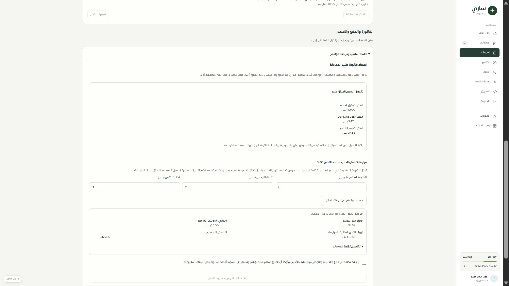

# المرحلة 65 — أدوات الطلب المالية في الموك أب

اكتملت أمثلة الفاتورة والهامش ومحاولات الدفع وتحرير الخصم داخل مكونات التطبيق الفعلية في موك أب الطلبات. جميع البيانات والكتابات في ذاكرة الصفحة، دون خادم أو مزود أو أموال حقيقية. لا تغيير في قاعدة البيانات أو API الإنتاج في هذه المرحلة.

| المسار | التغطية |
|---|---|
| DEMO-ORD-002 | إدخال الضريبة والتوصيل والتكاليف صراحة، حساب الهامش، رفض التكلفة المجهولة والإيراد غير الصالح، استثناء موثق لصاحب الصلاحية، إقرار المبلغ، اعتماد الفاتورة وعرض سجل الاستثناء وتفصيل الخصم |
| DEMO-ORD-001 | محاولة دفع مجهولة، معرف عملية بصيغته الصحيحة، مراجعة الدليل، نتيجة مطابقة أو عدم مطابقة أو خطأ، تحديث السجل؛ المطابقة لا تغيّر حالة الدفع إلى مدفوع |
| DEMO-ORD-006 | خصم طلب ملغى، سبب وإقرار، تحرير واحد وعرض تغير العداد وسجل السبب، منع التحرير عند وجود دليل دفع |
| خيارات المحاكاة | عشرة أوضاع مالية مستقلة، إضافة إلى أوضاع صفحة الطلبات الـ11؛ إعادة المثال تمسح السجلات المالية التوضيحية |

أصلح الفحص البصري تصادم متغير اللون `--muted` مع لون النص في هيكل الموك أب، فاستعيد وضوح النص الثانوي في الصفحة. حقول الأموال 16px وارتفاعها الفعلي نحو49px، وحقل السبب 96px، مع التفاف المراجع الطويلة وشبكات تتكدس على العرض الضيق. وُحّدت بنود مثال الفاتورة مع مجموع40.00 وخصم5.47 وإجمالي34.53 ريال.

## التحقق

- 37 حالة ناجحة: 12 لعقد المحاكاة المالية، 8 لمكونات صفحة الطلبات مع المحول الحقيقي، 17 لتفاعلات الطلبات السابقة. تشمل تغيير التكاليف بعد الحساب وإبطال الموافقة، رفض الدليل القديم، منع تجاوز الصلاحية، حفظ سبب الاستثناء، تحديث محاولة الدفع وتحرير الخصم في التفاصيل.
- TypeScript وبناء حزمة الموك أب نجحا. لم تضاف مفاتيح ترجمة؛ تُستخدم ترجمات مكونات التطبيق العربية والإنجليزية الحالية.
- تجربة متصفح محلية: هامش منخفض8.77%، إدخال سبب وإقراري المراجعة، ثم ظهور سجل الاستثناء؛ وكذلك هامش مقبول56.55% بتكاليف15 ريال.
- عرض IAB المقاس480px: عرض المستند450 وscrollWidth450، وحقل السبب96px. أُعيد العرض الافتراضي بعد الفحص. لقطة العرض الضيق كانت فارغة من أداة IAB، لذلك لم تُستخدم كإثبات بصري؛ اللقطة المكتبية محفوظة أدناه.

## حدود باقية

أدوات سلة وزد ما زالت فارغة في المحاكاة، وتبدأ في المرحلة66. تبقى التغطية82 صفحة عامة و27 جزئية و9 تفصيلية و8 تحويلات، ولا يُعد وجود هذه الأمثلة اكتمالًا للنظام100%.

البصمات هنا رموز توضيحية وليست توقيعات أمنية. وضع ضياع استجابة الفاتورة يحفظ التغيير في الذاكرة ثم يفشل؛ القراءة التالية ترى الحالة الجديدة، لكنه لا يثبت إيصال اعتماد دائم أو استعادة رابط دفع من المزود. إعادة التحميل تمحو العمليات. التعارض والتسوية وسلوك المزود الحقيقي و320/390 وSafari/iPhone تحتاج أدلة مستقلة. لا نشر ولا إرسال خارجي.
