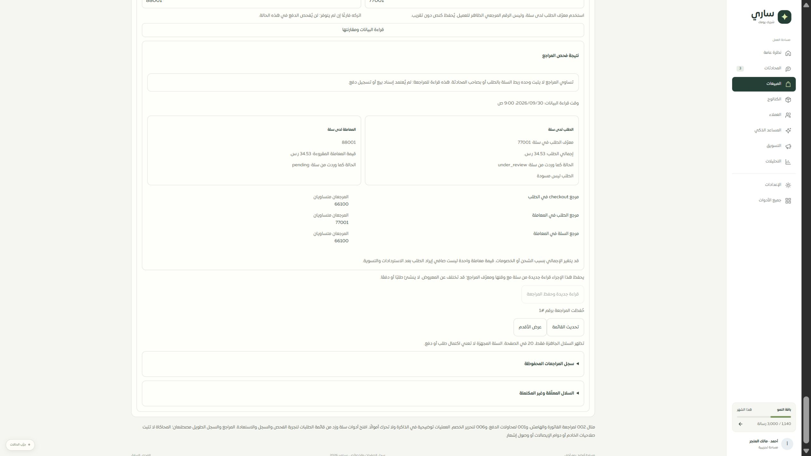

# المرحلة 66 — أدوات سلة وزد في موك أب الطلبات

طابقت المحاكاة مكونات التطبيق الفعلية لفحص سلة وسجل الفحوص والاستعادة ومراجعة زد. توجد12 حالة منصة مستقلة، بجانب11 حالة طلبات و10 حالات مالية. العمليات في الذاكرة فقط؛ لا اتصال بسلة أو زد ولا تسجيل تحصيل أو رسالة.

| الخاصية | التغطية |
|---|---|
| سلات سلة | 22 مثالًا بصفحات20، جاهزة ودليل غير متاح، العودة للأحدث، اختيار وإغلاق الفحص |
| مقارنة المراجع | معرف الطلب والمعاملة الاختيارية، تطابق واختلاف وغياب وعدم فحص، مبلغ وحالة ووقت وحدود الدليل، فشل القراءة |
| حفظ الفحص | قراءة جديدة، سجل بالمراجع والوقت، إعادة نفس UUID عند ضياع الاستجابة، رفض تغيير المدخل لنفس UUID، فشل دون سجل كاذب |
| سجل الفحوص | عرض وفتح التفاصيل والتحديث والترقيم؛ وضع21 سجلًا مصطنعًا لا يمثل تعاملات التاجر |
| استعادة السلات | مراجعة/تجهيز/إرسال/مرفوض، مرجع مفقود أو دليل غير صالح أو قيد التنفيذ، استعادة واحدة للقابل للتحقق وإظهار تأكيدها حتى التحديث، فشل دون ادعاء الاستعادة |
| زد | 27 مثالًا بصفحات25، انتظار التنفيذ وغياب المرجع والقراءة فقط، معرف وإقرار، تحقق أو فشل أو تأكد الطلب مع بقاء تحديث السجل، ثبات معرف الطلب المؤكد |

أصبح إبطال القراءة في محول الموك أب خاصًا بالمصدر المحدد؛ حفظ سجل الفحص لا يعيد تركيب نموذج الفحص ويمحو النتيجة. وفُصل تحديث اللغة عن تحديث البيانات كي تبقى المدخلات والنتيجة عند التبديل. المكونات الإنتاجية نفسها لم تتغير في هذه المرحلة.

## التحقق

- 54 حالة ناجحة:12 للمنصات،12 للماليات،13 لمكونات الصفحة مع المحول،17 للطلبات الأساسية. تشمل الحفظ وإعادة الإرسال بنفس المعرف وعدم التكرار، الترقيم، بقاء نتيجة الفحص، تبديل اللغة، والاستعادة والمراجعة ومنع الكتابة للقارئ.
- فحص أنواع مستقل جديد `tsconfig.orders.json` يشمل ملفات موك أب الطلبات. الإعداد العام للتطبيق لا يشملها. كشف الفحص نقص تضييق الأنواع حول دوال الخطأ القديمة فصُحح تعريفها؛ نجح الفحص بعد تضمين تعريفات المشروع الخارجية. لا تعطيل للتحقق أو تحويل شامل إلى any.
- بناء الموك أب نجح. أُحدث سجل الخصائص دون تغيير أعداد التغطية:82 عامة و27 جزئية و9 تفصيلية و8 تحويلات من126.
- نجحت حالات الحصر الست في `merchant-feature-inventory.test.ts` بعد تحديث مواصفات الطلبات.
- المتصفح المحلي: اختيار سلة66100، طلب77001 ومعاملة88001، عرض3 مقارنات متساوية مع تصريح عدم إثبات البيع/الدفع، ثم حفظ مراجعة رقم1 مع بقاء النتيجة.
- العرض المقاس480px: document450 وscrollWidth450، حقلا الفحص16px وارتفاع48px تقريبًا. عادت الأبعاد الافتراضية بعد الفحص. جُرّبت القراءة فقط مع وضع السجل الطويل ثم الإنجليزية دون خطأ في الصفحة.

## المرحلة التالية والحدود

كشف الفحص أن أدوات زد المفتوحة قد تطيل الصفحة وتؤخر الوصول لسلة، وأن فشل التحقق من صلاحية فحص سلة يُخفي الأداة دون بيان الخطأ. تبدأ المرحلة67 بمعالجة هاتين الفجوتين في التطبيق والموك أب وفحصهما.

المحاكاة لا تثبت أمان المزود أو استمرار الإيصال بعد إعادة التحميل أو قبول مرجع حقيقي. بيانات المقارنة هنا مصطنعة، وحفظ التدقيق ليس إسناد بيع. لا إثبات Safari/iPhone أو320/390؛ اختبار480 ليس بديلًا عنها. قراءات التقارير والأتمتة وحصر بقية الصفحات مستمر، ولا نشر.
