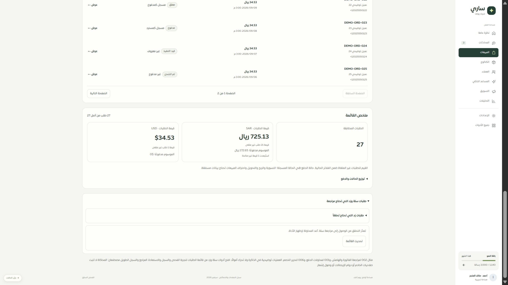
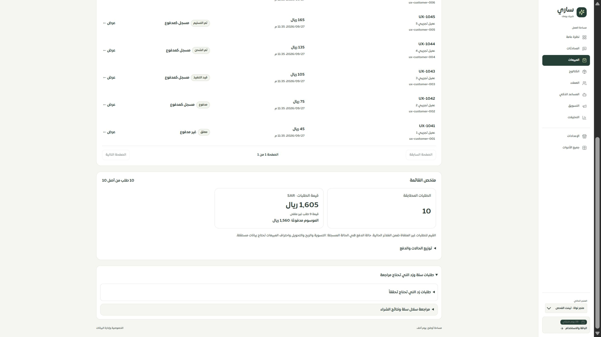

# المرحلة 67 — الوصول إلى أدوات المنصات وحالات الفشل

أصبحت مراجعة زد داخل لوحة يمكن فتحها عند الحاجة، بجانب لوحة سلة، في التطبيق والموك أب باستخدام نفس المكونات. فتح قسم المنصات لا يعرض25 نموذج زد قبل أداة سلة. إغلاق لوحة زد وفتحها يحافظ على مدخلها ما دام المستخدم في الصفحة.

بدل اختفاء أداة سلة عند فشل قراءة صلاحيتها، تعرض رسالة واضحة وزر إعادة المحاولة. تظهر حالتا التحميل وتوقف الشبكة بنصين مختلفين، وتُحجب الأداة عند رد غير صالح، وتبقى مخفية عند تأكيد عدم الصلاحية. لا تغيير في صلاحيات الخادم أو كتاباته.

أضيفت ثلاثة مفاتيح عربية وإنجليزية واختبارات تساويها. أضيف وضع محاكاة لفشل الوصول (13 وضع منصة الآن)، وصُححت خلفية النص الخام للطلب في الموك أب حتى تبقى القراءة واضحة بعد إصلاح لون النص الثانوي.

## التحقق

- 84 حالة ناجحة:18 لمكونات الصفحة مع محول الموك أب،20 لصفحة الطلبات،34 لحدود فحص سلة،12 لنموذج المنصات. شملت الفشل وإعادة المحاولة والرد غير الصالح وعدم الصلاحية والتحميل وتوقف الشبكة وحفظ المدخل بعد الطي.
- فحص TypeScript للتطبيق ولملفات موك أب الطلبات نجحا. بناء التطبيق والموك أب نجحا؛ حزمة البداية103406 بايت gzip. بقي تحذير أحجام بعض الحزم من البناء.
- فحص الترجمة:9550 استدعاء و443 مفتاحًا ديناميكيًا، دون مفاتيح مفقودة أو أخطاء إدراج متغيرات.
- المتصفح: ظهرت رسالة الوصول الفاشل في الموك أب وبقيت عند إعادة محاولة المثال الفاشل. في التطبيق على3018 ظهرت اللوحتان المنفصلتان، وقائمة سلة الفعلية الفارغة بدلالة صريحة.
- العرض المقاس480px للتطبيق: document450 وscrollWidth450، وعناوين الفتح48px ارتفاعًا. أُعيد العرض الافتراضي. هذا لا يثبت Safari/iPhone أو320/390.
- حصر المصدر:126 مسارًا و281 ملفًا و1949 عنصرًا و295 قراءة عبرhooks و22 قراءة مباشرة و4fetch؛ بلا روابط داخلية غير صالحة أو ملفات يتيمة.745 تسمية غير محلولة آليًا ليست745 مشكلة مثبتة. التغطية ثابتة82 عامة و27 جزئية و9 تفصيلية و8 تحويلات.

تبدأ المرحلة68 بمراجعة بيانات التقارير وقراءة قيم الطلبات والعملات، خصوصًا التقرير المجدول الذي كان يحول الحقول غير الموجودة إلى صفر. لا نشر أو عملية خارجية في هذه المرحلة، وبقية الحصر مستمرة.
