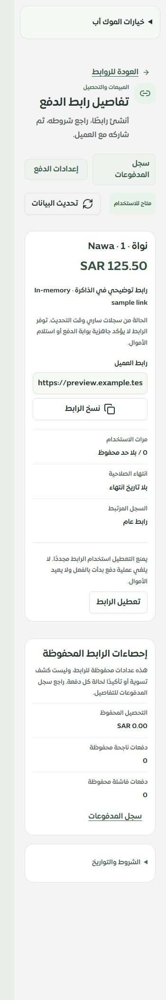
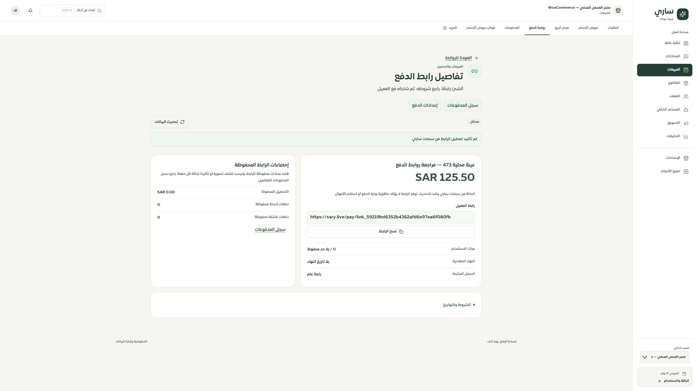

# المرحلة 473 — واجهة روابط الدفع والموك أب

استُبدلت الصفحة القديمة بمكونات مشتركة للقائمة والتفاصيل والإنشاء. تستخدم الصفحة مصدر `payments.linksWorkspace` المراجع في المراحل 469–472، مع هوية الحساب والتيننت والتحقق من عقد البيانات قبل عرضها. لا نشر أو دفع فعلي في هذه المرحلة.

## ما تغير

- بحث وحالات إتاحة وصفحات 25/50، مع أعداد جميع النتائج المطابقة، وسياق فلاتر محفوظ في رابط العودة. الحالة تميز المتاح والمعطل والمنتهي ومكتمل الاستخدام والبيانات غير الصالحة.
- تفاصيل العنوان والوصف والمبلغ والشروط والعدادات والتواريخ والمرجع المرتبط الآمن. روابط العميل مبنية من المصدر الموثوق؛ المراجع المتعارضة محجوبة. العدادات موضحة كقيم محفوظة وليست كشف تسوية. حد استخدام تالف لا يعرض كغير محدود.
- إنشاء مختصر: العنوان والمبلغ، وخيارات اختيارية للوصف وحد الاستخدام وتاريخ الانتهاء. إدخال عربي/فارسي مدعوم؛ الكسور تتحول إلى هللات بدقة دون تقريب أو قبول صيغ أسية. أخطاء بجوار الحقول مع تركيز الحقل الخاطئ وفتح الخيارات إذا لزم.
- مراجعة صريحة قبل الإنشاء والتعطيل. الطلب المعلق يحتفظ بمعرف UUID فقط في تخزين الجلسة، منفصل لكل حساب وتيننت. لا إرسال دون حفظ المرجع، ولا إعادة إرسال تلقائية أو استبدال مرجع مجهول. عدم العثور على السجل لا يعلن توقف الطلب السابق.
- الاستعادة تتحقق من مرجع الطلب وهوية الحساب والمتجر، وتعرض الحالة الحالية للرابط، حتى إن عُطل لاحقًا. نتائج متأخرة بعد تغيير التيننت لا تُعتمد. تعطيل متعارض/مجهول يوقف المحاولة حتى إعادة القراءة.
- النسخ ينتظر إقرار الحافظة؛ الرفض لا يعطي رسالة نجاح. أزيل النسخ التلقائي بعد الإنشاء.
- الموك أب يستعمل مكونات التطبيق ذاتها، بلغتين وتيننتين وحالات الأخطاء والتعارض والتأخير والنتيجة غير المؤكدة. بياناته في الذاكرة ولا يتصل بمزود دفع.

## التحقق

- نجحت **157 حالة** في الحزمة النهائية (`phase473-final.json`)، منها **42** لتفاعلات الصفحة والتخزين، مع انحدار سجل المدفوعات وإعدادات الدفع وعقد المصدر وسياسة الإتاحة. أثبتت الاختبارات فشل النسخ، منع التكرار أثناء التعليق، عزل التيننت، رفض مرجع غير متحقق، والاستعادة بحالة معطلة.
- TypeScript وبناء التطبيق وبناء المعاينة ومفاتيح الترجمة نجحت. لا مفاتيح مفقودة أو أخطاء interpolation؛ إضافة namespace واحدة مع الحفاظ على بقية ملفات اللغة.
- تجربة التطبيق المحلي على تيننت 17070: إنشاء رابط بعنوان عينة المرحلة 473 بمبلغ «١٢٥٫٥٠»، عرض **125.50 SAR**، ثم تعطيله بتأكيد مراجع. السجل المحلي 613 حُذف بحارس يطابق التيننت والهوية والعنوان والمبلغ والحالة والعدادات الصفرية، ثم أعيدت القائمة الفارغة.
- **60 حالة مقاس** موثقة في [responsive.json](responsive.json): عروض 320/390/768/1440؛ قائمة وتفاصيل وإنشاء والتفاصيل والخيارات الموسعة. التطبيق عربي، والموك أب عربي/إنجليزي. لا تجاوز عرض في المكوّن، ولا أهداف زر/رابط/summary أقل من 44px تقريبًا، ولا خط إدخال أصغر من 16px. بعض حالات RTL تخصم شريط تمرير 30px من عرض الإطار؛ القياسات الفعلية محفوظة.
- الحصر: 126 مسارًا و498 ملفًا و2729 عنصرًا مرصودًا، بلا روابط داخلية غير صالحة أو مسارات محذوفة. رقم العناصر غير المسماة في الحصر الساكن ليس حكمًا نهائيًا على الوصولية.

## الحدود والمتابعة

لم نختبر Safari أو iPhone فعليًا؛ الفحص الهندسي عبر إطارات داخل المتصفح الحالي. لم نتصل بـ Tap ولم نختبر تحصيلًا أو تسوية، ولم ننشر. حفظ مسودة الإنشاء عبر التنقل غير مطبق؛ المحفوظ الدائم في الجلسة هو مرجع الطلب المعلق فقط. الموك أب يعيد بيانات الذاكرة عند إعادة التحميل. اختبار اختراق شامل للنظام غير مُدعى. المرحلة التالية إغلاق APIs القديمة بعد التحقق من مسارات إصدار روابط الطلبات والحجوزات المتخصصة.

