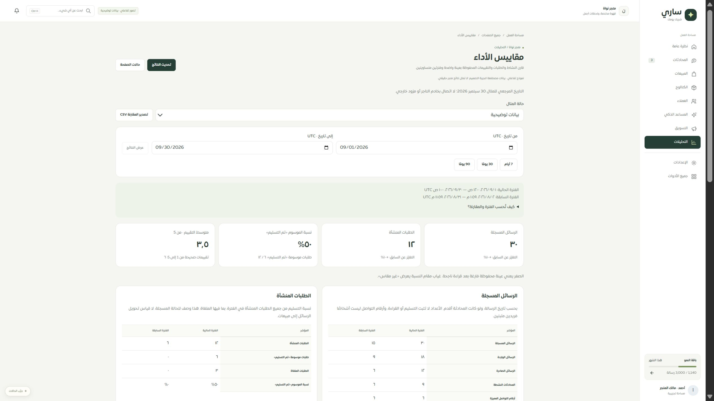
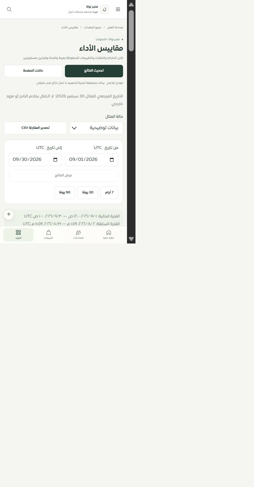

# موك أب مقاييس الأداء — 30 سبتمبر 2026

طابق المسار `/merchant/performance-metrics` مكون PerformanceReport وتصدير CSV والترجمة وCSS المستخدمة في التطبيق الفعلي، بدل القالب العام. البيانات مصطنعة والتاريخ المرجعي ثابت 30 سبتمبر 2026، ولا اتصال بخادم التاجر أو مزود.

## المطابقة والتحقق

- 20 مؤشرًا في أربعة أقسام، 4 بطاقات، جدولا SAR وUSD، و7 حدود قياس صريحة. احتراف المبيعات والتحويل السببي والربح غير مقاسة بهذه البيانات.
- مسودة فترة مستقلة عن النتائج، اعتماد وتحقق 1–90 يومًا، اختصارات 7/30/90، فترتان متساويتان دون تداخل، وتعريف الفترة الجزئية داخل تفاصيل قابلة للفتح.
- حالات الفراغ، غياب العينة السابقة، التحميل، فشل القراءة، انقطاع الاتصال، الصلاحية، وفشل التصدير. لا أصفار بدل القراءة الفاشلة، ولا نجاح متأخر بعد الانتقال أو تغيير الفترة.
- CSV كامل للفترتين مع الوحدات والعملات وحدود القياس وإشارة البيانات المصطنعة؛ منع التصدير عند وجود مسودة أو غياب نتيجة موثوقة.
- أصلح الفحص البصري تباين رؤوس الجداول: كان متغير muted الخاص بالخلفية يستخدم لونًا للنص في النمط العام. أضيف تجاوز داخل ov-preview وأعيد بناء موك أب نظرة الأداء ومقاييس التجربة كذلك.
- نجحت **238 حالة** تشمل الموك أب الجديد والمشترك، الشاشة الفعلية، المصدر والعقد القديم، وحماية حصر الصفحات والخصائص. النتائج في tests.json. بناء الحزم الثلاث نجح.
- تحقق حي في IAB من اختصار الفترة، فشل القراءة واستعادة المثال، العرض المكتبي 2560×1440 والعرض الضيق الفعلي 480×860. scrollWidth يساوي clientWidth: 2530 و450 على الترتيب. لون رؤوس الجداول rgb(108,120,114)، وأسماء الصفوف rgb(32,53,46).

## الحدود والخطوة التالية

تصنيف المسار تفصيلي جزئي؛ أصبح الإجمالي **126 = 86 عامًا +23 جزئيًا +9 تفصيلية +8 تحويلات**. اختبارات Blob ومحتوى الملف واسمه ناجحة، لكن حفظ تنزيل المتصفح الفعلي غير مؤكد. Safari/iPhone الفعليان و320/390 غير مثبتة في هذه المرحلة. الاختبار في IAB لا يعادل اختبار Safari.

المصدر الحالي 263 ملفًا و1883 عنصرًا؛ لم يتغير كود الإنتاج بهذه المرحلة. توحيد API القديم مثبت في تقرير tenant-performance-compatibility-2026-09-30. التالي مراجعة مسار المبيعات ومصدره وخصائصه قبل تصميمه. لا دفع ولا نشر.

