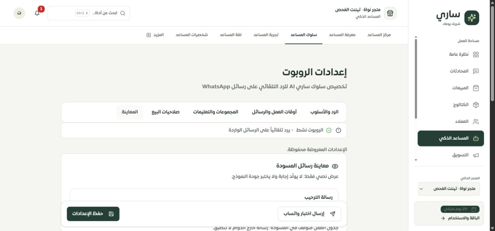
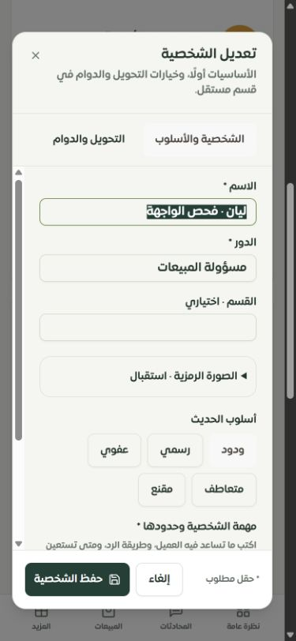
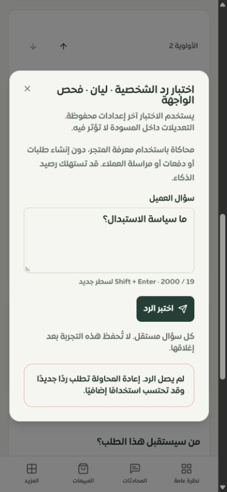

# استكمال شخصيات العمل ومعاينة المساعد

2026-09-28 · مشروع ساري · الفرع `main` · تطبيق محلي وموك أب تفاعلي. هذا تقرير دفعة محددة، وليس إعلان اكتمال مراجعة لوحة التيننت بنسبة 100%.

## التغييرات المنفذة

| المجال | المشكلة | النتيجة |
| --- | --- | --- |
| اختبار الشخصية | لم يوجد اختبار مباشر لرد الشخصية من بطاقتها | زر لكل شخصية يختبر هويتها ودورها ونبرتها وتعليماتها المحفوظة مع معرفة المتجر؛ الاختيار اليدوي يوضح تجاوز الدوام داخل المعاينة فقط، ويبين إن كانت الشخصية متوقفة. |
| التوجيه | معاينة الاسم وحدها لا تختبر رد الشخصية المختارة | اختبار بحسب السؤال والوقت بتوقيت الرياض. يعيد الخادم اختيار الشخصية من البيانات الحالية، باستخدام قواعد الكلمات والأولوية والدوام نفسها. لا يقبل اسمًا أو تعليمات أو معرّف تيننت من العميل. |
| أمان المعاينة | ضرورة منع استخدام معرّف شخصية لتيننت آخر أو منح صلاحيات عبر الطلب | صلاحية `bot_settings.manage`، وقراءة مقيدة بالتيننت المختار والمتحقق منه، ومدخلات صارمة. الأسئلة محدودة إلى 2000 حرف وتشترك في حد الاختبارات البالغ 15 طلبًا/دقيقة/مستخدم/تيننت داخل عملية الخادم. |
| نتيجة التجربة | خلط المعاينة بإجراءات العملاء أو اعتبار فشل المزود جوابًا | محرك معاينة منفصل، دون استدعاء إجراءات العميل أو إنشاء طلب أو دفع أو إرسال WhatsApp. الاستخدام يمر عبر ميزانية الذكاء المعتادة. تظهر نتيجة النموذج أو التنبيه الوقائي عند النجاح، والخطأ عند الفشل. كل سؤال مستقل ولا يحفظ سجل هذه المعاينة. |
| مسودة الشخصية | إغلاق النموذج قد يفقد التعديلات؛ النقر المتكرر قد يكرر الحفظ | تأكيد تجاهل التعديلات، مع الاحتفاظ بالمسودة عند متابعة التحرير. قفل متزامن للحفظ وتعطيل الحقول والإغلاق أثناء الطلب. يبقى النموذج عند فشل الحفظ. |
| أيام العمل | إعادة اختيار يوم بعد إلغاء الأيام يمكن أن تحفظ `NaN`، والأيام كانت عناصر قابلة للنقر دون سلوك زر | تحليل آمن للقائمة وأزرار حقيقية بحالة `aria-pressed`؛ يمكن اختيارها بمفتاح المسافة. تبقى القائمة الفارغة مقصودة ولا تتحول إلى يوم افتراضي. |
| إعدادات المساعد | رسالة المسودة قد تبدو ردًا فعالًا مع تعطيل الرد أو الجدول | فصل «معاينة رسائل المسودة» عن «اختبار الإعدادات المحفوظة». لا تعرض رسالة خارج الدوام عندما يتوقف الجدول، ولا تعرض الترحيب كرد فعال عندما يتوقف الرد. المسودة غير المحفوظة موضحة قبل اختبار الإعدادات. |
| اختبار WhatsApp | اسم الزر العام لا يوضح الفرق بين محاكاة الذكاء وإرسال رسالة | اسم صريح «إرسال اختبار واتساب» مع توضيح رقم المتجر والرسالة المحفوظة. يعطل عند وجود مسودة أو حفظ جارٍ. لم تُرسل أي رسالة في هذه الجولة. |
| القوالب والترجمة | عبارة «مُطبّق» اعتمدت على تطابق النبرة فقط؛ نصوص ثابتة بقيت بالعربية داخل الصفحة | أصبح الفعل «استخدام القالب في المسودة»، والأمثلة تبين الأسلوب دون ادعاء توفر منتج. نقلت نصوص المجموعات والتعليمات والأمثلة إلى مفاتيح ترجمة مع نظائر إنجليزية. لم تُحذف مفاتيح قديمة. |
| الهاتف | زر إغلاق نوافذ الفريق كان 16×16 | أصبح 44×44، مع موضع حسب اتجاه اللغة ومسافة تمنع تداخله مع العنوان. حقول المعاينة 16px والنوافذ قابلة للتمرير ضمن الارتفاع المتاح. |
| الموك أب | افتقد تجربة رد الشخصية وحالات الفشل | أضيفت تجربة الشخصية اليدوية والتوجيه وإعدادات المتجر، مع حفظ السؤال عند الفشل. النتيجة موسومة صراحة كمثال ثابت لا يستدعي نموذجًا ولا يثبت جودة المبيعات. معاينة رسائل المسودة والإرسال المحفوظ أصبحت متوافقة مع هذا الفصل. |

## التحقق

- **142 اختبارًا ناجحًا في 13 ملفًا** عبر `scripts/testing/run-isolated.mjs`، و**اختباران ناجحان على MySQL** في قاعدة محلية باسم اختباري وباستخدام تيننتين مؤقتين: المجموع **144 اختبارًا فريدًا**. إعادة تشغيل الاختبار لا تزيد هذا العدد.
- تغطي الاختبارات الصلاحيات وتزوير المدخلات، اختيار شخصية محفوظة، منع قراءة تيننت آخر، تحديث ترتيب القراءة من قاعدة البيانات، الشخصية المتوقفة، الدوام الليلي، فشل المزود، منع HTML تنفيذي في الرد، إغلاق المسودة والحفظ المكرر، الحالات المشروطة في الإعدادات، الموك أب ومعاينات المساعد السابقة.
- اجتاز TypeScript فحص `--noEmit`. اجتاز فحص الترجمة المعلن للعربية دون مفاتيح مفقودة أو أخطاء استبدال متغيرات. يوجد ملف إنجليزي مقابل للنصوص المضافة، لكن التطبيق يعلن العربية فقط حاليًا؛ لم يجر تجاوز هذا القيد لادعاء اختبار واجهة إنجليزية حية.
- نجح بناء Vite وتجميع الخادم والعامل وفحص حجم حزمة الدخول. بقي تحذير البناء المعتاد عن حزمة ExcelJS الكبيرة؛ ليس خطأ بناء.
- فحص Chrome على Windows للواجهة الفعلية على مقاسات هاتف 390×844 و320×568، وعرض أفقي 844×390، وسطح مكتب 1440×900. راجع [القياسات المسجلة](browser-checks.json). استُبعدت القراءات اللحظية التي سبقت استقرار إعادة التحجيم.
- في الهاتف جُرّبت نافذة الشخصية، الخطأ الحقيقي للمعاينة المعزولة، إغلاق مسودة معدلة والاحتفاظ بها، التحويل والدوام، تبويبات الإعدادات، اختيار يوم بمفتاح المسافة، وحقل سؤال طويل. لم يحدث تجاوز أفقي في الحالات المسجلة. فحص صلاحيات البيع كان قراءة فقط؛ لم يُعتمد خصم أو حد هامش.

ملفات الاختبار: `persona-preview` (20)، `ai/sari-preview` (11)، `assistant-reply-preview` (10)، `assistant-settings-review` (6)، `virtual-team-page` (5)، `merchant-persona-access` (12)، `merchant-persona-routing` (17)، `merchant-assistant-prototype` (12)، `merchant-core-accessibility-pentest` (11)، `merchant-domains-access` (15)، `sari-quick-preview` (12)، `sari-playground-page` (6)، `test-sari-page` (5)، و`ai/persona-context.mysql` (2).

## حدود النتيجة والأعمال المفتوحة

1. الخادم التجريبي يعمل على loopback مع حظر الاتصالات الخارجية؛ ظهرت رسالة تعذّر الرد كما ينبغي. لم تُقاس جودة نموذج حقيقي أو احتراف المبيعات، ولم تُختبر عملية إرسال WhatsApp. اختبارات الرد الناجح تستخدم مزودًا محاكى. لا تتغير نتائج عقل ساري أو نسبته بسبب هذه التجربة.
2. Safari وiPhone الفعلي ولوحة المفاتيح الافتراضية لم تُختبر. تغيير أبعاد Chrome ليس اختبارًا لمحرك WebKit أو جهاز iPhone.
3. هذه المعاينة تستخدم الشخصية والمعرفة، لكنها لا تحاكي كامل منظومة تشغيل العملاء، مثل تدخل الموظف وسياسات المجموعات وجدول المساعد العام والأدوات المالية. التوجيه التلقائي هنا يختبر توافر الشخصيات وفق الوقت المحدد. ضوابط اكتشاف ادعاءات تنفيذ الإجراءات محدودة بالقواعد الحالية وليست كشفًا شاملًا للهلوسة.
4. مراجعة الكود أظهرت أعمالًا قديمة تحتاج دفعة مستقلة: تعيين الشخصية الافتراضية وإضافة القوالب وحد العشر شخصيات ليست جميعها محمية بمعاملة موحدة ضد التزامن؛ وحذف معرّف غير موجود يعيد نجاحًا دون سجل محذوف. لم يثبت اختبار تنافس طلبات في هذه الجولة، ولم تُعدّل تلك العمليات هنا.
5. تحقق خادم إعدادات العمل يحتاج تشديدًا إضافيًا: صيغة الوقت القديمة تسمح بأرقام خارج المجال، وقائمة الأيام ليست مقيدة بخادم الحفظ مثل التحليل الجديد في الواجهة. إصلاح `NaN` في الواجهة لا يغلق هذا العمل. كذلك لا تشمل هذه الدفعة حماية مسودة إعدادات المساعد عند مغادرة الصفحة أو تبديل التيننت.
6. نوايا التوجيه `triggerIntents` مخزنة في API لكنها لا تدخل خوارزمية الاختيار الحالية؛ لا تُعرض كخاصية تعمل. حفظ تقييمات التجربة واستعادة جلساتها ومطابقة بقية الصفحات المفصلة بالخادم ما زالت أعمالًا مفتوحة.
7. لم يُعد توليد حصر المسارات في هذه الدفعة. سجل الموك أب السابق يحصي **126 مسارًا: 10 تفصيلية، 1 جزئية، 107 عامة، 8 تحويلات**. هذه التحسينات لا ترفع العدد تلقائيًا ولا تثبت فحص كل خاصية 100%. راجع [سجل الاستكمال](../tenant-testing-workspace-2026-09-28/REMAINING.md).

## الصور

العمل محلي ولم يتضمن push أو تشغيل تحديث الإنتاج؛ ليس هذا تقرير نشر.
