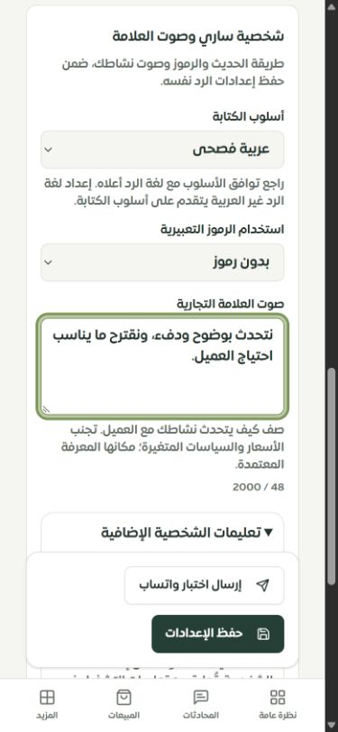
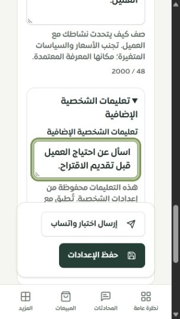

# نقل إعدادات شخصية ساري إلى لوحة التيننت الجديدة

تاريخ الفحص: 2026-09-28. اكتملت هذه الجولة محليًا؛ لا تعني اكتمال كل صفحات النظام أو نشر التغييرات.

## الإصلاح

نقلت جميع خيارات صفحة `SariPersonality` القديمة إلى قسم «الرد والأسلوب» داخل إعدادات المساعد: النبرات الأربع بما فيها «متحمس»، أساليب الكتابة الأربعة، مستويات الرموز الأربعة، صوت العلامة، وتعليمات الشخصية الإضافية. أصبحت تسميات الحقول مرتبطة بمدخلاتها، مع عدادات نص وحدود 2000 حرف ومدخلات بحجم خط 16px على الهاتف. تعليمات الشخصية الإضافية تظهر ضمن قسم قابل للطي، ويُفتح عند وجود نص سابق.

حُذفت صفحة React القديمة واستيرادها الكسول بعد مطابقة حقولها. بقي رابط `/merchant/sari-personality` يحوّل إلى صفحة الإعدادات الجديدة، وبقيت مفاتيح الترجمة القديمة حتى لا تنكسر المراجع الخارجية أو القديمة. لم تُحذف بيانات الشخصية أو جدولها.

قبل الإصلاح كان حفظ الرد يتبعه حفظ منفصل لنبرة الشخصية يمكن أن يفشل، وكان محرك الرد يستبدل نبرة «متحمس» بقيمة الجدول القديم الذي يدعم ثلاث نبرات فقط. الآن تُقرأ إعدادات النموذج من لقطة متسقة وتُكتب الحقول في معاملة واحدة، بترتيب قفل التاجر ثم الرد ثم الشخصية. يحفظ الجدول القديم قيمة متوافقة، بينما تحتفظ الشخصية بالنبرة الرابعة ويستخدمها محرك الرد. لا تتطلب هذه الجولة ترحيل مخطط قاعدة البيانات.

تشمل بصمة تعارض الحفظ حقول الشخصية الجديدة. أي تعديل عليها من الواجهة القديمة أو نافذة أخرى يمنع استبدالها بنموذج قديم. تُستعاد الحقول ضمن مسودة التبويب وتشارك مراجعة التعارض والدمج. لا تُمزج تعليمات الشخصية نصيًا مع تعليمات التشغيل؛ تُحفظ وتُعرض منفصلة مع توضيح علاقتهما، فلا يختفي محتوى قديم. صُحح قطع صوت العلامة عند 1000 حرف ليقرأ تجهيز الطلب كامل الحد المسموح به، 2000 حرف.

وُحّدت واجهة `personality` القديمة في الراوتر المعياري باستخدام سياق التيننت المختار وصلاحية `bot_settings.manage` للتحرير، مع حدود النص والتحقق الصارم ورسالة فشل آمنة. ظلت واجهة التوافق متاحة؛ الحماية من التعارض تطبقها الواجهة الجديدة عند إرسال الإصدار، ولا تدعي حماية كل عميل قديم لا يرسل إصدارًا.

أُصلحت كذلك مشكلة فتح الروابط الداخلية في تبويب جديد: الاختيار التلقائي للمتجر الوحيد يعيد تحميل الرابط الحالي، بينما التبديل اليدوي يحتفظ بإعادة التحميل والعودة للوحة البداية لعزل ذاكرة التيننت السابق. طابق الموك أب خيارات الشخصية وحفظها واستعادتها.

## التحقق

نجح **121 اختبارًا في 11 ملفًا**، دون جمع إعادة تشغيل الاختبار نفسه مرتين:

| الملف | العدد |
| --- | ---: |
| assistant-personality-access.test.ts | 14 |
| assistant-personality.mysql.test.ts | 6 |
| assistant-settings-review.test.ts | 15 |
| merchant-assistant-prototype.test.ts | 15 |
| merchant-selection-navigation.test.ts | 3 |
| assistant-save-safety.mysql.test.ts | 11 |
| ai/discount-policy.mysql.test.ts | 31 |
| merchant-domains-access.test.ts | 15 |
| bot-settings-validation.test.ts | 7 |
| assistant-draft-cache.test.ts | 3 |
| bot-settings-version.test.ts | 1 |

تشمل اختبارات MySQL الحفظ المتكامل، التراجع عن تحديث الرد إذا فشل تحديث الشخصية، منع الكتابة من نسخة قديمة، حفظًا متزامنًا واحدًا من نفس النسخة، عدم إنشاء شخصيات إعدادات مكررة عند أول قراءة متزامنة، رفض البيانات القديمة المكررة، وعزل التيننت. تشمل اختبارات الواجهة بقاء الحقول القديمة بعد التنقل والاستعادة والحفظ، وخيارات الموك أب كاملة. اختبار تجهيز الطلب يثبت دخول النص والإعدادات إلى الطلب؛ لا يثبت جودة إجابة مزود فعلي.

نجح فحص TypeScript والترجمة: **8167** استدعاءً و**348** مفتاحًا ديناميكيًا، بلا مفتاح مفقود أو خطأ interpolation. نجح بناء Vite والخادم والعامل وميزانية حزمة المتصفح. بقي تحذير Vite المعتاد عن حزم تتجاوز 600kB. هذه اختبارات انحدار وصلاحيات وتزامن محددة، وليست اختبار اختراق شاملًا.

## فحص المتصفح

التطبيق الفعلي على `127.0.0.1:3018`، تيننت «متجر نواة · تيننت الفحص»، مع حظر الاتصال الخارجي وتعطيل cron. حُفظت «متحمس» والفصحى وبدون رموز ونصا العلامة والشخصية، ثم أُعيد تحميل الصفحة وتأكد بقاؤها. أُعيدت القيم الأصلية وحُفظت، وأكد تبويب جديد النبرة والأسلوب الأصليين وحالة الحفظ. لم يُرسل اختبار WhatsApp أو طلب نموذج خارجي.

فتح تبويب جديد مباشرة على الرابط القديم `/merchant/sari-personality` وصل إلى `/merchant/bot-settings` وبقي هناك بعد الاختيار التلقائي للمتجر، مع ظهور الحقول الجديدة.

| مقاس Chrome | عرض المحتوى / scrollWidth | خط الحقول | نهاية الحفظ / بداية تنقل الهاتف |
| --- | --- | --- | --- |
| 390×844 | 375 / 375 | 16px | 770 / 782 |
| 320×568 | 305 / 305 | 16px | 494 / 506 |

لم يوجد تجاوز أفقي أو تداخل بين الحفظ والتنقل السفلي. فرق عرض المحتوى عن النافذة هو شريط التمرير. أُعيد المقاس الطبيعي وأغلق تبويب الفحص الإضافي. [سجل المتصفح](browser-checks.json).

## الحصر وما بقي

[الحصر المحدث](source/FEATURE_REGISTER.md) عند 2026-09-28T18:15:15.960Z: **126 مسارًا، 185 ملفًا، 1633 عنصر تحكم**. لا رابط تاجر حرفي غير مطابق حسب فاحص المصدر. أصبحت الملفات القديمة المرشحة للمراجعة **6** بعد حذف SariPersonality فقط. عدد العناصر دون تسمية يستنتجها الفاحص 560؛ يحتاج مراجعة سياق وليس إثبات 560 خطأ وصول.

بقيت أرقام عمق تصميم الموك أب السابقة: 107 عامة، 10 تفصيلية، واحدة تفصيلية جزئية و8 تحويلات؛ لا تتحول تلقائيًا إلى تغطية تشغيل كاملة. [سجل الاستكمال](../tenant-testing-workspace-2026-09-28/REMAINING.md) يوضح الصفحات المتبقية.

- Safari وiPhone الفعلي ولوحة مفاتيح iOS والمناطق الآمنة لم تُختبر؛ المقاسات هنا في Chrome.
- تحقق الترجمة يشمل العربية والإنجليزية؛ الفحص البصري لهذه الجولة بالعربية.
- لغة الرد لها قواعد أولوية حالية موضحة قرب أسلوب الكتابة. جودة توافق كل لغة وأسلوب وشخصية افتراضية تحتاج تجارب نموذج فعلية؛ لم تُستنتج نسبة احتراف مبيعات جديدة.
- تبقى استعادة المسودة محدودة بعمر التبويب، وبقية صفحات النظام والملفات القديمة الستة قيد الاستكمال.
- تغييرات فهم المحادثة والترحيلات الموجودة بالتزامن ليست جزءًا من هذه الجولة. اقتصر تعديل ملف محرك الرد المشترك على اختيار النبرة وحد صوت العلامة والاستيراد اللازم.
- لا push أو نشر في هذه الجولة، ولا نتيجة DEPLOY_OK جديدة.
