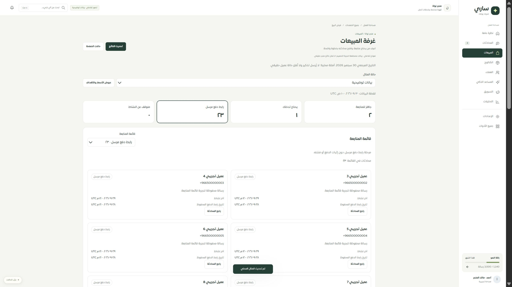
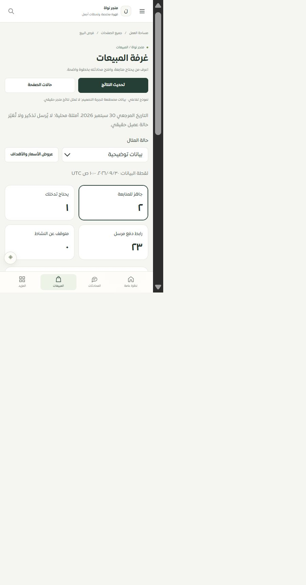

# موك أب غرفة المبيعات — 30 سبتمبر 2026

المسار `/merchant/sales-pipeline` يستخدم الآن PipelineReport الفعلي وترجمته وأنماطه بدل قالب المراحل العام. بيانات ثابتة ومصطنعة، بلا قراءة خادم أو تذكير أو إرسال خارجي.

- قوائم المتابعة الأربع، القوائم السبع، كل المراحل التسع والمجهول، وترقيم 23 محادثة معلقة على صفحتين 20+3. تغيير الفلتر يعيد الصفحة الأولى.
- المعاينات والتواريخ وروابط المحادثة، والتفاصيل المطوية للعينات والأسبوعين والعملات والأسباب وحدود القياس، بنفس المكون الفعلي.
- الفراغ والتحميل والفشل وانقطاع الاتصال وفقدان الصلاحية، والاستعادة الصريحة ومنع نجاح متأخر بعد تغيير الحالة أو الصفحة.
- كشف الفحص الحي خطأ 404 عند رابط يحتوي phone. أصلح تحليل مسار الهاش بفصل معاملات البحث قبل فك الترميز، مع استعادة بحث الرقم. المثال المرتبط يضيف محادثة محلية من مصدر الموك أب المعروف فقط، لا يقبل إنشاء عميل من نص الرابط العشوائي. فتح البحث ثم المحادثة تحقق حيًا؛ لا إرسال تم.
- **267 حالة ناجحة** تشمل الموك أب الجديد، الصفحات المشتركة الأخرى، المكون الفعلي والمصدر والعقود القديمة وحصر الخصائص. بناء حزمة الموك أب نجح. النتائج في tests.json.
- تحقق مكتبي 2560×1440 وموبايل فعلي للمتصفح 480×860 (مساحة المستند 450/450 بلا تجاوز أفقي)، مع الترقيم والفشل والاستعادة والانتقال للمحادثة. الصور desktop.png وmobile-480.png.

التغطية الحالية **126 = 85 عامًا +24 جزئيًا +9 تفصيلية +8 تحويلات**. المسار تفصيلي جزئي لأن المحاكاة لا تثبت الحالات المتغيرة خارجيًا أو استعادة عمليات حقيقية، وSafari/iPhone و320/390 غير مثبتة. الموك أب لا يثبت تسوية دفع أو قياس تحويل سببي أو احتراف المبيعات. قوائم المحادثات العامة ما زالت تحتاج مراجعتها التفصيلية المستقلة. لا تغيير إضافي لكود الإنتاج بهذه المرحلة، ولا دفع أو نشر. التالي مركز عروض الأسعار والأهداف ومصدره ثم الواجهة والموك أب.

