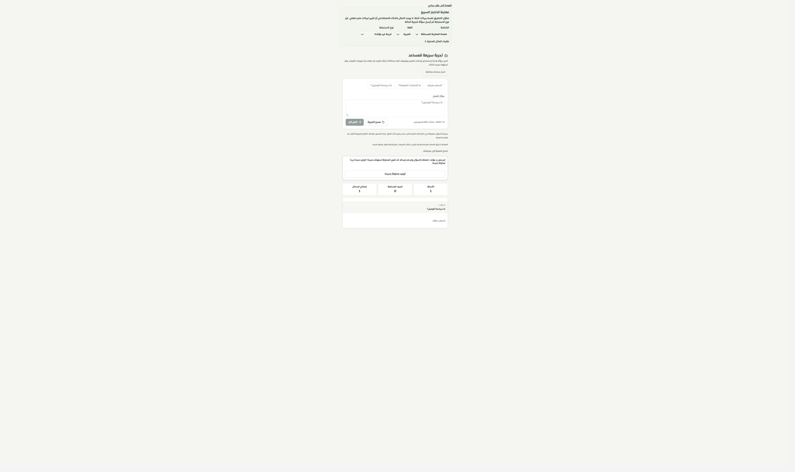
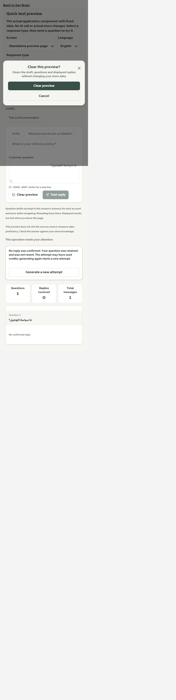

# المعاينة المستقلة: السؤال والنطاق والمحاولة الجديدة

1 أكتوبر 2026 · المرحلة154 · main

فُحصت صفحة `/merchant/sari-playground` واستُكملت حماية السؤال وحالات الطلب مع بقاء الأسئلة والأجوبة والعدادات والمسح المؤكد والرابط إلى جلسة الاختبار.

- استُبدل `maxLength` الذي يقص النص الملصق بتحقق طول ظاهر عند تجاوز2000 حرف، مع حفظ كامل النص وتعطيل الإرسال.
- مُنعت أمثلة الأسئلة من استبدال مسودة مكتوبة، وحُفظ السؤال أثناء الإرسال والفشل. يمسح الحقل بعد نتيجة صحيحة فقط.
- صارت الصفحة مرتبطة بهوية المستخدم والتيننت المؤكدة من API، وتمسح نتائج النطاق القديم عند تبديله. الردود المتأخرة بعد مغادرة المكوّن أو تسجيل الخروج لا تُعرض في النطاق الجديد.
- مسودة السؤال في ذاكرة الجلسة لكل حساب ومتجر تستعاد أثناء التنقل وتمسح عند الخروج. النتائج تظل داخل الصفحة ولا تُحفظ في الخادم؛ حدود إعادة التحميل والمغادرة معلنة.
- فحص بنية النتيجة ونوع مصدرها قبل العرض. الفشل غير المؤكد وحد المحاولات والصلاحية منفصلة، ورسالة الفشل لا تكشف تفاصيل المزود. إعادة التوليد فعل صريح باسم «توليد محاولة جديدة» مع تنبيه لاستهلاك الرصيد المحتمل، دون إعادة تلقائية أو ادعاء استعادة محاولة قديمة.
- حافظنا على قفل الإرسال وIME وأضفنا منع Enter المتكرر. الرابط إلى الجلسة لا يعمل أثناء الطلب. المسح يحتاج إقرارًا ويعيد الصفحة فقط.
- الموك أب المشترك يعرض الآن المكوّن الفعلي لشاشتي العقل والمعاينة المستقلة بست حالات لكل منهما، وله رابط من صفحة الموك أب القديمة. الأسئلة والأجوبة ثابتة محليًا ولا تستدعي AI.

نجحت **71 حالة** للصفحة والمعاينة وواجهة العقل وجلسات الاختبار والموك أب، و**132 حالة** للحصر وحفظ الخصائص. نجح فحص أنواع التطبيق والموك أب وبناؤهما، و10673 استدعاء ترجمة و509 مفاتيح ديناميكية دون فقد أو أخطاء معاملات. تحذير ExcelJS السابق مستمر، وميزانية الحزمة ناجحة.

في المتصفح جُرب الخطأ العربي والنافذة الإنجليزية عند480×844، والتراجع عن المسح حافظ على السؤال. عرض الصفحة الداخلي450 يساوي عرض التمرير450، ثم أعيد الحجم الافتراضي. ظهرت الصفحة المعدلة داخل التيننت المحلي دون إرسال سؤال إلى المزود. خادم الفحص3018 أُعيد تشغيله بحارس الاتصالات الخارجية؛ لم تُعدّل بيانات العملاء ولم يُدفع أو يُنشر شيء. Safari/iPhone الفعليان لم يُختبرا.

الحصر126 مسارًا و322 ملفًا و2163 موضع تحكم، بلا مسار محذوف أو رابط غير صالح. التالي بطاقات استخلاص المعرفة والمبيعات ثم بقية السجل.

[معاينة الصفحة الفعلية](http://127.0.0.1:4329/brain-preview.html?screen=playground)

