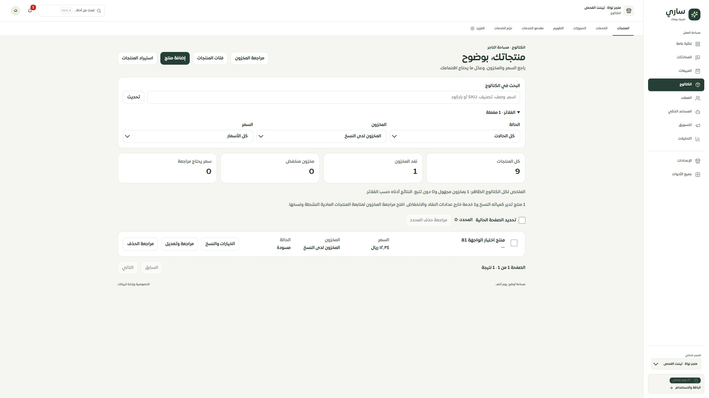

# المرحلة137 — دلالة مخزون القائمة الأساسية

2026-09-30، main محلي دون push أو نشر.

كانت القائمة تعد كمية الأب للمنتج ذي النسخ كمخزونه المتاح، وتعد الخدمة ذات الكمية صفر نافدة. أضيف تصنيف مستقل «المخزون لدى النسخ» وتصنيف «خدمة · لا تنطبق الكمية»، مع فلاترهما وعداداتهما وتفسير النطاق. لا تعرض البطاقة كمية الأب لهاتين الحالتين. يظهر في محرر المنتج ذي النسخ تنبيه يوضح أن الكمية الأساسية ليست كمية نسخه.

صُححت قواعد SQL والواجهة والموك أب معًا. ما زالت الكمية الأصلية محفوظة، ولا تعدل المرحلة أي منتج أو نسخة. المنتجات الرقمية تحتفظ بدلالة الكمية المسجلة السابقة؛ مراجعة المخزون المنفصلة توضح نطاق المنتجات المادية النشطة. لا يُستخدم تصنيف «لدى النسخ» كادعاء توافر؛ حالة كل نسخة تُراجع في شاشة المخزون أو التفاصيل.

## التحقق

- نجحت217 حالة وحدة وواجهة وموك أب واستيراد، و15 حالة MySQL على sari_pages_test، و132 حالة لحصر الخصائص.
- اختبار MySQL الجديد يجمع11 حالة للنسخ والخدمات والقيم غير السليمة والمنتجات الرقمية ونوع قديم فارغ، ويطابق تصنيف كل صف مع فلتره وعداده. يبقى عزل المتجر ومعاملة القراءة المتسقة قائمين.
- نجحت أنواع التطبيق والموك أب وبناء التطبيق والخادم والعامل والموك أب؛ لا نقص ترجمة أو متغيرات.
- تحقق متصفح فعلي: انخفض عداد النفاد في تيننت الفحص من3 إلى1 بعد استبعاد الخدمة والمنتج ذي النسخ. فلتر النسخ يعرض المنتج الصحيح ولا يعرض صفر كمية الأب. الصورة مرفقة.
- لم تتغير مقاسات أو CSS، ولم يُعد فحص Safari/iPhone فعليًا. العدد العام126 مسارًا،311 ملفًا،2100 عنصر، ولا مسار محذوف أو رابط غير صالح.

## التالي

مسارات الوصول إلى المصدر المرتبط من الكتالوج، ثم بقية سجل التيننت والخصائص. لا ادعاء اكتمال كل الصفحات أو التوافق100%.

