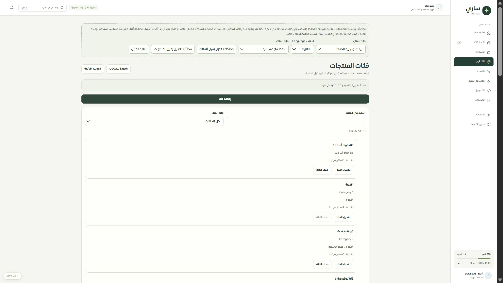
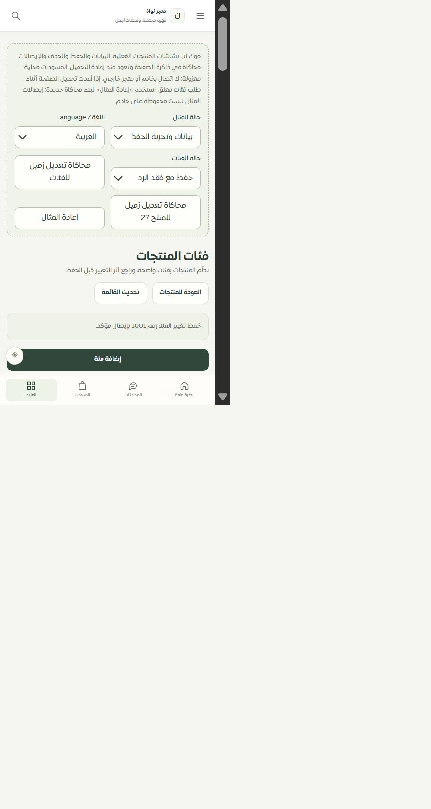

# موك أب فئات المنتجات — 2026-09-30

تعرض صفحة المنتجات مكوّن إدارة الفئات الفعلي وترجماته، مع نموذج محلي يستخدم عقد اللقطة وخطة التغيير والإيصال نفسها. تشمل التجربة25 فئة، الفروع والفئات المرتبطة وغير النشطة، جميع الحقول والبحث والترقيم، المراجعة والحفظ والحذف والاستعادة.

أضيفت18 حالة: البيانات والفراغ والتحميل والفشل وتوقف الاتصال والصلاحية والجلسة والقراءة فقط والمصدر الخارجي واختلاف النطاق والأسماء الطويلة والأب المفقود والحد ورفض الحفظ وفقد الرد وعدم وصول الطلب وفشل استعادة الإيصال وعدم تطابقه. يمكن محاكاة تعديل زميل واختبار التعارض، وتبقى المسودة عند التنقل. إعادة المثال تتطلب تأكيدًا ولا تمس مسودات التيننتات الأخرى.

البيانات والإيصالات في ذاكرة الموك أب. إعادة تحميل الصفحة تعيدها؛ توجد ملاحظة ظاهرة عن إعادة المثال إذا بقي طلب محلي معلق. هذا لا يحاكي دوام قاعدة البيانات أو قفلها ولا يتصل بخادم أو Google.

التحقق:116/116 حالة للعقود والموك أب المبني والشاشة والتخزين، وفحص أنواع التطبيق والموك أب وبناء الحزمة. يتضمن الاختبار عرض اللغتين، إخفاء النطاق الخاطئ، منع حذف الفئة المستخدمة، موافقة المراجعة، التعارض، واستعادة الحفظ دون إضافة ثانية.

نجحت132 حالة للحصر كذلك؛ بقي126 مسارًا و308 ملفات و2061 عنصرًا والتغطية74 عامة و35 جزئية و9 تفصيلية و8 تحويلات. في المتصفح تمت إضافة «فئة موك أب125» مع فقد الرد واستعادة إيصال1001؛ فحص2560×1440 و480×844 دون تجاوز أفقي. اللقطات الخام للمقاس الصغير تتضمن مساحة فارغة بسبب التقاط المتصفح؛ قياسDOM هو المقاس المذكور.

تبقى مرحلة اختيار الفئة المرتبطة داخل محرر المنتج، ثم خياراته ومتغيراته وبقية سجل الصفحات. لا نشر ولا ادعاء اكتمال100% أو اختبارSafari/iPhone فعلي.
