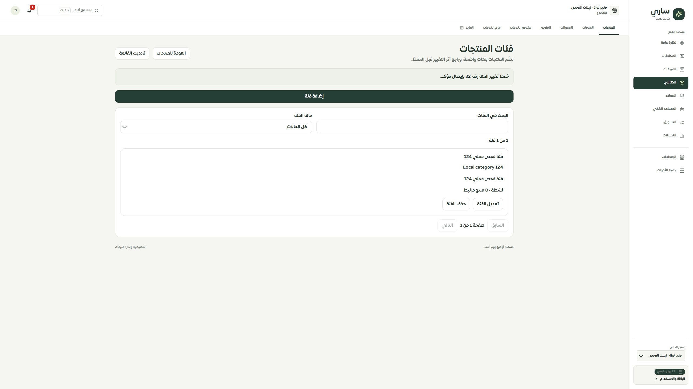
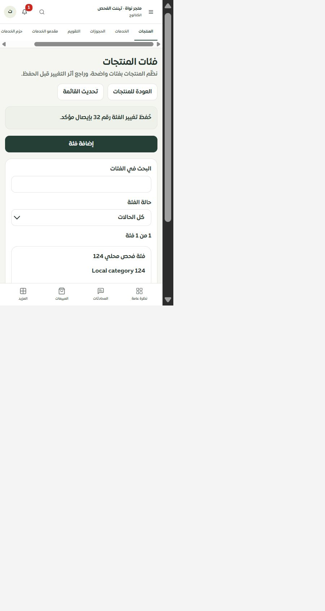

# واجهة فئات المنتجات — 2026-09-30

أضيفت مساحة الفئات من زر داخل الكتالوج، بتصميم المنتجات الجديد: بحث وحالة وترقيم20 عنصرًا، ومسار الفئة وعدد المنتجات المرتبطة، وإضافة وتعديل وحذف بمراجعة قبل الاعتماد. تشمل جميع حقول الفئة الحالية: الاسم والاسم الإنجليزي والأب والترتيب والتفعيل.

لا يُسمح بحذف فئة مرتبطة أو ذات فروع. تظهر أخطاء الحقول ومشكلات الأب والدورة والتكرار قبل الحفظ. تغيّر بصمة الفئات/استخدام المنتجات يوقف المسودة حتى تحميل النسخة الحالية. المصدر الخارجي والصلاحيات تحددان قابلية التعديل، وتُحجب البيانات عند فشل القراءة أو اختلاف النطاق.

المسودة فيsessionStorage معزولة للمستخدم والتيننت وصلاحيتها24 ساعة دون طلب معلّق. يُحفظUUID والمدخل الأصلي قبل الإرسال؛ فقد الرد يُبقي المحاولة ولا يسمح باستبدالها بطلب جديد. التحقق من الإيصال أو إعادة الطلب نفسه يعالجان النتيجة. لا تُستعاد الموافقة من مسودة عادية؛ تسجيل الخروج يمسح التخزين ويمنع الرد المتأخر من إعادته. فشل التخزين يمنع الكتابة.

التحقق:185/185 حالة (53 للشاشة والتخزين ومحرر المنتجات،132 للحصر)، وفحص الأنواع والترجمة والبناء. فُحص10114 استدعاء ترجمة و451 مفتاحًا ديناميكيًا دون مفاتيح ناقصة أو أخطاء إحلال. تحذير حجم ExcelJS معروف ودون تجاوز ميزانية الحزمة الرئيسية.

في التيننت المحلي أُنشئت فئة «فئة فحص محلي124» بهوية32 بعد مراجعتها، وظهر إيصال النجاح والقائمة المحدثة. فُحص2560×1440 و480×844 دون تجاوز أفقي. لا اختبار Safari/iPhone فعلي أو مقاسات320/390؛ لا تغيير إنتاج أو نشر.

الحصر126 مسارًا و308 ملفات و2061 عنصر تحكم. التغطية74 عامة و35 جزئية و9 تفصيلية و8 تحويلات لم تتغير؛ موك أب الفئات واختيار الفئة المرتبطة في محرر المنتج ثم خيارات ومتغيرات المنتجات ما زالت المراحل التالية. حزمة الموك أب الحالية لم تُعد بناؤها مع زر الفئات حتى توفير نموذجها في المرحلة التالية.
