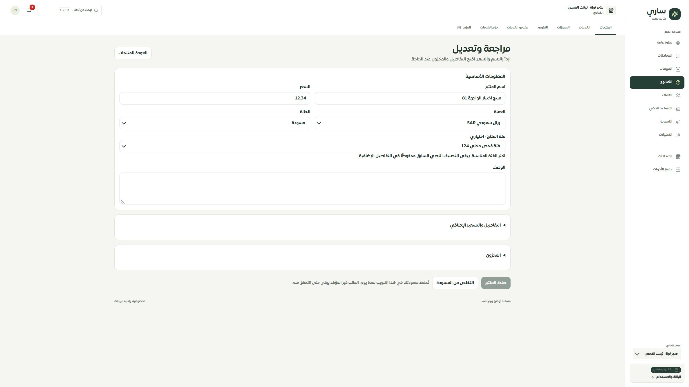

# اختيار فئة المنتج — 2026-09-30

أضيف اختيار الفئة المرتبطة إلى المعلومات الأساسية في محرر المنتج، مع إظهار مسار الفئة وأسمائها العربية/الإنجليزية، وخيار إزالة الارتباط. بقي التصنيف النصي القديم حقلًا مستقلًا في التفاصيل ولا يتغير عند اختيار فئة. تُحفظ18 خانة الآن في مسودة المحرر.

الفئات غير النشطة أو ذات أب مفقود أو دورة أو عمق يتجاوز8 مستويات غير متاحة للارتباط الجديد. يفحص الخادم التسلسل المعزول للتيننت داخل معاملة الحفظ، وتظل إعادة الطلب نفسه معتمدة على إيصالها السابق. تعديل الحقول الأخرى لا يزيل ارتباطًا قديمًا غير متاح؛ فشل قراءة الفئات لا يتحول إلى قائمة فارغة مضللة ولا يمنع تعديل الحقول المستقلة.

تقرأ المسودات السابقة قبل إضافة الحقل دون مسحها. عند فتح مسودة تعديل قديمة يُحمّل ارتباط المنتج الحالي كقيمة محفوظة غير معدلة؛ طلباتها غير المؤكدة تبقى بنفسUUID ومدخلاتها. تُحفظ تغييرات الفئة الجديدة وحدها أوnull للإزالة الصريحة.

الموك أب يطابق المكوّن والقواعد؛ ربط منتج بفئة ينعكس في عدّ استخدامها ومنع حذفها، دون مضاعفة العدد بعد إعادة تسمية الفئة.

التجربة المحلية: رُبط «منتج اختبار الواجهة81» بالفئة32 «فئة فحص محلي124»، وأكد التطبيق الحفظ بإيصال. لا تعديل إنتاج أو نشر.

التحقق:221 حالة للشاشة والتخزين والعقود والموك أب بعد تصحيح محدد البحث في الاختبار؛132 للحصر؛24 MySQL. نجحت أنواع التطبيق والموك أب والبناء، و10122 استدعاء ترجمة و451 مفتاحًا ديناميكيًا دون نقص. صُحح دليل الانتقال الحالي ليطلب18 حقلًا عوض17؛ لم يتغير خط الأساس الأصلي.

فُحص التطبيق عند2560×1440 وبقي اختيار الفئة بعد إعادة فتح المنتج. قيس مكوّن الموك أب عند480×844 دون تجاوز أفقي (عرض الحقل388px)؛ تعذرت لقطة موثوقة بعد تمرير المتصفح في هذا المقاس، لذلك لا تُقدم لقطة فارغة كدليل. لا إثبات لمقاسات320/390 أوSafari/iPhone فعلي.

الحصر126 مسارًا و308 ملفات و2063 عنصرًا، دون روابط معطلة أو ملفات يتيمة. التغطية74 عامة و35 جزئية و9 تفصيلية و8 تحويلات. المرحلة التالية خيارات المنتج ومتغيراته، ثم بقية السجل.
