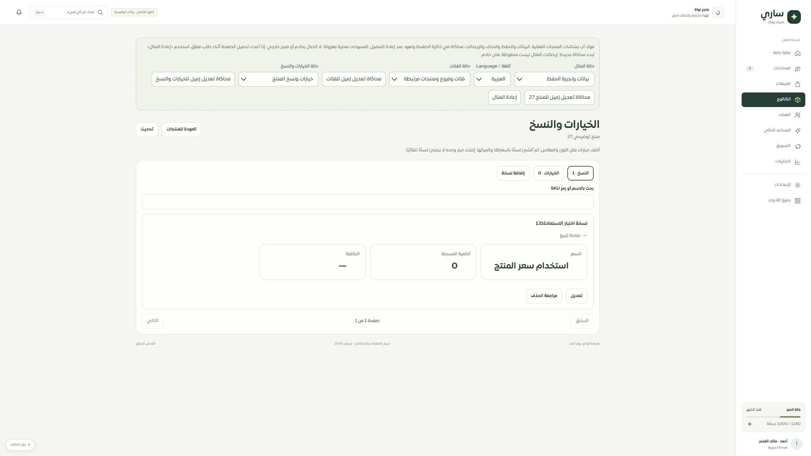

# المرحلة131 — موك أب الخيارات والنسخ المطابق

2026-09-30، محلي على main دون push أو نشر.

رُبط الموك أب بمكوّن ProductDetailsWorkspace الفعلي ونصوصه العربية والإنجليزية، والقواعد المشتركة لمراجعة الخيارات والنسخ.20 حالة تشمل الفراغ والتحميل والانقطاع والصلاحية والمصدر والنطاق والأسعار القديمة والاختيارات التالفة والحدود ورفض الحفظ وفقد الرد واستعادة الإيصال.

يربط النموذج كل خيار ونسخة بمنتجه. الحفظ يحدّث علامة وجود النسخ ومرجع مراجعة المنتج، ومراجعة حذف المنتج تحسب خياراته ونسخه وتكشف تغيّرها. إيصال التفاصيل يبقى قابلًا للاستعادة بعد حذف منتج المثال. إعادة المثال تمسح فقط مسودات هذه المحاكاة؛ إيصالاتها في ذاكرة الصفحة ولا تمثل خادمًا أو قفل قاعدة بيانات.

## الفحص

-155 حالة ناجحة للموك أب الجديد والمنتجات والفئات وواجهة التفاصيل المشتركة.
- فحص أنواع التطبيق والموك أب ناجح، وبناء product-preview.js وCSS ناجح. لم تتغير شيفرة تشغيل الخادم في هذه المرحلة.
- تجربة تفاعلية عربية: إنشاء نسخة مع فقد الرد، ثم استعادة الإيصال1000001 دون تكرار النسخة. تجربة إنجليزية: تعديل المسودة، محاكاة تعديل زميل، منع الحفظ حتى تحميل المرجع الحالي صراحةً.
- فحص بصري مكتبي2560×1440. قياس480 للمكوّن الفعلي موثق في المرحلة130؛ لم يُختبر Safari/iPhone أو320/390 فعليًا.
- الحصر126 مسارًا دون حذف مسارات؛ تبقى التغطية74 عامة و35 جزئية و9 تفصيلية و8 تحويلات.

## التالي

فحص مستهلكي API النسخ القديم وإغلاقه، ثم انخفاض المخزون وبقية سجل التيننت. هذه المرحلة لا تثبت نشرًا ولا اكتمال جميع الصفحات.
