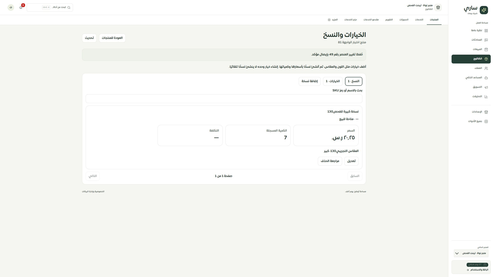

# المرحلة130 — شاشة خيارات ونسخ المنتجات

تاريخ الفحص: 2026-09-30. العمل محلي على main، دون push أو نشر. تعتمد هذه المرحلة على عقد المراجعة وخادم الحفظ الذري والترحيل181 ومسودات المراحل127–129.

## التنفيذ

- مدخل «الخيارات والنسخ» لكل منتج في الكتالوج، بمكوّن التطبيق الفعلي. قراءة مقيدة بالمستخدم والتيننت والمنتج، مع فصل الفشل والتحميل والانقطاع والصلاحية والمصدر المتصل.
- تبويبان وبحث وترقيم20 عنصرًا؛ اسم الخيار واسمه الإنجليزي وقيمه وترتيبه، واسم النسخة وسعرها المستقل أو الموروث وكميتها وSKU وتفعيل البيع واختياراتها. التكلفة وسعر المقارنة والباركود والوزن والصورة والترتيب في تفاصيل إضافية.
- أخطاء حقول ومراجعة القيم الحالية وبعد الحفظ، مع بيان أثر وجود النسخ على البيع. لا تتحول الكمية المجهولة إلى صفر، ولا تُعرض الأسعار غير الموثقة كأنها صحيحة.
- إصلاح الاختيارات القديمة غير القابلة للقراءة إجراء صريح. تعديل حقل آخر يحافظ عليها. توثيق السعر القديم يعرض مسح التكلفة وسعر المقارنة غير الموثقين ضمن المراجعة.
- مسودة مستقلة لكل منتج، تثبيت UUID قبل الكتابة، استعادة الإيصال ومطابقة هويته، إعادة الطلب نفسه عند فقد الرد. لا تُمحى محاولة غير محسومة، ولا يُطبّق رد متأخر بعد الخروج.
- تعارض التحديث يحتاج تحميل النسخة الحالية صراحةً؛ الإضافة يمكنها تحديث المرجع مع حفظ الحقول. فتح نسخة دون تغييرات يعرض «لا توجد تغييرات للحفظ» بدل رسالة حقول مبهمة.
- نصوص عربية وإنجليزية؛ الموك أب المجمع لم يُعد بناؤه في هذه المرحلة حتى تُربط محاكاة البيانات المطابقة في المرحلة التالية.

## الأدلة

-114 حالة واجهة ومسودة وخطة ومحرر منتجات نجحت أولًا. بعد إصلاح حالة «دون تغييرات» نجحت32 حالة واجهة؛ نجحت132 حالة حصر وحفظ خصائص كذلك. إجمالي الحالات المميزة في هذه المجموعات247.
- فحص TypeScript النهائي ناجح. بناء العميل والخادم والعامل ناجح؛ الحزمة الرئيسية337879 بايت،103484 مضغوطة. تحذير حجم ExcelJS السابق ما زال قائمًا.
- الترجمة:10234 استدعاء مباشر و451 مفتاحًا ديناميكيًا؛ صفر مفاتيح ناقصة وأخطاء تعويض.
- جرى الحفظ من المتصفح إلى MySQL المحلي في تيننت «متجر نواة · تيننت الفحص»: خيار12 «المقاس التجريبي130» بقيمتين، ونسخة49 «نسخة كبيرة للفحص130» بسعر20.25 وكمية7 واختيار «كبير». أُكد الإيصال وعادت البيانات بعد فتح المحرر. لا مزودات خارجية.
- العرض المكتبي2560×1440 دون تجاوز عرض. في فحص العرض الضيق كان DOM480×844 وعرض المستند450؛ الحقول الرئيسية388 بكسل وقائمة الاختيار354، ضمن الحدود. اللقطة الضيقة جزئية وبها مساحة فارغة من أداة الالتقاط؛ ليست إثباتًا لتصفح iPhone/Safari ولا لمقاسي320/390.
- الحصر الحالي126 مسارًا و310 ملفات و2090 عنصرًا؛ لا روابط غير صحيحة ولا ملفات واجهة يتيمة وفق التحليل.747 عنصرًا لم يحسم المحلل الساكن تسميتها، و127 قراءة بلا إشارة خطأ مباشرة؛ إشارات مراجعة وليست اختبارات نجاح.

## التالي

موك أب مطابق بمكوّن التطبيق وحالات الفشل والاستعادة والتعارض، ثم إغلاق API النسخ والتفاصيل القديم بعد فحص المستهلكين، وفحص انخفاض المخزون، ثم بقية سجل الصفحات. التغطية تبقى74 عامًا و35 جزئيًا و9 تفصيليًا و8 تحويلات؛ لا ادعاء اكتمال100% أو نشر أو اختبار Safari فعلي.
