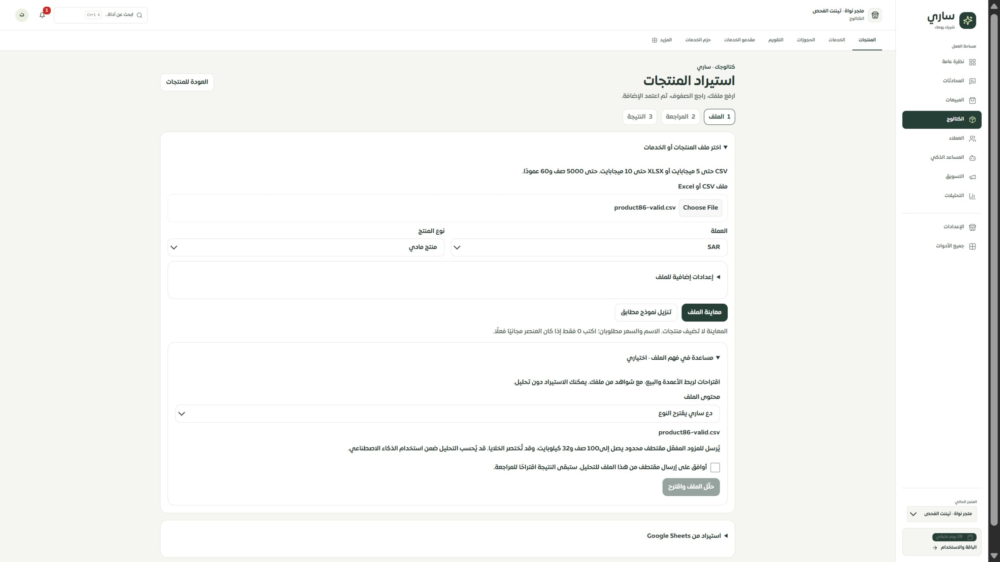

# مساعدة الملف الاختيارية — المرحلة 92

رُبطت مساعدة فهم الملف بنموذج CSV/XLSX نفسه. يختار التاجر ملفًا وخياراته، ثم يوافق على إرسال مقتطف محدود للمزود عند طلب التحليل. الاستيراد العادي متاح دون تحليل. أزيلت واجهة الاستيراد الذكي القديمة؛ أدوات Google Sheets بقيت منفصلة إلى مرحلة تحويلها.

تعرض النتيجة عدد الصفوف المعاينة والمستبعدة والخلايا المختصرة، واقتراح نوع الملف وربط الأعمدة ونصائح البيع مع اقتباسات وإحالات الصف والعمود. الاقتباس يثبت وجود النص في العينة، ولا يثبت صحة النصيحة. لا ينشأ منتج أو ملف معرفة ولا نسبة احتراف من التحليل.

تطبيق الربط يحتاج مراجعة وموافقة جديدة وتطابق بصمة الملف وخياراته. يغير إعدادات المعاينة فقط؛ تُقرأ قيم المنتجات من الملف الأصلي ويظل اعتمادها خطوة منفصلة. النتيجة المختلفة في المستخدم أو التيننت أو الطلب مخفية، وكذلك النتيجة القديمة أثناء خطأ القراءة أو التحديث أو انقطاع الاتصال.

يُحفظ مرجع الطلب قبل إرساله، دون محتوى الملف أو نتيجة التحليل في التخزين المحلي. فقد الرد يبقي المرجع؛ التحقق اللاحق يقرأ النتيجة ولا يعيد استدعاء النموذج. طلب جديد يحتاج تأكيدًا منفصلًا ولا يتاح أثناء المعالجة. حذف المرجع محلي فقط، والنتيجة القديمة تبقى في الخادم؛ لا توجد شاشة سجل التحليلات بعد، لذلك تنبه الواجهة للاحتفاظ برقم الطلب. تسجيل الخروج يمسح المرجع ويعزل النتائج المتأخرة.

## التحقق

- نجحت 267 حالة تشمل 15 حالة جديدة للواجهة، وعقد التحليل وحدود الرفع والصلاحية والاستيراد والموك أب والحصر وحفظ الخصائص.
- نجح TypeScript وبناء الواجهة وميزانية الحزمة وبناء موك أب الاستيراد. فحص 9810 استخدامات ترجمة و451 استخدامًا ديناميكيًا دون مفاتيح مفقودة أو أخطاء متغيرات.
- فُحص التطبيق المحلي على تيننت الاختبار: اختيار ملف، فتح المساعدة، منع زر التحليل قبل الموافقة وإتاحته بعدها. لم يُضغط زر التحليل ولم يُرسل ملف لمزود أو تُفرض رسوم.
- قياس IAB الفعلي 2560×1440 و480×860؛ عرض المستند في الحالة الضيقة 450 دون تجاوز أفقي. لقطتا desktop.png وnarrow-480.png توثقان العرض. تعذر إثبات 320/390 أو Safari/iPhone بهذه الأداة.

الحصر الحالي: 126 مسارًا، 299 ملفًا، 1967 عنصر تحكم، 296 طلب قراءة، 129 قراءة بلا معالجة خطأ مباشرة، 743 تسمية تحتاج مراجعة ساكنة، دون روابط غير صحيحة أو صفحات يتيمة. التغطية 77 عامًا و32 جزئيًا و9 تفصيلية و8 تحويلات؛ الأعداد لا تثبت اكتمال الفحص الوظيفي.

لا نشر. التالي إغلاق smartImport القديم في الخادم بعد انتقال المستهلك، ثم موك أب المساعدة وGoogle Sheets والفئات والخيارات والمتغيرات وبقية السجل.

