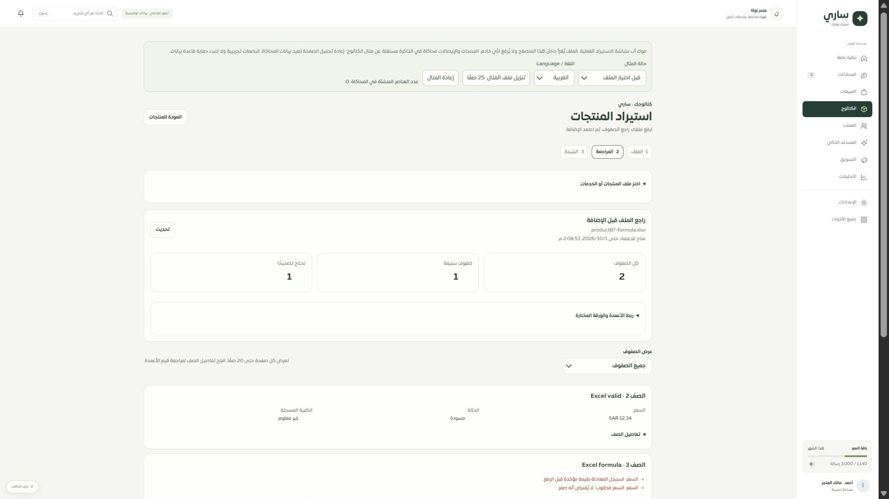
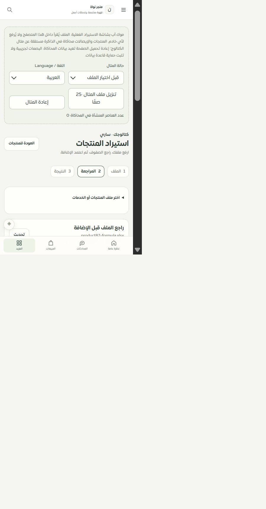

# مطابقة موك أب مراجعة استيراد المنتجات — المرحلة87

## النتيجة

المسار `/merchant/products/upload` يستخدم مكوّن التطبيق الفعلي وقارئ CSV/XLSX نفسه داخل المتصفح. رُبطت17 خانة، المعاينة والترقيم والتصفية وربط الأعمدة والورقة، أخطاء الصفوف والموافقة والنتيجة. أضيفت22 حالة اختبار تفاعلية، العربية والإنجليزية، وإعادة المثال بتأكيد. يعرض الموك أب بوضوح أن المنتجات والإيصالات في الذاكرة وأن البصمات مصطنعة وليست إثبات أمان أو حفظ خادم. لا يرسل الملفات إلى خادم ولا يكتب في كتالوج المثال الآخر.

شُدد التحقق في التطبيق الحقيقي كذلك: إيصال المراجعة يجب أن يطابق المستخدم والتيننت والمراجعة والبصمة وعدد الصفوف؛ وإذا كان هناك طلب محلي معلّق فلا يحسمه إيصال يحمل رقم طلب مختلف.

## التحقق

- نجحت163 حالة: قارئ الملفات، شاشة الاستيراد واستعادة الإيصال، نموذج الموك أب وواجهته المبنية، كتالوج المنتجات، وجولة المسارات133 في سجل الموك أب.
- نجحت138 حالة لحفظ الخصائص والحصر والتحليل الساكن. بقي126 مسارًا و297 ملفًا و1960 عنصرًا، دون مسار محذوف أو رابط داخلي غير صالح.
- نجحت أنواع التطبيق وأنواع حزمة الموك أب والبناء. فحص الترجمة:9775 استدعاء و451 مفتاحًا ديناميكيًا، دون مفاتيح مفقودة أو أخطاء متغيرات. بقي تحذير أحجام حزم ExcelJS المعتاد؛ ليس فشل بناء.
- تجربة متصفح فعلية لملفXLSX: صف صالح12.34 وصف بمعادلة محفوظة النتيجة؛ ظهر خطأ المعادلة والسعر، وتوقف الاعتماد لكامل الملف. اختبر فلتر الأخطاء أيضًا.
- تجربة ملفCSV عربي من عنصرين: سعر12.34 و0، مخزون مجهول و0. محاكاة فقد رد الاعتماد ثم فحص الإيصال أكدت عنصرين دون تكرار العدد.
- العرض المكتبي2560، والضيق الفعلي480: عرض مستند450 ومحتوى450 دون تجاوز أفقي. أُعيد مقاس المتصفح بعد الفحص. الصور المرفقة توثق Excel والاستعادة.

## حدود وتالٍ

التغطية الحالية77 صفحة عامة و32 جزئية و9 تفصيلية و8 تحويلات. هذه الصفحة جزئية لأن أدواتAI وGoogle Sheets تحتاج تحويلًا مستقلًا. لا تثبت المحاكاة قفل قاعدة البيانات أو عزل الخادم؛ تغطيهما اختبارات المرحلة85. Safari/iPhone و320/390 وحفظ التنزيل خارج المتصفح لم تثبت في هذه الجولة. لا نشر.

التالي: إغلاق uploadCSV/uploadExcel القديمين بعد فحص المستهلكين، ثم أدواتAI/Sheets والفئات والخيارات والمتغيرات وبقية سجل الصفحات. مراجعة منتهية/مفقودة تحتاج أيضًا مسار بدء ملف جديد واضحًا مع حفظ أي طلب اعتماد غير محسوم.

