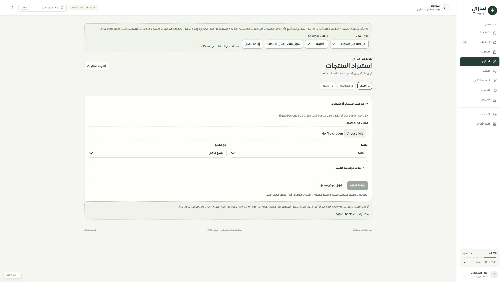

# التعافي من مراجعة استيراد مفقودة — المرحلة89

ظهور NOT_FOUND لمراجعة مستعادة كان يمنع بدء ملف جديد. أضيف عنوان خاص بالمراجعة وزرا تحديث وبدء ملف آخر؛ بعد التأكيد يُمسح المرجع المحلي فقط، دون طلب حذف أو كتابة منتجات. لا يظهر هذا المسار عند خطأ اتصال أو انتهاء جلسة أو نقص صلاحية أو نتيجة تحميل غير مطابقة. يعاد فحص الحالة عند التأكيد، ولا يُمسح أي طلب اعتماد غير محسوم. للمراجعة المنتهية زر بدء ملف آخر بجانب التنبيه، يستخدم الإلغاء المعتاد ويحتفظ بالمرجع إذا فشل الخادم.

نُقل تركيز لوحة المفاتيح إلى عنوان تأكيد الإلغاء. يعيد نجاح البدء الخيارات والملف والموافقة والترقيم إلى البداية. الموك أب يستخدم المكوّن نفسه؛ إعادة تحميله تمسح مرجعه المصطنع مع إعادة متجر الذاكرة، بينما التنقل الداخلي يحافظ على الإيصال والعدد.

نجحت221 حالة تشمل7 حالات تعافٍ جديدة، حدود فقد المراجعة وطلبات الاعتماد وعدم مسح الخطأ غير المؤكد، واستمرار الموك أب أثناء التنقل وجولة المسارات والحصر. نجحت الأنواع والبناء وفحص9783 استدعاء ترجمة و451 مفتاحًا ديناميكيًا دون مفقود أو خطأ متغيرات. الحصر297 ملفًا و1963 عنصرًا دون مسار محذوف. جُربت حالة المراجعة المفقودة وبدء ملف جديد في المتصفح عبر الموك أب؛ لم تُحذف مراجعة حقيقية أو منتجات لهذا الاختبار.

لا نشر. التالي إعادة تصميم أدواتAI وSheets ومراجعة عقودها وآثارها على المعرفة، ثم الفئات والخيارات والمتغيرات وبقية الحصر. Safari/iPhone و320/390 ما زالت غير مثبتة؛ التغطية77 عامة و32 جزئية و9 تفصيلية و8 تحويلات.

