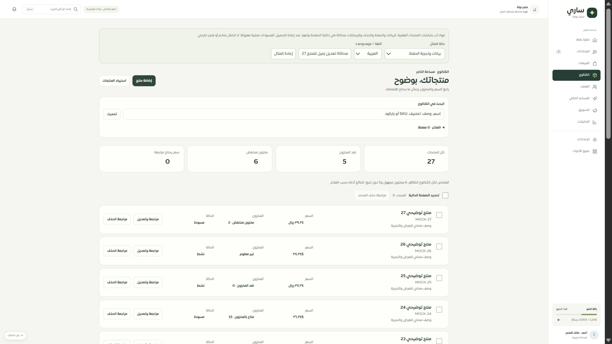
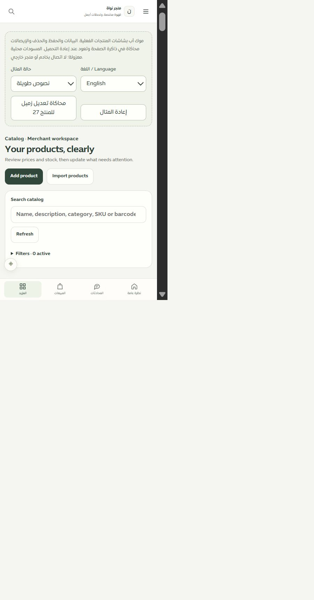

# المرحلة82: موك أب المنتجات المطابق

التاريخ2026-09-30، main، محلي دون دفع أو نشر.

استخدم الموك أب ProductCatalogWorkspace وProductEditorWorkspace وProductDeleteWorkspace والمكونات والترجمة والتحقق والمسودة نفسها. لا يوجد نموذج حقول موازٍ قد يختلف عن التطبيق. رابط المحاكاة: `http://127.0.0.1:4329/#/page/merchant/products`.

## نطاق المطابقة

- 27 منتجًا مصطنعًا وترقيم20 عنصرًا، بحث حرفي وفلاتر الحالة والمخزون والسعر؛ فصل العملتين والكمية المجهولة والصفر وعدم التتبع، مع رابط استيراد يبقى داخل الموك أب.
- الإضافة والتعديل بكل17 حقلًا ومعاينة الهامش والخصم والمسودات والأخطاء والحفظ والدمج وإعادة الطلب نفسه واستعادة الإيصال.
- حذف فردي ومتعدد بعد مراجعة وموافقة، وعدّ خيارات ومتغيرات المثال، ومنع المراجع والمصدر، واستعادة الحذف حتى بعد اختفاء المنتج.
- 20 حالة: بيانات، فراغ، تحميل، خطأ، توقف اتصال، ممنوع، جلسة منتهية، قراءة فقط، تيننت مختلف، اختيار سابق، منتج مفقود، نصوص طويلة، أسعار قديمة، مصدر مرتبط، مراجع تمنع الحذف، رفض حفظ، فقد رد، فشل إيصال، طلب لم يصل، وإيصال مختلف.
- زر يحاكي تعديل زميل للمنتج27. إعادة المثال تتطلب تأكيدًا وتمسح نطاق المسودة9000082 فقط. العربية والإنجليزية متاحتان للشاشات الفعلية؛ لوحة التحكم بالمحاكاة تبقى عربية.

## إصلاحات الفحص

ظهر تعارض زائد بعد حفظ تعديل فعلي مع فقد رده، لأن القراءة الجديدة تحمل بصمة العملية نفسها بينما المسودة تنتظر إيصالها. أُعطيت استعادة الإيصال الأولوية، وأُخفيت مراجعة التعارض حتى حسم الطلب؛ لم تُغيّر حماية البصمة في الخادم. اختبار مستقل يغطي هذا السيناريو.

صُحح تباين الموك أب: متغير muted مستخدم لنصوص الغلاف، بينما التطبيق يستخدمه للخلفية. أصبح النص داكنًا والخلفية الفاتحة للتنبيهات محددة داخل مساحة المنتجات، دون تعتيم نصوص الغلاف.

## التحقق

- 233 اختبارًا ناجحًا:44 للموك أب المبني وعقوده،8 للتنقل بكل133 شاشة بالفهرس،43 للشاشة والمسودة،138 للحصر وحفظ الخصائص. اختبارات المتصفح تمنع fetch وتتحقق من عدم الاتصال بالشبكة.
- فُحص حفظ نص شبيه بـHTML والتنقل بعيدًا والعودة دون تنفيذه؛ ونُقل اختبار الإنشاء العام إلى تصنيفات الخدمات مع إضافة بديله الخاص بالمنتجات.
- نجح TypeScript للتطبيق وللموك أب مستقلًا، وبناء الموك أب وبناء التطبيق والخادم والعامل. لا مفاتيح ترجمة جديدة في هذه المرحلة.
- في IAB جُرّب تعديل الاسم بالتزامن مع تعديل زميل للوصف والكمية، ودمج الاسم فقط، والحفظ مع فقد الرد واستعادة الإيصال. ظهرت النسخة المدمجة مرة واحدة.
- عُرض المكتبي2560 والضيق480 مع الإنجليزية والنصوص الطويلة؛ عرض الوثيقة450 وتمريرها450، واتجاه المحتوىltr ونص الإرشادrgb(93,107,96). الصورة الضيقة تثبت أعلى الشاشة، والتفاف بيانات القائمة الطويلة فُحص بقياسات DOM؛ تعذر الحصول على لقطة مفيدة بعد التمرير في هذه المحاولة. أُعيد المقاس الافتراضي.
- أصبحت تغطية126 مسارًا:78 عامة و31 جزئية و9 تفصيلية و8 تحويلات، بترقية المنتجات فقط. الحصر294 ملفًا و1938 عنصرًا، ولا مسار محذوف أو رابط غير صالح أو ملف يتيم.

## الحدود والمتابعة

بيانات وإيصالات الموك أب في الذاكرة وتعود بعد إعادة التحميل؛ البصمات مصطنعة وليست حماية قاعدة بيانات. لا يثبت مزودًا أو ربط متجر أو دوام إيصال خادم. الاستيراد والفئات والخيارات والمتغيرات لها مراحل منفصلة. التالي إزالة CRUD المنتجات القديمة بعد فحص المستهلكين، ثم الاستيراد وبقية الكتالوج. Safari/iPhone الحقيقي و320/390 غير مثبتة هنا.

