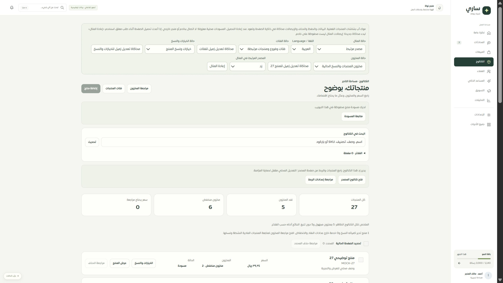

# المرحلة138 — الوصول إلى مصدر الكتالوج

2026-09-30، main محلي. لا push أو نشر أو تغيير اتصال فعلي.

أضيف مكوّن مشترك للقائمة والمحرر يوضح المصدر المرتبط ويفتح كتالوجه وإعداداته من مسارات التطبيق المسجلة: سلة، زد، WooCommerce، بيان وAPI. عند غياب المصدر المعروف يظهر رابط عام لمراجعة الربط. الوجهات محددة في الكود؛ لا يُستخدم اسم المصدر المخزن عنوانًا. بقي منع التعديل والصلاحيات كما هما، وأصبحت الروابط بأزرار ارتفاعها46 بكسل.

الموك أب يتيح اختيار المصادر الخمسة. كشف الفحص التفاعلي أن Wouter كان يغير عنوان روابط hash دون استدعاء موجه صفحات المثال، فبقيت الصفحة القديمة مع عنوان جديد. أصلح ProductWorkspaceLink ذلك بروابط hash أصلية في المثال وروابط Wouter في التطبيق. شمل التصحيح رابط الاستيراد القائم.

## التحقق

- نجحت128 حالة للكتالوج والمحرر والمخزون والموك أب، تتضمن فحص تحميل وجهة المصدر والاستيراد وإزالة جذر صفحة المنتجات. نجحت132 حالة لحفظ الحصر.
- أنواع التطبيق والموك أب وبناء التطبيق والخادم والعامل والموك أب ناجحة. الترجمة10287 استدعاء مباشر و451 ديناميكي بلا نقص أو اختلاف متغيرات.
- فُحصت روابط المزودين الخمسة في المتصفح، ثم الضغط على رابط زد أظهر محتوى «منتجات زد» والضغط على الاستيراد أظهر «استيراد المنتجات». لم يُكتف بتغير URL.
- فحص لقطة أزرار المصدر وقياس ارتفاعها46 بكسل. لا تغيير CSS عام ولا ادعاء اختبار Safari/iPhone.
- الحصر126 مسارًا،312 ملفًا،2104 عناصر. أضيف تعرف الحصر على ProductWorkspaceLink؛ مؤشرا التسمية الإضافيان يخصان عناصر المكوّن التي تستقبل children ديناميكيًا، وليسا فقدًا لتسمية الروابط في المتصفح.

صفحات المزودين مستقلة وتبقى مطابقتها التفصيلية في السجل؛ صفحة زد المصورة هنا هي نموذجها العام الحالي، وليست ادعاء إعادة تصميمها كاملة بهذه المرحلة.

## التالي

فحص إعداد الحساب الجديد كاملًا، بدءًا من نطاق المسودة وحفظ المراحل والاعتماد والتكرار، ثم مطابقة الشاشات والموك أب. بقية سجل التيننت مفتوحة.

