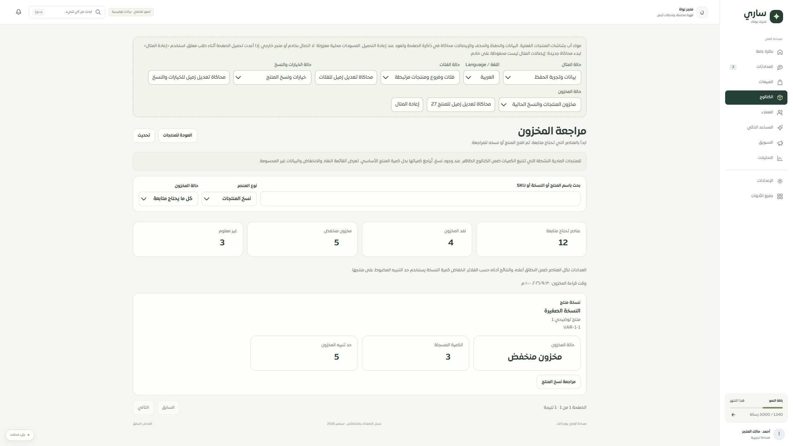

# المرحلة136 — موك أب مراجعة المخزون

2026-09-30، main محلي، دون push أو نشر أو اتصال خارجي.

أصبح الموك أب يستخدم ProductStockWorkspace الفعلي وترجماته، مع عشر حالات: بيانات، فارغ، تحميل، فشل، توقف اتصال، صلاحية، جلسة، متجر مختلف، اختيار سابق ورد غير مكتمل. نموذج المخزون يقرأ المنتجات والنسخ الحالية في المثال؛ تعديل الكمية أو حد التنبيه أو نشاط النسخة ينعكس عند العودة. لا يجمع كمية الأب والنسخة، ويعرض فجوة الإعداد إذا لم توجد نسخة متاحة.

نطاق المصدر المحاكى كالفعلي: منتج مادي نشط يتتبع الكمية؛ البحث حرفي، الترتيب والترقيم ثابتان والعدادات مستقلة عن فلاتر القائمة. تبقى هذه محاكاة ذاكرة لا تثبت مزودًا خارجيًا أو معاملات قاعدة البيانات. إعادة تحميل الصفحة تعيد البيانات كما هو موضح للمستخدم.

## التحقق

- نجحت191 حالة للنموذج والمكونات والموك أب المبني. تتضمن تحديث كمية منتج ونسخة، تعطيل النسخ، حد التنبيه، البحث والترقيم، قراءة المشاهد، منع البيانات غير المطابقة، والانتقال من التنبيه إلى التفاصيل والعودة بنفس التصفية. فحوص الموك أب تمنع fetch.
- نجحت132 حالة لحفظ الحصر، وفحص أنواع التطبيق والموك أب وبناؤه.
- تجربة متصفح محلية: نسخة1001 من كمية مجهولة إلى3 بعد مراجعة التغيير واعتماده؛ ظهرت حالة منخفض وحد5 في القائمة. تجربة رد غير مكتمل بالإنجليزية أخفت الصفوف والعدادات، وإعادة المحاولة استعادت النسخة المعدلة. لا مفاتيح ترجمة خام.
- يستخدم نفس CSS والشاشة التي قيس عرضها2560/480 في المرحلة135؛ لم يُعد فحص مقاسات إضافية هنا ولم يُختبر Safari/iPhone فعليًا.

## التالي

تصحيح قائمة المنتجات الأساسية كي لا تقدم كمية الأب باعتبارها مخزون النسخ أو تعد الخدمات كنفاد مخزون. ثم روابط المصادر وبقية سجل الصفحات والخصائص. الحصر والتغطية لم يتحولا إلى ادعاء100%.

