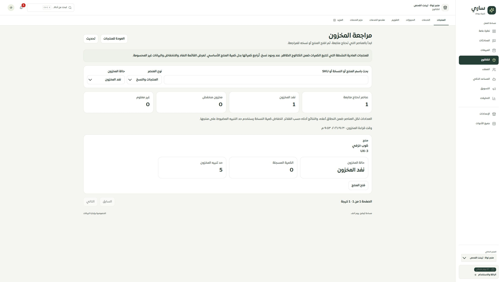

# المرحلة135 — شاشة مراجعة المخزون

2026-09-30، main محلي. لم يحدث push أو نشر أو اتصال بمزود خارجي.

أُضيفت شاشة مستقلة داخل الكتالوج تستخدم لقطة المخزون المعزولة: بحث باسم المنتج والنسخة وSKU، تصفية النوع والحالة، عدّادات شاملة للنطاق، وقت القراءة، وترقيم. توضح الشاشة المنتجات المشمولة وحد التنبيه ومشكلة الكمية أو إعداد النسخ، وتفتح محرر المنتج أو خياراته ونسخه حسب سبب التنبيه. العودة تحتفظ بفلاتر المخزون وتسمية زرها تطابق وجهتها.

تُحجب الصفوف والعدادات عند الفشل أو انقطاع القراءة أو اختلاف المتجر أو الاختيار. المخزون المجهول لا يعرض صفرًا، والنتيجة الخالية بسبب التصفية تختلف عن عدم وجود تنبيهات في النطاق المحدد. هذه الشاشة للقراءة؛ التعديل يتم من شاشات المراجعة والإيصال القائمة.

## التحقق

- نجحت100 حالة وحدة وواجهة وAPI، منها14 حالة جديدة للشاشة والتنقل واللغة والعزل والأخطاء والبحث. نجحت132 حالة لحفظ المسارات والخصائص.
- نجح TypeScript وبناء العميل والخادم والعامل. الترجمة:10277 استدعاء مباشر و451 ديناميكي دون نقص أو خطأ متغيرات.
- تجربة فعلية على3018 بتيننت الفحص: عنصر نشط واحد نافد، وفتح محرره ثم العودة مع بقاء فلتر النفاد. لم تُرسل كتابة منتج.
- مكتبي2560×1440 دون تجاوز عرض الوثيقة. في العرض الضيق كان DOM الفعلي480×844، عرض الوثيقة450 والحقول388 ضمن حدودها. الصورة الضيقة تُظهر الجزء العلوي داخل مساحة التقاط أكبر؛ لا تمثل جهاز iPhone أو Safari ولا إثبات320/390.
- الحصر الآن126 مسارًا و311 ملفًا و2100 عنصر تحكم. لا روابط غير صالحة أو ملفات يتيمة. ما تزال747 علامة تسمية و127 علامة معالجة قراءة تستلزم تدقيقًا؛ هذه مؤشرات حصر ثابت وليست ادعاء إنجاز كامل.

## التالي

مطابقة الموك أب لهذه الشاشة ثم تصحيح دلالة مخزون المنتج ذي النسخ في القائمة الأساسية. بقية سجل التيننت وSafari/iPhone الفعلي مفتوحة. تغطية الصفحات لم تُرفع إلى100%.

