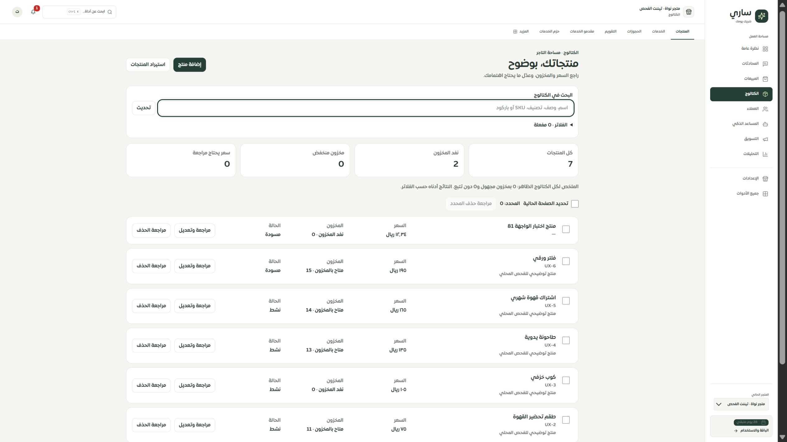
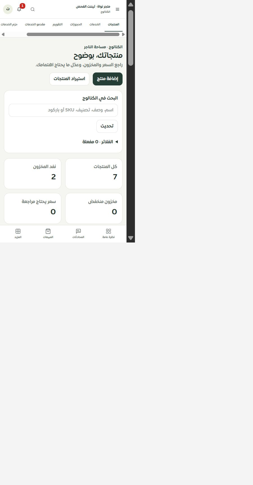
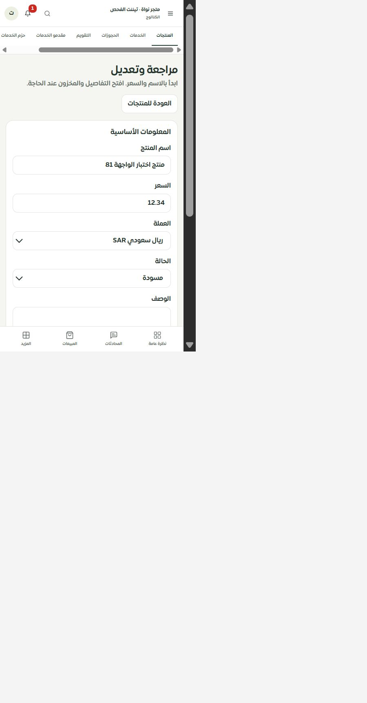
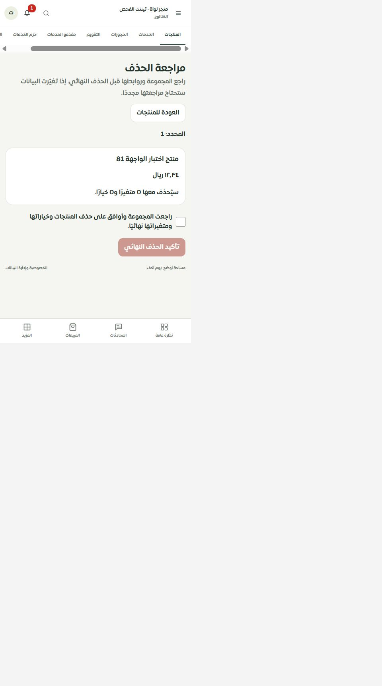

# المرحلة 81: شاشة كتالوج المنتجات والمحرر

التاريخ: 2026-09-30. الفرع: main. تطبيق محلي فقط؛ لا دفع أو نشر.

استُبدلت واجهة `/merchant/products` القديمة بمكونات موحدة للقائمة والمحرر ومراجعة الحذف، مرتبطة بمصادر المراحل 78–80. صفحة المنتجات العامة لم تتغير، والاستيراد والخيارات والمتغيرات لم تُحسب مكتملة في هذه المرحلة.

## مطابقة الوظائف

| الوظيفة | التنفيذ والتحقق |
| --- | --- |
| القائمة والبحث والترقيم | مصدر مقيد بالتيننت والاختيار؛ 20 عنصرًا للصفحة، بحث حرفي، تصفية الحالة والمخزون والسعر. الفلاتر قابلة للفتح لتقصير عرض الهاتف. |
| السعر والمخزون | فصل الصفر عن الكمية المجهولة وعدم التتبع؛ لا تحويل لسعر قديم مجهول الوحدة. عرض الحالة المسجلة والتنبيه إلى اختلاف التفعيل. |
| الإضافة والتعديل | حُفظت الحقول الـ16 السابقة وأضيفت العملة الصريحة: الاسم والوصف والسعر والصورة والكمية وSKU والباركود وسعر المقارنة والتكلفة والوزن والتصنيف والوسوم والنوع والحالة والتنبيه والتتبع. الأساسيات أولًا والتفاصيل عند الطلب. |
| الصور والهامش والخصم | صورة آمنة البروتوكول مع إخفاء فشل التحميل، ومعاينة النسب من القيم المكتوبة؛ توضيح استبعاد الشحن والرسوم والضريبة. |
| أخطاء الخانات | رسائل محددة للاسم والسعر والكمية والحد والرابط والوصف والوسوم، تركيز أول خطأ وفتح قسمه. |
| المسودة والتعارض | مسودة في sessionStorage لمدة يوم، مع عزل المستخدم والتيننت؛ مقارنة النسخة الحالية بالمسودة وموافقة صريحة لدمج الحقول المعدّلة فقط. |
| نتيجة الحفظ | حفظ UUID والطلب قبل الإرسال؛ رفض إيصال مختلف؛ استعادة الإيصال وإعادة الطلب نفسه عند فقد الرد. الطلب غير المؤكد لا تنتهي صلاحيته مع المسودة. |
| حذف فردي ومتعدد | تحديد الصفحة الحالية، مراجعة المجموعة والارتباطات والمصدر، موافقة صريحة، بصمة وإيصال؛ تعطل المصدر أو الصلاحية يمنع التنفيذ. |
| اللغة والوصول | العربية والإنجليزية، RTL/LTR، تركيز عنوان الشاشة، حقول 16px وأهداف لمس 44/46px، احترام الحركة المخفضة. |

## الفحص

- نجحت 124 حالة في ملفات الشاشة والمسودة والكتالوج والصلاحيات والمحرر والحذف، منها 43 للشاشة والمسودة. لا يُعاد احتساب اختبارات MySQL السابقة كاختبارات جديدة هنا.
- نجحت138 حالة للحصر وحفظ الخصائص وتحليل المصدر بعد توثيق انتقال CRUD إلى المحرر والمراجعة والإيصالات؛ المجموع262 حالة. بقي الخط الأساسي في28 سبتمبر دون تغيير.
- نجح TypeScript وبناء التطبيق والخادم والعامل. فحص الترجمة: 9703 استدعاءات و451 مفتاحًا ديناميكيًا، بلا مفتاح ناقص أو خطأ استبدال.
- في التطبيق الحقيقي على `127.0.0.1:3018`: أخطاء الاسم والسعر، العودة واستعادة المسودة، إنشاء «منتج اختبار الواجهة 81» بسعر12.34 وحالة مسودة، إعادة فتحه مع مقارنة20 وتكلفة0 وكمية فارغة. ثم حُفظ مسح التكلفة والكمية0 وأظهر الكتالوج نفاد المخزون وإيصال العملية.
- البحث أعاد المنتج وحده، بينما بقي الملخص لكل الكتالوج. فُتحت مراجعة الحذف على الهاتف؛ لم يُنفذ حذف نهائي من المتصفح. اختبار المعاملة الحقيقي للحذف موثق في المرحلة80.
- IAB: عرض مكتبي2560 وعرض ضيق فعلي480؛ لم يتجاوز عرض المستند مساحة العرض. إعداد الأداة المطلوب160 ينتج480 فعليًا، لذلك لا ندعي فحص320 أو390 أو Safari/iPhone حقيقي.
- الحصر المتجدد:126 مسارًا،294 ملفًا،1938 عنصرًا،293 استعلامًا،129 دون إشارة خطأ مباشرة وفق الفحص الساكن،26 قراءة عبر استدعاء مباشر،4 طلبات متصفح،60 قائمة خيارات،939 شرطًا،744 تسمية لم يحسمها الحصر الساكن، بلا روابط غير صالحة أو ملفات يتيمة أو مسارات محذوفة. نقص عدد JSX لا يعني فقدان حقول؛ دوال توليد الحقول موثقة أعلاه واختُبرت.

## الحدود والخطوة التالية

الموك أب ما زال عامًا للمنتجات حتى المرحلة82؛ التغطية الإجمالية ثابتة79 عامة و30 جزئية و9 تفصيلية و8 تحويلات. يلزم بعد مطابقته إغلاق CRUD القديمة بعد حصر مستهلكيها، ثم الاستيراد والفئات والخيارات والمتغيرات وروابط المصادر. لا تضمن هذه المرحلة صحة جميع كاتبي المنتجات الآخرين أو جميع صفحات النظام. اختبار Safari/iPhone الحقيقي مفتوح.

## أدلة العرض

