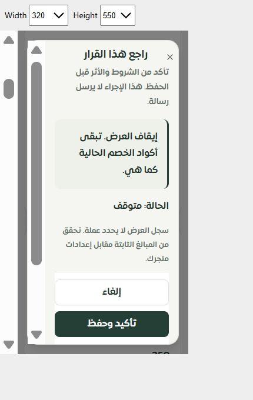

# موك أب العروض بالمكونات الفعلية — المرحلة 383

رُبط مسار العروض بالمركز وبالمعاينة المستقلة باستخدام صفحة التطبيق ومكونات القائمة والتفاصيل والنموذج والاختيار والمراجعة والإيصال نفسها. أزيل النموذج العام من هذا المسار.

يوفر المثال 31 عرضًا لكل تيننت، وصفحتين، و31 اختيارًا للمنتجات والفئات، وحالات القراءة الفاشلة والصلاحية والجلسة والبيانات القديمة والتعارض والتحميل والحفظ المعلق وغير المؤكد. الحفظ والمراجعة وإيصالات الاستعادة مؤقتة في الذاكرة فقط؛ لا اتصال بقاعدة أو مزوّد، ولا إنشاء كود أو إرسال رسالة حقيقية. تبديل التيننت أو الحالة وإعادة المثال يمسحان بيانات المحاكاة ومرجع طلبها.

## التحقق

- نجحت مجموعة140اختبارًا للواجهة والمعاينة والجسر، ثم مجموعة185اختبارًا للتحقق من العروض والخصومات والإحالات والسلات والجسر المشترك. المجموعتان متداخلتان؛ لا فشل أو تخطي.
- نجحت أنواع التطبيق والمعاينة وبناء حزمة المعاينة وترجماتها.
- فُحص المركز في المتصفح، ثم التحرير بقيمة عربية، وتصفح اختيارات الصفحة الثانية، والمراجعة والحفظ، واستعادة حفظ غير مؤكد لتيننت آخر دون كتابة ثانية.
- 10قياسات محفوظة للعربية والإنجليزية على320/390/768/1440 وارتفاع550/844؛ لا تجاوز أفقي ولا مفاتيح ترجمة خام. قياس أول أثناء انتقال الارتفاع سجل امتدادًا مؤقتًا؛ القياس النهائي عند320×550 يثبت نافذة518بكسل داخل الشاشة.
- الحصر:126مسارًا،454ملفًا،2601موضع تحكم، دون مسارات محذوفة أو ملفات يتيمة. ما زال التحليل الثابت يرصد1066تسمية غير محلولة و67موضعًا بلا إشارة خطأ مباشرة؛ ليست هذه شهادة اكتمال أو فحص إمكانية وصول كاملًا.
- أُخرجت ملفات القياس المؤقتة من الموقع بعد الفحص.

[الموك أب المحلي](http://127.0.0.1:4329/#/page/merchant/promotions) · [المعاينة المستقلة](http://127.0.0.1:4329/service-workspace.html?path=%2Fmerchant%2Fpromotions)

المتبقي: إغلاق مداخل العروض القديمة، وتصحيح أهلية العرض والنطاق والعملة والعدادات في سياق عقل ساري. ملخص المراجعة والتفاصيل يحفظ أرقام الأهداف؛ عرض أسمائها داخل الملخص يحتاج تحسينًا مستقلًا. لاSafari/iPhoneفعلي، ولا نشر.
