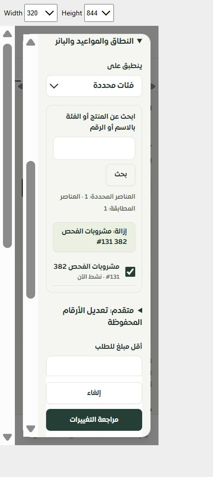

# اختيار أهداف العروض بالأسماء — المرحلة 382

أصبح اختيار المنتجات والفئات بالاسم مع البحث والصفحات (25 عنصرًا). يُعرض التحديد كاملًا حتى مع تغير البحث؛ الأرقام غير المتاحة تظهر بإزالة صريحة، ولا تُحذف عند فشل التحميل. بقي تحرير الأرقام القديمة في قسم متقدم للتصحيح.

المصدر يتحقق من الحساب والتيننت وصلاحية إدارة الحملات داخل المعاملة. البحث حرفي وآمن، ولا يعرض اسم عنصر يخص متجرًا آخر. الواجهة ترفض لقطة لا تطابق الحساب والتيننت والبحث والتحديد.

## التحقق

- 44 اختبار واجهة ونموذج وصلاحيات، و4 اختبارات MySQL: ناجحة، دون فشل أو تخطي.
- فحص الأنواع وبناء الإنتاج: ناجحان. البناء 13.55 ثانية؛ الحزمة الأساسية 425160 بايت / 127085 مضغوطة.
- الترجمة: 13162 استدعاء و854 مفتاحًا ديناميكيًا، بلا مفاتيح ناقصة أو أخطاء استبدال.
- متصفح محلي: اختيار منتج وفئة، حفظ التحديد أثناء بحث بلا نتائج، وعرضا 320 و390 بكسل دون تجاوز أفقي؛ القياسات مرفقة.
- حُذفت فقط عينتا المنتج والفئة اللتان أنشئتا لهذه المرحلة، وأُخرجت صفحة القياس المؤقتة من الملفات العامة قبل البناء.

هذا اختبار متصفح Chromium محلي، وليس Safari أو iPhone فعليًا. لم يحدث نشر. التالي: موك أب العروض بالمكونات الفعلية، ثم إغلاق المداخل القديمة وتصحيح استخدام العروض في دليل المساعد.
