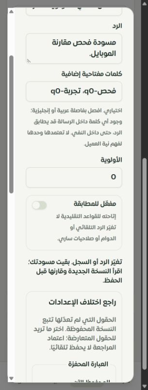

# مساحة الردود السريعة — 29 سبتمبر 2026

أصبحت صفحة `/merchant/quick-responses` مساحة موحدة للقواعد: بحث في العبارة والنص والكلمات، تصفية حسب الحالة، عشر بطاقات في الصفحة، عرض النص كاملًا، والأولوية والاستخدام والحالة. ترتيب العرض ثابت، وتوضح الواجهة أن عدد الاختيار لا يثبت إرسال الرد أو تسليمه أو نجاح البيع.

المحرر يستخدم كل الحقول السابقة، ويحافظ على الأولوية صفر، ويتحقق من الحقول قرب مواضعها. يبدأ الرد الجديد متوقفًا، ويعرض أثر التفعيل بدقة. إغلاق مسودة معدلة يحتفظ بها داخل الصفحة مع خيار المتابعة أو التخلي؛ تبقى الكتابات الأخرى مقفلة حتى حسمها. لا توجد استعادة بعد مغادرة الصفحة أو إعادة تحميلها.

عند تغير الرد بين نافذتين، يُمنع الحفظ القديم وتبقى المسودة. يجلب التاجر النسخة الجديدة، ويرى كل حقل، ويختار بين النسختين عند التعارض. تتبع الحقول غير المعدلة المحفوظ الحالي. اعتماد المقارنة يعدّل المسودة فقط؛ يحتاج الحفظ إلى إجراء مستقل. لا يُقبل تحديث فاشل يعيد بيانات مخزنة قديمة، ولا يُعاد إنشاء رد حذفه مستخدم آخر.

إن تعارض إنشاء جديد مع قائمة تغيرت، تظهر القائمة الحالية للمراجعة. إذا وُجد رد مطابق بعد توحيد المسافات والكلمات، يُفتح الرد المحفوظ بدل اقتراح نسخة إضافية. هذه مساعدة للاستعادة وليست إيصال إنشاء دائمًا. الحذف يعرض النص والكلمات والأولوية والحالة، ويطلب مراجعتها، ويعيد طلب الإقرار إذا تغير الرد. حماية سجلات A/B الموجودة في الخادم من المرحلة السابقة باقية.

معاينة المطابقة محلية وتستخدم منطق المطابقة المشترك نفسه على القواعد المحفوظة المفعلة فقط: العبارة الكاملة قبل الكلمات، ثم الأولوية والاستخدام والمعرّف. لا تستدعي نموذجًا، ولا ترسل رسالة، ولا تزيد العداد. توضّح أن فهم سياق المحادثة قد يتجاوز هذه القواعد، وأن المطابقة داخل نص منفي لا تثبت نية العميل. تختفي النتيجة عند تغير السؤال أو مصدر البيانات.

الموك أب التفصيلي يشمل الحقول والبحث والتصفية والترقيم، المسودة، التعارض والمراجعة، الحذف، المطابقة، وحالات القارئ وفشل التحميل والحفظ. بياناته محلية توضيحية. لم يعد وصف سجل الصفحات يدّعي وجود اختيار الرد داخل المحادثة؛ ذلك ليس خاصية منفذة في هذه الدفعة.

## التحقق

- **117 اختبارًا ناجحًا** في سبعة ملفات، تشمل 16 اختبارًا للواجهة المعروضة و12 للموك أب، مع رجوع اختبارات صلاحيات API والمطابقة وخيارات المساعد. النتائج في `tests.json`.
- فحص TypeScript للمشروع كاملًا وبناء الإنتاج ناجحان. حجم مدخل العميل 337291 بايت، و103362 مضغوطًا. يبقى تحذير البناء المعروف لبعض الحزم الكبيرة.
- 8877 استدعاء ترجمة و401 مفتاح ديناميكي دون مفاتيح ناقصة أو أخطاء قيم أو استدعاءات ديناميكية غير محلولة؛ `translations.txt`.
- تجربة حية على التيننت المحلي: بقاء المسودة بعد الإغلاق، تعارض من نافذتين، منع الكتابة القديمة، مقارنة ثم حفظ مستقل، ودمج أولوية أحدث غير معدلة محليًا. أعيد رد الفحص إلى نصه الأصلي وأولويته صفر وحالته المتوقفة. نافذة الحذف روجعت وأُلغيت دون حذف السجل.
- Chrome بعرض 320 للصفحة والمحرر والمقارنة، و390 للحذف. كشف الفحص قصًا أفقيًا في المقارنة؛ خُففت المسافات المتداخلة وسمح للزر بالالتفاف. بعد الإصلاح عرض المقارنة الداخلي 256 وتمريرها 256، والحذف 341/341. محرر الموك أب 320 كذلك 256/256. هذه ليست تجربة Safari أو iPhone حقيقي.
- لم تتغير عقود الخادم أو قاعدة البيانات في هذه الدفعة؛ فحوص MySQL الخمسة السابقة موثقة في [مرحلة الأمان](../tenant-quick-response-safety-2026-09-29/REPORT.md)، ولم يُدّع إعادة تشغيلها هنا.

## الباقي وحدود التغطية

استعادة المسودة بعد المغادرة، وإيصال إنشاء دائم، ومحاكاة منع الحذف بسبب تجربة A/B في الموك أب، واختبار Safari/iPhone الفعلي لم تكتمل. المطابقة اليدوية لا تثبت تشغيل الرد في محادثة حقيقية ولا جودة المبيعات. عُدّلت حالة الصفحة إلى «تفصيلي جزئي»؛ سجل الحصر أصبح 99 عامًا و9 جزئيًا و10 تفصيليًا و8 تحويلات، مجموعها 126 مسارًا. لا يعني هذا اكتمال جميع صفحات النظام. لا migration، ولا دفع أو نشر في هذه المرحلة.
